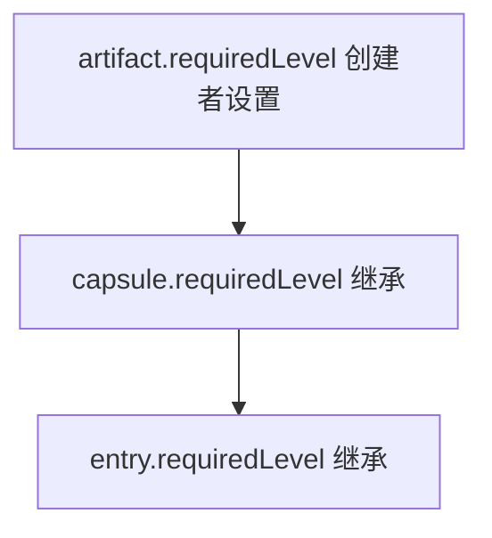

# 治理模型

> 真源：`packages/service-governance-review/src/`（`routes.ts`、`admin.ts`、`conflict-workflow.ts`）、`packages/host-distributed/src/gateway/routes.ts`。状态：Active。

## Owner 边界

`service-governance-review` 是 feedback、conflict、remediation 与 operator projection 的唯一业务 owner。它经 owner-local PostgreSQL ports 与 internal routes 提供 feedback admin、统计、批处理、remediation 与冲突工作流；最终知识生命周期变更经 `KnowledgeWritePort` 委托给 `knowledge-write`。`service-job-runtime` 只做 typed governance commands 的排队与执行底座（queue、retry / backoff、lease / reclaim、workflow、dead-letter），治理业务规则不回流 queue owner。distributed gateway 保留既有 public URL、认证 actor、trace / correlation header 与 canonical error 语义，把请求转发给 governance owner。

知识域治理约束已从应用层校验升级为数据库级约束：`knowledge_entries` 补 `CHECK` 约束（`scope`、`lifecycle_state`、`required_level`），`lifecycle_events` 补 `type` CHECK 约束；标签、边界、维护分配已从 JSONB 拆为结构化子表，支持按治理维度直接查询、过滤与索引。

## 安全等级

安全等级是 0-10 的整数：

| 等级 | 名称 | 示例 |
|---|---|---|
| 0 | 公开 | 公开文档、公共知识 |
| 1-3 | 内部 | 内部流程、团队知识 |
| 4-6 | 机密 | 敏感业务信息 |
| 7-9 | 高度机密 | 核心架构、密钥 |
| 10 | 最高机密 | 系统密钥、管理员凭据 |

继承链：`artifact.requiredLevel` 由创建者设置 → `capsule.requiredLevel` 继承 artifact → `entry.requiredLevel` 继承 capsule。

## 路由

内部与对外路径的逐条对照见 [TrapMap API 契约表面](../../reference/api-surface.md)。实现落点：内部在 `packages/service-governance-review/src/routes/`，对外在 `packages/host-distributed/src/gateway/route-defs/governance.ts`。

## 冲突工作流

`conflict-workflow.ts` 编排冲突检测与消解，`llm-conflict.ts` 做 LLM 侧判断，`conflict-trigger` 判断节点契约见 `packages/assembly/src/contracts/judgment-contracts.ts:60-66`。检测任务经 shared job `governance.conflict-detection` 入队（见 [Shared Async Job Contracts](ASYNC_SHARED_JOB_CONTRACTS.md)）。
