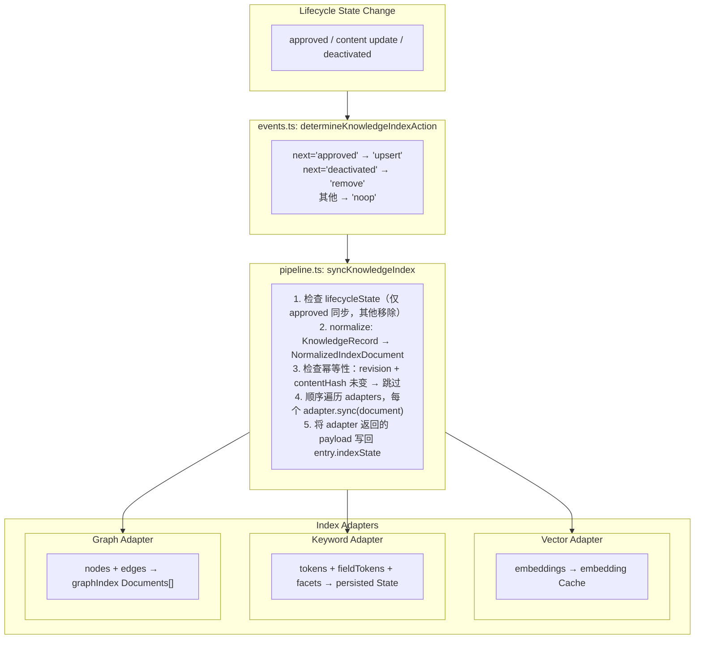
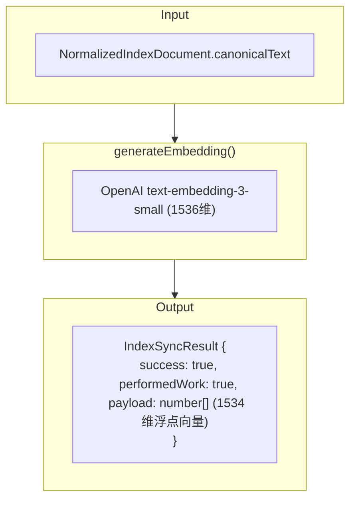
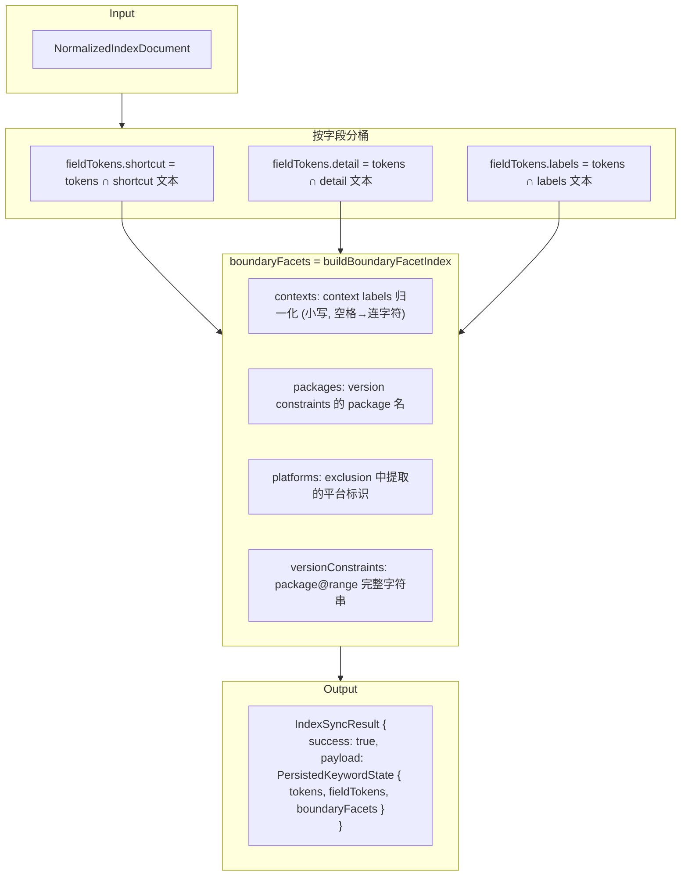
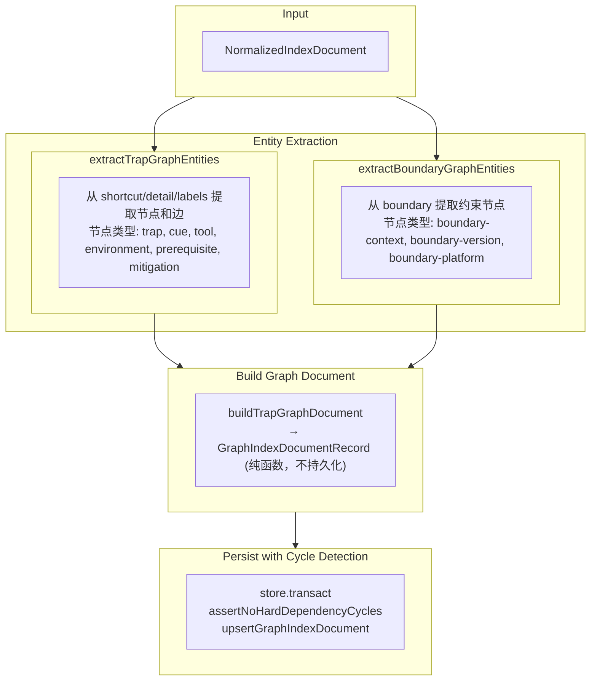

# 索引管道 (Indexing Pipeline)

## 概述

TrapMap 的索引管道采用**生命周期驱动**的多适配器架构。当知识条目或 Skill 工件的生命周期状态变更时（`approved` / `deactivated`），管道自动同步三种索引：向量索引、关键词索引和图索引。

## 源码目录结构

```
packages/server/src/lib/
├── indexing/                      # 索引管道核心
│   ├── types.ts                   # 类型定义：NormalizedIndexDocument, IndexAdapter, KnowledgeIndexStateRecord
│   ├── normalize.ts               # 规范化：KnowledgeRecord → NormalizedIndexDocument
│   ├── events.ts                  # 生命周期事件入口：determineKnowledgeIndexAction / runKnowledgeIndexEvent
│   ├── pipeline.ts                # 管道编排：syncKnowledgeIndex / reconcileKnowledgeIndexes
│   ├── reconcile.ts               # 图索引协调：reconcileGraphIndexes
│   ├── boundary-extract.ts        # 边界约束→图节点/边提取
│   ├── boundary-normalize.ts      # 边界值归一化 + facet 索引构建
│   ├── artifact-pipeline.ts       # Skill 工件适配器 fan-out 管道
│   ├── skill-events.ts            # Skill 生命周期事件 + 图文档构建
│   ├── adapters/                  # 索引适配器
│   │   ├── index.ts               # 适配器注册 + buildDefaultIndexAdapters / buildHybridIndexAdapters
│   │   ├── vector.ts              # 向量适配器：embedding 生成 + embeddingCache 持久化
│   │   ├── keyword.ts             # 关键词适配器：token 分桶 + boundaryFacets 持久化
│   │   ├── graph.ts               # 图适配器：实体提取 + 硬边环检测 + graphIndexDocuments 持久化
│   │   ├── graph-builders.ts      # 纯函数：NormalizedDocument → GraphIndexDocumentRecord
│   │   ├── artifact-graph.ts      # Skill 工件图适配器接口
│   │   ├── pg-vector.ts           # PostgreSQL pgvector 适配器
│   │   └── pg-keyword.ts          # PostgreSQL 关键词适配器
│   └── graph-lite/                # GraphRAG-lite 持久层
│       ├── documents.ts           # GraphIndexDocumentRecord 类型 + 文档构建器
│       ├── store.ts               # Store-backed CRUD：upsertGraphIndexDocument / removeGraphIndexDocumentsForSource
│       └── graphology.ts          # Graphology 组装 + 硬边投影 + 环检测 + 局部扩展
└── retrieval/
    └── graph-extract.ts           # TrapMap 实体提取：extractTrapGraphEntities / extractGraphEntities
```

---

## 架构总览



---

## 1. 规范化阶段 (Normalization)

**源码**：`indexing/normalize.ts`

所有适配器消费同一份规范文档。`normalizeKnowledgeIndexDocument()` 将 `KnowledgeRecord` 转换为 `NormalizedIndexDocument`：

```typescript
// indexing/types.ts
interface NormalizedIndexDocument {
  entryId: string;
  teamId: string | null;
  scope: Scope;
  requiredLevel: number;
  lifecycleState: LifecycleState;
  revision: number;                   // entry.history.length
  updatedAt: string;
  shortcut: string;                   // 原文 shortcut 字段
  detail: string;                     // 原文 detail 字段
  labels: string[];                   // 原文 labels 数组
  canonicalText: string;              // `${shortcut}\n${detail}\n${labelsText}`
  tokens: string[];                   // tokenize(canonicalText) — 小写、去停用词
  contentHash: string;                // SHA-256(canonicalText) — 变更检测
  normalizedAt: string;
  boundary: Boundary | null;          // 边界约束（Phase 53+）
}
```

**关键设计**：
- `canonicalText` 由 `shortcut + detail + labels` 三段拼接，三种适配器使用同一份源文本
- `contentHash`（SHA-256）用于幂等性：如果 revision + contentHash 都未变，适配器跳过工作
- `tokens` 复用 `retrieval/recall/keyword.ts` 的 `tokenize()` 保证一致性
- `boundary` 透传给关键词适配器（生成 facet）和图适配器（生成边界节点）

---

## 2. 适配器合约 (IndexAdapter)

**源码**：`indexing/types.ts`

```typescript
interface IndexAdapter {
  kind: 'vector' | 'keyword' | 'graph';
  sync(document: NormalizedIndexDocument): Promise<IndexSyncResult>;
  remove(ref: { entryId: string; revision: number }): Promise<void>;
}

interface IndexSyncResult {
  adapterKind: 'vector' | 'keyword' | 'graph';
  success: boolean;
  error: string | null;
  performedWork: boolean;    // false = 因幂等性跳过
  payload?: unknown;         // 适配器返回的数据，由 pipeline 写回 entry
}
```

适配器在 `pipeline.ts:syncKnowledgeIndex()` 中**顺序遍历**（非并行），每个适配器独立成功或失败。

---

## 3. Vector 适配器

**源码**：`indexing/adapters/vector.ts`

### 入库流程



### 持久化

Pipeline 收到 payload 后写入两个位置：

| 位置 | 字段 | 用途 |
|------|------|------|
| `entry.indexState.vector` | `{ status, revision, contentHash, lastSyncedAt }` | 适配器同步状态跟踪 |
| `entry.embeddingCache` | `{ textHash, vector, createdAt, revision }` | 向后兼容：语义检索直接读取 |

### 幂等性

Legacy `upsert()` 方法在 revision + contentHash 未变时返回 `{ performedWork: false }`。

### 生产模式

`adapters/pg-vector.ts` 使用 PostgreSQL `pg_vector` 扩展存储向量，由 `buildHybridIndexAdapters()` 在有 PG pool 时激活。

---

## 4. Keyword 适配器

**源码**：`indexing/adapters/keyword.ts`

### 入库流程



### 持久化

Pipeline 将 payload 写入 `entry.indexState.keyword.persistedState`：

```typescript
interface PersistedKeywordState {
  tokens: string[];          // 全局 token 列表（小写、去重）
  fieldTokens: {
    shortcut: string[];      // shortcut 字段命中的 token
    detail: string[];        // detail 字段命中的 token
    labels: string[];        // labels 字段命中的 token
  };
  boundaryFacets: BoundaryFacetIndex;  // 边界约束归一化值
}
```

查询时关键词召回直接读取 `persistedState`，无需重新分词。

### 生产模式

`adapters/pg-keyword.ts` 使用 PostgreSQL 全文索引存储，由 `buildHybridIndexAdapters()` 在有 PG pool 时激活。

---

## 5. Graph 适配器

**源码**：`indexing/adapters/graph.ts`

Graph 适配器是最复杂的通道，分为**实体提取**和**持久化**两步。

### 入库流程



### 节点类型 (GraphNodeKind)

| 类型 | 来源 | ID 模式 | 示例 |
|------|------|---------|------|
| `trap` | 知识条目本身 | `trap:{entryId}` | `trap:entry-123` |
| `cue` | 错误/异常模式匹配 | `cue:{pattern}` | `cue:error`, `cue:timeout` |
| `tool` | 工具关键词匹配 | `tool:{name}` | `tool:docker`, `tool:typescript` |
| `environment` | 环境关键词匹配 | `env:{name}` | `env:production`, `env:node-18` |
| `prerequisite` | 正则提取前提条件 | `prereq:{text}` | `prereq:node.js-18-or-higher` |
| `mitigation` | 正则提取修复方案 | `mit:{text}` | `mit:update-config-file` |
| `skill` | Skill 工件本身 | `skill:{artifactId}` | `skill:artifact-456` |
| `boundary-context` | boundary.context[] | `boundary-context:{label}` | `boundary-context:frontend` |
| `boundary-version` | boundary.versions[] | `boundary-version:{pkg}@{range}` | `boundary-version:react@>=16.8.0` |
| `boundary-platform` | boundary.exclusions[] | `boundary-platform:{name}` | `boundary-platform:docker` |

### 关系类型 (GraphRelationType)

| 关系 | 含义 | 边强度 | DAG 投影 |
|------|------|--------|----------|
| `mitigates` | A 缓解 B | hard/soft | 否 |
| `requires` | A 依赖 B | **hard** | **是** |
| `order` | A 先于 B | soft | 否 |
| `risk-blocks` | A 风险阻塞 B | **hard** | **是** |
| `co-occurs-with` | A 与 B 共现 | soft | 否 |
| `applies-in` | 条目在上下文生效 | soft | 否 |
| `requires-version` | 条目需要特定版本 | **hard** | **是** |
| `excludes-context` | 条目在某上下文排除 | soft | 否 |
| `excludes-version` | 条目不兼容某版本 | soft | 否 |

**硬边强度 (hard)** 表示必须遵守的依赖关系。只有 `requires`、`risk-blocks`、`requires-version` 三种关系的 hard 边参与 DAG 环检测。

### 硬边环检测

**源码**：`graph-lite/graphology.ts`

```typescript
const HARD_RELATION_TYPES = new Set(['requires', 'risk-blocks', 'requires-version']);

function projectHardDependencyGraph(documents) {
  // 只保留 relationType ∈ HARD_RELATION_TYPES 且 strength='hard' 的边
  // 构建有向图
}

function assertNoHardDependencyCycles(documents) {
  const dag = projectHardDependencyGraph(documents);
  if (hasCycle(dag)) throw new Error('hard dependency cycle detected');
}
```

在持久化之前，适配器将候选文档与现有文档合并，投影 hard 边后检测环。如果检测到环，抛出错误，文档不会被写入。

---

## 6. Graph 持久层 (graph-lite)

**源码**：`indexing/graph-lite/`

### 文档类型

```typescript
// graph-lite/documents.ts
interface GraphIndexDocumentRecord {
  id: string;                          // `graphdoc_{trap|skill}_{sourceId}_r{revision}`
  sourceType: 'trap' | 'skill';       // 来源类型
  sourceId: string;                    // 条目/工件 ID
  revision: number;                    // 版本号
  contentHash: string;                 // SHA-256(节点+边) — 变更检测
  teamId: string | null;               // 治理继承
  scope: Scope;
  requiredLevel: number;
  nodes: GraphNodeRecord[];
  edges: GraphEdgeRecord[];
  evidence: string;                    // 来源追溯文本
  createdAt: string;
  updatedAt: string;
}
```

### 存储 CRUD

**源码**：`graph-lite/store.ts`

| 操作 | 函数 | 说明 |
|------|------|------|
| 写入/更新 | `upsertGraphIndexDocument(data, doc)` | 按 `{sourceType, sourceId}` 替换，保证每个源只保留最新版 |
| 删除 | `removeGraphIndexDocumentsForSource(data, type, id)` | 按 `{sourceType, sourceId}` 删除全部文档 |
| 读取全部 | `getGraphIndexDocuments(data)` | 返回 `StoreData.graphIndexDocuments[]` |
| 按源读取 | `getGraphIndexDocumentsForSource(data, type, id)` | 过滤特定源的文档 |

### Graphology 运行时

**源码**：`graph-lite/graphology.ts`

查询时构建 `GraphRuntimeSnapshot`：

```typescript
interface GraphRuntimeSnapshot {
  graph: Graph;                             // Graphology 有向多重图
  documentsBySourceId: Map<string, GraphIndexDocumentRecord>;
  nodeIdsByNormalizedLabel: Map<string, Set<string>>;
  sourceIdsByNormalizedLabel: Map<string, Set<string>>;
  sourceIdsByNodeId: Map<string, Set<string>>;
  nodeIdsBySourceId: Map<string, Set<string>>;
}
```

提供查询辅助函数：
- `expandSourcesOneHop(runtime, queryLabels)` — 从查询标签出发扩展 1 跳
- `calculateSourceRelationStrength(runtime, sourceId, queryLabels)` — 计算关系强度 (hard=2, soft=1)
- `findEntriesByContext(runtime, contextLabel)` — 按上下文过滤
- `findEntriesByPackage(runtime, packageName)` — 按包名过滤
- `findEntriesByBoundaryConstraints(runtime, constraints)` — 组合约束 AND 语义
- `buildLocalExpansionView(params)` — 从种子节点出发的有界局部扩展

---

## 7. Skill 工件索引

**源码**：`indexing/skill-events.ts`、`indexing/artifact-pipeline.ts`

Skill 工件走独立的图入索引管道，与知识条目共用 `StoreData.graphIndexDocuments[]` 存储。

### 触发

`runSkillIndexEvent()` 与知识条目类似，生命周期映射相同：`approved→upsert`、`deactivated→remove`。

### 实体提取

`extractSkillGraphPrimitives()` 从 profile + capsules 提取：

| 文本源 | 提取的节点类型 |
|--------|---------------|
| `profile.summary` | prerequisite（检测硬性语言）、environment |
| `profile.keywords` | tool（匹配工具关键词） |
| `capsule.problem` / `capsule.situation` | cue（线索节点） |
| `capsule.goal` / `capsule.content` | mitigation（修复节点）、prerequisite |
| `capsule.labels` | tool |

**安全约束**：只读取 `derived.profile` 和 `derived.capsules`，不读取 `clientManifest.assets` 和 `clientManifest.scripts`。

### Fan-out 管道

`runArtifactAdapterFanOut()` 遍历注册的 `ArtifactGraphAdapter[]`，每个适配器的 `sync()` 和 `remove()` 独立执行。

---

## 8. 索引状态跟踪

**源码**：`indexing/types.ts`

每个知识条目维护 `KnowledgeIndexStateRecord`：

```typescript
interface KnowledgeIndexStateRecord {
  contentHash: string;         // 规范化内容的 SHA-256
  normalizedAt: string;        // 规范化时间戳
  vector: AdapterSyncState;    // 向量适配器同步状态
  keyword: AdapterSyncState;   // 关键词适配器同步状态
  graph: AdapterSyncState;     // 图适配器同步状态
}

interface AdapterSyncState {
  status: 'pending' | 'synced' | 'failed';
  revision: number;            // 最近同步的版本号
  contentHash: string;         // 最近同步的内容哈希
  lastSyncedAt: string | null;
  lastError: string | null;
}
```

关键词适配器扩展了 `KeywordAdapterSyncState`，额外携带 `persistedState`（分词结果和 facet 索引）。

### 幂等性机制

`pipeline.ts:needsSync()` 检查两个条件：
1. `adapterState.contentHash !== normalizedDocument.contentHash` — 内容变更
2. `adapterState.revision !== normalizedDocument.revision` — 版本变更

任一不满足即跳过同步。

---

## 9. 协调 (Reconciliation)

服务启动时执行两套协调：知识条目索引协调和图索引协调。

### 9.1 知识条目索引协调

**源码**：`indexing/pipeline.ts:reconcileKnowledgeIndexes()`

```
遍历所有 knowledgeEntries（分批，默认每批 50 条）:
  1. 非 approved → 移除 indexState + 调各 adapter.remove()
  2. approved 但无 indexState → 全量同步
  3. approved + 有 indexState → needsSync() 检查是否需要增量同步
```

### 9.2 图索引协调

**源码**：`indexing/reconcile.ts:reconcileGraphIndexes()`

三阶段流程：

```
Phase 1: 移除过期文档（安全优先，不可逆）
  遍历 graphIndexDocuments:
    → 源不在 approved 集合中 (deactivated/rejected) → 删除
    → 源的 revision 不匹配当前版本 → 删除

Phase 2: 重建缺失文档
  遍历 approved 源:
    → 没有对应 graph 文档 → 重新提取 + 构建

Phase 3: 硬边环校验
  将现有文档 + 候选文档合并 → assertNoHardDependencyCycles()
  通过 → 持久化重建
  失败 → 拒绝重建写入，但 Phase 1 的删除不回滚
```

---

## 10. 适配器注册

**源码**：`indexing/adapters/index.ts`

```typescript
// 默认适配器列表（内存存储）
function buildDefaultIndexAdapters(): IndexAdapter[] {
  return [vectorIndexAdapter, keywordIndexAdapter, graphIndexAdapter];
}

// 混合适配器（支持 PostgreSQL）
function buildHybridIndexAdapters(config?: {
  pool?: Pool;
  usePgVector?: () => boolean;
  usePgKeyword?: () => boolean;
}): IndexAdapter[]
```

服务启动时在 `app.ts` 中调用 `buildHybridIndexAdapters()` 注册适配器，后续生命周期事件自动触发 fan-out。
