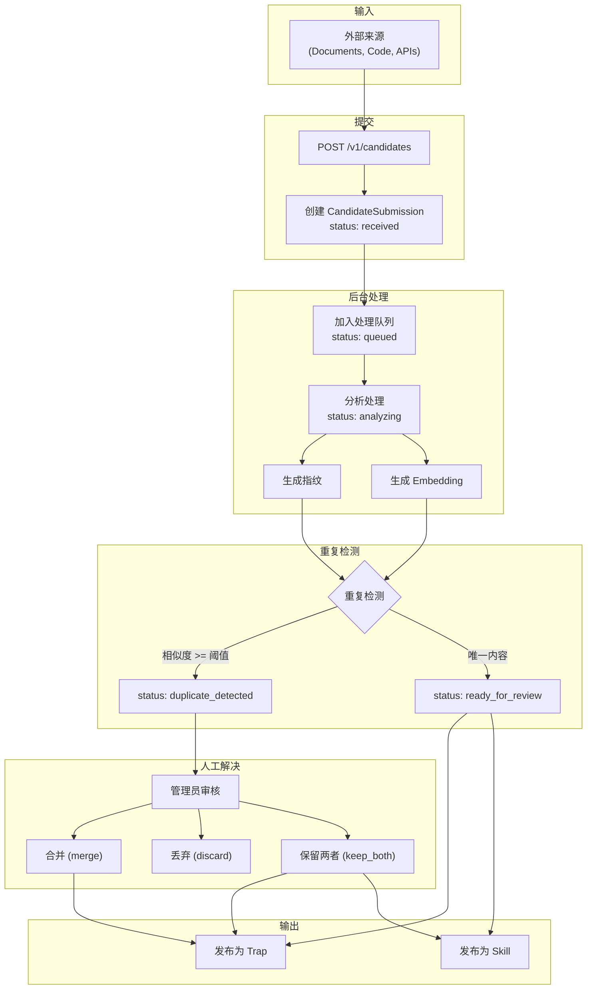

# 异步摄取管道 (Async Ingestion Pipeline)

## 概述

异步摄取管道用于批量导入外部知识源（如文档、代码库、API 响应），并将其转换为 TrapMap 中的可检索条目。管道处理候选提交、重复检测、人工解决和最终发布。

## 架构概览

```
┌─────────────────────────────────────────────────────────────────────────┐
│                    Async Ingestion Pipeline Architecture                 │
├─────────────────────────────────────────────────────────────────────────┤
│                                                                         │
│  ┌───────────────┐     ┌───────────────┐     ┌───────────────┐         │
│  │   External   │────▶│  Candidate    │────▶│  Background   │         │
│  │   Sources    │     │  Submission   │     │  Processor    │         │
│  │              │     │               │     │               │         │
│  │  - Documents │     │  POST /v1/    │     │  - Queue      │         │
│  │  - Code      │     │    candidates │     │  - Process    │         │
│  │  - APIs      │     │               │     │  - Detect     │         │
│  └───────────────┘     └───────────────┘     └───────┬───────┘         │
│                                                       │                 │
│                            ┌──────────────────────────┼─────────────┐   │
│                            ▼                          ▼             │   │
│                   ┌───────────────┐         ┌───────────────┐      │   │
│                   │   Duplicate   │         │   Analysis    │      │   │
│                   │   Detector    │         │   Complete    │      │   │
│                   │               │         │               │      │   │
│                   │  - Fingerprint│         │  Status:     │      │   │
│                   │  - Semantic   │         │  ready_for   │      │   │
│                   │               │         │  _review      │      │   │
│                   └───────┬───────┘         └───────┬───────┘      │   │
│                           │                          │                 │   │
│                           │                          │                 │   │
│                           ▼                          ▼                 │   │
│                   ┌─────────────────────────────────────────────┐      │   │
│                   │              Review Queue                   │      │   │
│                   │                                             │      │   │
│                   │  For duplicates: Manual resolution required │      │   │
│                   │  For unique: Auto-publish or queue review   │      │   │
│                   └─────────────────────────────────────────────┘      │   │
│                                                                       │   │
└───────────────────────────────────────────────────────────────────────┘
```

### 异步摄取管道流程（Mermaid）



## 候选状态机

```
┌─────────────┐
│  RECEIVED   │  ← Initial state
└──────┬──────┘
       │ process()
       ▼
┌─────────────┐
│   QUEUED    │  ← In processing queue
└──────┬──────┘
       │ start_processing()
       ▼
┌─────────────┐
│  ANALYZING  │  ← Being processed
└──────┬──────┘
       │
       ├──────────────────────────────┐
       ▼                              ▼
┌────────────────────┐      ┌─────────────────┐
│ DUPLICATE_DETECTED │      │READY_FOR_REVIEW │
│                    │      │                 │
│  Requires manual   │      │  Unique content │
│  resolution        │      │  Ready for      │
└──────┬─────────────┘      │  publication    │
       │                    └─────────────────┘
       │ manual_resolution()
       ▼
┌─────────────┐
│  RESOLVED   │  ← Final state
└─────────────┘
```

---

## 候选提交 (Candidate Submission)

### API 端点

```typescript
// POST /v1/candidates
interface CandidateSubmissionRequest {
  content: string;
  source: string;
  submittedBy?: ActorRef;
  metadata?: Record<string, unknown>;
}
```

### 字段说明

| 字段 | 类型 | 描述 |
|------|------|------|
| content | string | 要摄取的内容（文本） |
| source | string | 来源标识（如 URL、文件名） |
| submittedBy | ActorRef | 可选，提交者信息 |
| metadata | object | 可选，额外元数据 |

### 提交流程

```
┌─────────────────────────────────────────────────────────────────────────┐
│                    Candidate Submission Flow                             │
├─────────────────────────────────────────────────────────────────────────┤
│                                                                         │
│  External Source                                                        │
│  ┌─────────────────────────────────────────────────────────────────┐   │
│  │  - Document (PDF, MD, HTML)                                    │   │
│  │  - Code file                                                   │   │
│  │  - API response                                                │   │
│  │  - Database dump                                               │   │
│  └─────────────────────────────────────────────────────────────────┘   │
│        │                                                                │
│        ▼                                                                │
│  ┌─────────────────────────────────────────────────────────────────┐   │
│  │                    Content Extraction                            │   │
│  │  - Extract text (strip formatting, metadata)                    │   │
│  │  - Normalize encoding                                          │   │
│  │  - Chunk if too large (>32K chars)                             │   │
│  └─────────────────────────────────────────────────────────────────┘   │
│        │                                                                │
│        ▼                                                                │
│  ┌─────────────────────────────────────────────────────────────────┐   │
│  │                    Candidate Creation                            │   │
│  │  - Generate EntityId                                            │   │
│  │  - Set status: 'received'                                       │   │
│  │  - Record source and metadata                                   │   │
│  │  - Record submittedAt                                           │   │
│  └─────────────────────────────────────────────────────────────────┘   │
│        │                                                                │
│        ▼                                                                │
│  ┌─────────────────────────────────────────────────────────────────┐   │
│  │                    Queue for Processing                          │   │
│  └─────────────────────────────────────────────────────────────────┘   │
│                                                                         │
└─────────────────────────────────────────────────────────────────────────┘
```

---

## 后台处理 (Background Processing)

### 处理器实现

```typescript
interface ProcessingJob {
  candidateId: EntityId;
  priority: 'low' | 'normal' | 'high';
  attempts: number;
  createdAt: string;
}

class CandidateProcessor {
  private queue: ProcessingJob[] = [];
  private processing = new Set<EntityId>();
  private maxConcurrent = 5;
  
  async processLoop(): Promise<void> {
    while (true) {
      // Fill processing slots
      while (this.processing.size < this.maxConcurrent && this.queue.length > 0) {
        const job = this.queue.shift()!;
        this.processCandidate(job.candidateId);
      }
      
      // Wait before next iteration
      await sleep(1000);
    }
  }
  
  private async processCandidate(candidateId: EntityId): Promise<void> {
    this.processing.add(candidateId);
    
    try {
      // Update status to analyzing
      await this.updateStatus(candidateId, 'analyzing');
      
      // Generate fingerprint
      const fingerprint = await this.generateFingerprint(candidateId);
      
      // Generate embedding
      const embedding = await this.generateEmbedding(candidateId);
      
      // Check for duplicates
      const duplicates = await this.findDuplicates(candidateId, fingerprint, embedding);
      
      if (duplicates.length > 0) {
        // Mark as duplicate
        await this.updateStatus(candidateId, 'duplicate_detected', {
          duplicates
        });
      } else {
        // Mark as ready for review
        await this.updateStatus(candidateId, 'ready_for_review');
      }
    } catch (error) {
      // Handle failure
      await this.handleProcessingError(candidateId, error);
    } finally {
      this.processing.delete(candidateId);
    }
  }
}
```

### 指纹生成

```typescript
async function generateFingerprint(candidateId: EntityId): Promise<string> {
  const candidate = await store.getCandidate(candidateId);
  const content = candidate.content;
  
  // Normalize content
  const normalized = content
    .toLowerCase()
    .replace(/[^\w\s]/g, ' ')
    .replace(/\s+/g, ' ')
    .trim();
  
  // Generate hash
  const hash = crypto.createHash('sha256').update(normalized).digest('hex');
  
  // Truncate to 16 bytes for similarity matching
  return hash.substring(0, 32);
}

async function findDuplicates(
  candidateId: EntityId,
  fingerprint: string,
  embedding: number[]
): Promise<DuplicateMatch[]> {
  const duplicates: DuplicateMatch[] = [];
  
  // 1. Exact fingerprint match
  const fingerprintMatches = await store.findByFingerprint(fingerprint);
  for (const match of fingerprintMatches) {
    if (match.candidateId !== candidateId) {
      duplicates.push({
        candidateId,
        candidate2Id: match.candidateId,
        matchType: 'fingerprint',
        similarity: 1.0
      });
    }
  }
  
  // 2. Semantic similarity match
  const semanticMatches = await store.findByEmbedding(embedding, {
    threshold: 0.95,  // High threshold for duplicate detection
    limit: 5
  });
  
  for (const match of semanticMatches) {
    if (match.candidateId !== candidateId) {
      duplicates.push({
        candidateId,
        candidate2Id: match.candidateId,
        matchType: 'semantic',
        similarity: match.similarity
      });
    }
  }
  
  return duplicates;
}
```

---

## 重复检测 (Duplicate Detection)

### 检测策略

| 策略 | 方法 | 阈值 | 用途 |
|------|------|------|------|
| 精确指纹 | SHA-256 哈希 | 100% 匹配 | 精确重复 |
| 语义相似度 | 余弦相似度 | ≥ 0.95 | 近似重复 |

### 检测流程

```
┌─────────────────────────────────────────────────────────────────────────┐
│                    Duplicate Detection Flow                               │
├─────────────────────────────────────────────────────────────────────────┤
│                                                                         │
│  New Candidate                                                           │
│        │                                                                │
│        ▼                                                                │
│  ┌─────────────────────────────────────────────────────────────────┐   │
│  │                    Fingerprint Check                            │   │
│  │  - SHA-256 hash of normalized content                           │   │
│  │  - Exact match → immediate duplicate                           │   │
│  └─────────────────────────────────────────────────────────────────┘   │
│        │                                                                │
│        ▼                                                                │
│  ┌─────────────────────────────────────────────────────────────────┐   │
│  │                    Semantic Similarity Check                     │   │
│  │  - Generate embedding                                           │   │
│  │  - Compare with existing candidate embeddings                   │   │
│  │  - Similarity ≥ 0.95 → likely duplicate                        │   │
│  └─────────────────────────────────────────────────────────────────┘   │
│        │                                                                │
│        ▼                                                                │
│  ┌─────────────────────────────────────────────────────────────────┐   │
│  │                    Merge Decision                              │   │
│  │                                                                    │ │
│  │  ┌─────────────────┐    ┌─────────────────┐                    │   │
│  │  │ Duplicates      │    │ No Duplicates   │                    │   │
│  │  │ Found          │    │ Found           │                    │   │
│  │  │                 │    │                 │                    │   │
│  │  │ → Queue for     │    │ → Mark as       │                    │   │
│  │  │   manual       │    │   ready_for     │                    │   │
│  │  │   resolution   │    │   _review      │                    │   │
│  │  └─────────────────┘    └─────────────────┘                    │   │
│  └─────────────────────────────────────────────────────────────────┘   │
│                                                                         │
└─────────────────────────────────────────────────────────────────────────┘
```

---

## 人工解决 (Manual Resolution)

### API 端点

```typescript
// POST /v1/candidates/:id/manual-result
interface ManualResolutionRequest {
  resolution: 'merge' | 'discard' | 'keep_both';
  mergeIntoId?: EntityId;  // Required if resolution is 'merge'
  notes?: string;
}
```

### 解决选项

| 选项 | 描述 | 结果 |
|------|------|------|
| `merge` | 合并重复内容 | 创建单个条目，链接两个候选 |
| `discard` | 丢弃当前候选 | 当前候选被拒绝 |
| `keep_both` | 保留两者 | 两个候选都转为正式条目 |

### 解决流程

```
┌─────────────────────────────────────────────────────────────────────────┐
│                    Manual Resolution Flow                                 │
├─────────────────────────────────────────────────────────────────────────┤
│                                                                         │
│  Reviewer Action                                                         │
│  ┌─────────────────────────────────────────────────────────────────┐   │
│  │  GET /v1/duplicates/:candidateId/bundle                         │   │
│  │  - Returns current candidate + duplicate candidates            │   │
│  │  - Shows content comparison                                    │   │
│  └─────────────────────────────────────────────────────────────────┘   │
│        │                                                                │
│        ▼                                                                │
│  ┌─────────────────────────────────────────────────────────────────┐   │
│  │                    User Decision                               │   │
│  │                                                                    │   │
│  │  POST /v1/candidates/:id/manual-result                         │   │
│  │  { resolution: "merge" | "discard" | "keep_both" }            │   │
│  └─────────────────────────────────────────────────────────────────┘   │
│        │                                                                │
│        ▼                                                                │
│  ┌─────────────────────────────────────────────────────────────────┐   │
│  │                    Execute Resolution                            │   │
│  │                                                                    │   │
│  │  ┌─────────────────┐ ┌─────────────────┐ ┌─────────────────┐   │   │
│  │  │     MERGE       │ │    DISCARD      │ │   KEEP_BOTH     │   │   │
│  │  │                 │ │                │ │                 │   │   │
│  │  │ 1. Combine     │ │ 1. Mark         │ │ 1. Convert     │   │   │
│  │  │    content     │ │    candidate   │ │    current     │   │   │
│  │  │ 2. Create new  │ │    as          │ │    to entry    │   │   │
│  │  │    entry       │ │    rejected    │ │ 2. Convert     │   │   │
│  │  │ 3. Link        │ │ 2. Update      │ │    duplicate   │   │   │
│  │  │    candidates  │ │    duplicates  │ │    to entry    │   │   │
│  │  └─────────────────┘ └─────────────────┘ └─────────────────┘   │   │
│  └─────────────────────────────────────────────────────────────────┘   │
│        │                                                                │
│        ▼                                                                │
│  ┌─────────────────────────────────────────────────────────────────┐   │
│  │                    Status Update                                │   │
│  │  - All involved candidates: status → 'resolved'                │   │
│  │  - Record resolution in DuplicateCase                         │   │
│  │  - Send audit event                                           │   │
│  └─────────────────────────────────────────────────────────────────┘   │
│                                                                         │
└─────────────────────────────────────────────────────────────────────────┘
```

---

## 发布 (Publishing)

### 发布为 Trap

当候选被批准发布时，可以创建 Trap 条目：

```typescript
async function publishAsTrap(
  candidateId: EntityId,
  trapData: { name: string; description: string }
): Promise<EntityId> {
  const candidate = await store.getCandidate(candidateId);
  
  // Create trap entry
  const trap = await store.createTrap({
    id: generateEntityId(),
    name: trapData.name,
    description: trapData.description,
    content: candidate.content,
    requiredLevel: 0,  // Default level
    lifecycleState: 'approved',  // Direct approval for ingested
    createdAt: new Date().toISOString(),
    createdBy: { actorId: candidate.submittedBy?.actorId, actorName: 'System' }
  });
  
  // Link candidate to trap
  await store.updateCandidate(candidateId, {
    status: 'resolved',
    publishedAs: { type: 'trap', entityId: trap.id }
  });
  
  // Record lineage
  await store.createEntityLineage({
    entityId: trap.id,
    candidateIds: [candidateId]
  });
  
  return trap.id;
}
```

---

## 协调 (Reconciliation)

启动时协调未完成的候选：

```typescript
async function reconcileCandidates(): Promise<void> {
  const candidates = await store.listCandidates({
    filter: {
      status: { in: ['received', 'queued', 'analyzing'] }
    }
  });
  
  for (const candidate of candidates) {
    // Re-queue stuck candidates
    const stuckDuration = Date.now() - new Date(candidate.updatedAt).getTime();
    
    if (stuckDuration > 30 * 60 * 1000) {  // 30 minutes
      await processor.requeue(candidate.id);
    }
  }
  
  // Clean up old resolved candidates (optional)
  const oldResolved = await store.listCandidates({
    filter: {
      status: 'resolved',
      resolvedAt: { lt: subtractDays(new Date(), 30) }
    }
  });
  
  // Archive or delete old resolved
  for (const candidate of oldResolved) {
    await store.archiveCandidate(candidate.id);
  }
}
```

---

## 监控

### 指标

```typescript
interface IngestionMetrics {
  // Processing
  queueDepth: number;
  processingCount: number;
  averageProcessingTimeMs: number;
  
  // Outcomes
  pendingCount: number;
  duplicateDetectedCount: number;
  resolvedCount: number;
  
  // Errors
  failedCount: number;
  lastError?: string;
}
```

### 健康检查

```typescript
async function getIngestionHealth(): Promise<HealthStatus> {
  const metrics = await getIngestionMetrics();
  
  if (metrics.failedCount > 10) {
    return { status: 'unhealthy', reason: 'High failure count' };
  }
  
  if (metrics.queueDepth > 1000) {
    return { status: 'degraded', reason: 'Large queue depth' };
  }
  
  return { status: 'healthy' };
}
```
