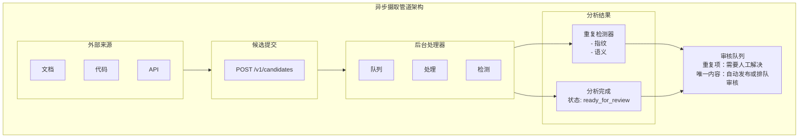
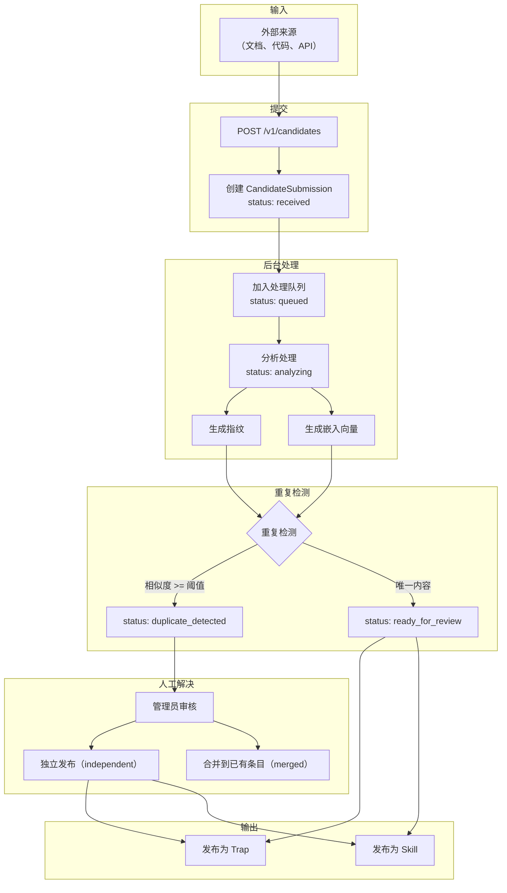
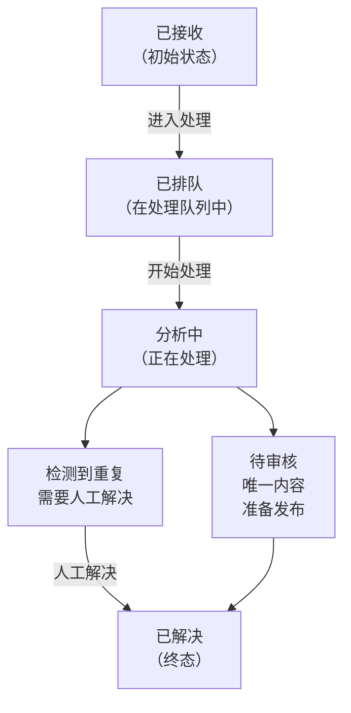
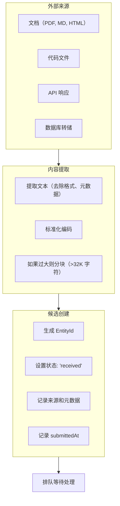
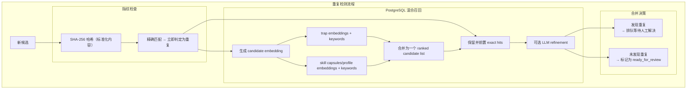
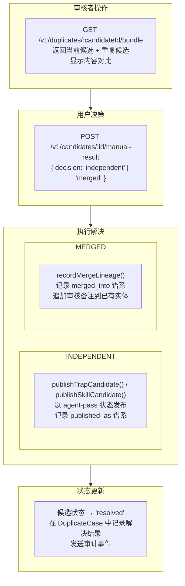
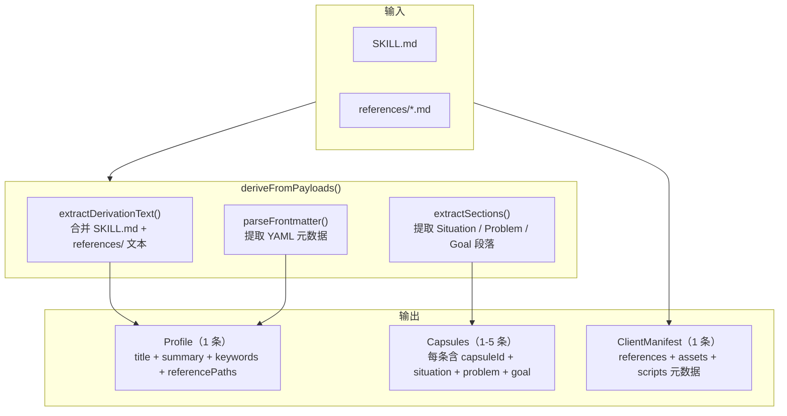

# 异步摄取管道 (Async Ingestion Pipeline)

## 概述

异步摄取管道用于批量导入外部知识源（如文档、代码库、API 响应），并将其转换为 TrapMap 中的可检索条目。管道处理候选提交、重复检测、人工解决和最终发布。

## 架构概览



### 异步摄取管道流程（Mermaid）



## 候选状态机



---

## 候选提交 (Candidate Submission)

### API 端点

```typescript
// POST /v1/candidates
interface CandidateSubmissionRequest {
  content: string;
  source: string;
  submittedBy?: ActorRef;
  metadata?: Record<string, unknown>;
}
```

### 字段说明

| 字段 | 类型 | 描述 |
|------|------|------|
| content | string | 要摄取的内容（文本） |
| source | string | 来源标识（如 URL、文件名） |
| submittedBy | ActorRef | 可选，提交者信息 |
| metadata | object | 可选，额外元数据 |

### 提交流程



---

## 后台处理 (Background Processing)

### 处理器实现

```typescript
interface ProcessingJob {
  candidateId: EntityId;
  priority: 'low' | 'normal' | 'high';
  attempts: number;
  createdAt: string;
}

class CandidateProcessor {
  private queue: ProcessingJob[] = [];
  private processing = new Set<EntityId>();
  private maxConcurrent = 5;
  
  async processLoop(): Promise<void> {
    while (true) {
      // Fill processing slots
      while (this.processing.size < this.maxConcurrent && this.queue.length > 0) {
        const job = this.queue.shift()!;
        this.processCandidate(job.candidateId);
      }
      
      // Wait before next iteration
      await sleep(1000);
    }
  }
  
  private async processCandidate(candidateId: EntityId): Promise<void> {
    this.processing.add(candidateId);
    
    try {
      // Update status to analyzing
      await this.updateStatus(candidateId, 'analyzing');
      
      // Generate fingerprint
      const fingerprint = await this.generateFingerprint(candidateId);
      
      // Generate embedding
      const embedding = await this.generateEmbedding(candidateId);
      
      // Check for duplicates
      const duplicates = await this.findDuplicates(candidateId, fingerprint, embedding);
      
      if (duplicates.length > 0) {
        // Mark as duplicate
        await this.updateStatus(candidateId, 'duplicate_detected', {
          duplicates
        });
      } else {
        // Mark as ready for review
        await this.updateStatus(candidateId, 'ready_for_review');
      }
    } catch (error) {
      // Handle failure
      await this.handleProcessingError(candidateId, error);
    } finally {
      this.processing.delete(candidateId);
    }
  }
}
```

### 指纹生成

```typescript
async function generateFingerprint(candidateId: EntityId): Promise<string> {
  const candidate = await store.getCandidate(candidateId);
  const content = candidate.content;
  
  // Normalize content
  const normalized = content
    .toLowerCase()
    .replace(/[^\w\s]/g, ' ')
    .replace(/\s+/g, ' ')
    .trim();
  
  // Generate hash
  const hash = crypto.createHash('sha256').update(normalized).digest('hex');
  
  // Truncate to 16 bytes for similarity matching
  return hash.substring(0, 32);
}

async function findDuplicates(
  candidateId: EntityId,
  fingerprint: string,
  embedding: number[]
): Promise<DuplicateMatch[]> {
  const duplicates: DuplicateMatch[] = [];
  
  // 1. Exact fingerprint match
  const fingerprintMatches = await store.findByFingerprint(fingerprint);
  for (const match of fingerprintMatches) {
    if (match.candidateId !== candidateId) {
      duplicates.push({
        candidateId,
        candidate2Id: match.candidateId,
        matchType: 'fingerprint',
        similarity: 1.0
      });
    }
  }
  
  // 2. Semantic similarity match
  const semanticMatches = await store.findByEmbedding(embedding, {
    threshold: 0.95,  // High threshold for duplicate detection
    limit: 5
  });
  
  for (const match of semanticMatches) {
    if (match.candidateId !== candidateId) {
      duplicates.push({
        candidateId,
        candidate2Id: match.candidateId,
        matchType: 'semantic',
        similarity: match.similarity
      });
    }
  }
  
  return duplicates;
}
```

---

## 重复检测 (Duplicate Detection)

### Exact match first (Phase 1)

> Phase 1 在两个探测器上同时落地了 **exact-fingerprint lane**：命中即返回 `matchType: 'exact'` 且 `similarityScore: 1`，跳过 Jaccard / pgvector 召回与 LLM 精排开销，保证相同内容在不同探测器之间行为一致。

- **Trap 侧**：`computeTrapFingerprint({shortcut, detail, labels})` 对 `shortcut` / `detail` 做 trim，对 `labels` 做 trim + sort + `,` 拼接，最后以 SHA-256 产出 trap exact key。候选生成时同样调用同一函数（`packages/server/src/lib/candidates/fingerprint.ts`），保证规范化口径一致。
  - In-memory 探测器（`packages/server/src/lib/candidates/detector.ts` 的 `checkTrapDuplicate`）在 Jaccard 评分前先比对 `computeTrapFingerprint(entry)` 与 `candidateExactLookupKey`，命中则直接返回 `matchType: 'exact'`。
  - PG 探测器（`packages/server/src/lib/candidates/pg-detector.ts` 的 `detectDuplicatesPg`）先扫描 `fallbackData.trapEntries`，对每个 `lifecycleState === 'approved'` 的 entry 重新计算 trap fingerprint 并比对；一旦命中，直接 early-return exact duplicate case，不再继续 embedding / recall / LLM。
- **Skill 侧**：候选 exact key 与已批准工件的 `derived.profile.contentHash` / `derived.profile.sourceHash` 对齐，而不是复用用于语义召回的 candidate fingerprint。
  - 候选在 `buildNormalizedDuplicateInput()` 中生成两个 key：`fingerprint` 继续服务于分析快照与语义检索，`exactLookupKey` 则优先复现 derivation text 的 `contentHash`；如果提交时没有正文，只保留 derivation-eligible 文件（`SKILL.md` + `references/`）的 `sha256`，则退化为与已批准 profile `sourceHash` 对齐。
  - In-memory 探测器（`checkSkillDuplicate`）先用 `candidateExactLookupKey` 对比 `profile.contentHash` / `profile.sourceHash`，命中即返回 `matchType: 'exact'`，不会先被相似度阈值过滤。
  - PG 探测器（`detectDuplicatesPg`）同样先跑 skill exact lane：先看 `fallbackData.skillArtifacts`，再查询 `skill_artifact_profiles.content_hash OR source_hash`；一旦命中，直接 early-return exact duplicate case，不再继续 hybrid recall。
- **不变量**：两端只要命中 exact lane，`DuplicateCase.duplicateType === 'exact'` 与 `hasExactDuplicate === true` 同时成立；后续 review workflow 与持久化 shape 不变（沿用现有 `DuplicateCase` 字段）。
- **索引局限**：Trap 端仍未引入持久化 fingerprint column / exact index，PG exact lane 只能通过 `fallbackData` 对 trap 逐条重算；skill 端已复用 `skill_artifact_profiles.content_hash` 与 `source_hash` 做 SQL exact lookup。

### Shared normalized candidate input (Phase 2)

> Phase 2 把 trap 与 skill 候选在同一处归一化为 `NormalizedDuplicateInput`（`packages/server/src/lib/candidates/types.ts`），由 in-memory 与 PostgreSQL 探测器共享，避免之前 trap-only `candidateText` 与空 skill 文本的偏差。

`buildNormalizedDuplicateInput(candidate)`（`packages/server/src/lib/candidates/fingerprint.ts`）作为唯一入口产出：

- `sourceType` — `'trap' | 'skill'`
- `fingerprint` — 唯一哈希；trap 走 `computeTrapFingerprint({shortcut, detail, labels})`，skill 走 `computeSkillFingerprint({profile, files})`（profile 由 SKILL.md content 解析得到，files 始终用 `path` + `sha256`）
- `titleText` — trap: `shortcut`；skill: SKILL.md 首个 `#` 标题（content 存在时），否则首个文件路径，再否则 `candidate.id`
- `bodyText` — trap: `detail`；skill: SKILL.md 去除首行标题后的余下内容（content 存在时），否则所有文件路径 `\n` 拼接
- `keywordTerms` — trap: `labels`；skill: 从 SKILL.md 提取的 keywords（content 存在时），否则 `[]`
- `tokenTerms` — 对 `titleText` + `bodyText` 调用 `tokenize()` 的结果
- `exactLookupKey` — trap 与 `fingerprint` 同值；skill 单独走 `computeSkillExactLookupKey()`，优先对齐 derivation text 的 `contentHash`，否则退化为 derivation-eligible 文件哈希形成的 `sourceHash`

调用方（`packages/server/src/lib/candidates/processor.ts`）把同一 `normalized` 对象传给两个探测器：

- In-memory 路径：把 `normalized.{fingerprint, keywordTerms, tokenTerms, titleText, bodyText}` 装入 `DuplicateDetectionInput`，LLM 精排直接消费 `candidateTitle` / `candidateBody` 而不是 `candidateKeywords.slice(0, 5)` / `candidateTokens.slice(0, 100)` 拼凑的 fallback。
- PG 路径：把 `normalized.titleText` + `normalized.bodyText` 拼接为 `candidateText` 喂给 `generateEmbedding()`，并把 `candidateTitle` / `candidateBody` 透传给 PG 探测器的 LLM 精排，确保 PG 端的 skill 候选不再回退到空 embedding / 空 LLM 文本。

### 目标分层架构 (Target Layered Architecture)

> 当前实现已经进入分层重复检测路径：候选先规范化，再经过 exact lane、PostgreSQL trap+skill 混合召回、统一排序，以及可选的 top-K LLM 精排。后续阶段（见根目录 `plan.md`）仍会继续补齐 trap 指纹持久化、队列去重和 rollout 校准，但本节描述的六层管线已经是当前的实现方向而非纯 future-state 占位。后续编辑本节时，请保持下表与 `plan.md` 中"Example Target Shapes"以及完成备注中冻结的字段名一致。

1. **Normalize candidate input** — 由共享 helper（`packages/server/src/lib/candidates/fingerprint.ts` 中的规范化器）将 trap 与 skill 候选都转成 `NormalizedDuplicateInput`：`sourceType`、`fingerprint`、`titleText`、`bodyText`、`keywordTerms`、`tokenTerms`、`exactLookupKey`。
2. **Exact fingerprint lane** — 命中即返回 `matchType: 'exact'`，跳过 Jaccard / pgvector / LLM。trap 仍依赖 on-the-fly 重新计算指纹；skill 复用 `derived.profile.contentHash` / `sourceHash` 这些已有字段。
3. **Indexed PostgreSQL recall** — `packages/server/src/lib/candidates/pg-detector.ts` 在 PostgreSQL 中并行执行四条召回通道：trap embeddings、trap keywords、skill capsule/profile embeddings、skill capsule/profile keywords。
4. **Merge + preserve exact hits** — SQL 召回结果先归一化为统一候选 shape，再与 exact-fingerprint lane 命中合并；exact 命中始终保留并前置，不会被后续 top-K 截断覆盖。
5. **Score + rerank top-K** — trap + skill 的混合候选列表按统一相似度分数排序、去重、截断到 top-K，再交给可选的 LLM 精排。
6. **Optional LLM refinement** — 仅对 merged ranked list 中的 top-K 候选对运行 LLM 判定，不对全量做调用。

### Queue dedupe 与 duplicate-path observability (Phase 4)

> Phase 4 把“不要重复处理同一个 candidate”和“命中的 duplicate lane 要能回放解释”这两件事都固化到当前实现里。

- **Queue dedupe**：`packages/server/src/lib/candidates/processor.ts` 在首次 `scheduleCandidateProcessing()` 与失败后的重试入队都传入 `dedupeKey: candidateId`。`packages/server/src/lib/queue/task-queue.ts` 依赖 `task_queue_dedupe_pending_idx` 这个 partial unique index（`WHERE status IN ('pending', 'running')`）保证同一 candidate 在 active 状态下只能保留一个任务；如果并发插入打到唯一约束，队列会回读现存 active task，并在冲突赢家已消失的 race 窗口里重试一次插入，而不是把请求直接丢掉。
- **Retry semantics unchanged**：active dedupe 只覆盖 `pending` / `running`。任务进入 `completed`、`failed` 或 `dead` 后，不再阻止后续合法再入队，所以真实失败后的重新调度、dead-letter 后的人工恢复、以及 resolution 后的显式重跑都不会被 dedupe 永久吞掉。
- **Persisted duplicate trace**：两个探测器都会把结构化 trace 写进 `AnalysisSnapshot.duplicateTrace`，并由 `PgCandidateRepository` 同步落到 `candidates.analysis_snapshot` 与 `candidate_analyses.duplicate_trace`：
  - `detector: 'in-memory' | 'postgresql'`
  - `matchedLane: 'exact' | 'indexed-recall' | 'fallback' | 'none'`
- **Trace interpretation**：
  - `exact`：命中了 exact-fingerprint lane
  - `indexed-recall`：命中了 PostgreSQL trap/skill recall 产出的候选
  - `fallback`：命中了 in-memory Jaccard/LLM fallback 路径
  - `none`：本次分析没有形成 duplicate case，但保留了探测器来源，方便调试“为什么没命中”

### 检测策略

| 策略 | 方法 | 阈值 | 用途 |
|------|------|------|------|
| 精确指纹 | SHA-256 哈希 | 100% 匹配 | 精确重复 |
| PostgreSQL trap recall | `knowledgeEmbeddings` + `knowledgeKeywords` | top-K / recall thresholds | 召回 trap duplicate 候选 |
| PostgreSQL skill recall | skill profile/capsule embeddings + keywords | top-K / recall thresholds | 召回 skill duplicate 候选 |
| 混合排序 | trap + skill merged ranked list | exact hits preserved | 在统一列表里比较跨来源 duplicate 候选 |
| LLM 语义判定 | merged top-K + LLM 判定 | confidence ≥ 0.8 | 对混合候选做最终语义精排 |

### 检测流程



---

## 人工解决 (Manual Resolution)

### API 端点

```typescript
// POST /v1/candidates/:id/manual-result
interface ManualResolutionRequest {
  resolution: 'merge' | 'discard' | 'keep_both';
  mergeIntoId?: EntityId;  // Required if resolution is 'merge'
  notes?: string;
}
```

### 解决选项

| 决策 | 描述 | 结果 |
|------|------|------|
| `independent` | 候选是独立条目 | 以 `agent-pass` 状态发布为正式条目，记录 `published_as` 谱系 |
| `merged` | 候选合并到已有条目 | 记录 `merged_into` 谱系，追加审核备注到已有实体 |

### 解决流程



---

## 发布 (Publishing)

### 发布为 Trap

当候选被批准发布时，可以创建 Trap 条目：

```typescript
async function publishAsTrap(
  candidateId: EntityId,
  trapData: { name: string; description: string }
): Promise<EntityId> {
  const candidate = await store.getCandidate(candidateId);
  
  // Create trap entry
  const trap = await store.createTrap({
    id: generateEntityId(),
    name: trapData.name,
    description: trapData.description,
    content: candidate.content,
    requiredLevel: 0,  // Default level
    lifecycleState: 'approved',  // Direct approval for ingested
    createdAt: new Date().toISOString(),
    createdBy: { actorId: candidate.submittedBy?.actorId, actorName: 'System' }
  });
  
  // Link candidate to trap
  await store.updateCandidate(candidateId, {
    status: 'resolved',
    publishedAs: { type: 'trap', entityId: trap.id }
  });
  
  // Record lineage
  await store.createEntityLineage({
    entityId: trap.id,
    candidateIds: [candidateId]
  });
  
  return trap.id;
}
```

---

## 协调 (Reconciliation)

启动时协调未完成的候选：

```typescript
async function reconcileCandidates(): Promise<void> {
  const candidates = await store.listCandidates({
    filter: {
      status: { in: ['received', 'queued', 'analyzing'] }
    }
  });
  
  for (const candidate of candidates) {
    // Re-queue stuck candidates
    const stuckDuration = Date.now() - new Date(candidate.updatedAt).getTime();
    
    if (stuckDuration > 30 * 60 * 1000) {  // 30 minutes
      await processor.requeue(candidate.id);
    }
  }
  
  // Clean up old resolved candidates (optional)
  const oldResolved = await store.listCandidates({
    filter: {
      status: 'resolved',
      resolvedAt: { lt: subtractDays(new Date(), 30) }
    }
  });
  
  // Archive or delete old resolved
  for (const candidate of oldResolved) {
    await store.archiveCandidate(candidate.id);
  }
}
```

---

## 监控

### 指标

```typescript
interface IngestionMetrics {
  // Processing
  queueDepth: number;
  processingCount: number;
  averageProcessingTimeMs: number;
  
  // Outcomes
  pendingCount: number;
  duplicateDetectedCount: number;
  resolvedCount: number;
  
  // Errors
  failedCount: number;
  lastError?: string;
}
```

### 健康检查

```typescript
async function getIngestionHealth(): Promise<HealthStatus> {
  const metrics = await getIngestionMetrics();

  if (metrics.failedCount > 10) {
    return { status: 'unhealthy', reason: 'High failure count' };
  }

  if (metrics.queueDepth > 1000) {
    return { status: 'degraded', reason: 'Large queue depth' };
  }

  return { status: 'healthy' };
}
```

---

## 切片策略 (Chunking Strategy)

TrapMap **不使用传统的文档切片策略**，而是采用整条目标范文本作为 embedding 输入。

### Knowledge Entry（Trap）的 embedding 输入

```typescript
// recall/semantic.ts:25
`${entry.shortcut}\n${entry.detail}\n${labelsText}`.trim()
```

各字段约束（`contracts/src/domain/knowledge.ts`）：

| 字段 | 约束 | 说明 |
|------|------|------|
| `shortcut` | ≤ 280 字符 | 精炼摘要 |
| `detail` | ≤ 10,000 字符 | 详细描述 |
| `labels` | 字符串数组 | 分类标签 |

整条 canonical text 直接生成 embedding，不做切分。设计理由：

- Knowledge entry 本身定位为精炼的陷阱/经验条目，不等同于长文档
- 整条文本保留语义完整性，避免切片导致上下文丢失
- 通过 keyword 索引和 graph 索引补充细粒度检索能力

> **注意：** `detail` 上限为 10,000 字符，接近上限时 embedding 质量可能下降，这是当前设计的已知取舍点。

### Skill Artifact 的 derivation

Skill artifact 不做传统切片，而是通过**结构化派生（derivation）**将 SKILL.md + references/ 拆分为 typed records（profile、capsules、clientManifest），详见下节。

---

## Skill Artifact 入库 (Skill Artifact Ingestion)

Skill 入库处理整个 skill 目录，不只是 SKILL.md。

### 文件分类

通过 `buildArtifactBundle()`（`cli/src/lib/artifact-bundle.ts:206-355`）扫描 skill 目录，按子目录分类：

| 文件类型 | 路径 | Kind | 参与 derivation | 仅用于激活 |
|---------|------|------|:---:|:---:|
| Skill 主文件 | `SKILL.md` | `skill-markdown` | ✅ | ❌ |
| 参考文档 | `references/` | `reference` | ✅ | ❌ |
| 资源文件 | `assets/` | `asset` | ❌ | ✅ |
| 脚本文件 | `scripts/` | `script` | ❌ | ✅ |

约束 T-12-09、T-12-10：**只有 SKILL.md + references/ 参与 profile/capsule 的内容计算**，assets 和 scripts 仅出现在 clientManifest 的激活元数据中。

### SKILL.md 解析

由 `parseSkillMarkdown()`（`contracts/src/domain/parsing.ts:92-107`）使用 `gray-matter` 库提取 YAML frontmatter 字段：`name`、`title`、`description`、`labels`、`feedbackPrompts`。

### Derivation 派生流程

入口函数 `deriveFromPayloads()`（`server/src/lib/artifacts/derive.ts:532-688`）从 SKILL.md + references/ 文件内容生成三类输出：



#### Profile（单条记录）

`buildSkillProfile()` 将所有 derivation-eligible 文件合并为单一 profile：
- `title`：来自 SKILL.md frontmatter
- `summary`：由 `buildSummaryFromText()` 从合并文本生成
- `keywords`：从 labels 提取
- `referencePaths`：所有 references/ 文件路径

#### Capsules（1-5 条记录）—— 核心拆分逻辑

Capsule 生成分两步：

1. **主 capsule**（始终生成）：从 SKILL.md 内容生成，通过 `extractSections()` 用 markdown header regex 提取 `## Situation` / `## Problem` / `## Goal` 段落
2. **额外 capsules**（条件生成）：遍历每个 references/ 文件，检查是否包含独立的结构化段落：

```typescript
// derive.ts:618-619
const refSections = extractSections(refContent);
if (refSections.problem || refSections.situation) {
  // 为该 reference 文件生成独立 capsule
}
```

- 每个 capsule 是独立的检索单元，拥有自己的 `capsuleId`、`sourcePaths`、`situation`、`problem`、`goal`、`content`、`labels`
- **上限 5 个 capsule**（`derive.ts:614`：`if (capsules.length >= 5) break`）
- 没有 `## Situation` 或 `## Problem` 段落的 reference 不会生成独立 capsule，其内容仍包含在主 capsule 的合并文本中
- 继承 artifact 的 `scope` 和 `requiredLevel`（约束 T-12-11）

#### ClientManifest（单条记录）

`buildClientManifest()` 汇集 references、assets、scripts 的元数据（path、sha256、sizeBytes、mediaType），用于客户端激活，不包含文件正文。

### Graph 索引

每个 capsule 在图索引阶段被独立分析（`llm-extract.ts` 的 `extractGraphEntitiesWithLLM`），使用两阶段 LLM 提取 graph nodes 和 edges（cue、tool、environment、prerequisite、mitigation 节点）。从 reference 拆出的独立 capsule 会各自贡献独立的图谱原语。LLM 不可用时退化为 `skill-events.ts` 的 `extractSkillGraphPrimitives` 规则引擎。

---

## 入库与检索版本的关系

v1、v2、v3 是**检索管道（query-time）**，不是入库管道。入库只有一条统一管道，但三个检索版本使用不同的入库数据：

| 检索版本 | 端点 | 数据源 | 说明 |
|---------|------|--------|------|
| v1 | `POST /v1/retrieval/search` | `KnowledgeEntry`（traps） | entry-level 检索，召回模式：semantic / hybrid / graph-assisted |
| v2 | `POST /v2/retrieval/search` | `SkillArtifact` 的 capsules + profile | capsule-native 检索，使用结构化意图分解（situation/problem/goal） |
| v3 | `POST /v1/retrieval/graph-plan` | `KnowledgeEntry` + `SkillArtifact` | trap-first 图检索，通过 `mitigates` / `risk-blocks` 边融合两者 |

### v3 的 trap-first 设计

v3 的 `compileTrapFirstPlan()`（`graph-plan/plan-compiler.ts:55`）流程：

1. 解析 seed intent → 从 `knowledgeEntries` 获取 trap 候选 → 从 `skillArtifacts` 获取 skill 候选（复用 `rankCapsules`）
2. 加载 graph document，构建局部图展开视图
3. 找到阻塞 traps（risk-blocks 边）→ 找到缓解 skills（mitigates 边）
4. 按 trap-缓解优先级分配 skill budget → 输出 `TrapFirstPlan`

置信度评估：high (≥0.65) / medium (≥0.4) / low (<0.4)。低置信度时回退到 v2（capsule 检索）或 v1（graph-assisted entry 检索）。

---

## 相关文档

- [入库预计算策略](../PRECOMPUTATION.md) — 入库阶段的预计算措施如何降低检索延迟
- [索引管道](INDEXING.md) — 三个适配器的索引同步详解
- [检索系统](RETRIEVAL.md) — v1/v2/v3 检索路径
- [文档入库验重](DEDUPLICATION.md) — 重复检测流程
- [性能指南](../../reference/PERFORMANCE.md) — 检索延迟与调优建议
