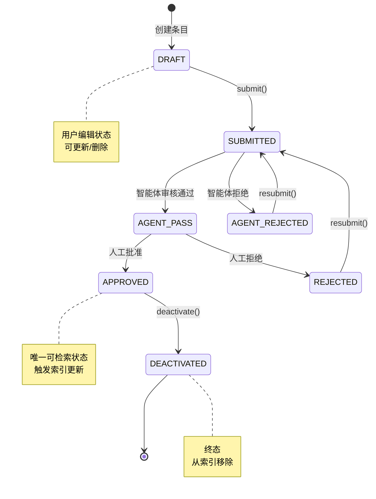

# 知识生命周期 (Knowledge Lifecycle)

## 概述

TrapMap 中的知识条目经历完整的状态转换生命周期，从创建到最终销毁。每个状态转换都有明确的业务规则、权限要求和副作用（索引更新、审计事件等）。

## 生命周期状态

```
┌─────────────────────────────────────────────────────────────────────────────┐
│                        Knowledge Lifecycle States                           │
├─────────────────────────────────────────────────────────────────────────────┤
│                                                                             │
│    ┌─────────┐                                                           │
│    │  DRAFT  │  ← 初始状态，用户创建但未提交                              │
│    └────┬────┘                                                           │
│         │ submit()                                                        │
│         ▼                                                                 │
│    ┌──────────────┐                                                      │
│    │  SUBMITTED   │  ← 已提交，等待智能体审核                             │
│    └──────┬───────┘                                                      │
│           │                                                               │
│    ┌──────┴───────┐    ┌─────────────────┐                               │
│    ▼              ▼    ▼                 ▼                               │
│ ┌──────────┐  ┌─────────────┐                                                    │
│ │ AGENT-   │  │   AGENT-    │                                                  │
│ │ PASS     │  │   REJECTED  │                                                  │
│ └────┬────┘  └──────┬─────┘                                                    │
│      │              │                                                          │
│      │              ▼                                                          │
│      │         ┌─────────┐                                                     │
│      │         │REJECTED│  ← 终态：条目被拒绝                                  │
│      │         └─────────┘                                                     │
│      │                                                                  │
│      ▼                                                                  │
│ ┌──────────────────────────────────────┐                                 │
│ │         APPROVED                     │ ← 可被检索                       │
│ └──────────────────┬───────────────────┘                                 │
│                   │                                                       │
│                   │ deactivate()                                          │
│                   ▼                                                       │
│            ┌─────────────┐                                               │
│            │DEACTIVATED │  ← 终态：条目被停用                              │
│            └─────────────┘                                               │
│                                                                            │
└─────────────────────────────────────────────────────────────────────────────┘
```

### 生命周期状态图（Mermaid）



## 状态详细说明

### DRAFT (草稿)

**定义**: 条目由用户创建但尚未提交。是用户编辑和组织知识的临时状态。

**入口动作**:
- 用户通过 `POST /v1/knowledge` 创建条目（不指定 submit）

**允许动作**:
- `PATCH /v1/knowledge/:entryId` - 更新内容
- `DELETE /v1/knowledge/:entryId` - 删除草稿

**出口转换**:
- `submit()` → SUBMITTED

---

### SUBMITTED (已提交)

**定义**: 条目已提交给系统，等待自动化智能体审核。

**入口动作**:
- 用户调用 `POST /v1/knowledge/:entryId/resubmit`
- 用户首次提交新条目

**触发副作用**:
1. 记录 `submittedBy` ActorRef
2. 记录 `submittedAt` 时间戳
3. 发送审计事件 `knowledge.submitted`
4. 触发异步智能体审核

**允许动作**:
- 仅查看（审核中不能编辑）

**出口转换**:
- `agentPass()` → AGENT-PASS
- `agentReject()` → AGENT-REJECTED

---

### AGENT-PASS (智能体通过)

**定义**: 自动化智能体审核通过，条目进入人工审核队列。

**入口动作**:
- 智能体审核完成，正确性风险在可接受范围内
- 未检测到重复

**触发副作用**:
1. 记录 `agentReviewResult`
2. 记录 `reviewedBy` 为 "SYSTEM"
3. 发送审计事件 `knowledge.agent-passed`

**允许动作**:
- 人工审核（approve/reject）

**出口转换**:
- `approve()` → APPROVED
- `reject()` → REJECTED

---

### AGENT-REJECTED (智能体拒绝)

**定义**: 自动化智能体审核拒绝，条目返回给用户修改。

**入口动作**:
- 智能体检测到高风险问题
- 检测到重复候选

**触发副作用**:
1. 记录 `agentReviewResult` (含拒绝原因)
2. 发送审计事件 `knowledge.agent-rejected`

**允许动作**:
- 用户重新编辑并 resubmit

**出口转换**:
- `resubmit()` → SUBMITTED (重新循环)

---

### APPROVED (已审批)

**定义**: 人工审核批准，条目可被检索和使用。

**入口动作**:
- 审核者调用 `POST /v1/knowledge/review` with `decision: 'approved'`

**触发副作用**:
1. 记录 `approvedBy` ActorRef
2. 记录 `reviewedAt` 时间戳
3. 追加到 `reviewHistory`
4. 发送审计事件 `knowledge.approved`
5. **触发提交后索引** (Post-Commit Indexing):
   - Vector Adapter: 生成 embedding 并索引
   - Keyword Adapter: 提取并索引关键词
   - Graph Adapter: 建立关系边

**允许动作**:
- `deactivate()` → DEACTIVATED
- 引用（作为 trap/capsule）

**注意**: APPROVED 条目是唯一可被检索的活跃状态

---

### REJECTED (已拒绝)

**定义**: 人工审核拒绝，条目不可被检索。

**入口动作**:
- 审核者调用 `POST /v1/knowledge/review` with `decision: 'rejected'`
- 审核者必须提供 `notes` 说明拒绝原因

**触发副作用**:
1. 记录 `rejectedBy` ActorRef
2. 记录 `reviewedAt` 时间戳
3. 追加到 `reviewHistory`
4. 发送审计事件 `knowledge.rejected`

**允许动作**:
- 用户可以请求重新审核（resubmit）

**出口转换**:
- `resubmit()` → SUBMITTED (重新循环)

---

### DEACTIVATED (已停用)

**定义**: 条目被主动停用，不再可被检索。

**入口动作**:
- 管理员调用 `POST /v1/operations/knowledge/:entryId/deactivate`

**触发副作用**:
1. 更新 `lifecycleState: 'deactivated'`
2. 从所有索引中移除
3. 发送审计事件 `knowledge.deactivated`

**允许动作**:
- 仅查看（历史记录）

---

## 状态转换矩阵

| 当前状态 | 允许转换到 | 触发条件 | 必需权限 |
|----------|-----------|----------|----------|
| DRAFT | SUBMITTED | submit() | knowledge:submit |
| SUBMITTED | AGENT-PASS, AGENT-REJECTED | 智能体审核完成 | SYSTEM |
| AGENT-PASS | APPROVED, REJECTED | 人工审核 | knowledge:review |
| AGENT-REJECTED | SUBMITTED | resubmit() | knowledge:submit |
| APPROVED | DEACTIVATED | deactivate() | knowledge:update |
| REJECTED | SUBMITTED | resubmit() | knowledge:submit |
| DEACTIVATED | (无) | - | - |

---

## Review History (审核历史)

每个条目维护完整的审核历史记录：

```typescript
interface ReviewRecord {
  id: EntityId
  entryId: EntityId
  decision: 'approved' | 'rejected'
  notes?: string
  reviewedBy: ActorRef
  reviewedAt: string  // ISO 8601
  previousState: LifecycleState
  newState: LifecycleState
}
```

**追加规则**:
1. 每次状态转换创建新 ReviewRecord
2. 记录 previousState 和 newState 以支持审计
3. Agent 审核和人工审核分别记录

---

## Agent Review (智能体审核)

智能体审核是自动化的正确性风险评估：

### 审核维度

```typescript
interface AgentReviewResult {
  correctnessRisk: 'low' | 'medium' | 'high'
  duplicateRisk: 'none' | 'possible' | 'confirmed'
  duplicateCandidateIds?: EntityId[]
  flags: string[]
  summary: string
  reviewedAt: string
}
```

### 风险阈值

| 风险等级 | correctnessRisk | duplicateRisk | 结果 |
|----------|----------------|---------------|------|
| Low | 'low' | 'none'/'possible' | → AGENT-PASS |
| Medium | 'medium' | 'none' | → AGENT-PASS (带标记) |
| High | 'high' | 任何 | → AGENT-REJECTED |
| Confirmed | 任何 | 'confirmed' | → AGENT-REJECTED |

### 审核流程

```
┌─────────────────────────────────────────────────────────┐
│              Agent Review Process                       │
├─────────────────────────────────────────────────────────┤
│                                                         │
│  Entry Submitted                                        │
│        │                                              │
│        ▼                                              │
│  ┌──────────────────┐                                 │
│  │  Correctness    │                                 │
│  │  Assessment     │──AI 分析内容                      │
│  │  (正确性评估)    │  - 事实一致性                    │
│  └────────┬─────────┘  - 逻辑清晰度                   │
│           │              - 格式规范                    │
│           ▼                                              │
│  ┌──────────────────┐                                 │
│  │  Duplicate      │                                 │
│  │  Detection      │──指纹 + 语义                    │
│  │  (重复检测)      │  - fingerprint                 │
│  └────────┬─────────┘  - embedding similarity         │
│           │                                              │
│           ▼                                              │
│  ┌──────────────────┐                                 │
│  │  Risk Scoring   │                                 │
│  │  (风险评分)      │  结合两个维度                   │
│  └────────┬─────────┘  计算综合风险                  │
│           │                                              │
│           ▼                                              │
│  ┌──────────────────┐                                 │
│  │  Decision       │                                 │
│  │  (决策)          │                                 │
│  └────────┬─────────┘                                 │
│           │                                              │
│    ┌─────┴─────┐                                      │
│    ▼           ▼                                      │
│ ┌────────┐ ┌───────────┐                               │
│ │  PASS  │ │ REJECTED  │                               │
│ │ AGENT- │ │ AGENT-    │                               │
│ │ PASS   │ │ REJECTED  │                               │
│ └────────┘ └───────────┘                               │
│                                                         │
└─────────────────────────────────────────────────────────┘
```

---

## 索引状态记录

每个条目跟踪在各适配器中的索引状态：

```typescript
interface KnowledgeIndexStateRecord {
  entryId: EntityId
  adapters: {
    [adapterName: string]: {
      status: 'pending' | 'synced' | 'failed'
      indexedAt?: string  // ISO 8601
      error?: string
    }
  }
  lastReconciledAt?: string
}
```

### 适配器列表

| 适配器 | 用途 |
|--------|------|
| `vector` | OpenAI embedding 向量索引 |
| `keyword` | BM25 关键词索引 |
| `graph` | Graphology DAG 关系索引 |

---

## 并发控制

### 乐观锁

```typescript
interface KnowledgeEntry {
  // ...
  version: number  // 每次更新递增
}
```

更新时检查 version：
```typescript
await store.updateKnowledgeEntry(id, updates, {
  expectedVersion: currentVersion
});
```

### 状态转换原子性

状态转换通过 `store.transact()` 保证原子性：

```typescript
await store.transact(async (tx) => {
  const entry = await tx.getKnowledgeEntry(id);
  
  // 验证当前状态允许转换
  if (entry.lifecycleState !== 'submitted') {
    throw new InvalidStateTransitionError(id, entry.lifecycleState, 'agent-pass');
  }
  
  // 更新状态
  await tx.updateKnowledgeEntry(id, {
    lifecycleState: 'agent-pass',
    agentReviewResult: result,
    reviewedBy: { actorId: 'SYSTEM', actorName: 'Agent' }
  });
  
  // 记录审核历史
  await tx.createReviewRecord({...});
});
```

---

## 示例场景

### 场景 1: 首次提交并审批

```
1. Alice 调用 POST /v1/knowledge
   → 创建 DRAFT 条目, id: "entry-1"

2. Alice 调用 PATCH /v1/knowledge/entry-1 完善内容

3. Alice 调用 POST /v1/knowledge/entry-1/resubmit
   → 状态: DRAFT → SUBMITTED
   → 触发异步 Agent Review

4. Agent Review 完成
   → 状态: SUBMITTED → AGENT-PASS
   → 发送事件: knowledge.agent-passed

5. Bob (审核者) 调用 POST /v1/knowledge/review
   { entryId: "entry-1", decision: "approved" }
   → 状态: AGENT-PASS → APPROVED
   → 触发 Post-Commit Indexing
   → 发送事件: knowledge.approved

6. Carol 现在可以检索到该条目
```

### 场景 2: 被拒绝后重新提交

```
1. Alice 提交条目 → SUBMITTED
2. Agent Review → AGENT-REJECTED (检测到重复)
3. Alice 查看被拒绝原因
4. Alice 修正内容
5. Alice 调用 resubmit
   → 状态: AGENT-REJECTED → SUBMITTED
   → 重新进入审核队列
```
