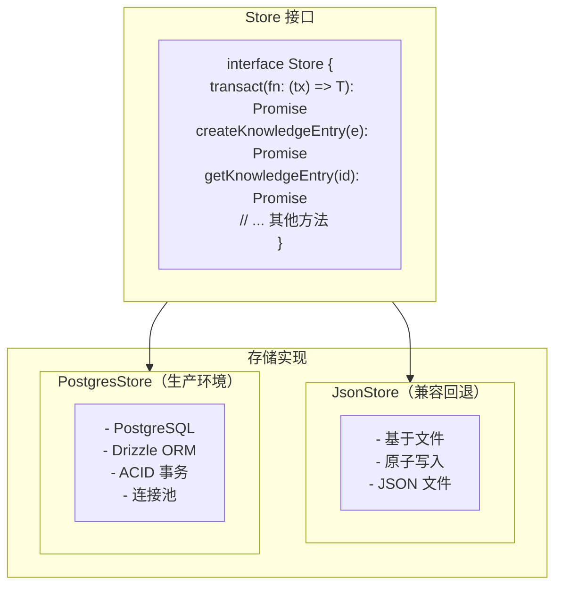
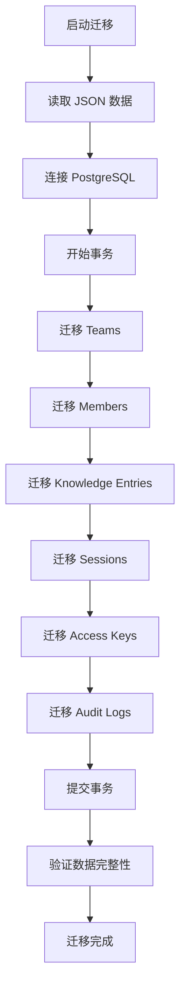
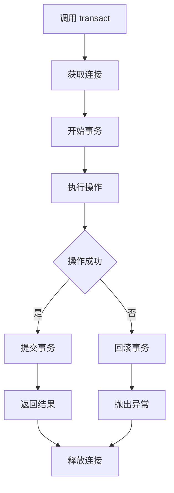
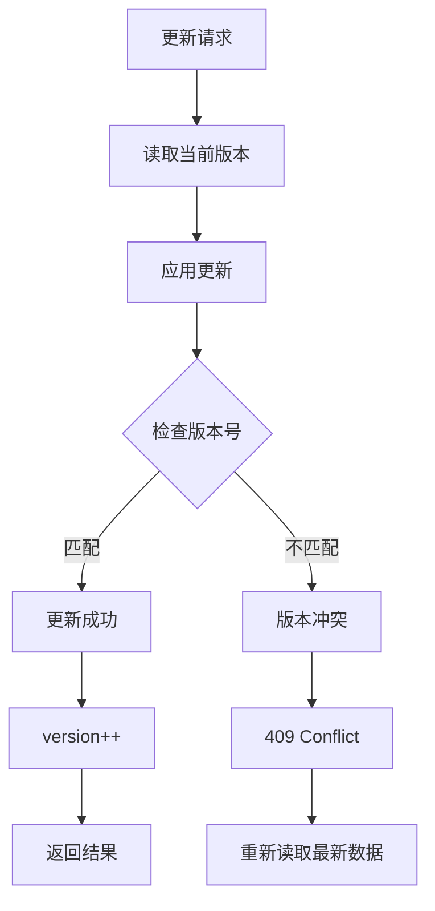

# 持久化存储层 (Persistence Layer)

## 概述

持久化存储层为 TrapMap 提供数据持久化能力。PostgreSQL 是主要的推荐存储后端；JsonStore 作为向后兼容的回退方案保留。

## 架构



---

## Store 接口

### 核心接口

```typescript
interface Store {
  // Transaction support
  transact<T>(fn: (tx: Transaction) => Promise<T>): Promise<T>;
  
  // Knowledge Entries
  createKnowledgeEntry(entry: KnowledgeEntry): Promise<void>;
  getKnowledgeEntry(id: EntityId): Promise<KnowledgeEntry | null>;
  updateKnowledgeEntry(
    id: EntityId, 
    updates: Partial<KnowledgeEntry>,
    options?: { expectedVersion?: number }
  ): Promise<void>;
  deleteKnowledgeEntry(id: EntityId): Promise<void>;
  listKnowledgeEntries(query: ListQuery): Promise<KnowledgeEntry[]>;
  
  // Teams
  createTeam(team: Team): Promise<void>;
  getTeam(id: EntityId): Promise<Team | null>;
  updateTeam(id: EntityId, updates: Partial<Team>): Promise<void>;
  deleteTeam(id: EntityId): Promise<void>;
  listTeams(): Promise<Team[]>;
  
  // Members
  createMember(member: Member): Promise<void>;
  getMember(id: EntityId): Promise<Member | null>;
  updateMember(id: EntityId, updates: Partial<Member>): Promise<void>;
  deleteMember(id: EntityId): Promise<void>;
  listMembers(query: ListQuery): Promise<Member[]>;
  
  // Sessions
  createSession(session: Session): Promise<void>;
  getSession(id: EntityId): Promise<Session | null>;
  deleteSession(id: EntityId): Promise<void>;
  listSessionsByUser(userId: EntityId): Promise<Session[]>;
  
  // Access Keys
  createAccessKey(key: AccessKey): Promise<void>;
  getAccessKeyByHash(hash: string): Promise<AccessKey | null>;
  deleteAccessKey(id: EntityId): Promise<void>;
  
  // Audit Log
  createAuditLog(log: AuditLog): Promise<void>;
  listAuditLogs(query: AuditLogQuery): Promise<AuditLog[]>;
  
  // Index State
  getIndexState(entryId: EntityId): Promise<KnowledgeIndexStateRecord | null>;
  updateIndexState(entryId: EntityId, state: Partial<AdapterIndexState>): Promise<void>;
  
  // Candidates
  createCandidate(candidate: CandidateSubmission): Promise<void>;
  getCandidate(id: EntityId): Promise<CandidateSubmission | null>;
  updateCandidate(id: EntityId, updates: Partial<CandidateSubmission>): Promise<void>;
  listCandidates(query: ListQuery): Promise<CandidateSubmission[]>;
}
```

### Transaction 接口

```typescript
interface Transaction {
  // Within a transaction, methods return data directly without tx wrapper
  getKnowledgeEntry(id: EntityId): Promise<KnowledgeEntry | null>;
  updateKnowledgeEntry(id: EntityId, updates: Partial<KnowledgeEntry>): Promise<void>;
  // ... other methods that need transactional semantics
  
  commit(): Promise<void>;
  rollback(): Promise<void>;
}
```

---

## JsonStore (兼容回退存储)

### 特点

| 特性 | 说明 |
|------|------|
| 存储介质 | 本地 JSON 文件 |
| 并发控制 | 文件锁定 |
| 事务支持 | 内存模拟 |
| 适用场景 | 开发、测试、小规模部署 |

### 文件结构

```
.data/
├── skill-shareer.json       # 主数据文件
├── skill-shareer.backup     # 自动备份
└── lock                     # 锁文件
```

### 实现细节

```typescript
class JsonStore implements Store {
  private filePath: string;
  private backupPath: string;
  private lockPath: string;
  private data: TrapMapData;
  private fd: number | null = null;
  
  constructor(filePath: string = '.data/skill-shareer.json') {
    this.filePath = path.resolve(filePath);
    this.backupPath = `${this.filePath}.backup`;
    this.lockPath = `${this.filePath}.lock`;
  }
  
  async initialize(): Promise<void> {
    // Ensure directory exists
    await fs.mkdir(path.dirname(this.filePath), { recursive: true });
    
    // Create lock directory
    await fs.mkdir(this.lockPath, { recursive: true });
    
    if (await fs.exists(this.filePath)) {
      // Load existing data
      const content = await fs.readFile(this.filePath, 'utf-8');
      this.data = JSON.parse(content);
    } else {
      // Initialize empty data
      this.data = this.createEmptyData();
      await this.save();
    }
  }
  
  private async acquireLock(): Promise<void> {
    const lockDir = await fs.opendir(this.lockPath);
    this.fd = lockDir.fd;
    
    // Wait for lock with timeout
    const deadline = Date.now() + 5000;
    while (Date.now() < deadline) {
      try {
        await fs.stat(this.lockPath + '/.lock');
        await sleep(100);
      } catch {
        // Lock acquired (directory doesn't exist means we have lock)
        break;
      }
    }
  }
  
  private async releaseLock(): Promise<void> {
    if (this.fd !== null) {
      await fs.close(this.fd);
      this.fd = null;
    }
  }
  
  private async save(): Promise<void> {
    // Atomic write: write to temp, then rename
    const tempPath = `${this.filePath}.tmp`;
    await fs.writeFile(tempPath, JSON.stringify(this.data, null, 2));
    await fs.rename(tempPath, this.filePath);
  }
  
  async transact<T>(fn: (tx: Transaction) => Promise<T>): Promise<T> {
    await this.acquireLock();
    
    try {
      const tx = this.createTransaction();
      const result = await fn(tx);
      await this.save();  // Single save at end
      return result;
    } finally {
      await this.releaseLock();
    }
  }
  
  async createKnowledgeEntry(entry: KnowledgeEntry): Promise<void> {
    this.data.entries.push(entry);
  }
  
  async getKnowledgeEntry(id: EntityId): Promise<KnowledgeEntry | null> {
    return this.data.entries.find(e => e.id === id) || null;
  }
  
  // ... other methods
}
```

### 备份策略

```typescript
async function backup(): Promise<void> {
  if (await fs.exists(this.filePath)) {
    await fs.copyFile(this.filePath, this.backupPath);
  }
}

async function restore(): Promise<void> {
  if (await fs.exists(this.backupPath)) {
    await fs.copyFile(this.backupPath, this.filePath);
    const content = await fs.readFile(this.filePath, 'utf-8');
    this.data = JSON.parse(content);
  }
}
```

---

## PostgresStore (生产存储)

### 特点

| 特性 | 说明 |
|------|------|
| 存储介质 | PostgreSQL 16+ |
| 并发控制 | MVCC |
| 事务支持 | 原生 ACID |
| 连接池 | pg-pool |
| ORM | Drizzle |

### Drizzle Schema

> **完整 schema 定义**: `packages/server/src/lib/persistence/schema/` (按领域拆分，共 57 张表)
> **快速参考**: `docs/reference/DATABASE_SCHEMA.md`

Schema 按业务域组织为六大模块：

| 域 | 根表 | 子表数量 | 说明 |
|----|------|----------|------|
| 知识 | `knowledge_entries` | 14 | 含修订、生命周期、边界、维护、嵌入、关键词、搜索文档、反馈、使用事件 |
| 技能工件 | `skill_artifacts` | 22 | 含修订、文件、脚本、配置、胶囊、清单、边界、维护、审核、元数据、索引表 |
| 候选人 | `candidates` | 7 | 含分析、去重、人工审核、解析结果、溯源 |
| 身份与审计 | `users` / `teams` | 6 | Phase 3：含 users、teams、memberships、sessions、access_keys、audit_events |
| 反馈分析 | `feedback_records` | 4 | 含自定义问答、使用事件、日聚合 |
| 跨域 | `store_snapshot` / `task_queue` | 3 | 含 JSONB 兼容层、图索引文档、后台任务队列 |

另有 `store_snapshot` (JSONB 兼容层，仅保留未迁移辅助域) 和 `task_queue` (后台任务队列)。身份域和审计域在 PG 模式下不再通过 `store_snapshot` 读取。

候选读取路径（Phase 4）默认从结构化表读取重复检测数据。候选记录上的 JSONB 列（`duplicate_case`、`analysis_snapshot`、`manual_result`）仅作为兼容缓存，不再作为读取路径的真相来源。

示例（知识条目主表）：

```typescript
// schema.ts (节选，完整定义见源码)
export const knowledgeEntries = pgTable(
  'knowledge_entries',
  {
    id: text('id').primaryKey(),
    teamId: text('team_id'),           // null = 全局条目
    scope: text('scope').notNull(),    // 'global' | 'project'
    labels: jsonb('labels').notNull().default([]),
    shortcut: text('shortcut').notNull(),
    detail: text('detail').notNull(),
    requiredLevel: integer('required_level').notNull().default(0),
    lifecycleState: text('lifecycle_state').notNull(),
    ownerUserId: text('owner_user_id').notNull(),
    boundary: jsonb('boundary').$type<Boundary>(),
    maintenanceMeta: jsonb('maintenance_meta'),
    createdAt: timestamp('created_at', { withTimezone: true }).notNull().defaultNow(),
    updatedAt: timestamp('updated_at', { withTimezone: true }).notNull().defaultNow(),
  },
  (table) => [
    index('idx_knowledge_entries_lifecycle_state').on(table.lifecycleState),
    index('idx_knowledge_entries_team').on(table.teamId),
    index('idx_knowledge_entries_scope_level').on(table.scope, table.requiredLevel),
    index('idx_knowledge_entries_owner').on(table.ownerUserId),
  ],
);
```

特殊索引类型（由应用层创建，非 Drizzle 原生支持）：

```sql
-- HNSW 向量索引 (启动时由 ensureVectorIndex() 创建)
CREATE INDEX knowledge_embeddings_vector_idx
ON knowledge_embeddings USING hnsw (vector vector_cosine_ops)
WITH (m = 16, ef_construction = 64);

-- GIN 全文搜索索引 (migration 0005 创建)
CREATE INDEX idx_knowledge_search_documents_gin
ON knowledge_search_documents USING gin (document);
```

### 实现细节

> **完整实现**: `packages/server/src/lib/persistence/postgres-store.ts`

PostgresStore 通过 Drizzle ORM 操作 PostgreSQL，主要特点：

- **事务支持**: 使用 `db.transaction()` 实现原生 ACID 事务
- **批量操作**: 子表写入使用 `db.insert().values([...])` 批量插入
- **JSONB 兼容层**: `store_snapshot` 表存储完整 StoreData，支持渐进式迁移
- **向量搜索**: 通过 raw SQL 调用 pgvector 的余弦距离操作符 `<=>`

---

## 存储工厂

```typescript
import pg from 'pg';

import { JsonStore, type SkillShareerStore } from '../store.js';
import { PostgresStore } from './postgres-store.js';

export interface StoreConfig {
  dataFile: string;
  databaseUrl: string | null;
}

export function createSkillShareerStore(config: StoreConfig): SkillShareerStore {
  if (config.databaseUrl) {
    const pool = new pg.Pool({ connectionString: config.databaseUrl });
    return new PostgresStore(pool);
  }

  return new JsonStore(config.dataFile);
}
```

---

## 迁移策略

### Drizzle 迁移

```bash
# Generate migration
pnpm --filter @trapmap/server db:generate

# Apply migration
pnpm --filter @trapmap/server db:migrate

# Push schema (development only)
pnpm --filter @trapmap/server db:push
```

### 数据迁移

```typescript
async function migrateFromJsonToPostgres(
  jsonStore: JsonStore,
  postgresStore: PostgresStore
): Promise<void> {
  const data = await jsonStore.getAllData();
  
  console.log(`Migrating ${data.entries.length} entries...`);
  
  await postgresStore.transact(async (tx) => {
    for (const entry of data.entries) {
      await tx.createKnowledgeEntry(entry);
    }
    
    for (const team of data.teams) {
      await tx.createTeam(team);
    }
    
    for (const member of data.members) {
      await tx.createMember(member);
    }
  });
  
  console.log('Migration complete');
}
```

---

## 性能优化

### 连接池配置

```typescript
const pool = new Pool({
  connectionString: databaseUrl,
  
  // Pool settings
  max: 20,           // Maximum connections
  idleTimeoutMillis: 30000,
  connectionTimeoutMillis: 2000,
  
  // Statement timeout (ms)
  statement_timeout: 30000
});
```

### 索引策略

> **完整索引列表**: 参见 `docs/reference/DATABASE_SCHEMA.md`

主要索引类型：

```sql
-- B-tree 索引 (状态/团队/级别过滤)
CREATE INDEX idx_knowledge_entries_lifecycle_state ON knowledge_entries(lifecycle_state);
CREATE INDEX idx_knowledge_entries_team ON knowledge_entries(team_id);
CREATE INDEX idx_knowledge_entries_scope_level ON knowledge_entries(scope, required_level);
CREATE INDEX idx_skill_artifacts_lifecycle_state ON skill_artifacts(lifecycle_state);
CREATE INDEX idx_candidates_status ON candidates(status);

-- 唯一索引 (业务约束)
CREATE UNIQUE INDEX idx_knowledge_revisions_entry_revision_no
  ON knowledge_revisions(entry_id, revision_no);
CREATE UNIQUE INDEX idx_skill_artifacts_scope_team_slug
  ON skill_artifacts(COALESCE(team_id, '__global__'), scope, slug);

-- HNSW 向量索引 (启动时由应用层创建)
CREATE INDEX knowledge_embeddings_vector_idx
  ON knowledge_embeddings USING hnsw (vector vector_cosine_ops)
  WITH (m = 16, ef_construction = 64);

-- GIN 索引 (数组重叠 / 全文搜索)
CREATE INDEX idx_knowledge_keywords_tokens_gin
  ON knowledge_keywords USING gin (tokens);
CREATE INDEX idx_knowledge_search_documents_gin
  ON knowledge_search_documents USING gin (document);
```

---

## 流程图

### 数据迁移流程



### 事务流程



### 乐观锁机制


