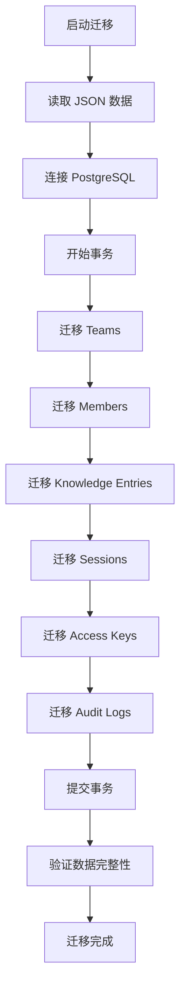
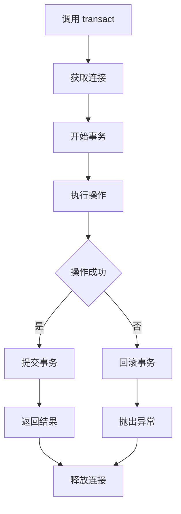
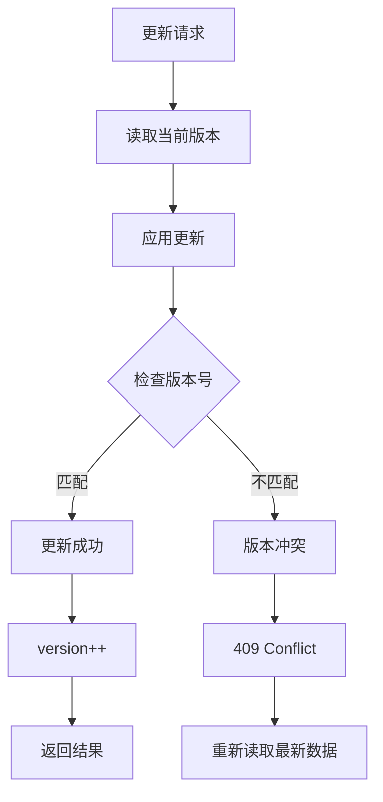

# 持久化存储层 (Persistence Layer)

## 概述

持久化存储层为 TrapMap 提供数据持久化能力，支持两种存储实现：JsonStore（文件级，适合开发）和 PostgresStore（PostgreSQL，适合生产）。

## 架构

```
┌─────────────────────────────────────────────────────────────────────────┐
│                    Persistence Layer Architecture                        │
├─────────────────────────────────────────────────────────────────────────┤
│                                                                         │
│  ┌─────────────────────────────────────────────────────────────────┐   │
│  │                    Store Interface                              │   │
│  │                                                                    │   │
│  │  interface Store {                                              │   │
│  │    transact<T>(fn: (tx) => T): Promise<T>                       │   │
│  │    createKnowledgeEntry(e): Promise<void>                       │   │
│  │    getKnowledgeEntry(id): Promise<Entry | null>                 │   │
│  │    // ... other methods                                        │   │
│  │  }                                                              │   │
│  └─────────────────────────────────────────────────────────────────┘   │
│                              │                                          │
│              ┌───────────────┼───────────────┐                        │
│              ▼               ▼               ▼                         │
│  ┌─────────────────┐ ┌─────────────────┐                              │
│  │   JsonStore    │ │  PostgresStore  │                              │
│  │  (Development) │ │  (Production)   │                              │
│  │                │ │                │                              │
│  │  - File-based  │ │  - PostgreSQL  │                              │
│  │  - Atomic     │ │  - Drizzle ORM │                              │
│  │    writes     │ │  - ACID       │                              │
│  │  - JSON files │ │  - Pooled     │                              │
│  └─────────────────┘ └─────────────────┘                              │
│                                                                         │
└─────────────────────────────────────────────────────────────────────────┘
```

---

## Store 接口

### 核心接口

```typescript
interface Store {
  // Transaction support
  transact<T>(fn: (tx: Transaction) => Promise<T>): Promise<T>;
  
  // Knowledge Entries
  createKnowledgeEntry(entry: KnowledgeEntry): Promise<void>;
  getKnowledgeEntry(id: EntityId): Promise<KnowledgeEntry | null>;
  updateKnowledgeEntry(
    id: EntityId, 
    updates: Partial<KnowledgeEntry>,
    options?: { expectedVersion?: number }
  ): Promise<void>;
  deleteKnowledgeEntry(id: EntityId): Promise<void>;
  listKnowledgeEntries(query: ListQuery): Promise<KnowledgeEntry[]>;
  
  // Teams
  createTeam(team: Team): Promise<void>;
  getTeam(id: EntityId): Promise<Team | null>;
  updateTeam(id: EntityId, updates: Partial<Team>): Promise<void>;
  deleteTeam(id: EntityId): Promise<void>;
  listTeams(): Promise<Team[]>;
  
  // Members
  createMember(member: Member): Promise<void>;
  getMember(id: EntityId): Promise<Member | null>;
  updateMember(id: EntityId, updates: Partial<Member>): Promise<void>;
  deleteMember(id: EntityId): Promise<void>;
  listMembers(query: ListQuery): Promise<Member[]>;
  
  // Sessions
  createSession(session: Session): Promise<void>;
  getSession(id: EntityId): Promise<Session | null>;
  deleteSession(id: EntityId): Promise<void>;
  listSessionsByUser(userId: EntityId): Promise<Session[]>;
  
  // Access Keys
  createAccessKey(key: AccessKey): Promise<void>;
  getAccessKeyByHash(hash: string): Promise<AccessKey | null>;
  deleteAccessKey(id: EntityId): Promise<void>;
  
  // Audit Log
  createAuditLog(log: AuditLog): Promise<void>;
  listAuditLogs(query: AuditLogQuery): Promise<AuditLog[]>;
  
  // Index State
  getIndexState(entryId: EntityId): Promise<KnowledgeIndexStateRecord | null>;
  updateIndexState(entryId: EntityId, state: Partial<AdapterIndexState>): Promise<void>;
  
  // Candidates
  createCandidate(candidate: CandidateSubmission): Promise<void>;
  getCandidate(id: EntityId): Promise<CandidateSubmission | null>;
  updateCandidate(id: EntityId, updates: Partial<CandidateSubmission>): Promise<void>;
  listCandidates(query: ListQuery): Promise<CandidateSubmission[]>;
}
```

### Transaction 接口

```typescript
interface Transaction {
  // Within a transaction, methods return data directly without tx wrapper
  getKnowledgeEntry(id: EntityId): Promise<KnowledgeEntry | null>;
  updateKnowledgeEntry(id: EntityId, updates: Partial<KnowledgeEntry>): Promise<void>;
  // ... other methods that need transactional semantics
  
  commit(): Promise<void>;
  rollback(): Promise<void>;
}
```

---

## JsonStore (开发存储)

### 特点

| 特性 | 说明 |
|------|------|
| 存储介质 | 本地 JSON 文件 |
| 并发控制 | 文件锁定 |
| 事务支持 | 内存模拟 |
| 适用场景 | 开发、测试、小规模部署 |

### 文件结构

```
.data/
├── skill-shareer.json       # 主数据文件
├── skill-shareer.backup     # 自动备份
└── lock                     # 锁文件
```

### 实现细节

```typescript
class JsonStore implements Store {
  private filePath: string;
  private backupPath: string;
  private lockPath: string;
  private data: TrapMapData;
  private fd: number | null = null;
  
  constructor(filePath: string = '.data/skill-shareer.json') {
    this.filePath = path.resolve(filePath);
    this.backupPath = `${this.filePath}.backup`;
    this.lockPath = `${this.filePath}.lock`;
  }
  
  async initialize(): Promise<void> {
    // Ensure directory exists
    await fs.mkdir(path.dirname(this.filePath), { recursive: true });
    
    // Create lock directory
    await fs.mkdir(this.lockPath, { recursive: true });
    
    if (await fs.exists(this.filePath)) {
      // Load existing data
      const content = await fs.readFile(this.filePath, 'utf-8');
      this.data = JSON.parse(content);
    } else {
      // Initialize empty data
      this.data = this.createEmptyData();
      await this.save();
    }
  }
  
  private async acquireLock(): Promise<void> {
    const lockDir = await fs.opendir(this.lockPath);
    this.fd = lockDir.fd;
    
    // Wait for lock with timeout
    const deadline = Date.now() + 5000;
    while (Date.now() < deadline) {
      try {
        await fs.stat(this.lockPath + '/.lock');
        await sleep(100);
      } catch {
        // Lock acquired (directory doesn't exist means we have lock)
        break;
      }
    }
  }
  
  private async releaseLock(): Promise<void> {
    if (this.fd !== null) {
      await fs.close(this.fd);
      this.fd = null;
    }
  }
  
  private async save(): Promise<void> {
    // Atomic write: write to temp, then rename
    const tempPath = `${this.filePath}.tmp`;
    await fs.writeFile(tempPath, JSON.stringify(this.data, null, 2));
    await fs.rename(tempPath, this.filePath);
  }
  
  async transact<T>(fn: (tx: Transaction) => Promise<T>): Promise<T> {
    await this.acquireLock();
    
    try {
      const tx = this.createTransaction();
      const result = await fn(tx);
      await this.save();  // Single save at end
      return result;
    } finally {
      await this.releaseLock();
    }
  }
  
  async createKnowledgeEntry(entry: KnowledgeEntry): Promise<void> {
    this.data.entries.push(entry);
  }
  
  async getKnowledgeEntry(id: EntityId): Promise<KnowledgeEntry | null> {
    return this.data.entries.find(e => e.id === id) || null;
  }
  
  // ... other methods
}
```

### 备份策略

```typescript
async function backup(): Promise<void> {
  if (await fs.exists(this.filePath)) {
    await fs.copyFile(this.filePath, this.backupPath);
  }
}

async function restore(): Promise<void> {
  if (await fs.exists(this.backupPath)) {
    await fs.copyFile(this.backupPath, this.filePath);
    const content = await fs.readFile(this.filePath, 'utf-8');
    this.data = JSON.parse(content);
  }
}
```

---

## PostgresStore (生产存储)

### 特点

| 特性 | 说明 |
|------|------|
| 存储介质 | PostgreSQL 16+ |
| 并发控制 | MVCC |
| 事务支持 | 原生 ACID |
| 连接池 | pg-pool |
| ORM | Drizzle |

### Drizzle Schema

```typescript
// schema.ts
import { pgTable, uuid, text, timestamp, integer, jsonb, boolean } from 'drizzle-orm/pg-core';

export const knowledgeEntries = pgTable('knowledge_entries', {
  id: uuid('id').primaryKey(),
  title: text('title').notNull(),
  content: text('content').notNull(),
  format: text('format').notNull(),
  requiredLevel: integer('required_level').notNull().default(0),
  lifecycleState: text('lifecycle_state').notNull(),
  
  createdAt: timestamp('created_at').notNull(),
  updatedAt: timestamp('updated_at').notNull(),
  createdBy: jsonb('created_by').notNull(),
  submittedBy: jsonb('submitted_by'),
  approvedBy: jsonb('approved_by'),
  teamId: uuid('team_id'),
  
  capsuleIds: jsonb('capsule_ids').default([]),
  trapIds: jsonb('trap_ids').default([]),
  
  reviewHistory: jsonb('review_history').default([]),
  agentReviewResult: jsonb('agent_review_result'),
  
  version: integer('version').notNull().default(1)
});

export const teams = pgTable('teams', {
  id: uuid('id').primaryKey(),
  name: text('name').notNull(),
  description: text('description'),
  createdAt: timestamp('created_at').notNull(),
  createdBy: jsonb('created_by').notNull()
});

export const members = pgTable('members', {
  id: uuid('id').primaryKey(),
  username: text('username').notNull().unique(),
  passwordHash: text('password_hash').notNull(),
  roleName: text('role_name').notNull(),
  level: integer('level').notNull().default(0),
  teamId: uuid('team_id').references(() => teams.id),
  createdAt: timestamp('created_at').notNull()
});

export const sessions = pgTable('sessions', {
  id: uuid('id').primaryKey(),
  userId: uuid('user_id').notNull().references(() => members.id),
  createdAt: timestamp('created_at').notNull(),
  expiresAt: timestamp('expires_at').notNull()
});

export const accessKeys = pgTable('access_keys', {
  id: uuid('id').primaryKey(),
  name: text('name').notNull(),
  keyHash: text('key_hash').notNull().unique(),
  createdBy: jsonb('created_by').notNull(),
  createdAt: timestamp('created_at').notNull(),
  expiresAt: timestamp('expires_at'),
  lastUsedAt: timestamp('last_used_at'),
  permissions: jsonb('permissions').default([]),
  level: integer('level').notNull()
});

export const auditLog = pgTable('audit_log', {
  id: uuid('id').primaryKey(),
  timestamp: timestamp('timestamp').notNull().defaultNow(),
  eventType: text('event_type').notNull(),
  actorId: uuid('actor_id'),
  resourceType: text('resource_type'),
  resourceId: uuid('resource_id'),
  metadata: jsonb('metadata'),
  ipAddress: text('ip_address'),
  userAgent: text('user_agent')
});

export const indexState = pgTable('knowledge_index_state', {
  entryId: uuid('entry_id').primaryKey().references(() => knowledgeEntries.id),
  adapters: jsonb('adapters').notNull(),
  lastReconciledAt: timestamp('last_reconciled_at')
});

// Knowledge vectors for semantic search
export const knowledgeVectors = pgTable('knowledge_vectors', {
  entryId: uuid('entry_id').primaryKey().references(() => knowledgeEntries.id),
  embeddingVector: vector('embedding_vector', { dimensions: 1536 }).notNull(),
  version: integer('version').notNull().default(1),
  createdAt: timestamp('created_at').notNull(),
  updatedAt: timestamp('updated_at').notNull()
});

// Knowledge keyword index
export const keywordIndex = pgTable('keyword_index', {
  entryId: uuid('entry_id').notNull().references(() => knowledgeEntries.id),
  term: text('term').notNull(),
  termFrequency: integer('term_frequency').notNull(),
  idf: text('idf').notNull(),
  bm25Score: text('bm25_score').notNull(),
  PRIMARY KEY (entryId, term)
});

// Graph nodes and edges
export const graphNodes = pgTable('graph_nodes', {
  entryId: uuid('entry_id').primaryKey().references(() => knowledgeEntries.id),
  nodeType: text('node_type').notNull(),
  label: text('label').notNull(),
  metadata: jsonb('metadata')
});

export const graphEdges = pgTable('graph_edges', {
  sourceId: uuid('source_id').notNull().references(() => knowledgeEntries.id),
  targetId: uuid('target_id').notNull().references(() => knowledgeEntries.id),
  edgeType: text('edge_type').notNull(),
  metadata: jsonb('metadata'),
  PRIMARY KEY (sourceId, targetId, edgeType)
});
```

### 实现细节

```typescript
import { drizzle } from 'drizzle-orm/node-postgres';
import { Pool } from 'pg';

export class PostgresStore implements Store {
  private pool: Pool;
  private db: ReturnType<typeof drizzle>;
  
  constructor(databaseUrl: string) {
    this.pool = new Pool({ connectionString: databaseUrl });
    this.db = drizzle(this.pool);
  }
  
  async transact<T>(fn: (tx: Transaction) => Promise<T>): Promise<T> {
    return this.db.transaction(async (tx) => {
      const wrappedTx = this.wrapTransaction(tx);
      return fn(wrappedTx);
    });
  }
  
  async createKnowledgeEntry(entry: KnowledgeEntry): Promise<void> {
    await this.db.insert(knowledgeEntries).values({
      id: entry.id,
      title: entry.title,
      content: entry.content,
      format: entry.format,
      requiredLevel: entry.requiredLevel,
      lifecycleState: entry.lifecycleState,
      createdAt: new Date(entry.createdAt),
      updatedAt: new Date(entry.updatedAt),
      createdBy: entry.createdBy,
      version: 1
    });
  }
  
  async getKnowledgeEntry(id: EntityId): Promise<KnowledgeEntry | null> {
    const result = await this.db.select()
      .from(knowledgeEntries)
      .where(eq(knowledgeEntries.id, id))
      .limit(1);
    
    if (result.length === 0) return null;
    
    return this.mapToEntry(result[0]);
  }
  
  async updateKnowledgeEntry(
    id: EntityId,
    updates: Partial<KnowledgeEntry>,
    options?: { expectedVersion?: number }
  ): Promise<void> {
    const updateData: Partial<typeof knowledgeEntries.$inferInsert> = {
      ...updates,
      updatedAt: new Date()
    };
    
    if (options?.expectedVersion !== undefined) {
      // Optimistic locking
      const result = await this.db.update(knowledgeEntries)
        .set(updateData)
        .where(
          and(
            eq(knowledgeEntries.id, id),
            eq(knowledgeEntries.version, options.expectedVersion)
          )
        );
      
      if (result.rowCount === 0) {
        throw new OptimisticLockError(id);
      }
    } else {
      await this.db.update(knowledgeEntries)
        .set(updateData)
        .where(eq(knowledgeEntries.id, id));
    }
  }
  
  async listKnowledgeEntries(query: ListQuery): Promise<KnowledgeEntry[]> {
    let q = this.db.select().from(knowledgeEntries);
    
    if (query.filter) {
      if (query.filter.lifecycleState) {
        q = q.where(eq(knowledgeEntries.lifecycleState, query.filter.lifecycleState));
      }
      if (query.filter.teamId) {
        q = q.where(eq(knowledgeEntries.teamId, query.filter.teamId));
      }
    }
    
    if (query.limit) {
      q = q.limit(query.limit);
    }
    
    const results = await q;
    return results.map(r => this.mapToEntry(r));
  }
  
  // Vector similarity search
  async similaritySearch(
    embedding: number[],
    limit: number
  ): Promise<Array<{ entryId: EntityId; score: number }>> {
    const results = await this.db.execute(
      sql`
        SELECT entry_id, 
               1 - (embedding_vector <=> ${embedding}) as similarity
        FROM knowledge_vectors
        ORDER BY embedding_vector <=> ${embedding}
        LIMIT ${limit}
      `
    );
    
    return results.rows.map(row => ({
      entryId: row.entry_id,
      score: parseFloat(row.similarity)
    }));
  }
}
```

---

## 存储工厂

```typescript
import pg from 'pg';

import { JsonStore, type SkillShareerStore } from '../store.js';
import { PostgresStore } from './postgres-store.js';

export interface StoreConfig {
  dataFile: string;
  databaseUrl: string | null;
}

export function createSkillShareerStore(config: StoreConfig): SkillShareerStore {
  if (config.databaseUrl) {
    const pool = new pg.Pool({ connectionString: config.databaseUrl });
    return new PostgresStore(pool);
  }

  return new JsonStore(config.dataFile);
}
```

---

## 迁移策略

### Drizzle 迁移

```bash
# Generate migration
pnpm drizzle-kit generate

# Apply migration
pnpm drizzle-kit migrate

# Push schema (development only)
pnpm drizzle-kit push
```

### 数据迁移

```typescript
async function migrateFromJsonToPostgres(
  jsonStore: JsonStore,
  postgresStore: PostgresStore
): Promise<void> {
  const data = await jsonStore.getAllData();
  
  console.log(`Migrating ${data.entries.length} entries...`);
  
  await postgresStore.transact(async (tx) => {
    for (const entry of data.entries) {
      await tx.createKnowledgeEntry(entry);
    }
    
    for (const team of data.teams) {
      await tx.createTeam(team);
    }
    
    for (const member of data.members) {
      await tx.createMember(member);
    }
  });
  
  console.log('Migration complete');
}
```

---

## 性能优化

### 连接池配置

```typescript
const pool = new Pool({
  connectionString: databaseUrl,
  
  // Pool settings
  max: 20,           // Maximum connections
  idleTimeoutMillis: 30000,
  connectionTimeoutMillis: 2000,
  
  // Statement timeout (ms)
  statement_timeout: 30000
});
```

### 索引策略

```sql
-- Frequently queried columns
CREATE INDEX idx_entries_state ON knowledge_entries(lifecycle_state);
CREATE INDEX idx_entries_team ON knowledge_entries(team_id);
CREATE INDEX idx_entries_level ON knowledge_entries(required_level);
CREATE INDEX idx_entries_created ON knowledge_entries(created_at DESC);

-- Session lookups
CREATE INDEX idx_sessions_user ON sessions(user_id);
CREATE INDEX idx_sessions_expires ON sessions(expires_at);

-- Audit log queries
CREATE INDEX idx_audit_timestamp ON audit_log(timestamp DESC);
CREATE INDEX idx_audit_actor ON audit_log(actor_id);
```

---

## 流程图

### 数据迁移流程



### 事务流程



### 乐观锁机制


