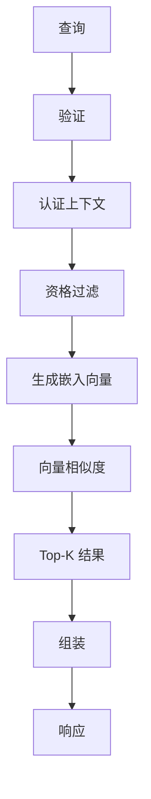
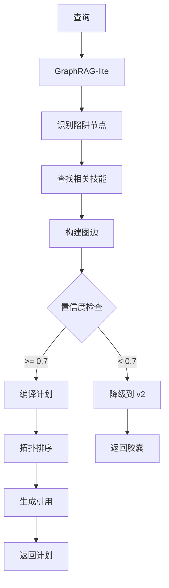
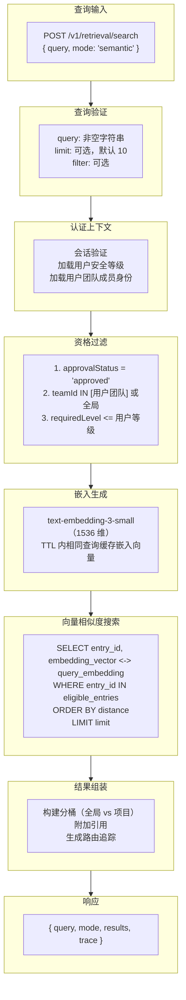
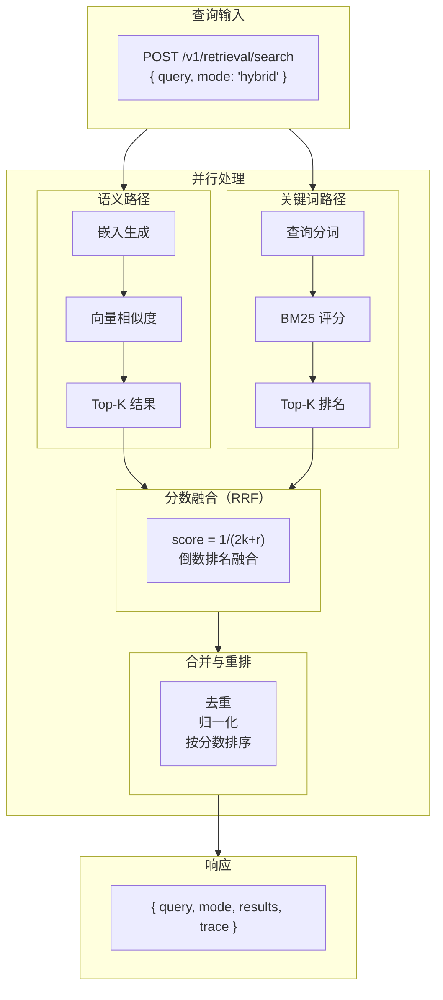
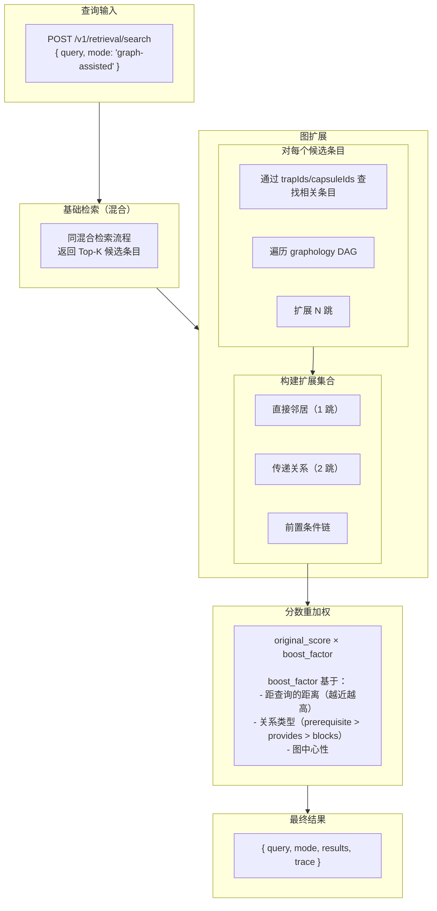
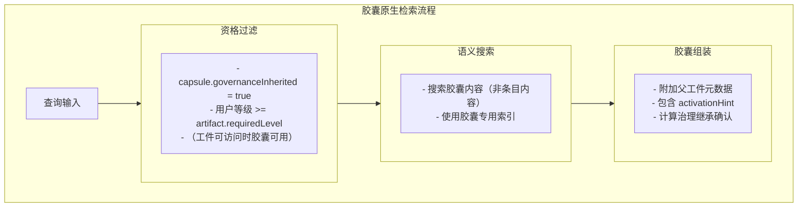
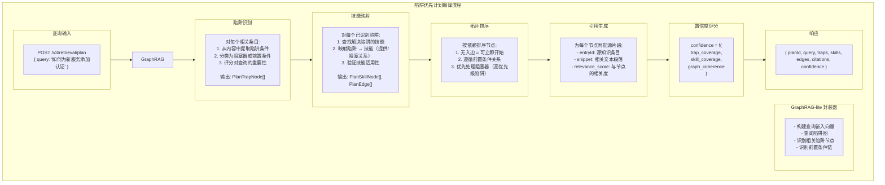

# 检索系统 (Retrieval System)

## 概述

TrapMap 提供多版本检索能力，支持从简单的语义搜索到复杂的 GraphRAG-lite 陷阱优先计划生成。检索系统是 TrapMap 的核心功能，负责从索引知识库中高效召回相关条目。

## 版本演进

| 版本 | 模式 | 核心能力 |
|------|------|----------|
| v1 | Entry-based | 语义/混合/图辅助三种模式 |
| v2 | Capsule-native | 原生胶囊检索，支持激活提示 |
| v3 | Plan-first | GraphRAG-lite，陷阱优先计划编译 |

## v1 检索 (Entry-based Retrieval)

### 支持的检索模式

| 模式 | 描述 | 底层算法 |
|------|------|----------|
| `semantic` | 纯语义检索 | OpenAI embedding + 余弦相似度 |
| `hybrid` | 语义 + 关键词混合 | embedding merge BM25 |
| `graph-assisted` | 混合 + 图扩展 | embedding + graphology DAG |

### v1 语义检索流程（Mermaid）



### v1 混合检索流程（Mermaid）

```mermaid
flowchart TB
    A[查询] --> B[验证与认证]
    B --> C{并行处理}

    C -->|语义路径| D1[生成 Embedding]
    D1 --> D2[向量相似度]
    D2 --> D3[Top-K 语义结果]

    C -->|关键词路径| E1[分词]
    E1 --> E2[BM25 评分]
    E2 --> E3[Top-K 关键词结果]

    D3 --> F[分数融合<br/>(RRF)]
    E3 --> F
    F --> G[合并与重排]
    G --> H[组装]
    H --> I[响应]
```

### v3 陷阱优先计划编译（Mermaid）



### 语义检索流程 (Semantic Mode)



### 混合检索流程 (Hybrid Mode)



### 图辅助检索流程 (Graph-assisted Mode)



---

## v2 检索 (Capsule-native Retrieval)

### 与 v1 的区别

| 特性 | v1 | v2 |
|------|-----|-----|
| 检索单元 | KnowledgeEntry | SkillCapsule |
| 治理继承 | entry.requiredLevel | capsule.governanceInherited |
| 激活提示 | 无 | capsule.activationHint |
| 种子输入 | query only | query only |
| 返回格式 | entries | capsules with activation hints |

### 请求/响应示例

**请求**:
```typescript
POST /v3/retrieval/search
{
  query: "authentication setup for microservices",
  capsuleFilter?: {
    artifactId?: EntityId
    governanceInherited?: boolean
  }
}
```

**响应**:
```typescript
{
  query: "authentication setup for microservices",
  mode: "capsule-native",
  capsules: [
    {
      capsuleId: "capsule-1",
      artifactId: "artifact-1",
      name: "OAuth2 Setup",
      content: "To set up OAuth2 in Node.js...",
      activationHint: "Use when implementing user authentication",
      score: 0.92
    },
    {
      capsuleId: "capsule-2",
      artifactId: "artifact-2",
      name: "JWT Validation",
      content: "JWT validation steps...",
      activationHint: "Use when you need to validate access tokens",
      score: 0.87
    }
  ],
  trace: {
    provider: "semantic",
    confidence: 0.85,
    capsuleCount: 2
  }
}
```

### 胶囊检索流程



---

## v3 检索 (Trap-first Plan Compilation)

### 概念

v3 检索生成可执行的陷阱优先计划，而不是简单的结果列表。计划由以下组件构成：

```typescript
interface TrapFirstPlan {
  planId: EntityId
  query: string
  
  // 陷阱节点（需要解决或满足的条件）
  traps: PlanTrapNode[]
  
  // 技能节点（可用于解决问题的技能）
  skills: PlanSkillNode[]
  
  // 边（节点间关系）
  edges: PlanEdge[]
  
  // 引用（用于生成计划的源条目）
  citations: Citation[]
}
```

### 陷阱 vs 技能

| 概念 | 定义 | 示例 |
|------|------|------|
| Trap (陷阱) | 需要满足的前提条件或需要解决的障碍 | "需要 Node.js 18+", "数据库需要已迁移" |
| Skill (技能) | 可用于解决问题的知识单元 | "OAuth2 实现指南", "数据库迁移脚本" |

### 计划编译流程



### 置信度感知路由

```typescript
interface PlanCompilationResult {
  // If confidence >= threshold (0.7):
  plan: TrapFirstPlan
  confidence: number
  routing: 'plan'
  
  // If confidence < threshold:
  fallback: CapsuleMatch[]  // v2 capsule results
  confidence: number
  routing: 'fallback'
}
```

### 计划示例

**查询**: "how to add OAuth2 authentication to my service"

**生成的计划**:
```json
{
  "planId": "plan-123",
  "query": "how to add OAuth2 authentication to my service",
  "traps": [
    {
      "id": "trap-1",
      "name": "Requires HTTPS",
      "description": "OAuth2 requires HTTPS in production",
      "blockers": ["production-deployment"],
      "priority": 1
    },
    {
      "id": "trap-2", 
      "name": "Needs identity provider",
      "description": "Must have OAuth2 provider (Auth0, Okta, etc)",
      "blockers": ["oauth2-implementation"],
      "priority": 2
    }
  ],
  "skills": [
    {
      "id": "skill-1",
      "name": "HTTPS Setup Guide",
      "description": "How to configure HTTPS with nginx",
      "inputRequirements": ["nginx-installed"],
      "outputGuarantees": ["https-configured"]
    },
    {
      "id": "skill-2",
      "name": "Auth0 Integration",
      "description": "Step-by-step Auth0 OAuth2 integration",
      "inputRequirements": ["https-configured", "auth0-account"],
      "outputGuarantees": ["oauth2-implemented"]
    }
  ],
  "edges": [
    { "source": "skill-1", "target": "trap-1", "edgeType": "blocks" },
    { "source": "skill-2", "target": "trap-2", "edgeType": "blocks" },
    { "source": "trap-1", "target": "trap-2", "edgeType": "prerequisite" }
  ],
  "citations": [
    {
      "entryId": "entry-456",
      "nodeId": "trap-1",
      "snippet": "Production OAuth2 requires valid HTTPS...",
      "relevanceScore": 0.95
    }
  ],
  "confidence": 0.82
}
```

---

## 检索过滤器

所有检索版本支持过滤器：

```typescript
interface RetrievalFilter {
  // 审批状态过滤
  approvalStatus?: 'approved' | 'submitted' | 'agent-pass'
  
  // 团队过滤
  teamId?: EntityId
  
  // 安全等级过滤
  requiredLevel?: {
    lte?: SecurityLevel  // less than or equal
    gte?: SecurityLevel  // greater than or equal
  }
  
  // 实体引用过滤
  trapIds?: EntityId[]
  capsuleIds?: EntityId[]
  
  // 日期范围
  createdAt?: {
    gte?: string  // ISO 8601
    lte?: string
  }
}
```

---

## 评分机制

### 向量相似度

使用余弦相似度：

```typescript
function cosineSimilarity(a: number[], b: number[]): number {
  const dotProduct = a.reduce((sum, ai, i) => sum + ai * b[i], 0);
  const normA = Math.sqrt(a.reduce((sum, ai) => sum + ai * ai, 0));
  const normB = Math.sqrt(b.reduce((sum, bi) => sum + bi * bi, 0));
  return dotProduct / (normA * normB);
}
```

### RRF (Reciprocal Rank Fusion)

混合检索使用 RRF 融合多路检索结果：

```typescript
function reciprocalRankFusion(
  rankings: Array<Array<{ id: string; rank: number }>>,
  k: number = 60
): Array<{ id: string; score: number }> {
  const scores: Record<string, number> = {};
  
  for (const ranking of rankings) {
    for (let i = 0; i < ranking.length; i++) {
      const id = ranking[i].id;
      scores[id] = (scores[id] || 0) + 1 / (k + i + 1);
    }
  }
  
  return Object.entries(scores)
    .map(([id, score]) => ({ id, score }))
    .sort((a, b) => b.score - a.score);
}
```

### BM25 评分

关键词检索使用 BM25：

```typescript
function bm25(
  documents: string[],
  query: string,
  k1: number = 1.5,
  b: number = 0.75
): Array<{ docIndex: number; score: number }> {
  // Tokenize documents and query
  const tokenizedDocs = documents.map(doc => tokenize(doc));
  const tokenizedQuery = tokenize(query);
  
  // Calculate IDF for each term
  const idf = calculateIDF(tokenizedDocs, tokenizedQuery);
  
  // Calculate BM25 score for each document
  return tokenizedDocs.map((doc, index) => ({
    docIndex: index,
    score: calculateBM25(doc, tokenizedQuery, idf, k1, b)
  })).sort((a, b) => b.score - a.score);
}
```

---

## 路由追踪 (Routing Trace)

每个检索响应包含路由追踪：

```typescript
interface RoutingTrace {
  // 实际使用的检索提供者
  provider: 'semantic' | 'keyword' | 'graph'
  
  // 置信度分数 (0-1)
  confidence: number
  
  // 是否使用了回退
  fallback: boolean
  
  // 额外信息
  metadata?: {
    embeddingCacheHit?: boolean
    graphExpansionDepth?: number
    candidateCount?: number
  }
}
```

---

## 性能优化

### Embedding 缓存

```typescript
const embeddingCache = new LRUCache<string, number[]>({
  max: 1000,
  ttl: 1000 * 60 * 5  // 5 minutes
});

async function getEmbedding(text: string): Promise<number[]> {
  const cacheKey = hashText(text);
  
  if (embeddingCache.has(cacheKey)) {
    return embeddingCache.get(cacheKey)!;
  }
  
  const embedding = await aiProvider.embed([text]);
  embeddingCache.set(cacheKey, embedding[0]);
  
  return embedding[0];
}
```

### 批处理

```typescript
async function batchEmbed(
  texts: string[],
  batchSize: number = 100
): Promise<number[][]> {
  const results: number[][] = [];
  
  for (let i = 0; i < texts.length; i += batchSize) {
    const batch = texts.slice(i, i + batchSize);
    const embeddings = await aiProvider.embed(batch);
    results.push(...embeddings);
  }
  
  return results;
}
```

### 向量索引优化

使用 PostgreSQL 的 `pg_vector` 扩展或专门的向量数据库：

```sql
-- 索引配置
CREATE INDEX ON knowledge_entries 
USING ivfflat (embedding_vector vector_cosine_ops)
WITH (lists = 100);
```
