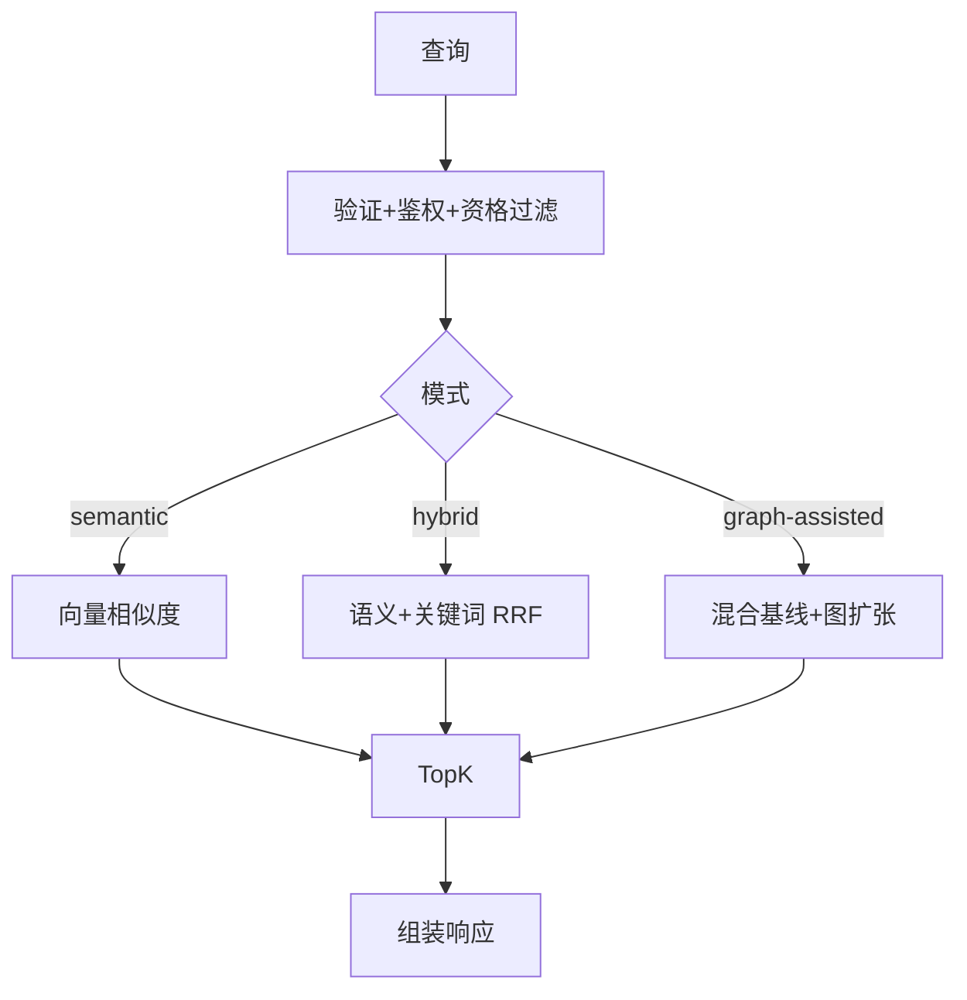

# 检索系统

> 真源：`packages/service-knowledge-read` 与 `packages/contracts/src/domain/retrieval.ts`；图索引真相在 `packages/db/src/schema/retrieval.ts` 与 `packages/db/src/schema/knowledge.ts`。状态：Active。

## 设计灵感

本检索系统的两个近期演进直接以论文为出发点：

- **Experience Gene 检索（gene-native）** — 论文 *From Procedural Skills to Strategy Genes: Towards Experience-Driven Test-Time Evolution*（HTML: https://arxiv.org/html/2604.15097v2 · ABS: https://arxiv.org/abs/2604.15097）。该文证明：文档型 Skill（~2500 tokens, -1.1pp）的控制信号稀疏，而紧凑的 control-oriented Gene（~230 tokens, +3.0pp, 45 scenarios / 4590 trials，`g=(m,u,π,α,c,v)`）更利于 test-time 控制。TrapMap 将其 1:1 落为 `ExperienceGene{ signalsMatch=m, summary=u, strategy=π, avoid=α, constraints=c, validation=v }`（`packages/contracts/src/domain/experience-gene.ts`），经 `trap / skill-artifact(bounded 16k) / skill-capsule` 三源派生，以 `gene-native` 投影独立于 `RetrievalMatch / SkillCapsule` 检索池提供 `POST /v1/retrieval/genes/search`（`off|shadow|serve`）与 `<strategy-gene>` 注入块（`packages/lib/src/strategy-gene.ts`）。详见主线 `docs/archived/archived-plans/experience-gene-program-mainline-archived.md（已归档，路径冻结）`。
- **v3 Trap-First Plan 图编排 / ExecutionPlan** — 论文 *GraSP (arXiv:2604.17870, PDF: https://arxiv.org/pdf/2604.17870)* 的 DAG 编译（`state / data / order` 边）与 *SkillGraph (2605.12039)* 的 `R_ret = TopoSort(...)` 拓扑排序。TrapMap 在 `TrapFirstPlan` 中新增 `executionPlan: ExecutionStep[]`（`packages/contracts/src/domain/plans.ts`），由 `plan-compiler.ts` 的 `buildExecutionPlan()` 对 `mitigates / requires / order` 边执行 Kahn 排序，输出 `{ rank, nodeId, label, kind:trap-mitigation|skill, blockedBy }`，供 CLI/MCP 直接消费；详见 `docs/superpowers/plans/2026-05-25-topological-execution-plan.md`。

## 路由对照

对外与内部路径的逐条对照见 [TrapMap API 契约表面](../../reference/api-surface.md)。实现落点：对外在 `packages/host-distributed/src/gateway/route-defs/knowledge.ts`，内部在 `packages/service-knowledge-read/src/routes.ts`。`POST /v1/retrieval/genes/search` 未在 gateway route-defs 中出现，标未知/待确认（2026-09-08）。

统一调度内核是 `retrieval-orchestration.ts` 与 `retrieval-recall-coordinator.ts`。

## v1 模式

| 模式 | 召回 | 算法 |
|---|---|---|
| `semantic` | 向量 | embedding 余弦 |
| `hybrid` | 向量 + 关键词 | embedding + BM25 → RRF 融合 |
| `graph-assisted` | 基线 + 图邻域 | + `GraphQueryBackend` local-neighborhood |

图约束：`graph_index_documents` 为真相；`GraphQueryBackend` 只做 query-time 扩张；`memory (graphology)` / `neo4j` 可切换，fail-open 回 `memory`；`routingTrace.graphRetrieval` 记录 `mergeMode: mixed` 与 backend 状态。



## v2 胶囊检索

| 通道 | 实现 | 职责 |
|---|---|---|
| `heuristic` | `retrieval-*.ts` + capsule-recall | 保底，治理 + 多维加权评分 |
| `keyword` | `retrieval-keyword.ts` | 词法通道，字段加权 BM25 |
| `semantic` | `retrieval-semantic.ts` | 向量通道，余弦相似度 |
| `graph` | `graph-query*.ts` | skill graph 结构化扩张 |

通道经 `retrieval-recall-coordinator.ts` 并行调度，注册表在 `retrieval-infra.ts`。合并用 RRF（`preRerankScore = Σ 1/(k+rank)`，按 capsuleId 去重），重排用 intent-aware 特征与 `finalScore` + explainable reason。缺省三通道（heuristic + keyword + semantic），graph 按配置开。`MIN_CAPSULE_SCORE` 在通道层与 rerank 层双重门控。`contextualPrefix` 为第五评分维度（problem 0.30 / situation 0.21 / goal 0.17 / keyword 0.17 / contextualPrefix 0.15），token overlap 计分。

## v3 陷阱优先计划（灵感：GraSP arXiv:2604.17870 + SkillGraph 2605.12039）

> 出发点论文：*GraSP* PDF https://arxiv.org/pdf/2604.17870（DAG 编译 + state/data/order 边 + 拓扑序执行）与 *SkillGraph* `R_ret = TopoSort(R_seed ∪ R_BFS ∪ R_beam)`（prerequisite / enhancement 边）。TrapMap 的 `executionPlan` 即该思想在 `TrapFirstPlan` 上的工程化：`mitigates / requires / order → Kahn → ExecutionStep[]`。

`graph-llm-extract.ts` 做 LLM 抽取，`response-summary.ts` 做摘要组装。

## 意图解析

`intent-recognition` 端口在 `packages/backend-core/src/ports/intent-ports.ts`，规则实现在 `service-knowledge-read/src/intent-recognition/`：先 regex，失败走 LLM（至多 3 次，退避 100 / 400ms），内部字段 `category / semanticQuery / parseMethod`；进程内 LRU 缓存 200 条、TTL 30min，只缓存 LLM 结果；胶囊语义通道优先用 `intent.semanticQuery`。

## 响应组装与追踪

组装链为 `response-assembly.ts` / `response-citations.ts` / `response-refinement.ts` / `response-summary.ts`。`routingTrace` 记录 `provider/confidence/fallback`、图 backend 状态、`channelsPlanned/channelsUsed/mergeStats`。

## 性能

- Embedding 缓存：`LRU 1000 / 5min`，按 `hash(text)` 命中；批嵌入缺省 `batchSize=100`。
- 向量：PostgreSQL `pgvector HNSW`（`knowledge_embeddings`、`skill_artifact_capsule_embeddings`）；全文 `tsvector + GIN`；低频 `jsonb + GIN`。
- 失败隔离：单通道失败返回空数组，不阻断整体检索。
- 批量阈值见 [评估框架](EVALUATION.md) 性能节。

## 契约

请求 / 响应 Zod 在 `packages/contracts/src/domain/retrieval.ts`（`retrievalQueryModeSchema`、`retrievalStrategySchema` 等）。空结果契约与阈值调优见 rerank 与 orchestrator 的 `threshold-gate` trace。

## 常见用法

### 你跑检索冒烟（dry-run）

前置条件：依赖已装；不打活服务。

```bash
pnpm --filter @trapmap/evals eval:retrieval:dry-run
```

脚本定义在 `evals/package.json:34`。

### 你跑检索冒烟（活服务）

前置条件：目标服务运行中，PG 可达。

```bash
pnpm --filter @trapmap/evals eval:retrieval:smoke
```

用例结构与跑法前置见 [评估框架](EVALUATION.md)「评估类型」「跑法」两节。

### 你用 CLI 发起检索

前置条件：gateway 运行中。

```bash
trapmap retrieval --help
```

实现落点见本页「路由对照」节；逐条路径见 [TrapMap API 契约表面](../../reference/api-surface.md)。
