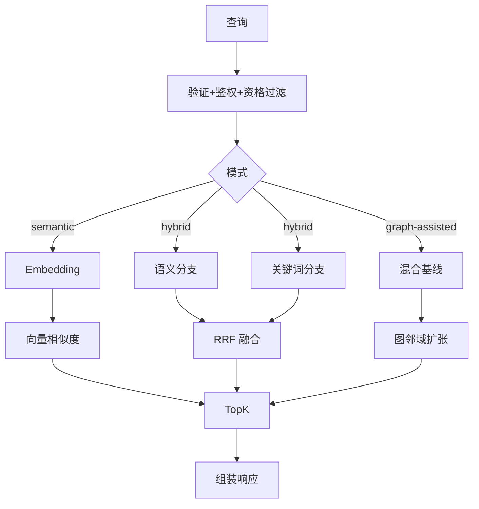
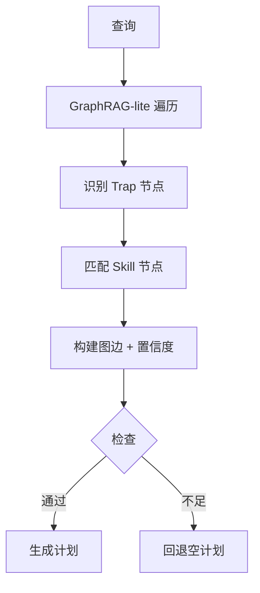

# 检索系统

> 真源：`packages/service-knowledge-read` 与 `packages/contracts/src/domain/retrieval.ts`；图索引真相在 `packages/db/src/schema/retrieval.ts` 与 `packages/db/src/schema/knowledge.ts`。

## 设计灵感

本检索系统的两个近期演进直接以论文为出发点：

- **Experience Gene 检索（gene-native）** — 论文 *From Procedural Skills to Strategy Genes: Towards Experience-Driven Test-Time Evolution*（HTML: https://arxiv.org/html/2604.15097v2 · ABS: https://arxiv.org/abs/2604.15097）。该文证明：文档型 Skill（~2500 tokens, -1.1pp）的控制信号稀疏，而紧凑的 control-oriented Gene（~230 tokens, +3.0pp, 45 scenarios / 4590 trials，`g=(m,u,π,α,c,v)`）更利于 test-time 控制。TrapMap 将其 1:1 落为 `ExperienceGene{ signalsMatch=m, summary=u, strategy=π, avoid=α, constraints=c, validation=v }`（`packages/contracts/src/domain/experience-gene.ts`），经 `trap / skill-artifact(bounded 16k) / skill-capsule` 三源派生，以 `gene-native` 投影独立于 `RetrievalMatch / SkillCapsule` 检索池提供 `POST /v1/retrieval/genes/search`（`off|shadow|serve`）与 `<strategy-gene>` 注入块（`packages/lib/src/strategy-gene.ts`）。详见主线 `docs/archived/archived-plans/experience-gene-program-mainline-archived.md`。
- **v3 Trap-First Plan 图编排 / ExecutionPlan** — 论文 *GraSP (arXiv:2604.17870, PDF: https://arxiv.org/pdf/2604.17870)* 的 DAG 编译（`state / data / order` 边）与 *SkillGraph (2605.12039)* 的 `R_ret = TopoSort(...)` 拓扑排序。TrapMap 在 `TrapFirstPlan` 中新增 `executionPlan: ExecutionStep[]`（`packages/contracts/src/domain/plans.ts`），由 `plan-compiler.ts` 的 `buildExecutionPlan()` 对 `mitigates / requires / order` 边执行 Kahn 排序，输出 `{ rank, nodeId, label, kind:trap-mitigation|skill, blockedBy }`，供 CLI/MCP 直接消费；详见 `docs/superpowers/plans/2026-05-25-topological-execution-plan.md`。

## 概述

TrapMap 提供分层检索：

- **v1 Entry**：知识条目的语义 / 混合 / 图辅助检索。
- **v2 Capsule**：胶囊原生检索，支持激活提示与多通道召回。
- **v3 Plan**：GraphRAG-lite 陷阱优先计划编译。

所有检索经 `POST /v1/retrieval/search` 等 gateway 路由进入 `service-knowledge-read`，由 `searchKnowledge` / `searchKnowledgeV2` / `compileTrapFirstPlan` 编排。

## 路由与版本

| 版本 | 入口 | 能力 |
|---|---|---|
| v1 | `createKnowledgeReadRouteDefs` → `/v1/retrieval/search` | `semantic | hybrid | graph-assisted` |
| v2 | `/v2/retrieval/search` | capsule 原生，多通道 RRF + 重排 |
| v3 | `POST /v3/trap-plan` | 图遍历 + Trap 阻断 + Skill 填补 |

`retrieval-orchestration.ts` / `retrieval-recall-coordinator.ts` 为统一调度内核。

## v1 模式

| 模式 | 召回 | 算法 |
|---|---|---|
| `semantic` | 向量 | embedding 余弦 |
| `hybrid` | 向量 + 关键词 | embedding + BM25 → RRF 融合 |
| `graph-assisted` | 上述基线 + 图邻域 | + `GraphQueryBackend` local-neighborhood |

图约束：
- `graph_index_documents` 为真相；`GraphQueryBackend` 仅 query-time 扩张。
- 可切换 `memory (graphology)` / `neo4j`，fail-open 时回退到 `memory`。
- `routingTrace.graphRetrieval` 记录 `mergeMode: mixed`、`graphExpansion` 与 backend 状态。



## v2 胶囊检索

### 通道

| 通道 | 实现位置 | 职责 |
|---|---|---|
| `heuristic` | `retrieval-*.ts` + `capsule-recall` | 保底，治理+多维加权评分 |
| `keyword` | `retrieval-keyword.ts` | 词法通道，字段加权 BM25 |
| `semantic` | `retrieval-semantic.ts` | 向量通道，余弦相似度 |
| `graph` | `graph-query*.ts` | skill graph 结构化扩张 |

通道经 `retrieval-recall-coordinator.ts` 并行调度，注册表在 `retrieval-infra`。

### 融合与重排

```
searchKnowledgeV2
 └─ coordinator (parallel recall)
     ├─ heuristic / keyword / semantic / graph
     ├─ merge (RRF 去重 by capsuleId, preRerankScore = Σ 1/(k+rank))
     └─ rerank (intent-aware 特征 + finalScore + explainable reason)
```

- 默认启用三通道（heuristic + keyword + semantic），graph 按配置开启。
- `MIN_CAPSULE_SCORE` 在通道层与 rerank 层双重门控，低于阈值返回 `capsules: []` + `buildEmptyV2Response()`。
- `filters.labels / scopes` 经治理过滤与 PG `fieldTokensLabels @>` 贯穿 keyword/向量/内存路径。

### Contextual 评分（CAPS-04-CTX）

派生阶段 `contextualPrefix` 作为第五维度（权重 0.15，与 problem 0.30 / situation 0.21 / goal 0.17 / keyword 0.17 共同归一），用 token overlap（Jaccard-like）计分，缺失时得 0。

### 评分维度

| 维度 | 权重 |
|---|---|
| problem | 0.30 |
| situation | 0.21 |
| goal | 0.17 |
| keyword | 0.17 |
| contextualPrefix | 0.15 |

## v3 陷阱优先计划（灵感：GraSP arXiv:2604.17870 + SkillGraph 2605.12039）

> 出发点论文：*GraSP* PDF https://arxiv.org/pdf/2604.17870（DAG 编译 + state/data/order 边 + 拓扑序执行）与 *SkillGraph* `R_ret = TopoSort(R_seed ∪ R_BFS ∪ R_beam)`（prerequisite / enhancement 边）。TrapMap 的 `executionPlan` 即该思想在 `TrapFirstPlan` 上的工程化：`mitigates / requires / order → Kahn → ExecutionStep[]`。



`graph-llm-extract.ts` / `response-summary.ts` 负责 LLM 抽取与摘要组装。

## 意图解析

`intent-recognition` 端口（`packages/backend-core/src/ports/intent-ports.ts`，rule 在 `service-knowledge-read/src/intent-recognition/`）：

- 先 regex，失败时 LLM（最多 3 次、退避 100/400ms），新增 `category / semanticQuery / parseMethod` 内部字段。
- 缓存：进程内 LRU 200 条、TTL 30min，仅缓存 LLM 结果。
- 胶囊语义通道优先使用 `intent.semanticQuery`。

## 响应组装与追踪

- 组装：`response-assembly.ts` / `response-citations.ts` / `response-refinement.ts` / `response-summary.ts`。
- `routingTrace` 记录 `provider/confidence/fallback` 及图 backend 状态；`channelsPlanned/channelsUsed/mergeStats` 经 trace 暴露。
- 精排 explainable reason 含通道来源 + 意图匹配百分比。

## 性能

- Embedding 缓存：`LRU 1000 / 5min`，按 `hash(text)` 命中。
- 批嵌入：默认 `batchSize=100`。
- 向量：PostgreSQL `pgvector HNSW`（`knowledge_embeddings`, `capsule_embeddings`）；全文 `tsvector+GIN`；低频 `jsonb+GIN`。
- 失败隔离：单通道失败返回空数组，不阻断整体检索。

## 契约

- 请求/响应 Zod 在 `packages/contracts/src/domain/retrieval.ts`（`retrievalQueryModeSchema`, `retrievalStrategySchema` 等）。
- 空结果契约与阈值调优见 `rerank` 与 `orchestrator` 的 `threshold-gate` trace。
