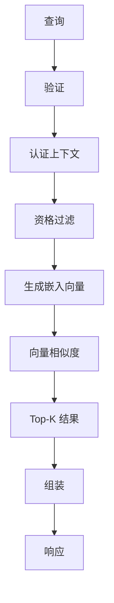
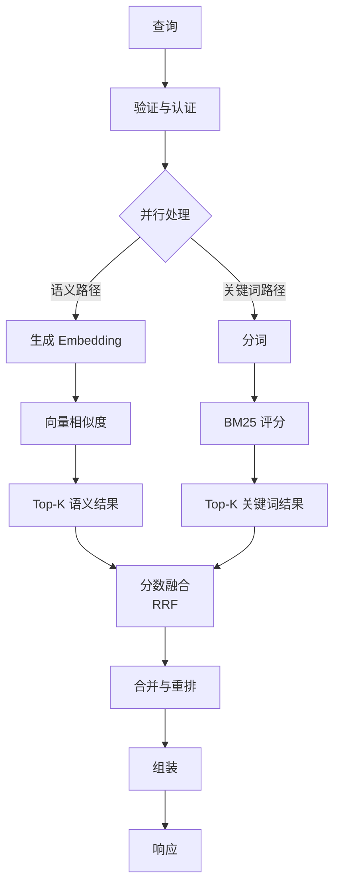
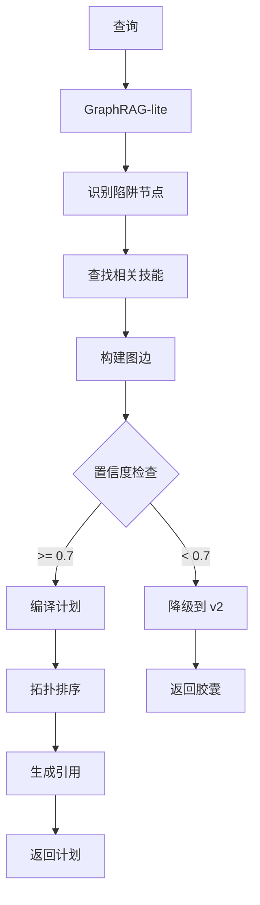
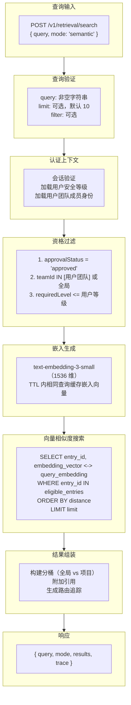
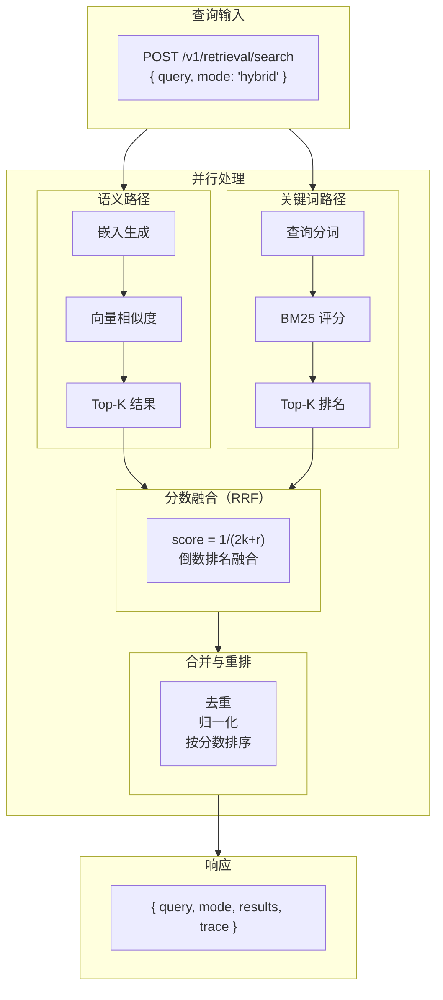
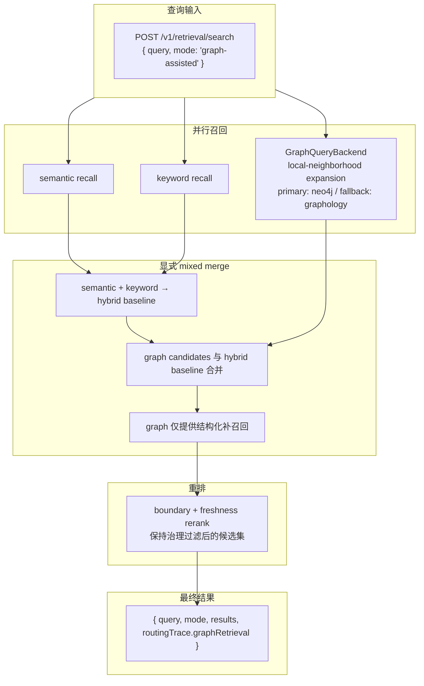
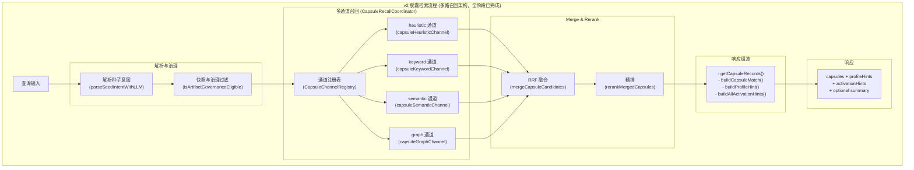
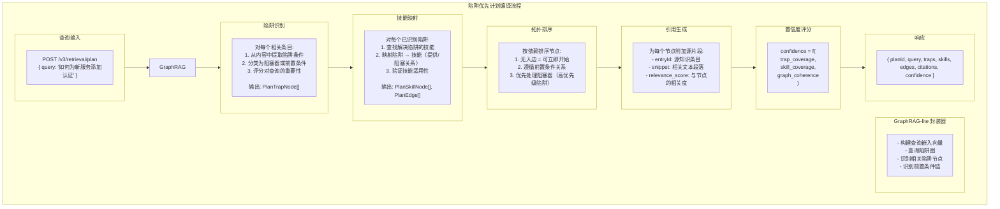

# 检索系统 (Retrieval System)

## 概述

TrapMap 提供多版本检索能力，支持从简单的语义搜索到复杂的 GraphRAG-lite 陷阱优先计划生成。检索系统是 TrapMap 的核心功能，负责从索引知识库中高效召回相关条目。

## 版本演进

| 版本 | 模式 | 核心能力 |
|------|------|----------|
| v1 | Entry-based | 语义/混合/图辅助三种模式 |
| v2 | Capsule-native | 原生胶囊检索，支持激活提示 |
| v3 | Plan-first | GraphRAG-lite，陷阱优先计划编译 |

## v1 检索 (Entry-based Retrieval)

### 支持的检索模式

| 模式 | 描述 | 底层算法 |
|------|------|----------|
| `semantic` | 纯语义检索 | OpenAI embedding + 余弦相似度 |
| `hybrid` | 语义 + 关键词混合 | embedding merge BM25 |
| `graph-assisted` | mixed recall + 本地图邻域扩展 | semantic + keyword + `GraphQueryBackend`（`memory` / `neo4j`） |

### 图查询后端约束

- graph DB 是可选后端，不是检索前提。
- PostgreSQL `graph_index_documents` 仍是图索引真相源。
- `GraphQueryBackend` 负责 query-time 图扩张；当前可切换 `memory`（`graphology`）和可选 `neo4j` backend。
- fail-open 开启时，graph DB 不健康会回退到 `graphology`，不会把图查询变成唯一召回路径。
- `graph-assisted` 仍然是 mixed retrieval：语义/关键词召回先建立基线，图只补充 local-neighborhood structural recall，不替代语义决策。
- `routingTrace.graphRetrieval` 会显式记录 `mergeMode: mixed`、`graphExpansion: local-neighborhood`，以及 backend 是 `disabled` / `enabled-primary` / `enabled-fallback`。

### v1 语义检索流程（Mermaid）



### v1 混合检索流程（Mermaid）



### v3 陷阱优先计划编译（Mermaid）



### 语义检索流程 (Semantic Mode)



### 混合检索流程 (Hybrid Mode)



### 图辅助检索流程 (Graph-assisted Mode)



### Phase 4 决策

- v1 `graph-assisted` 保持 local-neighborhood retrieval，不引入 graph-only search。
- 可选 Neo4j backend 只替换 traversal efficiency；semantic / keyword 仍然决定 mixed recall 的主体。
- plan compiler 继续只使用 seed neighborhood 的 local subgraph，不在本阶段引入 broader/global graph lookup。

---

## v2 检索 (Capsule-native Retrieval)

### 与 v1 的区别

| 特性 | v1 | v2 |
|------|-----|-----|
| 检索单元 | KnowledgeEntry | SkillCapsule |
| 治理继承 | entry.requiredLevel | capsule.governanceInherited |
| 激活提示 | 无 | capsule.activationHint |
| 种子输入 | query only | query only |
| 返回格式 | entries | capsules with activation hints |

### 请求/响应示例

**请求**:
```typescript
POST /v3/retrieval/search
{
  query: "authentication setup for microservices",
  capsuleFilter?: {
    artifactId?: EntityId
    governanceInherited?: boolean
  }
}
```

**响应**:
```typescript
{
  query: "authentication setup for microservices",
  mode: "capsule-native",
  capsules: [
    {
      capsuleId: "capsule-1",
      artifactId: "artifact-1",
      name: "OAuth2 Setup",
      content: "To set up OAuth2 in Node.js...",
      activationHint: "Use when implementing user authentication",
      score: 0.92
    },
    {
      capsuleId: "capsule-2",
      artifactId: "artifact-2",
      name: "JWT Validation",
      content: "JWT validation steps...",
      activationHint: "Use when you need to validate access tokens",
      score: 0.87
    }
  ],
  trace: {
    provider: "semantic",
    confidence: 0.85,
    capsuleCount: 2
  }
}
```

### 胶囊检索流程



### LLM Intent Parsing

v2 和 v3 检索管线现已集成 LLM 驱动的意图解析。原纯正则解析器 `parseSeedIntent()` 保留为确定性 baseline，新增异步包装器 `parseSeedIntentWithLLM()` 作为主入口：

- **确定性 baseline**: `parseSeedIntent()` — 纯同步正则解析，零外部依赖
- **LLM 包装器**: `parseSeedIntentWithLLM(seed, chat, options?)` — 缓存查找 → LLM 提取 → Schema 校验 → 确定性补充（tokens + stackPathHints）→ 正则降级
- **降级策略**: 任何 LLM 失败（未配置、调用异常、JSON 解析失败、Schema 校验失败）均自动降级到正则 baseline
- **重试**: 最多 3 次尝试（含指数退避 100ms/400ms），覆盖 invoke 异常和 parse 失败
- **缓存**: 进程内 `InMemoryIntentCache`（TTL 30 分钟，容量上限 200），仅缓存 LLM 结果
- **新增字段**: `category`（意图分类）、`semanticQuery`（语义优化查询）、`parseMethod`（`'regex'` | `'llm'` 可观测标记）— 均为 server 内部字段，不暴露到外部 API 契约
- **semanticQuery 使用**: `capsule-semantic` 召回通道优先使用 `intent.semanticQuery`，缺失时回退到 `seed` / `normalized`

**集成点**:
| 位置 | 用法 |
|------|------|
| `orchestrator.ts` (v2) | `searchKnowledgeV2()` → `parseSeedIntentWithLLM()` |
| `skill-lookup.ts` | `searchSkillsByContent()` → `parseSeedIntentWithLLM()` |
| `plan-compiler.ts` | `compileTrapFirstPlan()` → `parseSeedIntentWithLLM()` |

### Context-Aware Capsule Scoring (CAPS-04-CTX)

v2 检索评分支持 Anthropic Contextual Retrieval 策略。派生阶段生成的 `contextualPrefix`（LLM 生成的上下文前缀）在检索时作为额外评分维度参与排名。

**评分权重分配：**

| 维度 | 权重 | 说明 |
|------|------|------|
| problem | 0.30 | 查询问题与胶囊问题匹配度 |
| situation | 0.21 | 情境上下文匹配 |
| goal | 0.17 | 目标匹配 |
| keyword | 0.17 | 关键词重叠度 |
| contextualPrefix | 0.15 | 上下文前缀匹配（Anthropic Contextual Retrieval） |

**contextualPrefix 评分逻辑：**
- 使用与其它维度相同的 token overlap 算法（`computeTextSimilarity`）
- 将归一化查询与 contextualPrefix 文本进行 Jaccard-like 相似度计算
- 当 capsule 无 contextualPrefix 时（向后兼容），该维度得分为 0

**相关代码：**
- `packages/server/src/lib/retrieval/capsules/capsule-recall.ts` — `computeContextMatchScore()` 函数
- `packages/server/src/lib/artifacts/contextual-enrichment.ts` — 派生阶段的上下文生成

### v2 多路召回架构 (Phase 4)

v2 检索管线已重构为可扩展的多路召回架构。全部阶段已完成（Phase 1-7），heuristic + keyword + semantic + graph 四通道并行召回，通过 RRF 融合和独立重排层产生最终排序。这是 v2 检索的唯一路径，无旧版回退代码。

#### 架构分层

```text
searchKnowledgeV2() (orchestrator.ts)
  └─> CapsuleRecallCoordinator
        ├─> CapsuleChannelRegistry (channel recall)
        │     ├─> capsule-heuristic  ← 保底通道 (intent-aware 精排特征)
        │     ├─> capsule-keyword    ← ✅ Phase 2 已落地
        │     ├─> capsule-semantic   ← ✅ Phase 3 已落地
        │     └─> capsule-graph      ← ✅ Phase 5 已落地
        ├─> Capsule Merge Layer      ← ✅ Phase 4 新落地
        │     ├─> merge.ts: RRF 去重融合 (dedupe by capsuleId)
        │     └─> preRerankScore = Σ 1/(k + rank_i)
        └─> Capsule Rerank Layer     ← ✅ Phase 4 新落地
              ├─> rerank.ts: 独立重排 (复用 v2 intent-aware 特征)
              └─> reasons.ts: 多通道 explainable reason 生成
```

#### 组件职责

| 组件 | 文件 | 职责 |
|------|------|------|
| `searchKnowledgeV2()` | `packages/server/src/lib/retrieval/orchestration/orchestrator.ts` | v2 主编排器：解析 → 治理 → 协调器调用 → 响应组装 |
| `CapsuleRecallCoordinator` | `packages/server/src/lib/retrieval/capsules/capsule-recall-coordinator.ts` | 多通道召回调度：调用注册的通道、合并结果、产生 MergedCapsuleCandidate |
| `CapsuleChannelRegistry` | `packages/server/src/lib/retrieval/capsules/capsule-channel-registry.ts` | 通道注册表：register / get / all / unregister |
| `capsuleHeuristicChannel` | `packages/server/src/lib/retrieval/capsules/channels/heuristic.ts` | heuristic 通道：包装 rankCapsules()，提供 CapsuleRecallCandidate[] |
| `capsuleKeywordChannel` | `packages/server/src/lib/retrieval/capsules/channels/keyword.ts` | keyword 通道：独立词法召回，字段加权评分，内存/PG 双路径 |
| `capsuleSemanticChannel` | `packages/server/src/lib/retrieval/capsules/channels/semantic.ts` | semantic 通道：embedding 语义召回，余弦相似度评分，内存/PG 双路径 |
| `capsuleGraphChannel` | `packages/server/src/lib/retrieval/capsules/channels/graph.ts` | graph 通道：skill graph 结构化扩召回，one-hop 实体展开，artifact-to-capsule 映射 |
| `rankCapsules()` | `packages/server/src/lib/retrieval/capsules/capsule-recall.ts` | 核心评分引擎：治理过滤 + situation/problem/goal/keyword/context 多维加权评分 |
| `mergeCapsuleCandidates()` | `packages/server/src/lib/retrieval/capsules/scoring/merge.ts` | RRF 融合层：按 capsuleId 去重、保留 per-channel scores、计算 preRerankScore |
| `rerankMergedCapsules()` | `packages/server/src/lib/retrieval/capsules/scoring/rerank.ts` | 重排层：复用 v2 intent-aware 特征、计算 finalScore、生成多通道 reason |
| `buildMultiChannelReason()` | `packages/server/src/lib/retrieval/capsules/scoring/reasons.ts` | 多通道 explainable reason：包含通道来源 + 意图匹配百分比 + boost 信息 |
| `createCapsuleIndexSync()` | `packages/server/src/lib/retrieval/capsules/repositories/index-sync.ts` | 索引同步服务：capsule → keyword tokens + embedding vectors，幂等 upsert (capsuleId + contentHash) |
| `rebuildAllCapsuleIndexes()` | `packages/server/src/lib/retrieval/capsules/repositories/index-rebuild.ts` | 批量重建：清空索引表 → 遍历所有 artifact → 重新同步 |
| `verifyCapsuleIndexHealth()` | `packages/server/src/lib/retrieval/capsules/repositories/index-rebuild.ts` | 健康对账：对比 source capsules 与 index 行，检测缺失/失败/孤立 |

#### 类型定义

| 类型 | 描述 |
|------|------|
| `CapsuleRecallChannelName` | 通道标识符联合类型：`capsule-heuristic \| capsule-keyword \| capsule-semantic \| capsule-graph` |
| `CapsuleRecallCandidate` | 单通道召回候选：`{ capsuleId, artifactId, revision, channel, score, matchedTokens?, graphEvidence? }` |
| `MergedCapsuleCandidate` | 多通道融合候选：`{ capsuleId, artifactId, revision, channels, channelScores, preRerankScore, finalScore, reason }` |
| `CapsuleRecallChannel` | 通道接口：`{ name, recall(artifacts, intent, filters, maxResults) }` |

#### Phase 4 行为保证

- `/v2/retrieval/search` 请求/响应契约不变
- 治理过滤流程不变（team、requiredLevel、lifecycleState）
- 三通道并行召回 → merge 层 RRF 去重融合 → rerank 层 intent-aware 精排
- 默认启用 `capsule-heuristic` + `capsule-keyword` + `capsule-semantic` 三通道
- CapsuleRecallCoordinator.execute() 返回 `capsuleCandidates: CapsuleCandidate[]` 供后续组装层复用
- 语义/关键词通道失败时返回空数组，不阻断检索
- 通道 observable：`channelsPlanned` / `channelsUsed` / `mergeStats` 通过 trace 记录

#### 精度门控与空结果行为 (Precision Gating)

v2 管线在两个层面执行 `MIN_CAPSULE_SCORE` 阈值过滤，确保零信号和近零启发式匹配不会成为返回的 capsules：

1. **通道层预过滤**：`capsuleHeuristicChannel.recall()` 在返回前丢弃 `finalScore < MIN_CAPSULE_SCORE` 的候选，防止低分候选进入 merge 层
2. **rerank 层最终门控**：`rerankMergedCapsules()` 在独立重排后再次过滤，确保所有通道来源的低分候选都被丢弃

**空结果契约**：当所有候选低于阈值时（即使存在治理合格的 artifacts），`searchKnowledgeV2()` 返回 `buildEmptyV2Response()`：
- `capsules: []`
- `summary: null`
- `profileHints: []`

**可观测性**：orchestrator 在 pipeline steps 中记录 `threshold-gate` 步骤，包含 pre-threshold（`inputSize`）和 post-threshold（`outputSize`）候选计数，用于后续阈值调优。

#### v2 查询过滤器传播

v2 查询中的 `filters.labels` 和 `filters.scopes` 在以下位置生效：

1. **治理过滤器构建** (`orchestrator.ts`): 将查询元数据注入 `ArtifactGovernanceFilters`
2. **胶囊提取** (`capsule-recall.ts`): `extractGovernedCapsules()` 在治理过滤后追加 `matchesArtifactMetadata()` 检查
3. **Profile 短名单** (`capsule-recall.ts`): `buildProfileShortlist()` 同样应用 `matchesArtifactMetadata()`
4. **PG 关键词召回** (`pg-capsule-keyword.ts`): 使用 `fieldTokensLabels @> <labels>` 过滤
5. **PG 向量召回** (`pg-capsule-vector.ts`): 通过 JOIN 关键词表应用相同的标签过滤
6. **内存通道** (`keyword.ts`, `semantic.ts`): 通过 `extractGovernedCapsules()` 继承过滤

过滤语义：
- `scopes`: 非空时，工件 scope 必须在请求集合中
- `labels`: 非空时，工件必须携带所有请求标签（AND 语义）

这意味着 `capsules`、`profileHints` 和 `summary.citations` 都会在组装前被过滤。

#### Merge 与 Rerank 两阶段结构 (Phase 4)

```text
┌─────────────────────────────────────────────────────┐
│ 阶段 1: Merge (Capsule Merge Layer)                  │
│  - 输入: CapsuleRecallCandidate[][] (各通道结果)     │
│  - 按 capsuleId 去重                                 │
│  - 保留 per-channel scores (channelScores)           │
│  - RRF 计算 preRerankScore                          │
│    RRF = Σ 1 / (k + rank_i)  (k=60)                │
│  - 输出: MergedCapsuleCandidate[] (含 channel 溯源)  │
└─────────────────────────────────────────────────────┘
                         │
                         ▼
┌─────────────────────────────────────────────────────┐
│ 阶段 2: Rerank (Capsule Rerank Layer)                │
│  - 输入: MergedCapsuleCandidate[] + artifacts        │
│  - 查 capsule 数据，复用 v2 intent-aware 特征        │
│  - 特征: problem × 0.30 + situation × 0.21           │
│          + goal × 0.17 + keyword × 0.17              │
│          + context × 0.15                            │
│  - 多通道证据融合 (Phase 2 v2 blend):                │
│    blendedScore = baseScore × 0.65                   │
│      + preRerankScore × 0.20                         │
│      + semanticBoost (channelScore × 0.2)            │
│      + graphBoost (channelScore × 0.1)               │
│      + channelConsensusBoost (min(N×0.04, 0.12))     │
│  - finalScore = min(1, blendedScore × stackPathBoost)│
│  - 多通道共识优先于单通道弱词法匹配                   │
│  - 生成多通道 explainable reason:                    │
│    "Matched via heuristic + keyword + semantic;       │
│     problem match (82%), semantic evidence,           │
│     3-channel consensus"                              │
│  - 排序并限制 maxResults                             │
│  - 输出: CapsuleCandidate[]                          │
└─────────────────────────────────────────────────────┘
```

**Reason 生成格式** (Phase 4 + Phase 2 v2 blend):

Reason 字符串格式从 "Matched: ..." 升级为 "Matched via <channels>; ..."：

```
Matched via heuristic + keyword + semantic; problem match (84%), context match (61%), 3-channel consensus, semantic evidence, stack/path boost
```

- 开头标识贡献通道列表（heuristic/keyword/semantic/graph）
- 中间列出命中的意图特征及其匹配百分比（仅 score > 0.3 的特征）
- 多通道共识标注（`N-channel consensus`，当 channelConsensusBoost > 0 时可见）
- 语义证据标注（`semantic evidence`，当 semanticBoost > 0.05 时可见）
- 图证据标注（`graph evidence`，当 graphBoost > 0.02 时可见）
- 末尾标注 stack/path boost（仅 boost > 1.1 时可见）
- 无匹配特征时 fallback 到 "Capsule from <sourcePath>"

#### capsule-keyword 通道详情

**字段权重** (tokenize/normalizeQuery 复用 v1 逻辑)：

| 字段 | 权重 | 说明 |
|------|------|------|
| `labels` | 3.0 | 强语义标签命中 |
| `problem` | 2.5 | 问题文本是最强 capsule intent 信号之一 |
| `goal` | 2.0 | 目标导向检索的重要补充 |
| `situation` | 1.5 | 场景词对上下文区分有价值 |
| `contextualPrefix` | 1.5 | 提升上下文词召回 |
| `content` | 1.0 | 长正文兜底字段 |

**召回面**: `content`, `situation`, `problem`, `goal`, `labels`, `contextualPrefix`

**双路径支持**:
- 内存路径：调用 `capsuleKeywordRecall()` 基于 tokenize/normalizeQuery 做字段加权词法匹配
- PG 路径：`createPgCapsuleKeywordRecall()` 查询 `skill_artifact_capsule_keywords` 表（GIN 索引 text[] overlap）

**通道输出**: `CapsuleRecallCandidate[]` 含 `matchedTokens`（命中 token 列表）和 `score`（归一化 [0,1]）

#### capsule-semantic 通道详情 (Phase 3)

**embedding 文本构建** (字段拼接顺序):

```
labels → situation → problem → goal → contextualPrefix → content
```

- `content` 截断至 500 字符，避免长正文稀释 embedding
- 使用 `generateEmbedding()` 生成 384 维向量
- 使用 `cosineSimilarity()` 计算查询与胶囊的余弦相似度

**召回面**: `labels`, `situation`, `problem`, `goal`, `contextualPrefix`, `content` (截断)

**双路径支持**:
- 内存路径：调用 `capsuleSemanticRecall()` 基于 `generateEmbedding()` + `cosineSimilarity()` 逐胶囊计算
- PG 路径：`createPgCapsuleVectorRecall()` 查询 `skill_artifact_capsule_embeddings` 表（HNSW 索引 `vector_cosine_ops`）

**通道输出**: `CapsuleRecallCandidate[]` 含 `score`（余弦相似度，归一化 [0,1]）

**错误降级**: embedding 生成失败时返回空数组，不阻断检索主流程

#### capsule-graph 通道详情 (Phase 5)

`capsule-graph` 通道利用 skill artifact graph 文档做结构化扩召回，通过 one-hop 实体展开发现与查询相关的补充 capsule 候选。

**graph recall 策略**:
```text
graph recall artifact IDs -> map to artifact capsules -> rerank within artifact
```
在 v2 管线中，graph 结果进入 merge 层与其他通道平等竞争，rerank 层决定最终排序。graph 不作为唯一排序器。

**entity 提取与图匹配**:
- 从 query seed 归一化图标签关键词（不再复用规则抽取器）
- 按 `sourceType: 'skill'` 过滤 graph 文档，构建图运行时快照
- 通过 `expandSourcesOneHop()` 做 bounded expansion 获取候选 artifact ID

**artifact-to-capsule 映射**:
- 图展开得到 artifact ID → 与治理过滤后的 artifacts 交集
- 交集中的 artifact 所含 capsules 作为 graph 通道回结果
- graph 通道不引入未经治理的 capsules

**channel 输出**:
- 返回 `CapsuleRecallCandidate[]`，channel 标记为 `capsule-graph`
- 包含 `graphEvidence` 字段（query entity 列表，最多 5 个）用于审计追踪
- 评分基于 entity 关系强度：base 0.85 + relationStrength 加成（上限 1.0）

**位置**: 注册为最后一个通道（在 heuristic/keyword/semantic 之后），作为补召回

**通道注册**: 使用工厂函数模式 `createCapsuleGraphChannel(graphIndexRepo)`，注入 `GraphIndexRepository`

**错误降级**: graph repo 不可用或 graph channel 注册失败时，不阻断检索主流程

#### Summary 字段生成（Phase 4 Eval Accuracy）

v2 检索响应的 `summary` 字段由 `buildCapsuleSummary()` 生成，采用确定性事实合成策略：

**字段源优先级**：`problem` → `goal` → `content`

每个 capsule 按上述顺序提取非空字段作为事实行，跨 capsule 去重后取前 6 条，以空格连接为流畅段落。

**空结果契约**：
- 无 capsule → `summary: null`
- `includeSummary: false` → `summary: null`
- 无 citations → `summary: null`

**Groundedness 保证**：摘要仅从已通过治理过滤的 capsule 字段合成，不引入外部信息或 LLM 生成内容。

#### 后续阶段预览

| Phase | 任务 | 新增内容 | 状态 |
|-------|------|----------|------|
| Phase 1 | 架构解耦 | `CapsuleRecallCoordinator`, `CapsuleChannelRegistry`, `capsule-heuristic` | ✅ 完成 |
| Phase 2 | keyword 通道落地 | `capsule-keyword` 通道、字段权重、内存/PG 双路径 | ✅ 完成 |
| Phase 3 | semantic 通道落地 | `capsule-semantic` 通道、embedding 文本构建、向量索引 | ✅ 完成 |
| Phase 4 | merge / rerank 落地 | RRF 融合、独立重排层、channelsPlanned/Used trace、多通道 reason | ✅ 完成 |
| Phase 5 | graph 通道接入 | `capsule-graph` 通道、artifact-to-capsule 映射 | ✅ 完成 |
| Phase 6 | 索引同步与运维 | index-sync、rebuild、health check、fallback 策略 | ✅ 完成 |
| Phase 7 | 回归收口与基线对比 | 最终回归验证、baseline 对比、文档收口 | ✅ 完成 |

#### 索引同步与运维 (Phase 6)

Phase 6 补齐了多路召回管线的可持续运维能力：索引同步、重建、健康检查和通道故障隔离。

##### 索引同步触发点

派生索引表 (`skill_artifact_capsule_keywords` / `skill_artifact_capsule_embeddings`) 作为派生数据，在以下事件触发同步：

| 触发事件 | 同步操作 | 实现位置 |
|----------|----------|----------|
| Artifact publish / approve | `syncArtifactCapsules()` → keyword + embedding upsert | `repositories/index-sync.ts` |
| Artifact revision submission | 同上 | 同上 |
| Derive outputs 更新 | 同上 | 同上 |
| Batch 重建 | `rebuildAllCapsuleIndexes()` | `repositories/index-rebuild.ts` |
| 定点修复 | `rebuildCapsuleIndexForArtifact()` | 同上 |
| 健康对账 | `verifyCapsuleIndexHealth()` | 同上 |
| 孤立清理 | `cleanupOrphanCapsuleIndexes()` | 同上 |

##### 同步状态跟踪

每条索引行通过以下字段支持幂等同步和失败跟踪：

| 字段 | 说明 |
|------|------|
| `capsuleId` | PK，与 source capsule 一一对应 |
| `revisionNo` | 用于检测版本变更 |
| `contentHash` | SHA-256，用于检测内容变更（幂等 key） |
| `status` | `'synced'` 或 `'failed'` |
| `lastError` | 失败时的错误信息 |

使用 `INSERT ... ON CONFLICT (capsule_id) DO UPDATE` 实现幂等 upsert。

##### PG → Memory Fallback 策略

- **capsule-keyword 通道**: PG 不可用时自动回退到内存版本 `capsuleKeywordRecall()`
- **capsule-semantic 通道**: PG 不可用时自动回退到内存版本 `capsuleSemanticRecall()`
- **通道级故障隔离**: `CapsuleRecallCoordinator.execute()` 对每个通道单独 try/catch，单通道失败不阻断检索主流程
- **失败可观测**: `CapsuleRecallResult` 包含 `channelsFailed` 和 `channelErrors` 字段，已记录到 RAG log metadata

##### 数据重建入口

HTTP 路由和 CLI 命令均可用：

```bash
# 完整重建（清空索引表 → 遍历所有 approved artifact → 重新生成 keyword tokens + embedding vectors）
# 运维入口: POST /v1/operations/capsule-index/rebuild { "mode": "full" }
# CLI: trapmap operations capsule-index rebuild
# 底层调用: rebuildAllCapsuleIndexes({ pool, artifacts, onProgress? })

# 单 artifact 重建
# 运维入口: POST /v1/operations/capsule-index/rebuild { "mode": "artifact", "artifactId": "<artifact-id>" }
# CLI: trapmap operations capsule-index rebuild --mode artifact --artifact-id <artifact-id>
# 底层调用: rebuildCapsuleIndexForArtifact({ pool, artifacts }, artifactId)

# 健康对账（只读，不修改数据）
# 运维入口: GET /v1/operations/capsule-index/health
# CLI: trapmap operations capsule-index health
# 底层调用: verifyCapsuleIndexHealth({ pool, artifacts })
# 返回: { missingKeywords, missingEmbeddings, failedKeywords, failedEmbeddings, orphanKeywords, orphanEmbeddings }

# 孤立清理
# 运维入口: POST /v1/operations/capsule-index/cleanup-orphans
# CLI: trapmap operations capsule-index cleanup-orphans
# 底层调用: cleanupOrphanCapsuleIndexes({ pool, artifacts })
```

所有 CLI 命令支持 `--json` 标志输出机器可读格式。完整验证序列见 [`docs/operations/TESTING.md`](../../operations/TESTING.md#运维验证序列-phase-5)。

**注意**: 索引数据是派生数据，source of truth 始终是 `artifact.latestRevision.derived.capsules`。稳定运维路由只针对 `lifecycleState === 'approved'` 的 artifact 执行 rebuild/health/cleanup；索引重建不会丢失数据，只需重新执行同步逻辑即可。

##### Capsule-First Recall 约束与 Fallback

- **空胶囊处理**: `syncArtifactCapsules()` 在 `derived.capsules` 为空数组或 undefined 时返回 `{ keyword: [], embedding: [] }` 稳定空结果，不抛异常。
- **派生数据缺失处理**: `deriveFromPayloads()` 与 `deriveSkillArtifactOutputs()` 只负责生成派生结果；owner-local 写路径决定何时持久化。当 artifact 缺少 `derived.capsules`（例如尚未 approve、早期工件或数据迁移不完整时），`extractGovernedCapsules()` 会跳过该 artifact，召回通道使用已有索引数据继续工作。
- **PG 通道 fallback**: `capsule-keyword` 和 `capsule-semantic` 通道在 PG 不可用时自动降级到内存版本 (`capsuleKeywordRecall()` / `capsuleSemanticRecall()`)，`CapsuleRecallCoordinator` 对每个通道单独 try/catch，单通道失败不阻断检索。
- **索引同步幂等**: `INSERT ... ON CONFLICT (capsule_id) DO UPDATE` 基于 `capsuleId + revisionNo + contentHash` 实现幂等 upsert，重复同步相同内容为无操作。
- **Feature Flag 控制**: 同步和重建操作均支持 `featureFlag` 配置，flag 返回 false 时静默跳过写入。
- **健康对账与清理**: `verifyCapsuleIndexHealth()` 只读对账，`cleanupOrphanCapsuleIndexes()` 清理孤儿行。源 capsule 数为 0 时清理函数清空全部索引表。


---

## v3 检索 (Trap-first Plan Compilation)

### 概念

v3 检索生成可执行的陷阱优先计划，而不是简单的结果列表。计划由以下组件构成：

```typescript
interface TrapFirstPlan {
  planId: EntityId
  query: string
  
  // 陷阱节点（需要解决或满足的条件）
  traps: PlanTrapNode[]
  
  // 技能节点（可用于解决问题的技能）
  skills: PlanSkillNode[]
  
  // 边（节点间关系）
  edges: PlanEdge[]
  
  // 引用（用于生成计划的源条目）
  citations: Citation[]
}
```

### 陷阱 vs 技能

| 概念 | 定义 | 示例 |
|------|------|------|
| Trap (陷阱) | 需要满足的前提条件或需要解决的障碍 | "需要 Node.js 18+", "数据库需要已迁移" |
| Skill (技能) | 可用于解决问题的知识单元 | "OAuth2 实现指南", "数据库迁移脚本" |

### 计划编译流程



### 置信度感知路由

```typescript
interface PlanCompilationResult {
  // If confidence >= threshold (0.7):
  plan: TrapFirstPlan
  confidence: number
  routing: 'plan'
  
  // If confidence < threshold:
  fallback: CapsuleMatch[]  // v2 capsule results
  confidence: number
  routing: 'fallback'
}
```

### 计划示例

**查询**: "how to add OAuth2 authentication to my service"

**生成的计划**:
```json
{
  "planId": "plan-123",
  "query": "how to add OAuth2 authentication to my service",
  "traps": [
    {
      "id": "trap-1",
      "name": "Requires HTTPS",
      "description": "OAuth2 requires HTTPS in production",
      "blockers": ["production-deployment"],
      "priority": 1
    },
    {
      "id": "trap-2", 
      "name": "Needs identity provider",
      "description": "Must have OAuth2 provider (Auth0, Okta, etc)",
      "blockers": ["oauth2-implementation"],
      "priority": 2
    }
  ],
  "skills": [
    {
      "id": "skill-1",
      "name": "HTTPS Setup Guide",
      "description": "How to configure HTTPS with nginx",
      "inputRequirements": ["nginx-installed"],
      "outputGuarantees": ["https-configured"]
    },
    {
      "id": "skill-2",
      "name": "Auth0 Integration",
      "description": "Step-by-step Auth0 OAuth2 integration",
      "inputRequirements": ["https-configured", "auth0-account"],
      "outputGuarantees": ["oauth2-implemented"]
    }
  ],
  "edges": [
    { "source": "skill-1", "target": "trap-1", "edgeType": "blocks" },
    { "source": "skill-2", "target": "trap-2", "edgeType": "blocks" },
    { "source": "trap-1", "target": "trap-2", "edgeType": "prerequisite" }
  ],
  "citations": [
    {
      "entryId": "entry-456",
      "nodeId": "trap-1",
      "snippet": "Production OAuth2 requires valid HTTPS...",
      "relevanceScore": 0.95
    }
  ],
  "confidence": 0.82
}
```

---

## 检索过滤器

所有检索版本支持过滤器：

```typescript
interface RetrievalFilter {
  // 审批状态过滤
  approvalStatus?: 'approved' | 'submitted' | 'agent-pass'
  
  // 团队过滤
  teamId?: EntityId
  
  // 安全等级过滤
  requiredLevel?: {
    lte?: SecurityLevel  // less than or equal
    gte?: SecurityLevel  // greater than or equal
  }
  
  // 实体引用过滤
  trapIds?: EntityId[]
  capsuleIds?: EntityId[]
  
  // 日期范围
  createdAt?: {
    gte?: string  // ISO 8601
    lte?: string
  }
}
```

---

## 评分机制

### 向量相似度

使用余弦相似度：

```typescript
function cosineSimilarity(a: number[], b: number[]): number {
  const dotProduct = a.reduce((sum, ai, i) => sum + ai * b[i], 0);
  const normA = Math.sqrt(a.reduce((sum, ai) => sum + ai * ai, 0));
  const normB = Math.sqrt(b.reduce((sum, bi) => sum + bi * bi, 0));
  return dotProduct / (normA * normB);
}
```

### 词汇意图提升 (Lexical Intent Boost)

v1 语义检索在语义相似度之上叠加一个小的确定性词汇意图提升。这解决了 `maxResults=1` 场景中语义相似度产生近似并列时的排名稳定性问题（例如 Docker 核心 fixture）。

**算法**：
```typescript
function computeLexicalIntentBoost(seed: string, entry: KnowledgeRecord): number {
  const queryTokens = normalizeQuery(seed);         // tokenize + filter len>=2
  const entryTokens = normalizeQuery(buildEmbeddingText(entry));
  const overlapCount = queryTokens.filter(t => entryTokens.includes(t)).length;
  return Math.min(0.15, overlapCount / queryTokens.length / 5);
}
```

**特性**：
- 最大提升值 0.15，按 token 重叠比例缩放
- 确定性：相同输入始终产生相同输出
- 仅在查询和条目文本都有有效 token 时生效
- 在 `computeScore()` 中，位于 label/scope boost 之后应用

**典型效果**：查询 `docker deployment orchestration` 时，`knowledge_core_docker_primary`（包含 "deployment" 和 "orchestration"）获得比 `knowledge_core_docker_networking`（包含 "networking"）更高的词汇提升，确保 top-1 排名稳定。

### RRF (Reciprocal Rank Fusion)

混合检索使用 RRF 融合多路检索结果：

```typescript
function reciprocalRankFusion(
  rankings: Array<Array<{ id: string; rank: number }>>,
  k: number = 60
): Array<{ id: string; score: number }> {
  const scores: Record<string, number> = {};
  
  for (const ranking of rankings) {
    for (let i = 0; i < ranking.length; i++) {
      const id = ranking[i].id;
      scores[id] = (scores[id] || 0) + 1 / (k + i + 1);
    }
  }
  
  return Object.entries(scores)
    .map(([id, score]) => ({ id, score }))
    .sort((a, b) => b.score - a.score);
}
```

### BM25 评分

关键词检索使用 BM25：

```typescript
function bm25(
  documents: string[],
  query: string,
  k1: number = 1.5,
  b: number = 0.75
): Array<{ docIndex: number; score: number }> {
  // Tokenize documents and query
  const tokenizedDocs = documents.map(doc => tokenize(doc));
  const tokenizedQuery = tokenize(query);
  
  // Calculate IDF for each term
  const idf = calculateIDF(tokenizedDocs, tokenizedQuery);
  
  // Calculate BM25 score for each document
  return tokenizedDocs.map((doc, index) => ({
    docIndex: index,
    score: calculateBM25(doc, tokenizedQuery, idf, k1, b)
  })).sort((a, b) => b.score - a.score);
}
```

---

## 路由追踪 (Routing Trace)

每个检索响应包含路由追踪：

```typescript
interface RoutingTrace {
  // 实际使用的检索提供者
  provider: 'semantic' | 'keyword' | 'graph'
  
  // 置信度分数 (0-1)
  confidence: number
  
  // 是否使用了回退
  fallback: boolean
  
  // 额外信息
  metadata?: {
    embeddingCacheHit?: boolean
    graphExpansionDepth?: number
    candidateCount?: number
  }
}
```

---

## 性能优化

### Embedding 缓存

```typescript
const embeddingCache = new LRUCache<string, number[]>({
  max: 1000,
  ttl: 1000 * 60 * 5  // 5 minutes
});

async function getEmbedding(text: string): Promise<number[]> {
  const cacheKey = hashText(text);
  
  if (embeddingCache.has(cacheKey)) {
    return embeddingCache.get(cacheKey)!;
  }
  
  const embedding = await aiProvider.embed([text]);
  embeddingCache.set(cacheKey, embedding[0]);
  
  return embedding[0];
}
```

### 批处理

```typescript
async function batchEmbed(
  texts: string[],
  batchSize: number = 100
): Promise<number[][]> {
  const results: number[][] = [];
  
  for (let i = 0; i < texts.length; i += batchSize) {
    const batch = texts.slice(i, i + batchSize);
    const embeddings = await aiProvider.embed(batch);
    results.push(...embeddings);
  }
  
  return results;
}
```

### 向量索引优化

使用 PostgreSQL 的 `pg_vector` 扩展或专门的向量数据库：

```sql
-- 索引配置
CREATE INDEX ON knowledge_entries
USING ivfflat (embedding_vector vector_cosine_ops)
WITH (lists = 100);
```

### 入库预计算对检索性能的支撑

检索阶段的低延迟很大程度依赖入库阶段的预计算：

- **Entry embedding**：入库时由 Vector adapter 预生成，写入 `embeddingCache` 和 PG `knowledge_embeddings` 表。检索时 `getEntryEmbedding()` 优先读缓存，PG 路径走 HNSW 近似搜索。
- **Keyword tokens**：入库时由 Keyword adapter 预分词 + field 分桶，写入 `persistedState`。检索时 `tokenizeEntry()` 直接读 persistedState。
- **Graph 文档**：入库时由 Graph adapter 调 LLM 预提取 nodes/edges，写入 `graph_index_documents`。检索时 `buildGraphRuntimeSnapshot()` 从持久化文档组装，遍历走纯代码路径。
- **Capsule 派生结构 + contextualPrefix**：入库时由 `deriveFromPayloads()` + `enrichCapsules()` 预计算。v2 检索直接读派生的 capsule，`contextualPrefix` 参与 15% 权重评分。
- **Capsule 索引**：入库时由 `syncArtifactCapsules()` 预写 keyword tokens + embedding vectors 到 PG 表。v2 keyword/semantic 通道直接查预建索引。

检索路径的残余外部调用：每次 1 次 query embedding API；v2/v3 首次查询 1 次 intent parsing LLM（有 cache + 正则 fallback）。

> 完整清单见 [入库预计算策略](../PRECOMPUTATION.md)。
