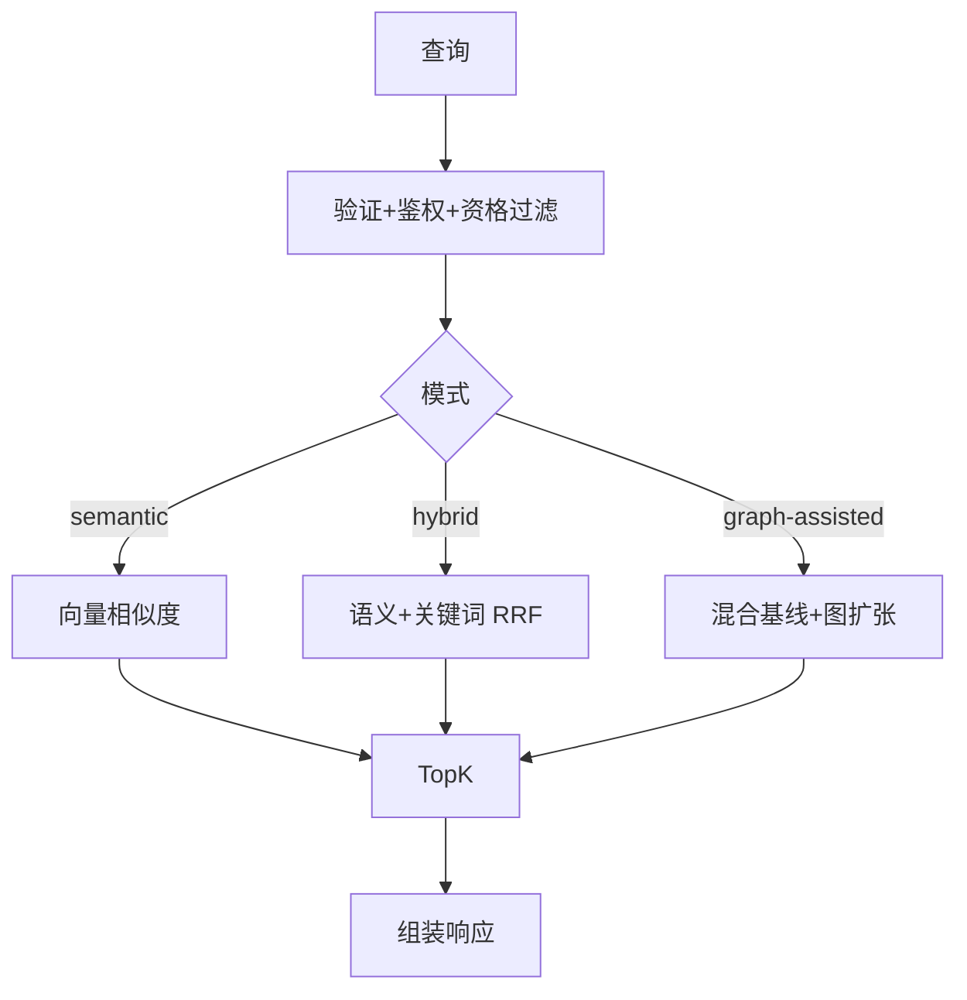

# 检索系统

> 真源：`packages/service-knowledge-read` 与 `packages/contracts/src/domain/retrieval.ts`；图索引真相在 `packages/db/src/schema/retrieval.ts` 与 `packages/db/src/schema/knowledge.ts`。状态：Active。

## 设计灵感

本检索系统的两个近期演进直接以论文为出发点：

- **Experience Gene 检索（gene-native）** — 论文 *From Procedural Skills to Strategy Genes: Towards Experience-Driven Test-Time Evolution*（HTML: https://arxiv.org/html/2604.15097v2 · ABS: https://arxiv.org/abs/2604.15097）。该文证明：文档型 Skill（~2500 tokens, -1.1pp）的控制信号稀疏，而紧凑的 control-oriented Gene（~230 tokens, +3.0pp, 45 scenarios / 4590 trials，`g=(m,u,π,α,c,v)`）更利于 test-time 控制。TrapMap 将其 1:1 落为 `ExperienceGene{ signalsMatch=m, summary=u, strategy=π, avoid=α, constraints=c, validation=v }`（`packages/contracts/src/domain/experience-gene.ts`），经 `trap / skill-artifact(bounded 16k) / skill-capsule` 三源派生，以 `gene-native` 投影独立于 `RetrievalMatch / SkillCapsule` 检索池提供 `POST /v1/retrieval/genes/search`（`off|shadow|serve`）与 `<strategy-gene>` 注入块（`packages/lib/src/strategy-gene.ts`）。主线已归档（`git show ec0e4c99:docs/archived/archived-plans/experience-gene-program-mainline-archived.md`）；现行契约见 `packages/contracts/src/domain/experience-gene.ts`，存储见 `packages/db/src/schema/experience-genes.ts`，评测见 `evals/experience-gene/`。
- **v3 Trap-First Plan 图编排 / ExecutionPlan** — 论文 *GraSP (arXiv:2604.17870, PDF: https://arxiv.org/pdf/2604.17870)* 的 DAG 编译（`state / data / order` 边）与 *SkillGraph (2605.12039)* 的 `R_ret = TopoSort(...)` 拓扑排序。TrapMap 在 `TrapFirstPlan` 中新增 `executionPlan: ExecutionStep[]`（`packages/contracts/src/domain/plans.ts`），由 `plan-compiler.ts` 的 `buildExecutionPlan()` 对 `mitigates / requires / order` 边执行 Kahn 排序，输出 `{ rank, nodeId, label, kind:trap-mitigation|skill, blockedBy }`，供 CLI/MCP 直接消费；详见 `docs/superpowers/plans/2026-05-25-topological-execution-plan.md`。

## 路由对照

对外与内部路径的逐条对照见 [TrapMap API 契约表面](../../reference/api-surface.md)。实现落点：对外在 `packages/host-distributed/src/gateway/route-defs/knowledge.ts`，内部在 `packages/service-knowledge-read/src/routes.ts`。`POST /v1/retrieval/genes/search` 未在 gateway route-defs 中出现，标未知/待确认（2026-09-08）。

统一调度内核是 `retrieval-orchestration.ts` 与 `retrieval-recall-coordinator.ts`。

### 四路管道（2026-09-19 起四路均已独立实现）

四条路径由同一条经验条目管道分化而来，`RetrievalQueryPort.searchCapsules` / `RetrievalSearchParams.variant` 决定走哪一条：

| 路径 | 实现 | 池 | 通道 |
|---|---|---|---|
| `/v1/retrieval/search` | `search-knowledge.ts`（`searchKnowledge`） | 知识条目 + skill artifact 视图 | keyword / semantic / graph（按 mode） |
| `/v1/retrieval/skills/search-by-content` | `server-retrieval-seam.ts`（`createKnowledgeReadSkillLookupQuery`） | 同上，+ artifact 元数据回填 | 同上 |
| `/v2/retrieval/search` | `search/search-v2.ts` + `search/capsule-recall.ts` | `skill_artifact_capsules` | keyword（全文）/ semantic（pgvector）/ heuristic（进程内规则） |
| `/v3/retrieval/search` | `search/search-v3-plan.ts`（强制 `mode='graph-assisted'`） | 知识条目 + 图扩张 | keyword / semantic / **graph** |

`variant` 与 `latencyEndpoint` 是内部字段：由 gateway 在调用点写入，内部 hop 原样透传（`retrievalInternalSearchBodySchema`），公开请求体 `retrievalSearchBodySchema` 不含它们，客户端无法选择管道或伪造指标标签。

## v1 模式

| 模式 | 召回 | 算法 |
|---|---|---|
| `semantic` | 向量 | embedding 余弦 |
| `hybrid` | 向量 + 关键词 | embedding + BM25 → RRF 融合 |
| `graph-assisted` | 基线 + 图邻域 | + `GraphQueryBackend` local-neighborhood |

图约束：`graph_index_documents` 为真相；`GraphQueryBackend` 只做 query-time 扩张；`memory (graphology)` / `neo4j` 可切换，fail-open 回 `memory`；`routingTrace.graphRetrieval` 记录 `mergeMode: mixed` 与 backend 状态。



## v2 胶囊检索

> **实现状态（2026-09-19）**：原胶囊管道随已删除的 `packages/server`（Wave-10 退役）一并消失，`MIN_CAPSULE_SCORE` 与胶囊评分器均无留存实现。现行实现是 `search/capsule-recall.ts` + `search/capsule-scoring.ts`，**按本文档记载的权重重新实现**，不是原实现的复原；文档未固定的部分（RRF 的 k 值、内容分与融合分的混合比例）已在代码注释中逐条标注为判断而非事实。

| 通道 | 实现 | 职责 |
|---|---|---|
| `semantic` | `capsule-recall.ts:semanticCapsuleChannel` | pgvector 检索 `skill_artifact_capsule_embeddings` |
| `keyword` | `capsule-recall.ts:keywordCapsuleChannel` | PostgreSQL 全文检索（`to_tsvector @@ plainto_tsquery` + `ts_rank`） |
| `heuristic` | `capsule-recall.ts:heuristicCapsuleChannel` | 进程内规则评分，向量索引为空时的保底 |

三通道经 `Promise.all` 并行，RRF（`Σ 1/(k+rank)`，k=60）融合，再按五个维度加权重排：problem 0.30 / situation 0.21 / goal 0.17 / keyword 0.17 / contextualPrefix 0.15。`finalScore = 0.7 × 内容分 + 0.3 × 归一化融合分`，低于 `TRAPMAP_MIN_CAPSULE_SCORE`（默认 0.15）的候选被剔除；未被任何通道召回的候选无论内容分多高都不会出现。

**表结构事实**：`packages/db/src/schema/artifacts.ts` 声明了 `keyword_tokens` / `field_keyword_tokens` / `team_id` 三列，但实际生效的 `packages/db/migrations/schema.sql` 里都没有，写入侧也从不写它们。因此词法通道走全文检索表达式而非预分词列，团队治理继承自 artifact 根表（`art.team_id`）。

## v3 陷阱优先图计划（灵感：GraSP arXiv:2604.17870 + SkillGraph 2605.12039）

> **实现状态（2026-09-19）**：v3 已实现为真正的图计划管线，返回 `GraphPlanSearchResponse`（`plan` + `fallback`）——`trapmap load` 与 retrieval eval 的 v3 切片消费的正是这个形状。

**管线**（`search/search-v3-plan.ts` 的 `searchV3`）：

1. 查询标签 → `GraphQueryBackend.expandSourcesOneHop` / `getSourceNodeIds` / `buildLocalExpansionView` 做图扩张；
2. 从扩张视图提取 trap / skill 节点（按查询 token 覆盖率打分），边按 plan 词汇表过滤；
3. Kahn 拓扑排序编译 `executionPlan`（`backend-core/src/knowledge-read/domain/graph-plan.ts:compileExecutionPlan`）；
4. 置信度 = 0.4×trap 证据 + 0.3×skill 证据 + 0.3×缓解链路（饱和点 3，判断值已在代码标注）；
5. 门控：`trapCount=0` → `graph-plan-insufficient-trap-evidence`；`skillCount=0` → `...-skill-evidence`；`confidence < 0.5` → `graph-plan-low-confidence`；编译异常 → `graph-plan-compilation-failed`；其余 → `graph-plan-selected`。未选中时按 `fallbackMode`（auto = entry）走 `v1-graph-assisted` 或 `v2-capsule` 的治理回退。

**边方向约定**（判断值，代码内标注）：graph 数据里 `mitigates` 存为 skill→trap，trap 缓解步骤先于受益 skill；`requires` 是"被依赖者先行"；`order` 按书写方向。环无法拒绝（图来自抽取），剩余节点带 `blockedBy` 原样输出。

**评测现状**：eval 组装服务器（`scripts/testing/postgres-server-composition.ts`）已注册 `/v2` `/v3` 路由，v2/v3 用例真实可达；retrieval eval 通过数 5→7。剩余失败是 fixture 期望按已退役原管线的排序行为编写，属评测调优，不是接线问题。

`graph-llm-extract.ts` 做 LLM 抽取，`response-summary.ts` 做摘要组装。

## 延迟可观测

两个切分维度共用一套指标：`endpoint`（四路）与 `channel`（四通道），加一个 `stage` 维度做管道分解。

- 契约枚举：`packages/contracts/src/enum-types/retrieval-latency.ts`；聚合形状：`packages/contracts/src/domain/retrieval-latency.ts`（`summarizeLatency` 是唯一的百分位实现）。
- Port：`RetrievalMetricsPort`（`packages/backend-core/src/ports/retrieval-metrics-ports.ts`），host-local 出 Prometheus、host-distributed 出 OTel，均可选注入。
- 打点：阶段在 `search-knowledge.ts:timedStep`，通道在 `recall/*-channel.ts` 的 `timedChannel`。通道三路并发执行，所以 `recall` 阶段耗时 ≈ 最慢通道，不等于各通道之和。
- 退役维度：`v2-capsule` 与 `channel="heuristic"` 恒为 0（`/v2/retrieval/search` 无宿主注册，`heuristic` 随已删除的 `packages/server` 退役）。
- 离线基线：`pnpm retrieval:latency:bench`，产物在 `benchmarks/retrieval-latency/`。DB 召回分支在无连接池时不激活，结果是 CPU 下限而非服务 SLO。

## 意图解析

`intent-recognition` 端口在 `packages/backend-core/src/ports/intent-ports.ts`，规则实现在 `service-knowledge-read/src/intent-recognition/`：先 regex，失败走 LLM（至多 3 次，退避 100 / 400ms），内部字段 `category / semanticQuery / parseMethod`；进程内 LRU 缓存 200 条、TTL 30min，只缓存 LLM 结果；胶囊语义通道优先用 `intent.semanticQuery`。

## 响应组装与追踪

组装链为 `response-assembly.ts` / `response-citations.ts` / `response-refinement.ts` / `response-summary.ts`。`routingTrace` 记录 `provider/confidence/fallback`、图 backend 状态、`channelsPlanned/channelsUsed/mergeStats`。

## 性能

- Embedding 缓存：`LRU 1000 / 5min`，按 `hash(text)` 命中；批嵌入缺省 `batchSize=100`。
- 向量：PostgreSQL `pgvector HNSW`（`knowledge_embeddings`、`skill_artifact_capsule_embeddings`）；全文 `tsvector + GIN`；低频 `jsonb + GIN`。
- 失败隔离：单通道失败返回空数组，不阻断整体检索。
- 批量阈值见 [评估框架](EVALUATION.md) 性能节。

## 契约

请求 / 响应 Zod 在 `packages/contracts/src/domain/retrieval.ts`（`retrievalQueryModeSchema`、`retrievalStrategySchema` 等）。空结果契约与阈值调优见 rerank 与 orchestrator 的 `threshold-gate` trace。

## 常见用法

### 你跑检索冒烟（dry-run）

前置条件：依赖已装；不打活服务。

```bash
pnpm --filter @trapmap/evals eval:retrieval:dry-run
```

脚本定义在 `evals/package.json:34`。

### 你跑检索冒烟（活服务）

前置条件：目标服务运行中，PG 可达。

```bash
pnpm --filter @trapmap/evals eval:retrieval:smoke
```

用例结构与跑法前置见 [评估框架](EVALUATION.md)「评估类型」「跑法」两节。

### 你用 CLI 发起检索

前置条件：gateway 运行中。

```bash
trapmap retrieval --help
```

实现落点见本页「路由对照」节；逐条路径见 [TrapMap API 契约表面](../../reference/api-surface.md)。
