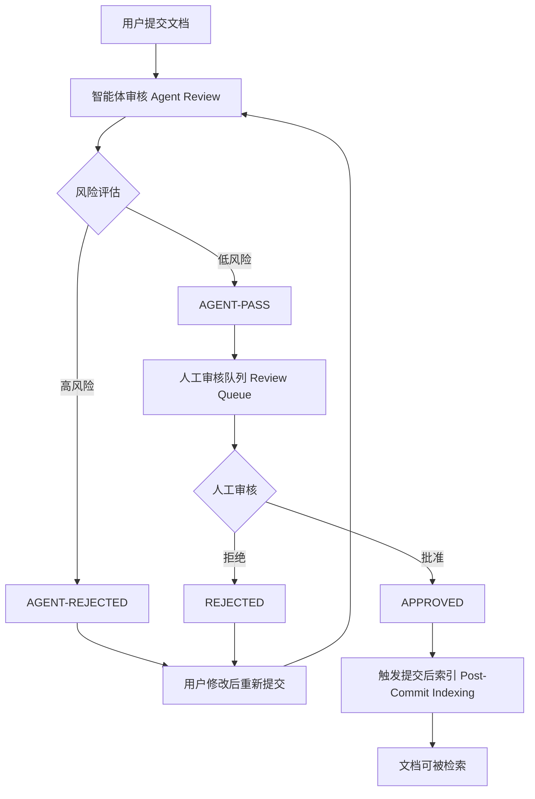
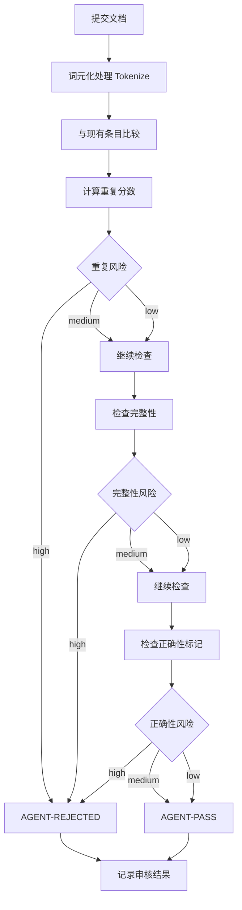
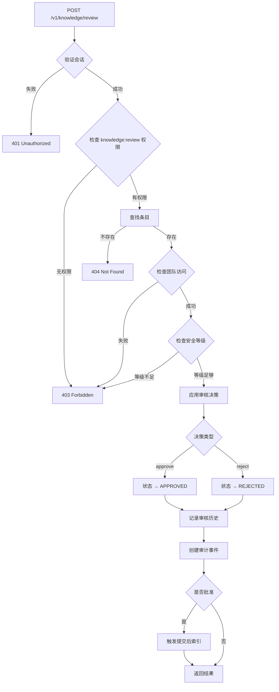
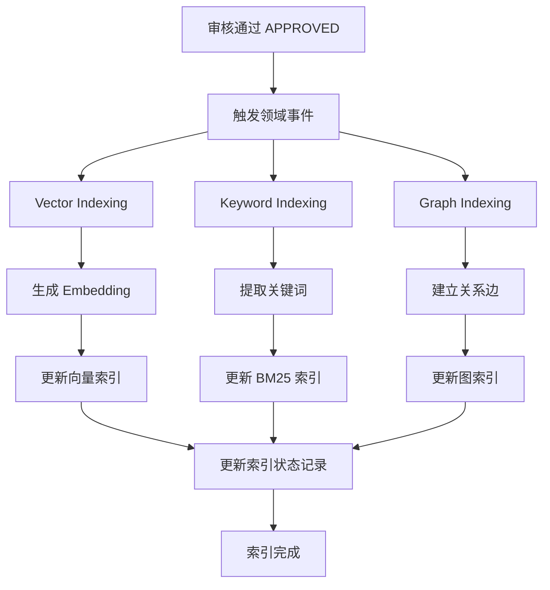
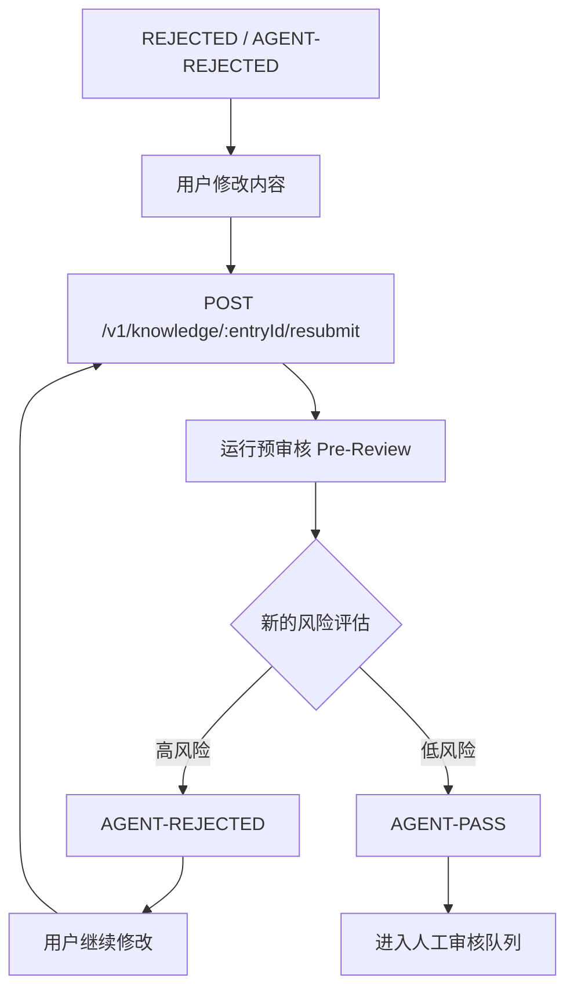

# 文档审批流程 (Review Flow)

## 概述

TrapMap 的文档审批流程采用两阶段审核机制：先由智能体进行自动化风险评估，再由人工审核者进行最终审批。这种设计确保了知识条目的质量和安全性。

## 审批流程概览



## 智能体审核 (Agent Review)

### 审核维度

智能体审核从三个维度评估提交内容：

| 维度 | 评估内容 | 风险等级 |
|------|---------|---------|
| **重复风险** (duplicateRisk) | 与现有条目的相似度 | low / medium / high |
| **完整性风险** (completenessRisk) | 内容长度和标签数量 | low / medium / high |
| **正确性风险** (correctnessRisk) | 证据标记和解释质量 | low / medium / high |

### 风险阈值判断

```typescript
// 风险评分阈值
function toRisk(score: number): 'low' | 'medium' | 'high' {
  if (score >= 0.72) return 'high';
  if (score >= 0.38) return 'medium';
  return 'low';
}

// 智能体拒绝条件
const isRejected = duplicateRisk === 'high' || completenessRisk === 'high';
```

### 重复检测算法

```typescript
// 词元重叠度计算
function overlapScore(a: Set<string>, b: Set<string>): number {
  if (a.size === 0 || b.size === 0) return 0;
  
  let shared = 0;
  for (const token of a) {
    if (b.has(token)) shared += 1;
  }
  
  return shared / new Set([...a, ...b]).size;
}
```

### 完整性检查

```typescript
function completenessRisk(submission): 'low' | 'medium' | 'high' {
  const detailLength = submission.detail.trim().length;
  
  if (detailLength < 80 || submission.labels.length < 1) return 'high';
  if (detailLength < 160 || submission.labels.length < 2) return 'medium';
  return 'low';
}
```

### 正确性检查

```typescript
function correctnessRisk(submission): 'low' | 'medium' | 'high' {
  const detail = submission.detail.toLowerCase();
  const evidenceTerms = ['because', 'fix', 'root cause', 'verify', 'caused by', 'solution'];
  const found = evidenceTerms.filter(term => detail.includes(term)).length;
  
  if (found >= 3) return 'low';
  if (found >= 1) return 'medium';
  return 'high';
}
```

### 智能体审核流程图



### 智能体审核结果结构

```typescript
interface AgentReviewResult {
  status: 'agent-pass' | 'agent-rejected';
  duplicateRisk: 'low' | 'medium' | 'high';
  completenessRisk: 'low' | 'medium' | 'high';
  correctnessRisk: 'low' | 'medium' | 'high';
  checkedAt: string;
  notes: string[];
  boundary?: Boundary | null;
}
```

## 人工审核 (Human Review)

### 审核队列

审核者可通过 `/v1/knowledge/review-queue` 获取待审核条目列表：

```typescript
// 审核队列过滤规则
const filteredEntries = allEntries.filter(entry => {
  // 团队访问检查
  if (entry.teamId && auth.subjectType !== 'system-admin') {
    requireTeamAccess(auth, entry.teamId);
  }
  
  // 安全等级检查
  if (auth.subjectType !== 'system-admin' && auth.securityLevel <= entry.requiredLevel) {
    return false;
  }
  
  // 状态过滤（可选）
  return rawQuery.status ? entry.lifecycleState === rawQuery.status : true;
});
```

### 审核决策

审核者通过 `/v1/knowledge/review` 提交审核决策：

```typescript
interface ReviewDecisionRequest {
  entryId: EntityId;
  decision: 'approve' | 'reject';
  notes: string;
  evidence?: EvidenceMeta;
  boundary?: Boundary | null;
}
```

### 审核流程图



### 审核决策应用

```typescript
function applyReviewDecision(args: {
  entry: KnowledgeRecord;
  reviewerUserId: string;
  decidedAt: string;
  decision: 'approve' | 'reject';
  notes: string;
  evidence?: EvidenceMeta;
}): KnowledgeRecord {
  // 创建审核决策记录
  const reviewDecision: KnowledgeReviewDecisionRecord = {
    decidedAt: args.decidedAt,
    decidedByUserId: args.reviewerUserId,
    decision: args.decision,
    notes: args.notes,
  };
  
  // 更新条目状态
  transitionLifecycleState(
    args.entry,
    args.decision === 'approve' ? 'approved' : 'rejected',
    'review decision'
  );
  
  // 批准时保存证据元数据
  if (args.decision === 'approve') {
    args.entry.evidenceMeta = args.evidence ?? createDefaultEvidenceMeta(
      args.decidedAt,
      reviewerActorRef
    );
  }
  
  // 记录审核历史
  args.entry.reviewHistory.push(reviewDecision);
  
  return args.entry;
}
```

## 审核历史记录

每个条目维护完整的审核历史：

```typescript
interface ReviewRecord {
  id: EntityId;
  entryId: EntityId;
  decision: 'approved' | 'rejected';
  notes: string;
  reviewedBy: ActorRef;
  reviewedAt: string;
  previousState: LifecycleState;
  newState: LifecycleState;
  evidence?: EvidenceMeta;
}
```

### 审核历史追加规则

1. 每次状态转换创建新的 ReviewRecord
2. 记录 previousState 和 newState 以支持审计
3. Agent 审核和人工审核分别记录
4. 审核备注必须提供（notes 字段必填）

## 提交后索引 (Post-Commit Indexing)

审核通过后，系统自动触发索引更新：



### 索引状态跟踪

```typescript
interface KnowledgeIndexStateRecord {
  entryId: EntityId;
  adapters: {
    [adapterName: string]: {
      status: 'pending' | 'synced' | 'failed';
      indexedAt?: string;
      error?: string;
    };
  };
  lastReconciledAt?: string;
}
```

## 重新提交流程 (Resubmit)

被拒绝的条目可通过重新提交进入审核循环：



### 重新提交验证

```typescript
// 重新提交的状态检查
if (!['rejected', 'agent-rejected'].includes(entry.lifecycleState)) {
  throw new AppError(400, 'invalid_state', 'Only rejected entries may be resubmitted');
}

// 所有者检查
if (entry.ownerUserId !== ownerUserId) {
  throw new AppError(403, 'forbidden', 'Only the original submitter may resubmit');
}
```

## 权限矩阵

| 操作 | 所需权限 | 安全等级要求 | 其他要求 |
|------|---------|-------------|---------|
| 提交文档 | knowledge:submit | - | 真实用户账户 |
| 查看审核队列 | knowledge:review | > entry.requiredLevel | 团队访问 |
| 审核决策 | knowledge:review | > entry.requiredLevel | 真实用户账户 |
| 重新提交 | knowledge:submit | - | 仅被拒绝条目 |

## 审计事件

审批流程产生的审计事件：

```typescript
type ReviewAuditEvent =
  | { type: 'knowledge.submitted'; actorId: EntityId; entryId: EntityId }
  | { type: 'knowledge.agent-passed'; entryId: EntityId }
  | { type: 'knowledge.agent-rejected'; entryId: EntityId; reason: string }
  | { type: 'knowledge.approved'; actorId: EntityId; entryId: EntityId }
  | { type: 'knowledge.rejected'; actorId: EntityId; entryId: EntityId; notes: string }
  | { type: 'knowledge.resubmitted'; actorId: EntityId; entryId: EntityId }
  | { type: 'knowledge-reviewed'; actorId: EntityId; entryId: EntityId; decision: string };
```

## 状态转换矩阵

| 当前状态 | 触发条件 | 下一状态 | 必需权限 |
|---------|---------|---------|---------|
| DRAFT | submit() | SUBMITTED | knowledge:submit |
| SUBMITTED | Agent 审核完成 | AGENT-PASS / AGENT-REJECTED | SYSTEM |
| AGENT-PASS | 人工批准 | APPROVED | knowledge:review |
| AGENT-PASS | 人工拒绝 | REJECTED | knowledge:review |
| AGENT-REJECTED | resubmit() | SUBMITTED | knowledge:submit |
| REJECTED | resubmit() | SUBMITTED | knowledge:submit |
| APPROVED | deactivate() | DEACTIVATED | knowledge:update |

## 参考文档

- [知识生命周期](KNOWLEDGE_LIFECYCLE.md)
- [治理模型](GOVERNANCE.md)
- [异步摄取管道](INGESTION.md)

## 相关源码

- [packages/server/src/routes/review.ts](../../packages/server/src/routes/review.ts)
- [packages/server/src/lib/pre-review.ts](../../packages/server/src/lib/pre-review.ts)
- [packages/server/src/lib/knowledge.ts](../../packages/server/src/lib/knowledge.ts)
- [packages/server/src/lib/lifecycle/state-machine.ts](../../packages/server/src/lib/lifecycle/state-machine.ts)
