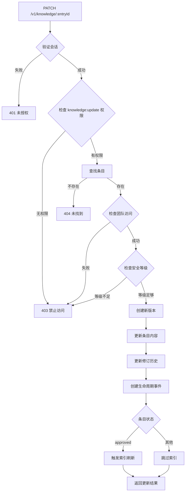
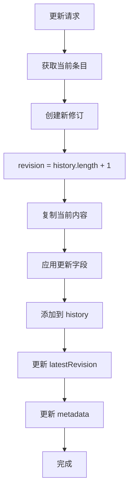
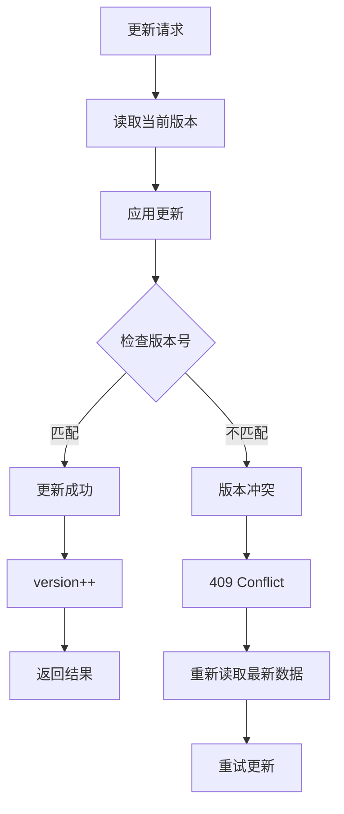
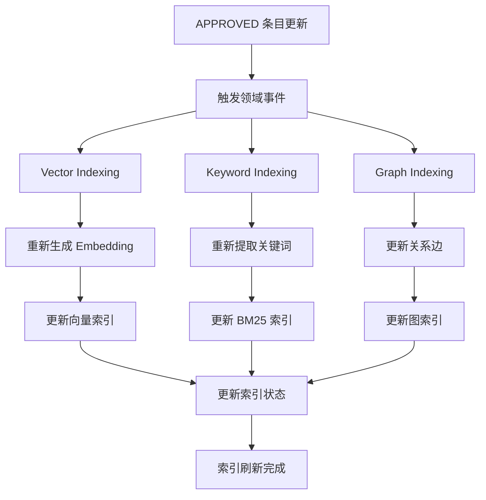
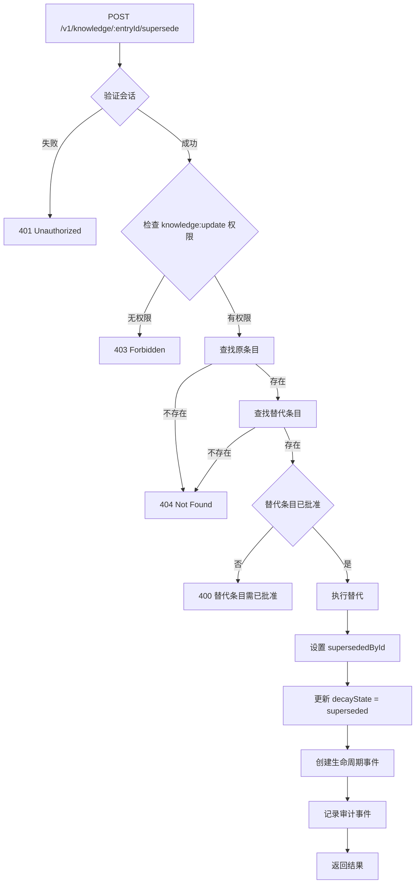

# 文档更新流程 (Update Flow)

## 概述

TrapMap 的文档更新流程允许授权用户修改现有知识条目的内容。更新操作受到严格的权限控制，并维护完整的修订历史。更新后的条目可能需要重新审核，具体取决于当前生命周期状态。

## 更新流程概览



## 权限验证

### 权限检查

```typescript
// 基本权限检查
requirePermission(auth, 'knowledge:update');

// 团队访问检查
if (entry.teamId) {
  requireTeamAccess(auth, entry.teamId);
}

// 安全等级检查
requireHigherLevel(auth, entry.requiredLevel, payload.requiredLevel ?? entry.requiredLevel);
```

### 权限矩阵

| 操作 | 所需权限 | 安全等级要求 | 其他要求 |
|------|---------|-------------|---------|
| 更新内容 | knowledge:update | >= entry.requiredLevel | 团队访问 |
| 更新安全等级 | knowledge:update | > 新 requiredLevel | 不能降低等级 |
| 更新团队作用域 | knowledge:update | 团队访问 | 活动团队 |

## 更新内容

### API 端点

```typescript
// PATCH /v1/knowledge/:entryId
interface KnowledgeUpdateRequest {
  entryId: EntityId;
  labels?: string[];
  shortcut?: string;
  detail?: string;
  requiredLevel?: number;
}
```

### 更新字段

| 字段 | 类型 | 描述 | 限制 |
|------|------|------|------|
| labels | string[] | 标签列表 | 可选 |
| shortcut | string | 标题/摘要 | 可选 |
| detail | string | 详细内容 | 可选 |
| requiredLevel | number | 安全等级 | 不能高于用户等级 |

## 修订历史

### 修订记录结构

```typescript
interface KnowledgeRevisionRecord {
  revision: number;
  submittedAt: string;
  submittedByUserId: string;
  shortcut: string;
  detail: string;
  labels: string[];
  reviewNotes: KnowledgeReviewNoteRecord[];
}
```

### 修订历史追加规则

1. 每次更新创建新的修订记录
2. 修订号递增（history.length + 1）
3. 记录修改者和时间
4. 保留完整内容快照

### 修订历史流程图



## 乐观锁机制

### 版本控制

```typescript
interface KnowledgeRecord {
  // ... other fields
  version: number;  // 每次更新递增
}
```

### 并发冲突处理

```typescript
// 更新时检查版本
await store.updateKnowledgeEntry(id, updates, {
  expectedVersion: currentVersion
});

// 版本不匹配时抛出异常
if (result.rowCount === 0) {
  throw new OptimisticLockError(id);
}
```

### 乐观锁流程图



## 索引刷新

### 触发条件

只有 APPROVED 状态的条目更新后才触发索引刷新：

```typescript
// 索引刷新检查
if (previousState === 'approved' && nextState === 'approved') {
  // 触发索引刷新
  await app.skillShareer.eventBus.emitDomainEventAsync({
    name: 'knowledge.updated',
    entryId,
    previousState,
    nextState,
    actorId: auth.actorId,
    reason: 'updated',
    timestamp: nowIso(),
  });
}
```

### 索引刷新流程



## 替代机制 (Supersede)

### 替代流程

替代机制用于用新条目替换旧条目：



### 替代实现

```typescript
function supersedeEntry(args: {
  store: SkillShareerStore;
  data: StoreData;
  entryId: EntityId;
  replacementId: EntityId;
  actorId: EntityId;
}): KnowledgeRecord {
  const entry = data.knowledgeEntries.find(e => e.id === entryId);
  const replacement = data.knowledgeEntries.find(e => e.id === replacementId);
  
  if (!entry || !replacement) {
    throw new AppError(404, 'entry_not_found', 'Entry not found');
  }
  
  if (replacement.lifecycleState !== 'approved') {
    throw new AppError(400, 'invalid_state', 'Replacement must be approved');
  }
  
  // 更新衰减元数据
  entry.decayMeta = {
    lastVerifiedAt: entry.decayMeta?.lastVerifiedAt ?? entry.updatedAt,
    decayState: 'superseded',
    supersededById: replacementId,
    decayStateComputedAt: nowIso(),
    freshnessType: entry.decayMeta?.freshnessType ?? 'evergreen',
  };
  
  // 创建生命周期事件
  const event: KnowledgeLifecycleEventRecord = {
    id: store.nextId(data, 'evt'),
    type: 'superseded',
    createdAt: nowIso(),
    actorUserId: args.actorId,
    submissionId: null,
    revision: null,
    state: entry.lifecycleState,
    note: `Superseded by ${replacementId}`,
  };
  entry.lifecycleHistory.push(event);
  
  return entry;
}
```

## 更新与重新提交的区别

| 特性 | 更新 (Update) | 重新提交 (Resubmit) |
|------|--------------|-------------------|
| **适用状态** | 任何状态 | 仅 REJECTED / AGENT-REJECTED |
| **权限要求** | knowledge:update | knowledge:submit |
| **审核流程** | 不需要重新审核 | 需要重新审核 |
| **修订历史** | 创建新修订 | 创建新提交记录 |
| **索引影响** | APPROVED 状态触发刷新 | 不触发索引 |
| **状态转换** | 不改变生命周期状态 | 改变生命周期状态 |

## 审计事件

更新流程产生的审计事件：

```typescript
type UpdateAuditEvent =
  | { type: 'knowledge.updated'; actorId: EntityId; entryId: EntityId }
  | { type: 'knowledge.superseded'; actorId: EntityId; entryId: EntityId; replacementId: EntityId }
  | { type: 'knowledge.revision-created'; actorId: EntityId; entryId: EntityId; revision: number };
```

## 用户操作日志

```typescript
// 更新操作日志
void logUserOperation(app.skillShareer.config.userOpsLog, {
  timestamp: nowIso(),
  actorId: auth.actorId,
  actorHandle: auth.handle,
  action: 'edit',
  targetId: entryId,
  teamId: auth.activeTeamId,
  metadata: { endpoint: 'update', scope: updatedEntry.scope, labels: payload.labels },
});
```

## 参考文档

- [知识生命周期](KNOWLEDGE_LIFECYCLE.md)
- [淘汰机制](DECAY.md)
- [治理模型](GOVERNANCE.md)

## 相关源码

- [packages/server/src/routes/knowledge.ts](../../packages/server/src/routes/knowledge.ts)
- [packages/server/src/lib/knowledge.ts](../../packages/server/src/lib/knowledge.ts)
- [packages/server/src/lib/decay/supersede.ts](../../packages/server/src/lib/decay/supersede.ts)
- [packages/server/src/lib/lifecycle/state-machine.ts](../../packages/server/src/lib/lifecycle/state-machine.ts)
