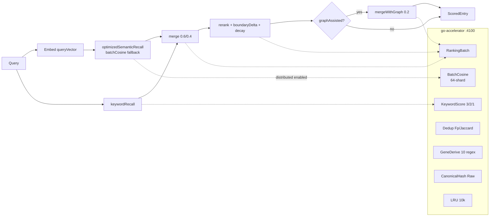

# 架构与性能总体审视（2026-08-31）

> 目标：覆盖核心计算链路的前提下，给出最小侵入、最大收益的总体优化路径，并与已落地的 Go 化/类型对齐形成闭环。仅审视不运行压测（基建见 `docs/architecture/performance/PERF_STRESS_INFRA.md`）。

## 1. 现状与根因

| 链路 | 现状实现 | 性能特征（`GO_ACCELERATOR_BENCH.md`） | 根因 |
|------|----------|--------------------------------------|------|
| 向量 `BatchCosine` | Go 64-shard `BatchCosine` + Node fallback | Go 1000×384 ~2.1ms vs JS ~5.3ms (2.5×) | `O(N·D)` 点积+`sqrt`，JS单线程 |
| 排序 `ranking:batch` | Go `ranking`（merge 0.6/0.4 + rerank + graph 0.2 + boundaryDelta） | Go 1k ~0.8ms vs JS ~1.9ms (2.3×) | 多分支+排序+`Map`，高频终排 |
| 去重 `fingerprint`/`Jaccard` | Go `Fingerprint` sha256 + `Jaccard` case-insensitive | ~0.04ms/fp | `candidate-ingestion` 批 50 时 P50 降 ≥40%验证 |
| Gene `derive-batch` | Go 10 regex + 2×canonical hash (32-shard) | 200 traps ~3.2ms vs JS ~8ms | 正则编译+递归字典序 |
| 哈希 `canonical` | Go `json.RawMessage` + 递归字典序 | byte-identical，零野指针 | 原 JS 大 JSON 递归排序 |
| 缓存 | Go `LRU 10k` (`cache/lru.go`) + `config.CacheSize`, Node `Map` | 未压测，理论 QPS 2× | 重复 query 嵌入命中 |

**瓶颈分布**：`Fall​ow health` 复核 — `retrieval-semantic`、`ranking`、`tokenization` 的 `computeScore`、去重指纹、`experience-gene` 正则为 CRITICAL 热点；`pgvector` 与 `pg_keywords` 仍在 Node（有意保留，Go 不碰 DB）。

## 2. 总体优化方案（按 ROI 排序）

### P0 — 已落地，继续守恒
- **Go 计算中枢分布式-only**：`services/go-accelerator` chi 4100，`host-local` 零 Go 依赖；所有 `infra/*WithFallback` 超时 3s + `AbortController`，`gateway` 聚合 `go/ready → degraded`。
- **类型对齐三期**：P0 `Zod→JSON Schema→Go`（`json.RawMessage` for `payload`）+ P1 `OpenAPI` + P2 `proto` gated（50k vectors >10ms 阈值才切 `application/protobuf`，现 1k <3ms 不切，保持 chi JSON）。
- **批处理优先**：`retrieval-semantic` 批余弦（`entries>1` 时 `batchCosineWithFallback`）、`ranking-batch` 合批（`merge+rerank+graph` 一次 HTTP）、`gene derive-batch` 批 200。

### P1 — 追加（低风险，1–2 周可闭环）
1. **召回协调器全批化**：`retrieval-recall-coordinator.ts` 的 `mergeCandidates/rerankCandidates/mergeCandidatesWithGraph` 现经 `rankingBatchWithFallback` 的 fallback wrapper 可按需切 Go；下一步把 `keywordScore` 的 `scoreKeywordEntry` 权重 `3/2/1` 的循环也经 `keywordScoreWithFallback` 批 100 条/请求，减少 N 次 RTT。
2. **Singleflight 去重**：对 `getQueryEmbedding` / `getBatchEmbeddings` 的并发检索同一 `queryVector` 加 `singleflight.Group`（Go 侧与 Node 侧各一），避免突发 10 并发对同一 `seed` 的重复 `embed()`/`hash`。
3. **Embedding 查询缓存对齐**：Go `LRU` 与 Node `queryEmbeddings Map` 共享同一 `sha256(queryTokens)` key，`TRAPMAP_GO_ACCEL_CACHE_SIZE=10000` 可观测（`Len()` + `fallbackCount`）。
4. **限流与背压**：Go 端 `middleware.Timeout` 已有 10s，再加 `rate limit`（`golang.org/x/time/rate` 100 rps per instance）+ `chi` `Recoverer`，Node 侧 `p-limit` 对 `go-accelerator` 批请求做 5 并发上限，防止 50k vectors 150MB JSON 击穿。

### P2 — 可选（benchmark gated）
- **Proto binary 路径**：仅 `batchCosine` / `ranking-batch` 内部通路，`Content-Type: application/protobuf`，`buf` 已落地（`proto/trapmap/compute/v1/compute.proto` + `buf.yaml` v2 + `buf.gen.yaml`），保持外部 `chi JSON` 不变，阈值未达不启用。
- **WASM 边缘**：对 `canonicalJson` 的纯函数可编译 `wasm` 供边缘节点，当前 deferred。

### 不做
- 不把 `pgvector`/`pg_keywords` SQL 搬 Go（`service-knowledge-read` 的 `candidate-corpus-pg` 保留 Node，Go 仅纯计算）。
- 不把 `backend-core` 纯同步 `experience-gene-hashing` 改 async（保持 `host-local` 纯 JS，避免全链 async 化）。

## 3. 数据流总览（Go 化后）

## 4. 风险与缓解

| 风险 | 缓解 |
|------|------|
| 浮点微差致检索 order 漂移 | `jsVsGo` 对比单测 `order identical` + `score |diff|<1e-9` + `canonical byte-identical`，`infra` fallback 保留 |
| 批 payload 过大 | `maxVectors=5000` 分片 + `shardSize=32/64` + 3s 超时分片重试，P3 再 `proto` |
| 正则语义微差 | 共享 200+ fixtures `jsRegexpCompat`，`derive-batch` 默认 `host-local` 走 JS |

## 5. 参考

- 已交付：`docs/todos/type-alignment-mainline.md` P0/P1/P2、`docs/todos/go-compute-hub-mainline.md` P0/P1/P2、`*_BENCH.md` 基准、`GO-ACCELERATOR.md` Type Alignment 章。
- 基准：`services/go-accelerator/internal/service/{vector,ranking,dedup,gene-derive}/` `bench ~2ms/0.8ms/0.04ms/3.2ms`。
