# TrapMap 架构探针报告 — 两阶段 subagent 无观点发散收敛

> **方法：** 第一阶段不注入任何观点，7 探针并行广度扫描各 10-12 条，计 68 条原始入手点；第二阶段同角度各 2-3 探针深研“可改哪些”，计 20 份深研意见，合并去重后得本清单。  
> **探针隔离：** 每探针仅读现场文件（`packages/*`, `services/*`, `docs/*`, `scripts/*`, `docker-compose.yml`, `.fallowrc.json`），互不复述观点。  
> **关联主线：** 本报告为 [`architecture-remediation-mainline.md`](architecture-remediation-mainline.md) 的输入证据，清单项已映射至 P1-P7。

## 探针拓扑

```mermaid
flowchart LR
  subgraph Phase1[Phase 1 广度 · 7探针并行]
    A[Probe A 结构/边界]
    B[Probe B 持久化/索引]
    C[Probe C 检索/知识读]
    D[Probe D Go/Infra]
    E[Probe E 契约/类型]
    F[Probe F 宿主/可观测/部署]
    G[Probe G 客户端/技能]
  end
  subgraph Phase2[Phase 2 深度 · 同角度 2-3 探针]
    A1[A1/A2/A3]
    B1[B1/B2/B3]
    C1[C1/C2/C3]
    D1[D1/D2/D3]
    E1[E1/E2/E3]
    F1[F1/F2/F3]
    G1[G1/G2]
  end
  Phase1 --> Phase2 --> List[去重改进清单 38 项]
  List --> Mainline[Remediation P0-P8]
```

## Phase 1 去重后大改进清单（38 项 · 按入手法归类）

### A 结构与边界（7）
1. **宿主 God Composition** — `AppModule.forRuntime` 集中 6 上下文 + 6 可观测，改一域触全宿主
2. **适配器集中** — `backend-core-adapters.ts 360` + `runtime/*.ts 1638` Profile 分支
3. **网关薄层仍厚** — `gateway.route-defs.ts 291` / `host-distributed/route-defs 1460` / `internal-client 1307`
4. **阈值绕过** — `// fallow-ignore-file` 在 governance-review 头部
5. **assembly 未全量** — `assembly` zone 已定义但 distributed 未全经 assembly
6. **DB 定义集中** — `db/schema knowledge 560 + artifacts 449` 单文件过载，Owner-Local 假象
7. **契约单体** — `operations 5187` 等单文件过载

### B 持久化与索引（8）
8. **Owner-Local 未落地** — schema 定义权仍在 `packages/db`，`service-*/schema.ts` 仅 re-export
9. **双源例外** — `conflict_relations` 仅在 `drizzle` 未进 `db` 真源
10. **迁移残留** — `store_snapshot` SQL 残留
11. **GIN 策略** — `candidates.analysis / duplicate_cases.matches jsonb+GIN` 低频全表 GIN vs 函数索引
12. **索引注释缺位** — `knowledge_search_documents tsvector+GIN` 与 `knowledge_embeddings HNSW` 未在注释与迁移对齐
13. **出队索引** — `task_queue` 无 `pending_dequeue` 索引，依赖 `SKIP LOCKED`
14. **lease 分散** — `task_queue` lease 回收多处实现
15. **表关联隐性** — `workflow_runs` 与 `task_queue` / `cron_jobs` 关系未显性

### C 检索与知识读（7）
16. **召回热点簇** — `coordinator 586 + infra-default 239 + semantic 220` 耦合
17. **搜索版本耦合** — `search-knowledge 391` 承载 v1/v2/v3
18. **通道注册分散** — `ChannelRegistry/StrategyRegistry` 已有但实现散落
19. **图链路分散** — `graph-query 167 + graph-query-core 162 + graph-index-repository 116`
20. **缓存双轨** — Node `retrieval-read-model-cache 61` vs Go `lru 61` 无统一失效
21. **组装边界模糊** — `response-assembly/citations/summary` 过散
22. **parity 缺口** — `batchCosineWithFallback` 分支与 `v2/v3` 宿主 parity 未显性测试

### D Go 服务与 Infra（7）
23. **双 Go 栈** — `go-accelerator 1.22` vs `knowledge-read-go 1.23` 版本不一致
24. **DEPRECATED 残留** — `ranking/retrieval handlers` 410 后代码未删
25. **DB 直连** — `knowledge-read-go/recall/store/pg.go 58` 直连 pg 未完全 Port
26. **功能重叠** — `vector 64-shard` 与 `query/embedding 32` 重叠
27. **fallback 双轨** — `infra client+fallback` + 网关 health 双聚合依赖四态开关
28. **部署缺位** — `compose profile distributed` 仅声明 `go-accelerator`
29. **门禁未强制** — `go vet/test/golangci-lint` 未在 CI 强制 6 包

### E 契约与类型（5）
30. **契约过载** — `operations 5187 / review 2663 / knowledge 2560 / retrieval 2295` + `test/index 3424`
31. **双链路** — `go-accelerator` 与 `knowledge-read-go` 双 JSON Schema 链路
32. **选型未落地** — `oapi-codegen + validator` 已选型未落码
33. **深路径导入** — `service-*/host-*` 仍 `src/domain/*` 深路径
34. **字节一致抽样** — `lib` 与 Go 侧 `canonicalJson/sha256/cosine` 仅抽样

### F 宿主/可观测/部署（4）
35. **可观测直连** — 6 observability 在 `AppModule` 直接 import
36. **异常集中** — `exception.filter 212` 未按上下文拆
37. **配置双源** — `host-local/config` vs `host-distributed/service-config` 未统一 `envconfig`
38. **采样硬编码** — `shadow 5% / dual 10%` 硬编码

> G 角度（客户端/技能/evals）3 项已合并至上表：`skill-registry` 边界、`mcp health`、`web-panel` 重叠、`GLOSSARY` 术语、`TESTING` tier 分散。

## Phase 2 同角度深研合并意见（每角度 2-3 探针合并，取并集）

### Angle A — 结构与边界 · 可改哪些（A1+A2+A3 合并）
- 宿主：6 observability 改 `assembly capability node`，`AppModule` 仅 `assembly.build(profile)`；`backend-core-adapters 360` 按 6 上下文拆 `adapters/*`；`gateway.route-defs` 瘦至聚合；删 `fallow-ignore` 后自证；`host-distributed` 全经 assembly
- 边界：`.fallowrc.json` 明确 `assembly→[backend-core,contracts,lib]`，`service-*` 禁跨服务导入；`packages/db` 仅聚合，`service-*/schema.ts` 自持 `pgTable`；`apps/light/distributed` thin 至 `bootstrap` only；建 `apps/* → client-core` lint
- 体积：`complexity-budgets` 落 `file≤300 hard400 module≤600 ratio≤30%`；四热点文件拆分；`internal-client 1307` 拆 `client/breaker/health`；`exception.filter` 按域拆

### Angle B — 持久化 · 可改哪些（B1+B2+B3 合并）
- 落位：7+11+4+3 表按 Owner 迁移至 `service-*/schema.ts`，`db` 仅 `export *` 聚合；`conflict_relations` 入 `service-governance-review`；baseline 顺序保持 6 步
- 精简：`manifest_items` 三合一保留但补索引评估；`label_*` 4 表与 `experience_genes` 3 表保留但 embeddings 考虑复用分区；`jsonb GIN` 改函数索引；`task_queue` 是否加 `pending_dequeue` 部分索引以实测定；显性 `workflow_runs` 关联
- 一致性：`domain_event_outbox` 同事务模式推广；lease 统一至 `lease-reclaimer.ts`；`cron_jobs + workflow_runs` 状态机文档对齐；补 HNSW/tsvector 联合说明

### Angle C — 检索 · 可改哪些（C1+C2+C3 合并）
- 召回：`coordinator 586` 仅编排，三通道各≤120 至 `recall/*`，`ChannelRegistry` 统一；`infra-default 239` 拆 infra+cache；`semanticChannel` 复用 `CachePort`；图链路统一至 `ports/graph-ports.ts`；补 `batchCosine` 分支单测
- 分层：`search-knowledge 391` 按 `v1/v2/v3` 拆；gateway 补 `v2/v3` parity；`response-*` 明确 `assembly` 仅 citation，`summary` 归 ranking；`artifact-entry-merge` 与 `gene-retrieval` 去重
- 缓存日志：统一 `CachePort` `key=canonicalJson sha256` `invalidate` 经 `workflow_runs/outbox`；`rag-log` 与 `read-model` 解耦经 observability；补 `命中/图增强率` metric 与 shadow/dual 对比

### Angle D — Go · 可改哪些（D1+D2+D3 合并）
- 边界：`go-accelerator` 瘦身仅 `hash/vector/tokenize/dedup/gene`，删或 410 代理；`knowledge-read-go` 唯一有状态 Go 读服务 6 模块各≤600；统一 `go.mod 1.23` 依赖白名单；`main.go≤150`
- 接线：`infra` 优先 `knowledge-read-go` 再 `compute` 再 `JS`，`host-local` 恒 JS；`fallback 计数` 双写；`vector` 重叠抽 `pkg/compute`；`proto` 仅 `batchCosine` 二进制开关对齐
- 部署门禁：`compose` 一键起 `pg+go-accelerator+knowledge-read-go+otel`；`gateway health` 聚合四态抽配置；CI 强 `vet/test/lint 6 包`；补 `LRU 10k+singleflight` 单机/Redis 选型文档

### Angle E — 契约 · 可改哪些（E1+E2+E3 合并）
- 拆分：`operations 5187` 按四域拆，`test/index 3424` 按域拆，深路径导入禁 via lint
- 门禁：`Zod→JSON Schema→Go` P0 补 `generate:contracts --check + git diff + check:go-contract` 进 CI；`oapi-codegen` 对齐 RouteDef；`payload RawMessage/sha256Hex` 双测
- 一致性：`lib` 三函数与 Go 侧改 property test；明确 `contracts↔lib` 单向；补 allowlist 生成

### Angle F — 宿主 · 可改哪些（F1+F2+F3 合并）
- 可观测：6 模块改 capability，经 `shutdown-controller`；`exception.filter` 按域拆；`internal-client/route-defs` 按职责拆并经 `RouteDef`
- 配置部署：双 config 合为 `envconfig` 唯一校验 `TRAPMAP_READ_IMPL` fail-fast；`apps` thin 至 `assembly.build().bootstrap()`；`compose` 一键；采样率抽配置
- 文档守卫：`OBSERVABILITY.md` vs `OBSERVABILITY-OPERATIONS.md` 健康码对齐；`check:complexity` 预警；补 gateway 四态 e2e 与 `distributed-closeout` 真实健康用例

### Angle G — 客户端 · 可改哪些（G1+G2 合并）
- 边界术语：`BOUNDARIES.md` 显性 `skill-registry vs skills`；`mcp health` 暴露；`web-panel` 与 `knowledge-read-go` 重叠评估；`GLOSSARY` 统一 `skill-lookup/capsule`
- 评测：`TESTING.md` 合并 `evals` 入口与 `eval:smoke tier`；`client-core` 单测补齐；明确 Skill 工作流与派生管线契约点

## 与 Remediation 主线映射（覆盖度）

| 本清单 | 主线 Phase |
|---|---|
| A1-3 结构/体积 | P1 路由检索解耦 + P2 宿主统一 |
| B1-3 持久化 | P4 Owner-Local + P5 索引 |
| C1-3 检索 | P1 + P5 缓存 |
| D1-3 Go | P3 Go 收敛 |
| E1-3 契约 | P6 契约模块化 |
| F1-3 宿主 | P2 + P7 部署配置 |
| G1-2 客户端 | P6/P7 边界与文档 |

> 清单 38 项中 35 项已在 `architecture-remediation-mainline.md` 的 8 Phase 覆盖；剩余 3 项（`store_snapshot` 标注、`docs/todos` 并行治理、`GLOSSARY` 术语）纳入 P8 文档收口。

## 原始探针证据（附录）

- Phase 1 原始 68 条见 `/tmp/probes/probe_*.md`（Probe A 12, B 11, C 10, D 10, E 8, F 10, G 7）
- Phase 2 深研 20 份见 `/tmp/probes/deep/*.md`（A 3, B 3, C 3, D 3, E 3, F 3, G 2）
- 本报告生成于 2026-09-01，方法：无观点注入 + 同角多次尝试合并并集

