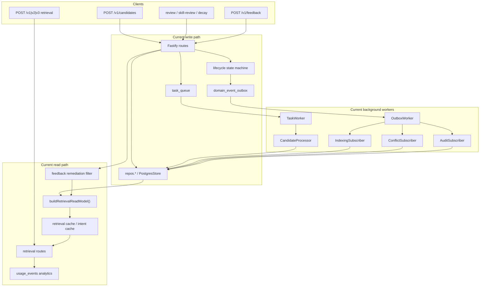
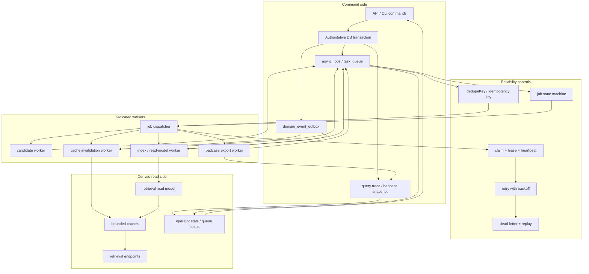

# Async State-Machine Backend Convergence Implementation Plan

> **For agentic workers:** REQUIRED SUB-SKILL: Use superpowers:subagent-driven-development (recommended) or superpowers:executing-plans to implement this plan task-by-task. Steps use checkbox (`- [ ]`) syntax for tracking.

**Goal:** Evolve TrapMap into a reliable async, state-machine-driven backend that can sustain moderate concurrency by moving heavy work off request paths, standardizing long-running job state, adding searchable badcase feedback loops, and deferring MQ/microservice adoption until measured bottlenecks justify it.

**Architecture:** Keep TrapMap as a PostgreSQL-first modular monolith in the near term. Reuse the existing `task_queue`, `domain_event_outbox`, lifecycle state machines, retrieval read models, usage analytics, and remediation flows to converge on command-write plus async-worker execution, explicit job state APIs, query/result traceability, and event-driven cache invalidation. Introduce separate worker entrypoints and richer read models before considering external MQ or service splits.

**Tech Stack:** TypeScript, Fastify, Zod contracts, Vitest, PostgreSQL/Drizzle, existing repository layer, existing queue/outbox worker runtime, existing retrieval/eval pipelines.

---

## Current Event-Driven Model



## Adjusted Async Model



## Archive Note

- [x] Previous root plan archived to `docs/archived/archived-plans/plan-2026-06-12-feedback-remediation-queue-root-archived.md`
- [x] Active tracking file remains `plan.md`

## Scope

- [ ] Strengthen the existing PostgreSQL-backed async runtime instead of introducing Kafka/RabbitMQ/NATS immediately.
- [ ] Standardize async task semantics for candidate processing, indexing, remediation follow-up, badcase capture, and derived retrieval artifacts.
- [ ] Add state-machine-driven job visibility so operators and tests can observe progress deterministically.
- [ ] Expose retrieval `queryId` end-to-end and persist enough request/result context to turn badcases into eval cases.
- [ ] Add event-driven cache invalidation and read-model refresh where retrieval latency or repeated derivation already exists.
- [ ] Split worker execution from API serving only where the repo already has natural seams.
- [ ] Document phase-specific operator and verification workflows as the design converges.

## Non-Goals

- [ ] Do not replace PostgreSQL queueing with external MQ in the first implementation wave.
- [ ] Do not split the product into many deployable microservices before runtime metrics show a real scaling boundary.
- [ ] Do not redesign all existing route contracts if additive async/status surfaces are sufficient.
- [ ] Do not remove JSON compatibility paths unless the touched subsystem already has a clear PG-first migration path.
- [ ] Do not build a full UI for job orchestration; API, CLI, and docs coverage are enough for this plan.

## Confirmed Current Baseline

> **Code and doc evidence recorded 2026-06-12 before implementation changes.**

- [x] Durable async primitives already exist.
  - **Evidence:** `packages/server/src/lib/queue/task-queue.ts`, `packages/server/src/lib/lifecycle/outbox.ts`, `packages/server/drizzle/0009_round10_task_queue_write_path.sql`, `packages/server/drizzle/0010_round10_lifecycle_outbox.sql`
- [x] Candidate submission already uses an async worker path in PostgreSQL mode.
  - **Evidence:** `packages/server/src/bootstrap/bootstrap-workers.ts`, `packages/server/src/lib/candidates/processor.ts`, `docs/reference/DATA_MODEL.md`
- [x] Lifecycle transitions already have a reusable state machine and async outbox subscribers.
  - **Evidence:** `packages/server/src/lib/lifecycle/state-machine.ts`, `packages/server/src/bootstrap/bootstrap-lifecycle.ts`
- [x] Runtime readiness already exposes queue/outbox worker state.
  - **Evidence:** `packages/server/src/lib/runtime/http-surface.ts`, `packages/server/src/lib/runtime/runtime-metadata.ts`, `packages/server/src/app.test.ts`
- [x] Retrieval routes already generate `queryId` for usage analytics, but the public retrieval responses do not consistently expose it.
  - **Evidence:** `packages/server/src/routes/retrieval.ts`, `packages/server/src/lib/analytics/pg-repository.ts`, `docs/todos/badcase-feedback-loop.md`
- [x] Feedback/remediation already exists, but the badcase loop is not yet closed with snapshots and eval conversion.
  - **Evidence:** `packages/server/src/routes/feedback.ts`, `packages/server/src/routes/feedback-admin.ts`, `packages/server/src/lib/feedback/remediation.ts`, `docs/todos/badcase-feedback-loop.md`
- [x] Retrieval caching already exists in-process and has metrics hooks, but invalidation and job-driven refresh are not yet systematized.
  - **Evidence:** `packages/server/src/lib/cache/retrieval-cache.ts`, `packages/server/src/lib/cache/metrics.ts`, `packages/server/src/lib/retrieval/capsules/intent-cache.ts`
- [x] The repository already contains a backend engineering TODO aligned with this direction.
  - **Evidence:** `docs/todos/backend-engineering-optimization-plan.md`

## Execution Rules

- [ ] Reuse `task_queue` and `domain_event_outbox` as the authoritative async transport in phase 1 and phase 2.
- [ ] Prefer additive contracts and read models over route-local polling or ad hoc background logic.
- [ ] Any new long-running operation must define:
  - a typed payload
  - a state model
  - retry/dead-letter semantics
  - operator-visible status
- [ ] Any new async state must be queryable without reading raw worker logs.
- [ ] Any new request/response trace data must be persisted through repositories or dedicated tables, not only in volatile logs.
- [ ] Cache invalidation must be event-driven where possible; request handlers should not manually clear unrelated caches.
- [ ] MQ and microservice decisions require metrics from this plan; they are not default implementation choices.
- [ ] Do not mark a phase complete until code, docs, tests, and required eval updates for that phase are all done.

## File Structure

### Async queue and worker runtime

- `packages/server/src/lib/queue/task-queue.ts`
  - existing durable queue; extend with richer task state, leases/timeouts, and operator queries
- `packages/server/src/lib/persistence/schema/queue.ts`
  - queue and outbox schema source of truth; expand only if new persisted async metadata is required
- `packages/server/drizzle/*.sql`
  - migrations for any queue/job/read-model additions
- `packages/server/src/bootstrap/bootstrap-workers.ts`
  - current in-process task worker startup
- `packages/server/src/bootstrap/bootstrap-lifecycle.ts`
  - current outbox worker startup
- `packages/server/src/index.ts`
  - server entrypoint; may need mode-aware API-only startup
- `packages/server/package.json`
  - add dedicated worker entrypoint scripts if workers move out of the API process

### Contracts and operator surfaces

- `packages/contracts/src/domain/feedback.ts`
  - extend badcase submission metadata if feedback carries query/result snapshots
- `packages/contracts/src/domain/retrieval.ts`
  - add public `queryId` and any additive trace fields needed by clients and eval tooling
- `packages/contracts/src/domain/operations.ts`
  - add queue/job status contracts and operator request/response schemas
- `packages/server/src/routes/feedback.ts`
  - persist query/result badcase context instead of only `querySeed`
- `packages/server/src/routes/retrieval.ts`
  - expose `queryId`, write request/result trace records, enqueue derived async work where needed
- `packages/server/src/routes/operations/`
  - add operator surfaces for queue inspection, dead-letter requeue, badcase export, and read-model rebuild where needed

### Read models, caches, and analytics

- `packages/server/src/lib/retrieval/read-model.ts`
  - extend retrieval read-model composition for async-derived state
- `packages/server/src/lib/cache/retrieval-cache.ts`
  - unify cache semantics used by retrieval-facing async refresh paths
- `packages/server/src/lib/cache/metrics.ts`
  - expand cache metrics snapshots if needed for readiness and operator stats
- `packages/server/src/lib/runtime/metrics.ts`
  - extend runtime execution counters for queue backlog / dead-letter / worker errors
- `packages/server/src/lib/analytics/`
  - reuse usage analytics for query trace correlation when possible

### Candidate, remediation, and badcase flows

- `packages/server/src/lib/candidates/processor.ts`
  - current async candidate path; use as the reference implementation for future queue tasks
- `packages/server/src/lib/feedback/remediation.ts`
  - current derived remediation state; extend to link badcase lifecycle if needed
- `docs/todos/badcase-feedback-loop.md`
  - evolve from TODO notes to implementation progress and remaining gaps
- `evals/retrieval/`
  - add badcase-to-eval conversion flow for retrieval regressions
- `evals/summary/`
  - add badcase-to-eval conversion flow for summary regressions

### Docs and truth surfaces

- `docs/PACKAGES.md`
  - update ownership for queue/runtime/status/badcase orchestration
- `docs/operations/TESTING.md`
  - phase-specific verification commands and operator playbooks
- `docs/reference/DATA_MODEL.md`
  - async state tables, job lifecycle semantics, trace persistence, badcase storage
- `docs/reference/api-surface.md`
  - public and operator endpoint contract updates
- `docs/reference/DATABASE_SCHEMA.md`
  - migration/table/index additions
- `docs/reference/SYSTEM_TRUTH_SOURCES.md`
  - update authoritative source mapping if new runtime/operator surfaces are introduced

## Phase 1: Standardize Async Task Semantics On Top Of Existing PostgreSQL Queue

**Objective:** Turn the existing queue/outbox runtime from “one working async lane” into a reusable async execution substrate with explicit task state, retries, dead-letter handling, and operator visibility.

**Files:**
- Modify: `packages/server/src/lib/queue/task-queue.ts`
- Modify: `packages/server/src/lib/persistence/schema/queue.ts`
- Modify: `packages/server/drizzle/0015_*.sql`
- Modify: `packages/contracts/src/domain/operations.ts`
- Modify: `packages/server/src/routes/operations/status.ts`
- Modify: `packages/server/src/lib/runtime/metrics.ts`
- Modify: `packages/server/src/lib/runtime/runtime-metadata.ts`
- Modify: `packages/server/src/lib/runtime/http-surface.ts`
- Modify: `packages/server/src/lib/queue/task-queue.test.ts`
- Modify: `packages/server/src/lib/runtime/runtime-metadata.test.ts`
- Modify: `packages/server/src/app.test.ts`
- Modify: `plan.md`

- [ ] Add a typed job/task status model that distinguishes `pending`, `running`, `completed`, `failed-retryable`, `dead`, and `cancelled` or explicitly document why a smaller state set is sufficient.
- [ ] Add persisted or derivable metadata for:
  - lease/heartbeat timeout
  - next retry time
  - last error
  - handler name
  - dedupe key
  - created/started/completed timestamps
- [ ] Add operator-readable queue status APIs under the existing operations route family.
- [ ] Extend runtime metrics/readiness output with queue backlog, dead-letter count, and worker degraded status.
- [ ] Keep the existing candidate worker working unchanged from an external behavior standpoint while migrating it to the richer queue semantics.

**Completion standard:**

- [ ] A task can be enqueued, claimed, retried, marked dead, and requeued through one canonical queue abstraction.
- [ ] Operators can inspect queue state without reading database rows manually.
- [ ] Readiness and runtime metrics expose enough information to detect a stuck worker or growing backlog.
- [ ] Candidate processing still passes its current behavioral tests on top of the richer queue contract.

**Document updates in this phase:**

- [ ] Update `docs/reference/DATA_MODEL.md` with the final task status vocabulary and queue semantics.
- [ ] Update `docs/reference/DATABASE_SCHEMA.md` with any new queue columns, indexes, and migration numbers.
- [ ] Update `docs/reference/api-surface.md` for queue status/requeue operator endpoints.
- [ ] Update `docs/PACKAGES.md` to state that queue/runtime surfaces are the canonical async execution layer.
- [ ] Update `docs/operations/TESTING.md` with the queue verification commands and expected outputs.

**Tests / eval updates in this phase:**

- [ ] Extend `packages/server/src/lib/queue/task-queue.test.ts` with:
  - lease timeout / retry scheduling
  - dead-letter transition
  - operator-visible counts
  - requeue behavior after `dead`
- [ ] Extend `packages/server/src/app.test.ts` and `packages/server/src/lib/runtime/runtime-metadata.test.ts` with:
  - backlog and dead-letter visibility
  - readiness behavior when queue worker is configured but unhealthy
- [ ] Run:
```bash
rtk pnpm test -- --run \
  packages/server/src/lib/queue/task-queue.test.ts \
  packages/server/src/lib/runtime/runtime-metadata.test.ts \
  packages/server/src/app.test.ts
```
- [ ] Run:
```bash
rtk pnpm typecheck
```

**Example structure or code:**
```ts
export const asyncJobStatusSchema = z.enum([
  'pending',
  'running',
  'completed',
  'failed-retryable',
  'dead',
]);

export interface AsyncJobSnapshot {
  id: string;
  type: string;
  status: z.infer<typeof asyncJobStatusSchema>;
  dedupeKey: string | null;
  attempts: number;
  maxAttempts: number;
  nextRetryAt: string | null;
  startedAt: string | null;
  completedAt: string | null;
  lastError: string | null;
}
```

```ts
app.get('/v1/operations/status/queue', async () => {
  return {
    pending: await queueRepo.countByStatus('pending'),
    running: await queueRepo.countByStatus('running'),
    dead: await queueRepo.countByStatus('dead'),
  };
});
```

## Phase 2: Separate API Serving From Worker Execution Without Service Explosion

**Objective:** Make worker execution deployable as a dedicated process while preserving the existing modular-monolith codebase and shared repositories.

**Files:**
- Modify: `packages/server/src/index.ts`
- Create: `packages/server/src/worker.ts`
- Create: `packages/server/src/bootstrap/run-worker-sequence.ts`
- Modify: `packages/server/src/bootstrap/bootstrap-workers.ts`
- Modify: `packages/server/src/bootstrap/bootstrap-lifecycle.ts`
- Modify: `packages/server/package.json`
- Modify: `package.json`
- Modify: `packages/server/src/bootstrap/startup.test.ts`
- Modify: `packages/server/src/app.test.ts`
- Modify: `plan.md`

- [ ] Split startup so the API process can run without owning all workers and a dedicated worker process can run queue/outbox consumers.
- [ ] Keep shared repository/config/bootstrap wiring in one place; do not duplicate service initialization logic.
- [ ] Add one explicit configuration switch or script split that determines:
  - API only
  - worker only
  - combined local-dev mode if still needed
- [ ] Ensure readiness semantics remain correct for API-only and worker-only deployment topologies.
- [ ] Preserve current local development simplicity; one command should still work for contributors who do not need split processes.

**Completion standard:**

- [ ] The repo can boot API-only and worker-only processes from explicit entrypoints.
- [ ] Existing tests can still run without spawning real external daemons.
- [ ] Runtime metadata correctly reports when the current process is not expected to own queue/outbox workers.
- [ ] This phase introduces no external infrastructure beyond PostgreSQL.

**Document updates in this phase:**

- [ ] Update `README.md` and `docs/guides/GETTING_STARTED.md` with API-only, worker-only, and local combined startup commands.
- [ ] Update `docs/PACKAGES.md` to note the dedicated worker entrypoint.
- [ ] Update `docs/reference/SYSTEM_TRUTH_SOURCES.md` if startup or runtime ownership truth sources change.
- [ ] Update `docs/operations/TESTING.md` with split-process verification recipes.

**Tests / eval updates in this phase:**

- [ ] Extend `packages/server/src/bootstrap/startup.test.ts` with:
  - API-only bootstrap
  - worker-only bootstrap
  - combined dev bootstrap
- [ ] Extend `packages/server/src/app.test.ts` readiness assertions for “worker not configured here by design”.
- [ ] Run:
```bash
rtk pnpm test -- --run \
  packages/server/src/bootstrap/startup.test.ts \
  packages/server/src/app.test.ts
```
- [ ] Run:
```bash
rtk pnpm typecheck
```

**Example structure or code:**
```ts
export interface RuntimeModeConfig {
  mode: 'api' | 'worker' | 'combined';
  enableTaskWorker: boolean;
  enableOutboxWorker: boolean;
}
```

```ts
if (runtime.mode === 'worker') {
  await runWorkerSequence(app);
} else {
  await server.listen({ host, port });
}
```

## Phase 3: Add Query Traceability And Badcase Capture Contracts

**Objective:** Close the first half of the badcase loop by exposing retrieval `queryId`, persisting result snapshots and failure classification, and making feedback submissions reproducible enough to become eval inputs.

**Files:**
- Modify: `packages/contracts/src/domain/retrieval.ts`
- Modify: `packages/contracts/src/domain/feedback.ts`
- Modify: `packages/contracts/src/domain/operations.ts`
- Modify: `packages/server/src/routes/retrieval.ts`
- Modify: `packages/server/src/routes/feedback.ts`
- Modify: `packages/server/src/lib/analytics/repository.ts`
- Modify: `packages/server/src/lib/analytics/pg-repository.ts`
- Modify: `packages/server/src/lib/persistence/schema/knowledge.ts`
- Modify: `packages/server/drizzle/0016_*.sql`
- Modify: `packages/server/src/routes/retrieval.test.ts`
- Modify: `packages/server/src/routes/feedback.test.ts`
- Modify: `packages/contracts/src/domain/retrieval.test.ts`
- Modify: `packages/contracts/src/domain/feedback.test.ts`
- Modify: `plan.md`

- [ ] Add additive `queryId` fields to public retrieval response contracts instead of keeping IDs only in analytics writes.
- [ ] Extend feedback submission contracts with the minimal reproducibility envelope:
  - `queryId`
  - `querySeed`
  - result snapshot or selected-hit snapshot
  - expected correction / failure classification
- [ ] Persist badcase trace fields in a durable location that can be queried later; avoid storing them only in logs.
- [ ] Keep the live retrieval contract backward-compatible by adding optional fields rather than reworking core payload structure.
- [ ] Reuse existing analytics and repository seams where possible instead of inventing an unrelated trace store.

**Completion standard:**

- [ ] A client can submit feedback tied to a concrete retrieval `queryId`.
- [ ] Operators can inspect enough stored context to understand why a retrieval or summary outcome was wrong.
- [ ] Retrieval tests assert that `queryId` is returned for v1, v2, and v3 retrieval surfaces where applicable.
- [ ] Feedback tests assert that the persisted trace fields survive repository round-trips.

**Document updates in this phase:**

- [ ] Update `docs/todos/badcase-feedback-loop.md` to move `queryId` exposure and snapshot persistence from TODO to implemented.
- [ ] Update `docs/reference/api-surface.md` with the additive retrieval and feedback contract fields.
- [ ] Update `docs/reference/DATA_MODEL.md` with the badcase trace storage shape.
- [ ] Update `docs/PACKAGES.md` to explain which modules own query trace capture.

**Tests / eval updates in this phase:**

- [ ] Extend `packages/contracts/src/domain/retrieval.test.ts` and `packages/contracts/src/domain/feedback.test.ts` with new additive fields.
- [ ] Extend `packages/server/src/routes/retrieval.test.ts` with:
  - v1 returns `queryId`
  - v2 returns `queryId`
  - v3 returns `queryId` or explicit rationale if it cannot
- [ ] Extend `packages/server/src/routes/feedback.test.ts` with:
  - feedback persists `queryId`
  - feedback persists hit snapshot / expected correction metadata
- [ ] Run:
```bash
rtk pnpm test -- --run \
  packages/contracts/src/domain/retrieval.test.ts \
  packages/contracts/src/domain/feedback.test.ts \
  packages/server/src/routes/retrieval.test.ts \
  packages/server/src/routes/feedback.test.ts
```
- [ ] Run:
```bash
rtk pnpm typecheck
```

**Example structure or code:**
```ts
export const badcaseSnapshotSchema = z.object({
  queryId: z.string().min(1),
  querySeed: z.string().min(1),
  entryId: z.string().min(1).optional(),
  routeFamily: z.enum(['entry', 'capsule', 'graph-plan']).optional(),
  observedFailure: z.enum([
    'missing-recall',
    'ranking-error',
    'summary-hallucination',
    'governance-leak',
    'outdated-content',
  ]),
  expectedBehavior: z.string().min(1).max(2000),
  selectedResultSnapshot: z.record(z.string(), z.unknown()).optional(),
});
```

```ts
return retrievalV2ResponseWithHintsSchema.passthrough().parse({
  ...result,
  queryId,
});
```

## Phase 4: Introduce Event-Driven Derived Jobs For Indexing, Remediation, And Badcase Export

**Objective:** Move the next set of heavy or failure-prone side effects onto reusable queue/outbox jobs instead of keeping them inline in routes or operator flows.

**Files:**
- Modify: `packages/server/src/lib/lifecycle/outbox.ts`
- Modify: `packages/server/src/lib/lifecycle/types.ts`
- Modify: `packages/server/src/lib/lifecycle/subscribers/indexing.ts`
- Modify: `packages/server/src/lib/feedback/remediation.ts`
- Modify: `packages/server/src/routes/feedback-admin.ts`
- Create: `packages/server/src/lib/jobs/`
- Create: `packages/server/src/lib/jobs/handlers/*.ts`
- Modify: `packages/server/src/bootstrap/bootstrap-workers.ts`
- Modify: `packages/server/src/lib/candidates/processor.ts`
- Modify: `packages/server/src/lib/lifecycle/subscribers/subscribers-integration.test.ts`
- Modify: `packages/server/src/__tests__/candidate-pipeline.test.ts`
- Modify: `packages/server/src/routes/feedback.test.ts`
- Modify: `plan.md`

- [ ] Add explicit job types for at least:
  - index rebuild / removal follow-up
  - remediation reactivation follow-up
  - badcase export or eval materialization draft
  - expensive derived summary / snapshot generation if still synchronous
- [ ] Use outbox events to enqueue jobs after authoritative writes commit.
- [ ] Keep workers idempotent by dedupe key and make repeated event handling safe.
- [ ] Make job failures visible via the queue status surface from phase 1.
- [ ] Reuse candidate processing patterns where the flow matches instead of inventing parallel worker frameworks.

**Completion standard:**

- [ ] Feedback/remediation follow-up no longer depends on route-local side effects for heavy work.
- [ ] At least one non-candidate subsystem uses the shared queue substrate end-to-end.
- [ ] Repeated event delivery does not cause duplicate active jobs.
- [ ] Dead-letter tasks can be identified and retried through operator APIs.

**Document updates in this phase:**

- [ ] Update `docs/PACKAGES.md` with the new shared `lib/jobs/` ownership.
- [ ] Update `docs/reference/DATA_MODEL.md` with job payload ownership and lifecycle notes.
- [ ] Update `docs/reference/api-surface.md` if remediation or operator responses now surface async job IDs.
- [ ] Update `docs/operations/TESTING.md` with queue inspection and dead-letter recovery playbooks.

**Tests / eval updates in this phase:**

- [ ] Add handler-level tests for each new job type under `packages/server/src/lib/jobs/handlers/*.test.ts`.
- [ ] Extend `packages/server/src/lib/lifecycle/subscribers/subscribers-integration.test.ts` with outbox-to-job enqueue assertions.
- [ ] Extend `packages/server/src/routes/feedback.test.ts` and `packages/server/src/__tests__/candidate-pipeline.test.ts` with async follow-up visibility checks.
- [ ] Run:
```bash
rtk pnpm test -- --run \
  packages/server/src/lib/lifecycle/subscribers/subscribers-integration.test.ts \
  packages/server/src/__tests__/candidate-pipeline.test.ts \
  packages/server/src/routes/feedback.test.ts
```
- [ ] Run:
```bash
rtk pnpm typecheck
```

**Example structure or code:**
```ts
export interface AsyncJobHandler<TPayload> {
  type: string;
  dedupeKey(payload: TPayload): string | null;
  handle(payload: TPayload, signal: AbortSignal): Promise<void>;
}
```

```ts
await taskQueue.enqueue(
  'feedback.badcase-export',
  { feedbackId, entryId, queryId },
  { dedupeKey: `feedback.badcase-export:${feedbackId}` },
);
```

## Phase 5: Add Event-Driven Cache Invalidation And Read-Model Refresh

**Objective:** Treat retrieval caches and derived read models as event-driven artifacts instead of best-effort process-local optimizations.

**Files:**
- Modify: `packages/server/src/lib/cache/retrieval-cache.ts`
- Modify: `packages/server/src/lib/cache/metrics.ts`
- Modify: `packages/server/src/lib/retrieval/read-model.ts`
- Modify: `packages/server/src/lib/retrieval/capsules/intent-cache.ts`
- Modify: `packages/server/src/lib/lifecycle/subscribers/indexing.ts`
- Modify: `packages/server/src/lib/jobs/handlers/*.ts`
- Modify: `packages/server/src/lib/cache/retrieval-cache.test.ts`
- Modify: `packages/server/src/lib/retrieval/orchestration/recall-coordinator.test.ts`
- Modify: `packages/server/src/lib/retrieval/graph-plan/graph-plan-search.test.ts`
- Modify: `plan.md`

- [ ] Define which retrieval-side caches remain process-local and which derived artifacts need explicit refresh/invalidation on writes.
- [ ] Add shared invalidation hooks for lifecycle approval, deactivation, remediation suppression, and remediation reactivation.
- [ ] Expose cache metrics in a form operators can inspect from runtime surfaces or stats endpoints.
- [ ] Avoid unbounded in-memory caches; keep TTL/LRU policy explicit and documented.
- [ ] Ensure stale cache entries cannot reintroduce suppressed content into retrieval results.

**Completion standard:**

- [ ] Cache invalidation happens from shared events/jobs, not one-off route logic.
- [ ] Retrieval tests demonstrate that approved/reactivated content appears after refresh and suppressed content stays hidden.
- [ ] Operators can inspect at least high-level hit/miss/eviction metrics.
- [ ] Cache ownership and invalidation policy are documented in truth docs.

**Document updates in this phase:**

- [ ] Update `docs/PACKAGES.md` and `docs/PACKAGE_STACK_RATIONALE.md` with cache ownership and invalidation posture.
- [ ] Update `docs/operations/TESTING.md` with manual verification of cache invalidation after remediation or lifecycle changes.
- [ ] Update `docs/reference/SYSTEM_TRUTH_SOURCES.md` if cache policy becomes a documented truth source.

**Tests / eval updates in this phase:**

- [ ] Extend `packages/server/src/lib/cache/retrieval-cache.test.ts` with invalidation-triggered refresh behavior.
- [ ] Extend retrieval integration tests with stale-cache guard assertions.
- [ ] Run:
```bash
rtk pnpm test -- --run \
  packages/server/src/lib/cache/retrieval-cache.test.ts \
  packages/server/src/lib/retrieval/orchestration/recall-coordinator.test.ts \
  packages/server/src/lib/retrieval/graph-plan/graph-plan-search.test.ts \
  packages/server/src/routes/retrieval.test.ts
```
- [ ] Run:
```bash
rtk pnpm typecheck
```

**Example structure or code:**
```ts
export interface CacheInvalidationEvent {
  sourceType: 'trap' | 'skill';
  sourceId: string;
  reason:
    | 'approved'
    | 'deactivated'
    | 'remediation-suppressed'
    | 'remediation-reactivated';
}
```

```ts
if (event.reason === 'remediation-suppressed') {
  retrievalCache.deleteByPrefix(`skill:${event.sourceId}`);
}
```

## Phase 6: Materialize Badcases Into Eval Inputs And Operator Workflow

**Objective:** Close the loop from live failure to reproducible regression by adding a deterministic badcase export path into eval fixtures or draft cases.

**Files:**
- Modify: `packages/contracts/src/domain/operations.ts`
- Create: `packages/server/src/routes/operations/badcases.ts`
- Modify: `packages/server/src/routes/operations/index.ts`
- Create: `scripts/export-badcase-to-eval.ts`
- Modify: `evals/retrieval/README.md`
- Modify: `evals/summary/README.md`
- Modify: `evals/README.md`
- Modify: `docs/todos/badcase-feedback-loop.md`
- Modify: `docs/operations/TESTING.md`
- Modify: `packages/server/src/routes/operations/*.test.ts`
- Modify: `plan.md`

- [ ] Add an operator flow to export a badcase record into a retrieval or summary eval draft.
- [ ] Keep the export deterministic: one badcase should produce a stable draft payload from stored query/snapshot context.
- [ ] Decide and document whether the first version writes files directly, returns JSON for manual placement, or does both; choose the lowest-risk option for this repo.
- [ ] Add classification guidance so exports can target retrieval vs summary evals correctly.
- [ ] Make the generated artifact auditable and easy to review before it becomes a permanent fixture.

**Completion standard:**

- [ ] An operator can take a stored badcase and generate an eval draft without reconstructing the context manually.
- [ ] The export path is documented and covered by at least one automated test.
- [ ] The docs explain how to convert the draft into a committed eval case and where human review is still required.
- [ ] `docs/todos/badcase-feedback-loop.md` shows this loop as implemented or clearly marks any remaining manual step.

**Document updates in this phase:**

- [ ] Update `docs/todos/badcase-feedback-loop.md` with the implemented loop and remaining manual review boundary.
- [ ] Update `evals/README.md`, `evals/retrieval/README.md`, and `evals/summary/README.md` with the export workflow.
- [ ] Update `docs/operations/TESTING.md` with the end-to-end operator recipe:
  - retrieve with `queryId`
  - submit feedback
  - inspect badcase
  - export eval draft
  - add regression case
- [ ] Update `docs/reference/api-surface.md` with the badcase export operator endpoint if added.

**Tests / eval updates in this phase:**

- [ ] Add route/script tests for badcase export.
- [ ] Add at least one example exported retrieval eval draft fixture or snapshot test.
- [ ] Run:
```bash
rtk pnpm test -- --run \
  packages/server/src/routes/operations/*.test.ts \
  packages/server/src/__tests__/docs-truth-smoke.test.ts
```
- [ ] Run:
```bash
rtk pnpm eval:smoke
```

**Example structure or code:**
```ts
export interface BadcaseEvalDraft {
  kind: 'retrieval' | 'summary';
  caseId: string;
  sourceFeedbackId: string;
  request: Record<string, unknown>;
  expected: Record<string, unknown>;
  notes: string[];
}
```

```ts
const draft: BadcaseEvalDraft = {
  kind: 'retrieval',
  caseId: `badcase_${feedback.id}`,
  sourceFeedbackId: feedback.id,
  request: { seed: feedback.querySeed },
  expected: { relevance: { mustInclude: [feedback.entryId] } },
  notes: ['Review expected assertions before committing to eval fixtures.'],
};
```

## Phase 7: Use Metrics To Decide Whether MQ Or Microservice Splits Are Justified

**Objective:** Finish the convergence work with explicit decision gates instead of assuming external MQ or service decomposition is automatically required.

**Files:**
- Modify: `packages/server/src/lib/runtime/metrics.ts`
- Modify: `packages/server/src/routes/operations/stats.ts`
- Modify: `packages/contracts/src/domain/operations.ts`
- Modify: `docs/todos/backend-engineering-optimization-plan.md`
- Modify: `docs/operations/TESTING.md`
- Modify: `docs/PACKAGES.md`
- Modify: `plan.md`

- [ ] Add metrics or summary endpoints that let operators answer:
  - queue backlog by type
  - retry/dead-letter rate by type
  - worker execution latency by type
  - cache hit/miss rate
  - badcase export volume
  - retrieval failure distribution
- [ ] Define concrete thresholds for “PG queue is enough” vs “consider external MQ”.
- [ ] Define concrete thresholds for “modular monolith is enough” vs “split worker/read service”.
- [ ] Update the backend engineering TODO doc to reflect measured decision gates instead of generic future desires.
- [ ] Ensure the final docs say clearly that MQ/microservices are contingent, not mandatory outcomes.

**Completion standard:**

- [ ] Operators can inspect enough telemetry to make the next architecture decision from data.
- [ ] The repo contains an explicit “when to adopt MQ” rubric.
- [ ] The repo contains an explicit “when to split services” rubric.
- [ ] No code in this phase requires actually introducing MQ or microservices.

**Document updates in this phase:**

- [ ] Update `docs/todos/backend-engineering-optimization-plan.md` from broad proposal to measured decision guide.
- [ ] Update `docs/operations/TESTING.md` with the metric checks to review after load or smoke runs.
- [ ] Update `docs/PACKAGES.md` and `docs/reference/api-surface.md` if new stats surfaces are added.

**Tests / eval updates in this phase:**

- [ ] Extend stats route tests and runtime metrics tests for the new counters.
- [ ] Run:
```bash
rtk pnpm test -- --run \
  packages/server/src/lib/runtime/metrics.test.ts \
  packages/server/src/routes/operations/stats.test.ts
```
- [ ] Run:
```bash
rtk pnpm typecheck
```

**Example structure or code:**
```ts
export interface AsyncArchitectureDecisionSnapshot {
  queueBacklogByType: Record<string, number>;
  deadLetterByType: Record<string, number>;
  avgHandlerLatencyMsByType: Record<string, number>;
  cacheHitRateByNamespace: Record<string, number>;
  badcaseExportCount: number;
}
```

```md
- If `deadLetterByType[index-rebuild] > 0` for sustained daily traffic, fix handler reliability first.
- If queue backlog keeps growing under normal load after worker parallelism tuning, evaluate external MQ.
- If API read latency remains dominated by retrieval read-model assembly after cache/read-model convergence, evaluate a dedicated read service.
```

## Final Acceptance Checklist

- [ ] The primary async transport remains PostgreSQL queue + outbox unless metrics prove it insufficient.
- [ ] API serving and worker execution can run separately without duplicating business logic.
- [ ] Public retrieval responses expose `queryId` and support badcase traceability.
- [ ] Feedback submissions can persist enough query/result context to reproduce failures.
- [ ] Heavy follow-up work is scheduled through shared async job handlers rather than route-local side effects.
- [ ] Retrieval caches/read models refresh through shared events or jobs and do not leak suppressed stale content.
- [ ] Operators can export badcases into eval drafts with a documented workflow.
- [ ] Runtime and operator metrics define objective triggers for MQ or microservice adoption.
- [ ] Docs cover the end-to-end operator and verification flow.
- [ ] Phase-complete status is only checked after matching code, tests, evals, and docs are updated.
