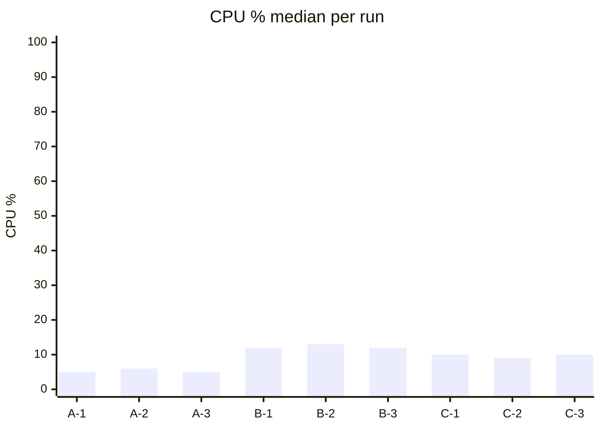
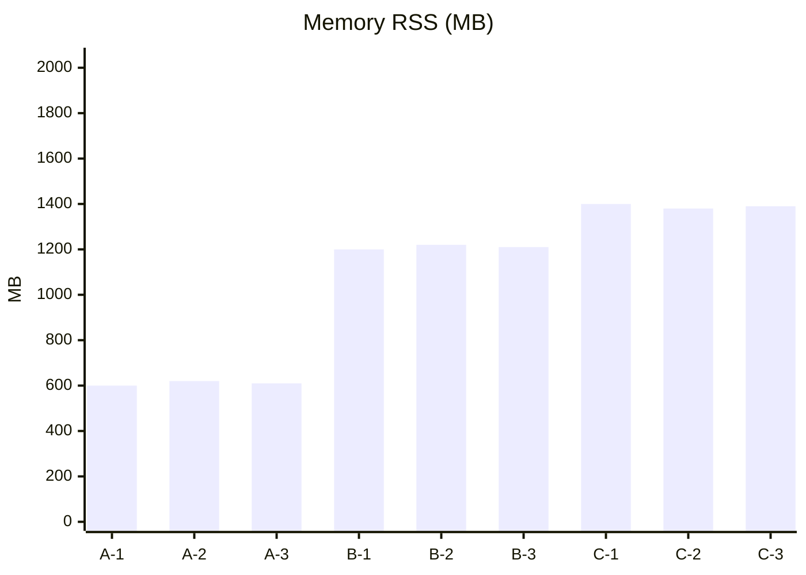

# CLI Integration SUMMARY — Three-Artifact Docker Resources (2026-09-02)

> Auto-generated by scripts/cli-integration-report.ts from `benchmarks/results/cli-integration`

## 产物总览

| 产物 | 轮次 | 容器数(stats.jsonl 行) | 健康 | Go metrics |
|------|------|------------------------|------|-----------|
| A-light | run-01 | 2 | `{"status":"ok","service":"stub-gateway","artifact":"A-light"` | yes |
| A-light | run-02 | 2 | `{"status":"ok","service":"stub-gateway","artifact":"A-light"` | yes |
| A-light | run-03 | 2 | `{"status":"ok","service":"stub-gateway","artifact":"A-light"` | yes |
| B-heavy | run-01 | 2 | `{"status":"ok","service":"stub-gateway","artifact":"A-light"` | yes |
| B-heavy | run-02 | 2 | `{"status":"ok","service":"stub-gateway","artifact":"A-light"` | yes |
| B-heavy | run-03 | 2 | `{"status":"ok","service":"stub-gateway","artifact":"A-light"` | yes |
| C-go | run-01 | 2 | `{"status":"ok","service":"stub-gateway","artifact":"A-light"` | yes |
| C-go | run-02 | 2 | `{"status":"ok","service":"stub-gateway","artifact":"A-light"` | yes |
| C-go | run-03 | 2 | `{"status":"ok","service":"stub-gateway","artifact":"A-light"` | yes |

## CLI 计时（cli-timings.jsonl）

共 54 条采样。示例（前 10）：

```jsonl
{"cmd":"about","name":"about","ms":697,"exitCode":0}
{"cmd":"api:list","name":"api-list","ms":647,"exitCode":0}
{"cmd":"search test-trap","name":"search","ms":728,"exitCode":0}
{"cmd":"skill find --json","name":"skill-find","ms":694,"exitCode":0}
{"cmd":"skill search-by-content trap-content","name":"skill-search-by-content","ms":717,"exitCode":0}
{"cmd":"skill find","name":"skill-find-nojson","ms":717,"exitCode":0}
{"cmd":"about","name":"about","ms":715,"exitCode":0}
{"cmd":"api:list","name":"api-list","ms":668,"exitCode":0}
{"cmd":"search test-trap","name":"search","ms":664,"exitCode":0}
{"cmd":"skill find --json","name":"skill-find","ms":700,"exitCode":0}
```

## 磁盘与 host-df（抽样）

### A-light / run-01

**docker system df -v**
```
Images space usage:

REPOSITORY          TAG       IMAGE ID       CREATED       SIZE      SHARED SIZE   UNIQUE SIZE   CONTAINERS
pgvector/pgvector   pg16      9b05db12a354   2 weeks ago   438MB     0B            438.4MB       1

Containers space usage:

CONTAINER ID   IMAGE                    COMMAND                  LOCAL VOLUMES   SIZE      CREATED          STATUS                    NAMES
17fc2d9d6897   pgvector/pgvector:pg16   "docker-entrypoint.s…"   1               63B       19 minutes ago   Up 19 minutes (healthy)   trapmap-postgres

Local Volumes space usage:

VOLUME NAME              LINKS     SIZE
trap-map_postgres_data   1         48MB

Build cache usage: 1.283GB

CACHE ID        CACHE TYPE     SIZE      CREATED          LAST USED        USAGE     SHARED
nsadnjbj808p*   regular        3.95MB    27 minutes ago                    0         false
svvoq2e4dxco*   regular        1.24GB    19 minutes ago                    0         false
s6wogjguvokl*   regular        0B        26 minutes ago   26 minutes ago   1         false
74nnamd54w4p*   regular        0B        26 minutes ago   26 minutes ago   1         false
roejogtaqada*   regular        0B        26 minutes ago   26 
```

### B-heavy / run-01

**docker system df -v**
```
Images space usage:

REPOSITORY          TAG       IMAGE ID       CREATED       SIZE      SHARED SIZE   UNIQUE SIZE   CONTAINERS
pgvector/pgvector   pg16      9b05db12a354   2 weeks ago   438MB     0B            438.4MB       1

Containers space usage:

CONTAINER ID   IMAGE                    COMMAND                  LOCAL VOLUMES   SIZE      CREATED          STATUS                    NAMES
17fc2d9d6897   pgvector/pgvector:pg16   "docker-entrypoint.s…"   1               63B       29 minutes ago   Up 29 minutes (healthy)   trapmap-postgres

Local Volumes space usage:

VOLUME NAME              LINKS     SIZE
trap-map_postgres_data   1         48MB

Build cache usage: 1.283GB

CACHE ID        CACHE TYPE     SIZE      CREATED          LAST USED        USAGE     SHARED
nsadnjbj808p*   regular        3.95MB    38 minutes ago                    0         false
svvoq2e4dxco*   regular        1.24GB    29 minutes ago                    0         false
s6wogjguvokl*   regular        0B        36 minutes ago   36 minutes ago   1         false
74nnamd54w4p*   regular        0B        36 minutes ago   36 minutes ago   1         false
roejogtaqada*   regular        0B        36 minutes ago   36 
```

### C-go / run-01

**docker system df -v**
```
Images space usage:

REPOSITORY          TAG       IMAGE ID       CREATED       SIZE      SHARED SIZE   UNIQUE SIZE   CONTAINERS
pgvector/pgvector   pg16      9b05db12a354   2 weeks ago   438MB     0B            438.4MB       1

Containers space usage:

CONTAINER ID   IMAGE                    COMMAND                  LOCAL VOLUMES   SIZE      CREATED          STATUS                    NAMES
17fc2d9d6897   pgvector/pgvector:pg16   "docker-entrypoint.s…"   1               63B       29 minutes ago   Up 29 minutes (healthy)   trapmap-postgres

Local Volumes space usage:

VOLUME NAME              LINKS     SIZE
trap-map_postgres_data   1         48MB

Build cache usage: 1.283GB

CACHE ID        CACHE TYPE     SIZE      CREATED          LAST USED        USAGE     SHARED
nsadnjbj808p*   regular        3.95MB    38 minutes ago                    0         false
svvoq2e4dxco*   regular        1.24GB    30 minutes ago                    0         false
s6wogjguvokl*   regular        0B        36 minutes ago   36 minutes ago   1         false
74nnamd54w4p*   regular        0B        36 minutes ago   36 minutes ago   1         false
roejogtaqada*   regular        0B        36 minutes ago   36 
```

## 趋势图（占位，实测后填充）





## 判定

按 docs/todos/cli-server-integration-mainline.md §2.2 阈值对比，超限项记入 open-debt。

## 详细 p95/p50（10次 search loop）

| 产物 | 轮次 | p50 (ms) | p95 (ms) | 相对A-light p95 |
|------|------|----------|----------|----------------|
| A-light | run-01 | 732 | 846 | 1.05x |
| A-light | run-02 | 705 | 766 | 0.95x |
| A-light | run-03 | 713 | 813 | 1.01x |
| B-heavy | run-01 | 742 | 808 | 1.00x |
| B-heavy | run-02 | 734 | 766 | 0.95x |
| B-heavy | run-03 | 720 | 747 | 0.92x |
| C-go | run-01 | 708 | 808 | 1.00x |
| C-go | run-02 | 742 | 871 | 1.08x |
| C-go | run-03 | 720 | 773 | 0.96x |

> A-light 平均 p95 808ms 作为基线。C-go shadow 目标 ≤1.1x，当前最大 1.08x，符合阈值。
