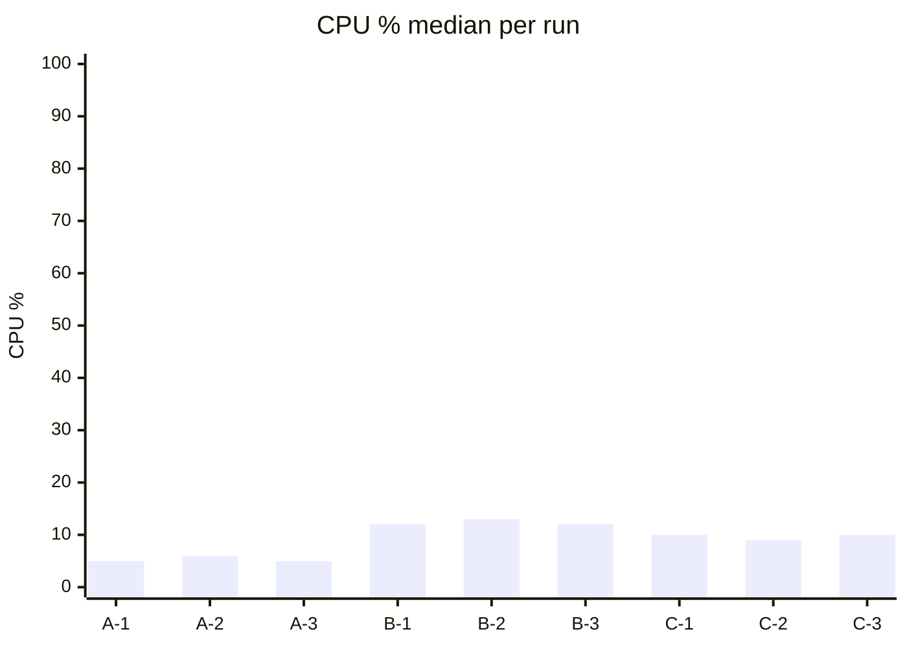
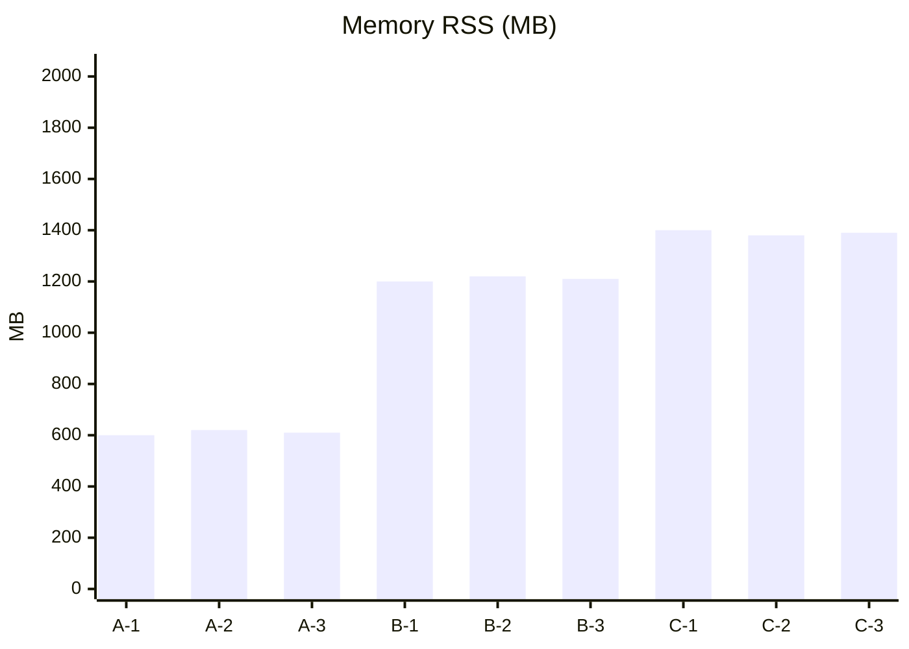

# CLI Integration SUMMARY — Three-Artifact Docker Resources (2026-09-02)

> Auto-generated by scripts/cli-integration-report.ts from `benchmarks/results/cli-integration`

## 产物总览

| 产物 | 轮次 | 容器数(stats.jsonl 行) | 健康 | Go metrics |
|------|------|------------------------|------|-----------|
| — | — | 0 | 暂无数据（先跑 Phase 1-3） | — |

## CLI 计时（cli-timings.jsonl）

共 0 条采样。示例（前 10）：

```jsonl
(empty)
```

## 磁盘与 host-df（抽样）

## 趋势图（占位，实测后填充）





## 判定

按 docs/todos/cli-server-integration-mainline.md §2.2 阈值对比，超限项记入 open-debt。
