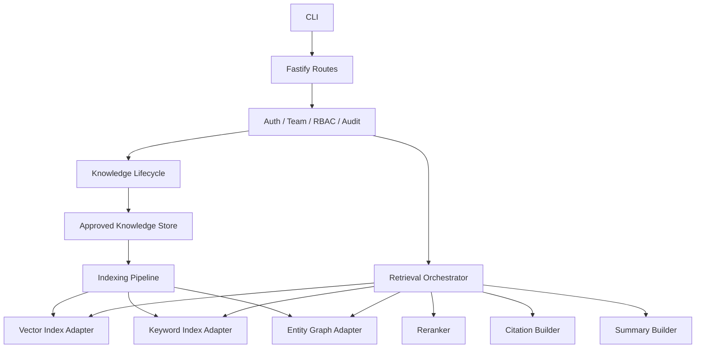
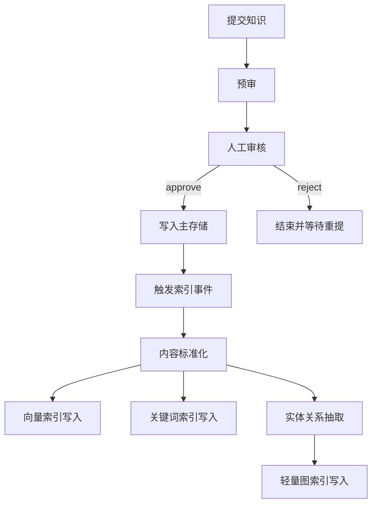
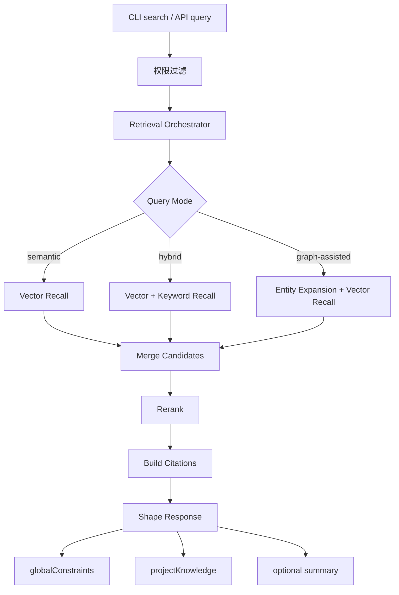
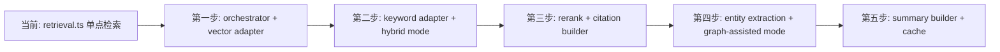

# Skill Shareer 检索结构调整文档

> **历史文档**：本文档撰写于 v1.x 早期阶段，记录了检索架构调整的技术决策背景。现已整合入主架构文档，仅供历史参考。

## 1. 文档目的

本文档用于明确 Skill Shareer 在现阶段的检索架构调整方向。

结论是：

- 不直接接入整个 `LightRAG` 项目
- 借鉴其“索引分层 + 检索编排 + 多路召回 + rerank + 引用/摘要”的结构
- 保留 Skill Shareer 现有的业务内核：`CLI + contracts + Fastify server + RBAC + 审批 + 审计`

本文档以当前代码结构为基础，给出后续结构演进方案，而不是提出一次性重构。

## 2. 当前项目现状

当前仓库的主要边界已经比较清晰：

- `packages/contracts` 负责共享 Zod 契约
- `packages/server` 负责 HTTP 路由、权限、审批、检索、导入导出、审计
- `packages/cli` 负责命令式 CLI 和 JSON 友好输出

当前检索实现的核心特点：

- 基于单路 embedding 相似度排序
- 查询前先做审批态、team、security level 过滤
- 结果按 `globalConstraints` 和 `projectKnowledge` 两个业务桶输出
- `refinementSummary` 仍是预留位，未形成真正的回答生成层
- 索引能力以查询时计算和轻量缓存为主，还没有稳定的增量索引流水线

这意味着当前系统更接近“受控知识检索”，而不是“图增强问答式 RAG”。

## 3. 结构调整总决策

### 3.1 不做的事

- 不直接把 `LightRAG` 作为主服务接入当前 monorepo
- 不引入 Python 作为当前服务主运行时
- 不把认证、team 隔离、审批和审计迁移给外部 RAG 系统
- 不在第一阶段全面引入重型知识图谱抽取

### 3.2 要做的事

- 在 `server` 内部增加“检索编排层”
- 将“存储事实”和“检索索引”分层
- 从单路 embedding 检索演进为多路召回
- 引入 rerank、引用组装、可选摘要
- 把索引刷新绑定到审批通过、更新、停用等生命周期事件

### 3.3 借鉴 LightRAG 的方式

借鉴的是结构，不是项目本体：

- 借鉴 query mode 思路
- 借鉴多种索引协同而不是单索引
- 借鉴图辅助检索，而不是全量图谱优先
- 借鉴 rerank、引用、缓存、索引生命周期管理
- 不照搬其认证、部署形态和运行时

## 4. 调整目标

本次结构调整的目标有四个：

1. 保持当前业务边界稳定，不破坏 CLI 契约和审批流
2. 让检索能力可演进，而不是继续把逻辑堆在一个检索函数里
3. 让“批准后的知识”进入稳定的增量索引管线
4. 为后续 `graph-assisted retrieval` 预留位置，但不要求一步到位

## 5. 目标结构

### 5.1 调整后的服务内分层



### 5.2 目录级建议

建议在 `packages/server/src/lib/` 下拆出以下结构：

```text
lib/
  retrieval/
    orchestrator.ts
    query-modes.ts
    recall/
      vector.ts
      keyword.ts
      graph-assisted.ts
    rerank.ts
    citations.ts
    summary.ts
    filters.ts
  indexing/
    pipeline.ts
    normalize.ts
    events.ts
    adapters/
      vector.ts
      keyword.ts
      graph.ts
  knowledge/
    lifecycle-hooks.ts
```

说明：

- `retrieval/` 负责“查”
- `indexing/` 负责“建索引和刷新索引”
- `knowledge/` 继续保留知识对象与生命周期逻辑，但补充索引触发钩子

## 6. 核心流程调整

### 6.1 知识入库与索引刷新



这里的关键变化不是“换存储”，而是把“批准后可检索”这件事从查询时现算，改成生命周期驱动。

### 6.2 查询与结果组装



## 7. 建议保留的现有边界

以下边界不应该被这次调整打散：

- `contracts` 仍然是唯一契约真源
- `cli` 仍然只依赖 API 契约，不直接依赖索引实现
- `server` 继续统一承担 RBAC、team 过滤、审批和审计
- `global` / `project` 继续表示业务范围，而不是检索模式

换句话说，检索增强应当发生在 `server` 内部，而不是把 CLI 改成直接面向外部 RAG 服务。

## 8. 建议新增的结构能力

### 8.1 Query Mode

新增查询模式字段，但不要复用当前的 `scope` 概念。

建议单独增加：

- `semantic`
- `hybrid`
- `graph-assisted`

默认从 `semantic` 开始，逐步升级到 `hybrid`。

### 8.2 Rerank

在当前项目里，rerank 的优先级高于完整图谱。

原因：

- 当前知识条目体量还不大
- 文本结构以 `shortcut + detail + labels` 为主
- 先做 rerank 能在较低成本下提升命中顺序
- 它比全量实体关系抽取更稳妥

### 8.3 Citation Builder

建议把当前“reason”扩展成更可审计的引用结构：

- 命中来源
- 命中片段
- 命中标签
- 召回通道
- rerank 后得分

这样更符合内部知识工具的可信性要求。

### 8.4 Summary Builder

当前 `refinementSummary` 还是占位能力。

建议把它提升为明确的后处理模块，但保持约束：

- 只基于命中的批准知识生成
- 不绕过权限过滤
- 必须能返回引用
- 可以关闭

## 9. 结构性映射：当前实现到目标实现



## 10. 分阶段落地建议

### Phase A：重构为可扩展检索骨架

目标：

- 抽出 `retrieval/orchestrator.ts`
- 把过滤逻辑、召回逻辑、结果组装逻辑拆开
- 保持现有 API 返回结构兼容

结果：

- 不改变产品行为
- 先解决结构耦合问题

### Phase B：增加 hybrid 检索

目标：

- 增加关键词召回通道
- 合并向量与关键词候选集
- 引入简单 rerank

结果：

- 召回稳定性提升
- 对短文本 pitfall 更友好

### Phase C：把索引构建变成生命周期驱动

目标：

- 审批通过后建索引
- 更新时刷新索引
- 停用时移除索引

结果：

- 降低查询时重复计算
- 为后续缓存和召回扩展提供基础

### Phase D：引入轻量图辅助

目标：

- 仅抽取少量高价值实体
- 支持实体扩展和关系辅助召回
- 不追求重型知识图谱平台

建议实体类型：

- service
- tool
- symptom
- root-cause
- fix
- environment

### Phase E：增加回答与引用层

目标：

- 在检索结果之上构建摘要
- 保留现有结果桶
- 新增可选 answer / summary 层

结果：

- 从“检索工具”逐步升级为“可解释的内部 RAG”

## 11. 与 LightRAG 的关系定位

Skill Shareer 与 LightRAG 的关系应当是：

- Skill Shareer 负责业务真相和访问控制
- LightRAG 提供可借鉴的检索结构思想
- 如果后续需要实验外部图增强引擎，也应通过 adapter 或 sidecar 方式接入

不应该变成：

- 让外部 RAG 项目接管主业务流程
- 让主系统直接依赖图索引实现细节
- 让权限控制后置到回答阶段

## 12. 最终建议

推荐的正式调整结论如下：

- 现阶段不直接接入整个 `LightRAG`
- 先在 Skill Shareer 内部引入“检索编排层 + 索引管线”
- 优先落地 `orchestrator + hybrid recall + rerank + citation`
- 图辅助检索放在后续阶段，以轻量实体抽取方式引入
- 所有增强都必须服从现有 `审批 -> 权限过滤 -> 检索 -> 输出` 的业务顺序

这条路线的优点是：

- 不破坏现有 monorepo 和 TS 技术栈
- 不削弱当前产品最重要的可信边界
- 仍然能系统性吸收 LightRAG 的优点
- 允许未来通过 adapter 继续演进，而不是一次性重构
