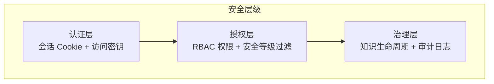
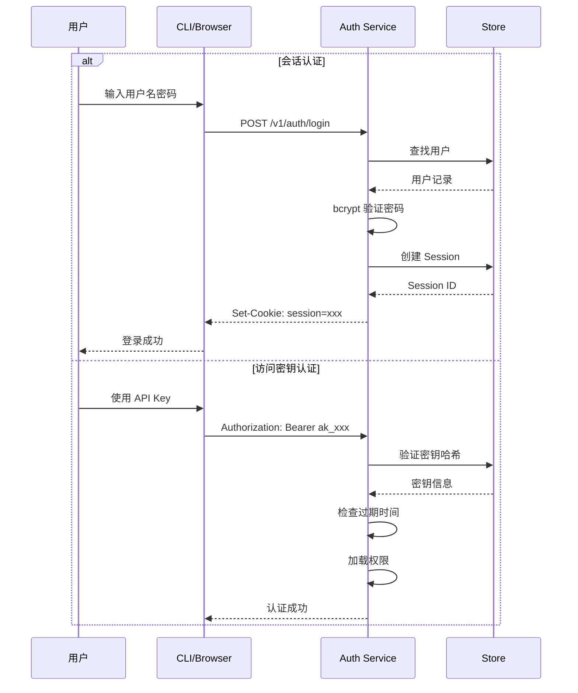
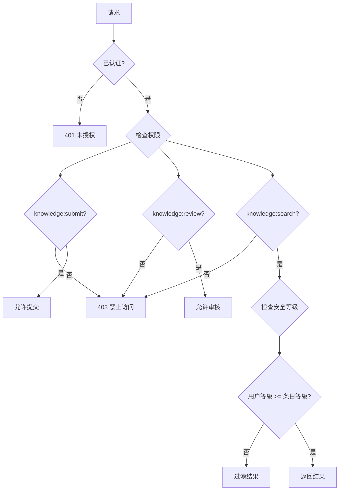

# 安全指南

本文档整合 TrapMap 的安全架构、配置清单和最佳实践。

## 安全架构概览

TrapMap 的安全模型基于三层防护：



### 认证流程图（Mermaid）



### 授权流程图（Mermaid）




---

## 认证机制

### 会话认证（Web UI）

| 属性 | 值 |
|------|-----|
| Cookie 名称 | `session` |
| Cookie 属性 | `httpOnly`, `secure`（生产）, `sameSite=strict` |
| 会话有效期 | 7 天 |
| Token 格式 | JWT（HS256） |
| 密码存储 | bcrypt，12 轮盐值 |

会话传输方式通过 `SESSION_TRANSPORT` 环境变量控制，可选 `bearer-header`（默认）或 `cookie`。

### 访问密钥认证（CLI / 自动化）

| 属性 | 值 |
|------|-----|
| 密钥长度 | 32 字节，base64url 编码 |
| 存储方式 | SHA-256 哈希后存储 |
| 有效期 | 可配置（创建时设定） |
| 显示时机 | 创建时仅显示一次明文 |

### 登出行为

- 删除服务端会话记录
- 清除客户端 Cookie
- 记录审计事件 `auth.logout`

---

## 安全等级

安全等级是 0-10 的整数，控制知识条目的可见性：

| 等级 | 名称 | 说明 | 典型场景 |
|------|------|------|----------|
| 0 | 公开 | 任何人可访问 | 公共文档、通用知识 |
| 1-3 | 内部 | 内部成员可访问 | 团队流程、内部规范 |
| 4-6 | 机密 | 需授权访问 | 业务信息、技术方案 |
| 7-9 | 高度机密 | 少数人可访问 | 核心架构、安全策略 |
| 10 | 最高机密 | 仅管理员可访问 | 系统密钥、凭据 |

### 访问规则

```typescript
// 用户等级 >= 条目等级 即可访问
function canAccess(userLevel: number, requiredLevel: number): boolean {
  return userLevel >= requiredLevel;
}
```

### 等级继承

```
SkillArtifact → Capsule → KnowledgeEntry
   (设定)        (继承)       (继承)
```

条目的 `requiredLevel` 继承自所属 Capsule，Capsule 继承自来源 Artifact。

---

## RBAC 权限

### 内置角色

| 角色 | 默认等级 | 权限范围 |
|------|----------|----------|
| `viewer` | 0 | 搜索、列表 |
| `contributor` | 1 | 提交、搜索、列表 |
| `reviewer` | 5 | 提交、搜索、审核、团队切换 |
| `admin` | 10 | 全部权限 |

### 权限清单

| 权限 | 说明 |
|------|------|
| `knowledge:submit` | 提交新知识条目 |
| `knowledge:search` | 搜索和检索条目 |
| `knowledge:review` | 审批/拒绝提交 |
| `knowledge:update` | 编辑现有条目 |
| `knowledge:import` | 批量导入 |
| `knowledge:export` | 批量导出 |
| `audit:read` | 查看审计日志 |
| `team:create` | 创建团队 |
| `team:list` | 列出团队 |
| `team:select` | 切换活动团队 |
| `member:create` | 添加团队成员 |
| `member:update` | 修改成员角色 |
| `member:key:create` | 生成访问密钥 |

### 最小权限原则

- 新成员默认为 `viewer` 角色
- 访问密钥权限默认等于创建者角色权限，可缩小范围
- 审核操作需要 `reviewer` 或更高角色

---

## 安全配置清单

### 必需配置

```bash
# 管理员密钥（首次部署设置，用于创建管理员账户）
TRAPMAP_SYSTEM_ADMIN_KEY=$(openssl rand -hex 32)

# AI 提供商密钥
OPENAI_API_KEY=sk-...

# Session 密钥（生产环境必须设置，至少 32 字符）
SESSION_SECRET=$(openssl rand -hex 32)
```

### 生产环境配置

```bash
NODE_ENV=production                    # 启用 secure cookies
HOST=127.0.0.1                        # 绑定本地地址
PORT=4000
LOG_USER_OPS_ENABLED=true             # 记录用户操作
LOG_RAG_ENABLED=true                  # 记录检索请求
SESSION_TRANSPORT=bearer-header       # 会话传输方式
```

### 可选安全加固

```bash
# 限制 CORS 来源
CORS_ORIGINS=https://your-domain.com

# 速率限制（每分钟最大请求数，0 = 无限制）
RATE_LIMIT_MAX_PER_MINUTE=100

# 日志轮转
LOG_MAX_FILE_SIZE_MB=10
LOG_MAX_BACKUP_FILES=5
```

---

## 访问密钥管理

### 创建密钥

```bash
# 通过 CLI 创建
pnpm --filter @trapmap/cli dev -- member key:create <username> --name "CI Pipeline" --days 90
```

创建后密钥明文仅显示一次，务必立即保存到安全位置。

### 密钥安全实践

- 不要将密钥明文提交到代码仓库
- 使用环境变量或密钥管理服务存储
- 定期轮换（建议 90 天）
- 不再需要时及时撤销
- 为自动化任务创建独立密钥，限制权限范围

---

## 敏感知识处理

### 提交敏感知识

1. 设置正确的 `requiredLevel`（推荐 4-7）
2. 明确团队作用域（`teamId`），避免全局暴露
3. 在摘要中不要包含敏感细节

### 审核敏感知识

- 审核者等级必须 >= 条目等级
- 审核结果会记录审计日志
- 拒绝时需提供原因

### 知识生命周期安全

```
draft → submitted → agent-pass → approved → (可被检索)
                  → agent-rejected → (不可见)
                                    → rejected → (不可见)
                                    → deactivated → (不可检索)
```

只有 `approved` 状态的条目才会被索引和检索。`deactivated` 条目从索引中移除但仍可查看（有权限时）。

---

## 审计日志

> **Round 10 Phase 3 更新**：审计事件已从 `store_snapshot` JSONB 迁移为 `audit_events` 结构化表。PG 模式下通过 `repos.audit.listByFilter()` 查询，支持 action/actorId/entityId/teamId/时间范围过滤和分页。

### 启用审计

```bash
LOG_USER_OPS_ENABLED=true
LOG_USER_OPS_DIR=logs/user-ops
```

### 审计事件类型

| 事件 | 触发时机 |
|------|----------|
| `auth.login` | 用户登录 |
| `auth.logout` | 用户登出 |
| `auth.failed` | 登录失败 |
| `auth.access_key_created` | 创建访问密钥 |
| `auth.access_key_used` | 使用密钥认证 |
| `auth.password_reset_requested` | 请求密码重置 |
| `auth.password_reset_completed` | 完成密码重置 |
| `knowledge-reviewed` | 审核知识条目（含 evidence 更新） |
| `knowledge-deactivated` | 停用知识条目 |
| `knowledge-exported` / `knowledge-imported` | 导出/导入知识 |
| `artifact-edited` | 编辑工件 |
| `artifact-reviewed` | 审核工件 |
| `artifact-deactivated` | 停用工件 |
| `artifact-exported` / `artifact-imported` | 导出/导入工件 |
| `artifact-history-viewed` | 查看工件历史 |
| `decay-batch` / `maintenance-batch` | 批量 decay/维护操作 |
| `feedback` / `feedback-batch` | 反馈提交/批量处理 |
| `reconcile-knowledge-indexes` | 索引重同步 |

审计日志需要 `audit:read` 权限才能查看：

```bash
pnpm --filter @trapmap/cli dev -- audit list --limit 50
```

---

## 相关文档

- [安全指南](SECURITY.md) — 认证流程、RBAC 和安全等级实现（本文档）
- [API 参考 — 认证端点](../architecture/API.md#认证端点) — 认证 API 详情
- [环境变量参考](ENVIRONMENT.md) — 完整环境变量列表
- [部署指南](../architecture/DEPLOYMENT.md) — 生产环境部署步骤
