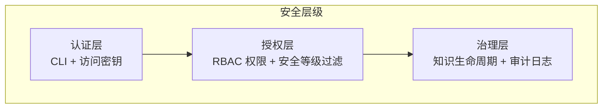
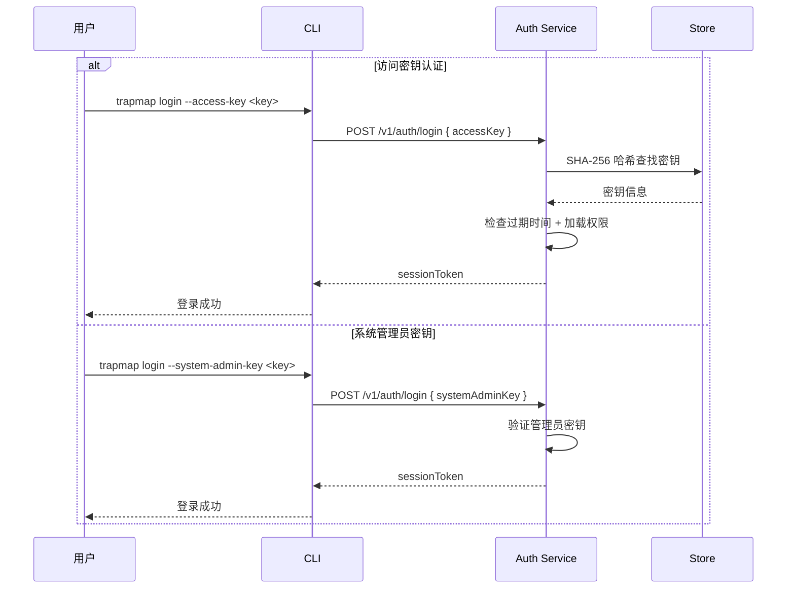
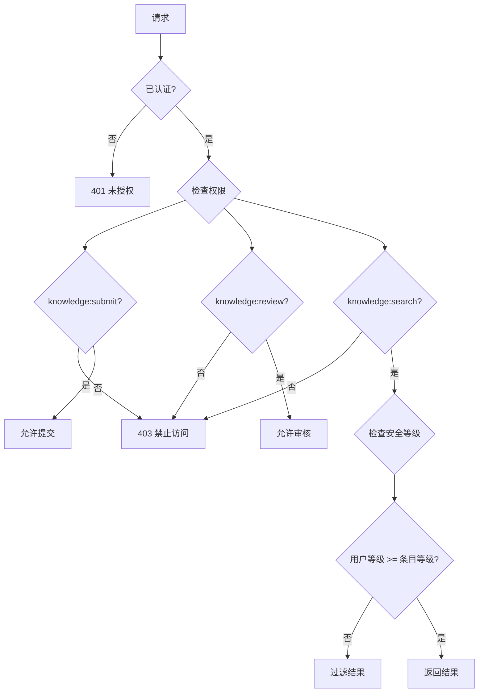

# 安全指南

本文档整合 TrapMap 的安全架构、配置清单和最佳实践。

## 安全架构概览

TrapMap 的安全模型基于三层防护：



### 认证流程图（Mermaid）



### 授权流程图（Mermaid）



## Phase 4 trust-boundary freeze

本轮微服务平台能力增强 Phase 4 没有把 service-to-service auth、mTLS 或零信任网络扩成已落地能力。当前安全 truth 仍然是：

- `gateway only`：外部调用方只通过 gateway 进入，不直连内部 service
- internal service hop 当前主要依赖现有 runtime trust boundary、canonical error normalization、request/trace propagation 和部署隔离
- `service-to-service auth hardening` 仍是 deferred platform topic；构建目标主线的非目标与问题回写规则保留在 `docs/archived/archived-plans/backend-build-targets-and-client-selection-archived.md` 供历史参考

因此当前文档只能把 internal hop 写成“已有最小运行边界”，不能写成“已具备独立 service identity、mTLS 或零信任策略默认值”。


---

## 认证机制

> TrapMap **仅支持 CLI + 访问密钥认证**，不提供用户名/密码登录或浏览器会话。

### 访问密钥认证（CLI）

| 属性 | 值 |
|------|-----|
| 密钥长度 | 32 字节，base64url 编码 |
| 存储方式 | SHA-256 哈希后存储 |
| 有效期 | 可配置（创建时设定） |
| 显示时机 | 创建时仅显示一次明文 |
| 密钥类型 | `--access-key`（成员密钥）/ `--system-admin-key`（管理员引导密钥）|

### CLI Gateway 地址配置

CLI **同时只连接一个 gateway**，本地状态里只保存单值地址。配置优先级（高→低）：

1. **`trapmap login --server <url>`** — 登录时指定，写入 `~/.trapmap/cli.json` 后持久生效
2. **`~/.trapmap/cli.json`** 中的 `gatewayUrl` 字段 — 首次登录后自动保存
3. **`TRAPMAP_GATEWAY_URL` 环境变量** — 未登录时的默认值
4. **硬编码默认值** `http://127.0.0.1:4000`

切换服务器只需重新 `trapmap login --server <新地址> --access-key <key>`。

兼容说明：CLI 仍兼容读取旧 `serverUrl` 配置，但新写入只使用 `gatewayUrl`。

### 登出行为

- 调用服务端 `POST /v1/auth/logout`
- 清除本地 `~/.trapmap/cli.json` 中的 `sessionToken` 和 `session`

---

## 安全等级

安全等级是 0-10 的整数，控制知识条目的可见性：

| 等级 | 名称 | 说明 | 典型场景 |
|------|------|------|----------|
| 0 | 公开 | 任何人可访问 | 公共文档、通用知识 |
| 1-3 | 内部 | 内部成员可访问 | 团队流程、内部规范 |
| 4-6 | 机密 | 需授权访问 | 业务信息、技术方案 |
| 7-9 | 高度机密 | 少数人可访问 | 核心架构、安全策略 |
| 10 | 最高机密 | 仅管理员可访问 | 系统密钥、凭据 |

### 访问规则

```typescript
// 用户等级 >= 条目等级 即可访问
function canAccess(userLevel: number, requiredLevel: number): boolean {
  return userLevel >= requiredLevel;
}
```

### 等级继承

```
SkillArtifact → Capsule → KnowledgeEntry
   (设定)        (继承)       (继承)
```

条目的 `requiredLevel` 继承自所属 Capsule，Capsule 继承自来源 Artifact。

---

## RBAC 权限

### 内置角色

| 角色 | 默认等级 | 权限范围 |
|------|----------|----------|
| `viewer` | 0 | 搜索、列表 |
| `contributor` | 1 | 提交、搜索、列表 |
| `reviewer` | 5 | 提交、搜索、审核、团队切换 |
| `admin` | 10 | 全部权限 |

### 权限清单

| 权限 | 说明 |
|------|------|
| `knowledge:submit` | 提交新知识条目 |
| `knowledge:search` | 搜索和检索条目 |
| `knowledge:review` | 审批/拒绝提交 |
| `knowledge:update` | 编辑现有条目 |
| `knowledge:import` | 批量导入 |
| `knowledge:export` | 批量导出 |
| `audit:read` | 查看审计日志 |
| `team:create` | 创建团队 |
| `team:list` | 列出团队 |
| `team:select` | 切换活动团队 |
| `member:create` | 添加团队成员 |
| `member:update` | 修改成员角色 |
| `member:key:create` | 生成访问密钥 |

### 最小权限原则

- 新成员默认为 `viewer` 角色
- 访问密钥权限默认等于创建者角色权限，可缩小范围
- 审核操作需要 `reviewer` 或更高角色

---

## 安全配置清单

### 必需配置

```bash
# 管理员密钥（首次部署设置，用于创建管理员账户）
TRAPMAP_SYSTEM_ADMIN_KEY=$(openssl rand -hex 32)

# AI 提供商密钥
OPENAI_API_KEY=sk-...
```

### 生产环境配置

```bash
NODE_ENV=production                    # 启用生产模式
HOST=127.0.0.1                        # 裸机/反代场景绑定本地地址
PORT=4000
LOG_USER_OPS_ENABLED=true             # 记录用户操作
LOG_RAG_ENABLED=true                  # 记录检索请求
```

如果运行在 Docker 容器内，容器内进程通常应配置为：

```bash
HOST=0.0.0.0
```

### 可选安全加固

```bash
# 限制 CORS 来源
CORS_ORIGINS=https://your-domain.com

# 速率限制（每分钟最大请求数，0 = 无限制）
RATE_LIMIT_MAX_PER_MINUTE=100

# 日志轮转
LOG_MAX_FILE_SIZE_MB=10
LOG_MAX_BACKUP_FILES=5
```

---

## 访问密钥管理

### 创建密钥

```bash
# 通过 CLI 创建
pnpm --filter @trapmap/cli dev -- access-key:create <memberId> --team <teamId> --note "CI Pipeline"
```

创建后密钥明文仅显示一次，务必立即保存到安全位置。

### 密钥安全实践

- 不要将密钥明文提交到代码仓库
- 使用环境变量或密钥管理服务存储
- 定期轮换（建议 90 天）
- 不再需要时及时撤销
- 为自动化任务创建独立密钥，限制权限范围

---

## 敏感知识处理

### 提交敏感知识

1. 设置正确的 `requiredLevel`（推荐 4-7）
2. 明确团队作用域（`teamId`），避免全局暴露
3. 在摘要中不要包含敏感细节

### 审核敏感知识

- 审核者等级必须 >= 条目等级
- 审核结果会记录审计日志
- 拒绝时需提供原因

### 知识生命周期安全

```
draft → submitted → agent-pass → approved → (可被检索)
                  → agent-rejected → (不可见)
                                    → rejected → (不可见)
                                    → deactivated → (不可检索)
```

只有 `approved` 状态的条目才会被索引和检索。`deactivated` 条目从索引中移除但仍可查看（有权限时）。

---

## 审计日志

> **Round 10 Phase 3 更新**：审计事件已从 `store_snapshot` JSONB 迁移为 `audit_events` 结构化表。PG 模式下通过 `repos.audit.listByFilter()` 查询，支持 action/actorId/entityId/teamId/时间范围过滤和分页。

### 启用审计

```bash
LOG_USER_OPS_ENABLED=true
LOG_USER_OPS_DIR=logs/user-ops
```

### 审计事件类型

| 事件 | 触发时机 |
|------|----------|
| `auth.login` | 用户登录 |
| `auth.logout` | 用户登出 |
| `auth.failed` | 登录失败 |
| `auth.access_key_created` | 创建访问密钥 |
| `auth.access_key_used` | 使用密钥认证 |
| `knowledge-reviewed`、`knowledge-deactivated` | 知识审核 / 停用 |
| `knowledge-exported`、`knowledge-imported` | 知识导出 / 导入 |
| `artifact-edited`、`artifact-reviewed`、`artifact-deactivated` | 工件编辑 / 审核 / 停用 |
| `artifact-exported`、`artifact-imported`、`artifact-history-viewed` | 工件导出 / 导入 / 历史查看 |
| `decay-batch`、`maintenance-batch`、`feedback-batch` | 批量运维动作 |
| `feedback`、`reconcile-knowledge-indexes` | 反馈提交 / 索引重同步 |

注意：当前审计 action 命名同时存在点分风格（如 `auth.login`）和连字符风格（如 `artifact-reviewed`）。文档在这里按当前实现如实列出，不再假设单一命名风格。

审计日志需要 `audit:read` 权限才能查看：

```bash
pnpm --filter @trapmap/cli dev -- audit --limit 50
```

---

## Sentry 错误智能隐私策略

Sentry 适配器（可选）在 `SENTRY_DSN` 配置时启用。以下隐私约束始终强制执行：

### 隐私保障

| 约束 | 说明 |
|------|------|
| `sendDefaultPii=false` | Sentry SDK 不自动采集 PII |
| `beforeSend` 递归脱敏 | 剥离 headers、cookies、request body、敏感 query 参数、prompt/knowledge 内容和 secrets |
| 敏感键模式匹配 | `authorization`、`cookie`、`password`、`secret`、`credential`、`prompt`、`knowledge_body`、`request_body` 等键自动替换为 `[REDACTED]` |
| 无 prompt/knowledge 正文 | 知识条目正文、prompt 内容、retrieval 结果正文不会进入 Sentry 事件 |
| 无 request body | 请求体不会进入 Sentry 事件 |
| 无 headers/cookies | 请求 headers 和 cookies 不会进入 Sentry 事件 |

### 仅捕获 actionable 错误

| 错误类型 | 是否捕获 | 说明 |
|----------|---------|------|
| 5xx 内部错误 | 是 | 服务端意外错误 |
| terminal async failure | 是 | 异步任务永久失败 |
| startup failure | 是 | 启动阶段致命错误 |
| 4xx 客户端错误 | 否 | 被抑制 |
| auth 错误 | 否 | 被抑制 |
| validation 错误 | 否 | 被抑制 |
| not-found 错误 | 否 | 被抑制 |

### safe tags（仅附加到 Sentry 事件）

| tag | 说明 |
|-----|------|
| `service` | 服务名称 |
| `environment` | 运行环境 |
| `deployment_profile` | 部署配置 |
| `owner_surface` | 负责该 surface 的边界 |
| `failure_classification` | 错误分类（来自 failure taxonomy） |
| `request_id` | 请求 ID |
| `trace_id` | 追踪 ID |
| `operation_id` | 操作 ID |

### 降级策略

- 缺少 `SENTRY_DSN`：Sentry SDK 不加载，零影响
- SDK 初始化失败：本地日志记录错误，不影响请求
- 事件传输失败：本地日志记录警告，不影响原始请求或任务完成路径
- Sentry close 超时：2 秒超时后放弃，不阻塞进程退出

---

## 相关文档

- [安全指南](SECURITY.md) — 认证流程、RBAC 和安全等级实现（本文档）
- [API 参考 — 认证](../architecture/API.md#-authentication) — 认证 API 详情
- [环境变量参考](ENVIRONMENT.md) — 完整环境变量列表
- [部署指南](../architecture/DEPLOYMENT.md) — 生产环境部署步骤

---

## Langfuse Runtime Observation 隐私策略

Langfuse 适配器（可选）在 `LANGFUSE_ENABLED` 且凭证齐全时启用。以下隐私约束始终强制执行：

### 隐私保障

| 约束 | 说明 |
|------|------|
| 默认 `strict` 隐私模式 | 等价于 `sendDefaultPii=false`；只发送 metadata、长度、哈希 |
| 无 raw prompt/output | LLM prompt、completion、embedding text 不会进入 Langfuse 事件 |
| 无 embedding vectors | Embedding 向量不会进入 Langfuse 事件 |
| 无 credentials | API keys、session tokens、credentials 不会进入 Langfuse 事件 |
| 无 request bodies | 请求体不会进入 Langfuse 事件 |
| Metadata only | 只发送 provider、operation、outcome、latencyMs、inputLength、outputDimensions、correlation IDs |

### 凭证处理

| 约束 | 说明 |
|------|------|
| Keys 不进入日志 | `LANGFUSE_PUBLIC_KEY` 和 `LANGFUSE_SECRET_KEY` 不会出现在诊断日志或 policy reason 中 |
| Keys 不进入 metadata | 凭证不会作为 observation metadata 发送到 Langfuse |
| Dynamic import | `langfuse` SDK 只在 host composition root 中动态导入，不作为硬依赖 |

### 降级策略

| 场景 | 行为 |
|------|------|
| 缺少 `LANGFUSE_*` 凭证 | SDK 不加载，零影响 |
| SDK 初始化失败 | 本地日志记录错误，不影响请求 |
| Observation 传输失败 | 本地静默忽略，不影响原始请求或任务完成路径 |
| Flush 超时 | Bounded timeout（默认 5000ms）防止挂起，超时后放弃 |

---

## CLI 路径安全

`validateOutputPath`（`packages/cli/src/lib/skill-artifact-export.ts`）在解析输出路径后执行边界检查：解析结果必须等于 `resolve(intendedDir)` 或以 `resolve(intendedDir) + sep` 为前缀。此检查防止绝对路径（如 `/etc/passwd`）绕过目录遍历防护逃逸出预期目录。`requireSessionToken` 同时验证 token 类型为 `string` 且非空，防止非字符串值绕过认证。
