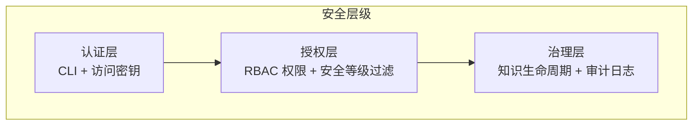
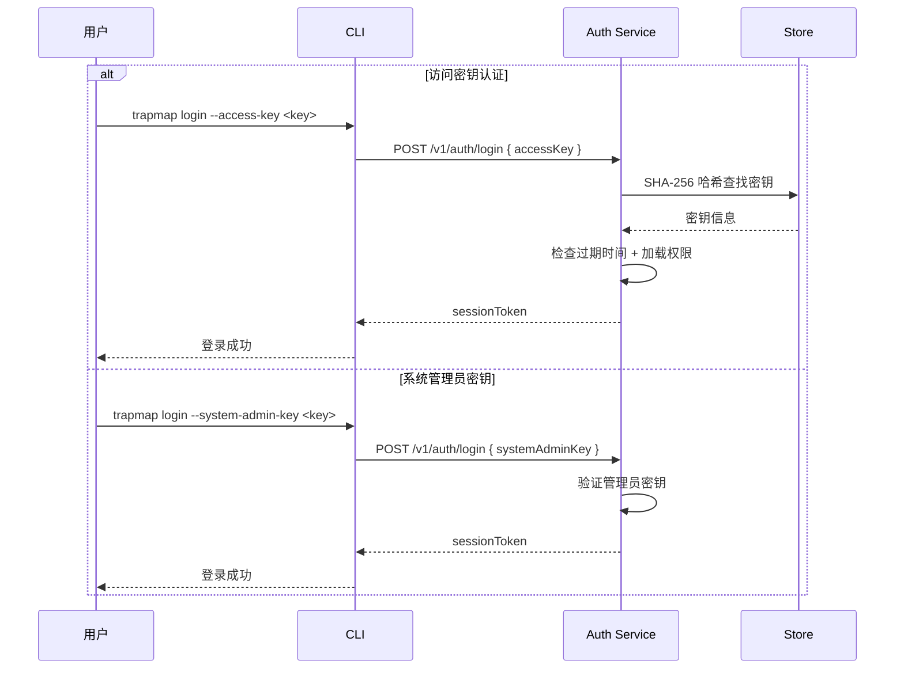
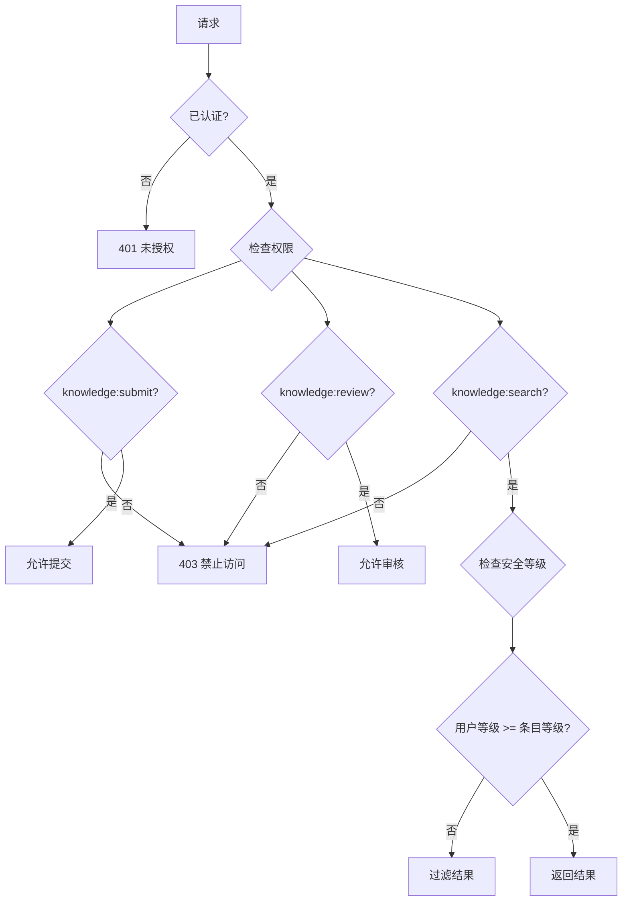

# 安全指南

> 状态：Active。本页讲 TrapMap 的安全架构、配置清单与最佳实践，变量默认值以 `docs/reference/ENVIRONMENT.md` 为准。

## 安全架构概览

TrapMap 的安全模型分三层：



### 认证流程图（Mermaid）



### 授权流程图（Mermaid）



## Phase 4 trust-boundary freeze

本轮微服务平台能力增强 Phase 4 没有把 service-to-service auth、mTLS、零信任网络扩成已落地能力。安全 truth 保持三条：

- `gateway only`：外部调用方只经网关进入，不直连内部 service
- 内部 hop 依赖现有 runtime trust boundary、canonical error normalization、request 与 trace 传播、部署隔离
- `service-to-service auth hardening` 仍是 deferred platform topic，历史依据见 `docs/archived/archived-plans/backend-build-targets-and-client-selection-archived.md（已归档，路径冻结）`

你写内部 hop 时只写"已有最小运行边界"，不写独立 service identity、mTLS、零信任策略默认值。

## 认证机制

> TrapMap 只支持 CLI 加访问密钥认证，不提供用户名密码登录或浏览器会话。

### 访问密钥认证（CLI）

| 属性 | 值 |
|------|-----|
| 密钥长度 | 32 字节，base64url 编码 |
| 存储方式 | SHA-256 哈希后存储 |
| 有效期 | 可配置，创建时设定 |
| 显示时机 | 创建时只显示一次明文 |
| 密钥类型 | `--access-key`（成员密钥）、`--system-admin-key`（管理员引导密钥）|

### CLI 网关地址配置

CLI 同时只连一个网关，本地状态只存单值地址。优先级从高到低：

1. `trapmap login --server <url>`：登录时指定，写入 `~/.trapmap/cli.json` 后持久生效
2. `~/.trapmap/cli.json` 的 `gatewayUrl` 字段：首次登录后自动保存
3. `TRAPMAP_GATEWAY_URL` 环境变量：未登录时的默认值
4. 硬编码默认值 `http://127.0.0.1:4000`

换服务器重跑一次 `trapmap login --server <新地址> --access-key <key>`。CLI 兼容读旧 `serverUrl`，新写入只用 `gatewayUrl`。

### 登出行为

- 调服务端 `POST /v1/auth/logout`
- 清本地 `~/.trapmap/cli.json` 里的 `sessionToken` 与 `session`

## 安全等级

安全等级是 0 到 10 的整数，控制知识条目可见性：

| 等级 | 名称 | 说明 | 典型场景 |
|------|------|------|----------|
| 0 | 公开 | 任何人可访问 | 公共文档、通用知识 |
| 1-3 | 内部 | 内部成员可访问 | 团队流程、内部规范 |
| 4-6 | 机密 | 需授权访问 | 业务信息、技术方案 |
| 7-9 | 高度机密 | 少数人可访问 | 核心架构、安全策略 |
| 10 | 最高机密 | 只管理员可访问 | 系统密钥、凭据 |

### 访问规则

```typescript
// 用户等级 >= 条目等级 即可访问
function canAccess(userLevel: number, requiredLevel: number): boolean {
  return userLevel >= requiredLevel;
}
```

### 等级继承

```text
SkillArtifact → Capsule → KnowledgeEntry
   (设定)        (继承)       (继承)
```

条目的 `requiredLevel` 继承自所属 Capsule，Capsule 继承自来源 Artifact。

## RBAC 权限

### 内置角色

| 角色 | 默认等级 | 权限范围 |
|------|----------|----------|
| `viewer` | 0 | 搜索、列表 |
| `contributor` | 1 | 提交、搜索、列表 |
| `reviewer` | 5 | 提交、搜索、审核、团队切换 |
| `admin` | 10 | 全部权限 |

### 权限清单

| 权限 | 说明 |
|------|------|
| `knowledge:submit` | 提交新知识条目 |
| `knowledge:search` | 搜索和检索条目 |
| `knowledge:review` | 审批或拒绝提交 |
| `knowledge:update` | 编辑现有条目 |
| `knowledge:import` | 批量导入 |
| `knowledge:export` | 批量导出 |
| `audit:read` | 查看审计日志 |
| `team:create` | 创建团队 |
| `team:list` | 列出团队 |
| `team:select` | 切换活动团队 |
| `member:create` | 添加团队成员 |
| `member:update` | 修改成员角色 |
| `member:key:create` | 生成访问密钥 |

最小权限：新成员默认 `viewer`，密钥权限默认等于创建者、可缩小，审核要 `reviewer` 及以上。

## 安全配置清单

变量默认值以 `docs/reference/ENVIRONMENT.md` 为准。下表标注了每个变量的核对结论，标"真相表有"的以真相表为准，标"未知/待确认（2026-09-08）"的还没在真相表里找到来源行，你用之前先核对代码。

### 必需配置

```bash
# 管理员密钥（首次部署设置；真相表有）
TRAPMAP_SYSTEM_ADMIN_KEY=$(openssl rand -hex 32)

# AI 提供商密钥（真相表有）
OPENAI_API_KEY=sk-...
```

### 生产环境配置

```bash
NODE_ENV=production                    # 未知/待确认（2026-09-08）
HOST=127.0.0.1                        # 真相表有：裸机或反代场景绑本地地址
PORT=4000                             # 真相表有
LOG_USER_OPS_ENABLED=true             # 未知/待确认（2026-09-08）
LOG_RAG_ENABLED=true                  # 未知/待确认（2026-09-08）
```

跑在 Docker 容器里时，容器内进程配 `HOST=0.0.0.0`。

### 可选安全加固

```bash
# 限制 CORS 来源（真相表有，默认 *）
CORS_ORIGINS=https://your-domain.com

# 速率限制，每分钟最大请求数，0 表无限制（真相表有）
RATE_LIMIT_MAX_PER_MINUTE=100

# 日志轮转（未知/待确认（2026-09-08））
LOG_MAX_FILE_SIZE_MB=10
LOG_MAX_BACKUP_FILES=5
```

## 访问密钥管理

### 创建密钥

命令旗标已按 `apps/cli/src/commands/member.ts` 核对，需要登录态：

```bash
pnpm --filter @trapmap/cli dev -- access-key:create <memberId> --team <teamId> --note "CI Pipeline"
```

密钥明文只显示一次，你立刻存到安全位置。

### 密钥安全实践

- 明文不进代码仓库
- 走环境变量或密钥管理服务存放
- 定期轮换（建议 90 天）
- 不用就撤销
- 自动化任务用独立密钥，权限收紧

## 敏感知识处理

### 提交敏感知识

1. `requiredLevel` 设 4 到 7
2. 明确团队作用域（`teamId`），不全局暴露
3. 摘要里不放敏感细节

### 审核敏感知识

- 审核者等级大于等于条目等级
- 审核结果进审计日志
- 拒绝要给原因

### 知识生命周期安全

```text
draft → submitted → agent-pass → approved → (可被检索)
                  → agent-rejected → (不可见)
                                    → rejected → (不可见)
                                    → deactivated → (不可检索)
```

只有 `approved` 进索引。`deactivated` 移出索引，有权限仍可查看。

## 审计日志

审计事件已从 `store_snapshot` JSONB 迁到 `audit_events` 结构化表。PG 模式经 `repos.audit.listByFilter()` 查，支持 action、actorId、entityId、teamId、时间范围过滤加分页。

### 启用审计

```bash
LOG_USER_OPS_ENABLED=true             # 未知/待确认（2026-09-08）
LOG_USER_OPS_DIR=logs/user-ops        # 未知/待确认（2026-09-08）
```

### 审计事件类型

| 事件 | 触发时机 |
|------|----------|
| `auth.login` | 用户登录 |
| `auth.logout` | 用户登出 |
| `auth.failed` | 登录失败 |
| `auth.access_key_created` | 创建访问密钥 |
| `auth.access_key_used` | 使用密钥认证 |
| `knowledge-reviewed`、`knowledge-deactivated` | 知识审核与停用 |
| `knowledge-exported`、`knowledge-imported` | 知识导出与导入 |
| `artifact-edited`、`artifact-reviewed`、`artifact-deactivated` | 工件编辑、审核、停用 |
| `artifact-exported`、`artifact-imported`、`artifact-history-viewed` | 工件导出、导入、历史查看 |
| `decay-batch`、`maintenance-batch`、`feedback-batch` | 批量运维动作 |
| `feedback`、`reconcile-knowledge-indexes` | 反馈提交与索引重同步 |

action 命名同时有点分风格（`auth.login`）与连字符风格（`artifact-reviewed`），本页按实现如实列，不假设单一风格。查看要 `audit:read` 权限，`--limit` 旗标已按 `apps/cli/src/commands/audit.ts` 核对：

```bash
pnpm --filter @trapmap/cli dev -- audit --limit 50
```

## Sentry 错误智能隐私策略

Sentry 适配器可选，配 `SENTRY_DSN` 才启用（该变量未知/待确认（2026-09-08），真相表里没有它）。隐私约束强制执行：

| 约束 | 说明 |
|------|------|
| `sendDefaultPii=false` | 不自动采集 PII |
| `beforeSend` 递归脱敏 | 剥离 headers、cookies、request body、敏感 query 参数、prompt 与 knowledge 内容、secrets |
| 敏感键模式匹配 | `authorization`、`cookie`、`password`、`secret`、`credential`、`prompt`、`knowledge_body`、`request_body` 等键替换为 `[REDACTED]` |
| 无 prompt 与 knowledge 正文 | 条目正文、prompt 内容、检索结果正文不进 Sentry 事件 |
| 无 request body | 请求体不进 Sentry 事件 |
| 无 headers 与 cookies | 请求 headers 与 cookies 不进 Sentry 事件 |

只收 5xx、terminal async failure、startup failure 三类。4xx、auth、validation、not-found 一律抑制。safe tags 只带 `service`、`environment`、`deployment_profile`、`owner_surface`、`failure_classification`、`request_id`、`trace_id`、`operation_id`。缺 DSN 时 SDK 不加载，初始化失败与传输失败只记本地日志，close 超时 2 秒放弃。

## Langfuse Runtime Observation 隐私策略

Langfuse 适配器可选，`LANGFUSE_ENABLED` 且凭证齐全才启用（相关变量未知/待确认（2026-09-08），真相表里没有它们）。隐私约束强制执行：

| 约束 | 说明 |
|------|------|
| 默认 `strict` 隐私模式 | 只发 metadata、长度、哈希 |
| 无 raw prompt 与 output | prompt、completion、embedding 文本不进 Langfuse 事件 |
| 无 embedding 向量 | 向量不进事件 |
| 无 credentials | API key、session token 不进事件与日志 |
| 无 request body | 请求体不进事件 |
| Metadata only | 只发 provider、operation、outcome、latencyMs、inputLength、outputDimensions、correlation ID |

凭证不进日志与 metadata，SDK 只在 host composition root 动态 import。缺凭证时不加载，初始化失败记本地日志，传输失败静默忽略，flush 超时默认 5000ms 后放弃。

## CLI 路径安全

`validateOutputPath`（`apps/cli/src/lib/skill-artifact-export.ts`）解析输出路径后做边界检查：结果必须等于 `resolve(intendedDir)` 或以它加分隔符为前缀，挡绝对路径逃逸。`requireSessionToken` 验证 token 是非空 string，挡非字符串绕过认证。

## 相关文档

- [TrapMap API 契约表面](../reference/api-surface.md)：认证 API 详情
- [环境变量](../reference/ENVIRONMENT.md)：完整变量列表
- [TrapMap 部署指南](../architecture/DEPLOYMENT.md)：生产部署步骤

## 常见用法

下面命令的旗标已按 `apps/cli/src/commands/` 核对。变量默认值以 `docs/reference/ENVIRONMENT.md` 为准。

### 建密钥给新成员

前置条件：你已用有权限的身份登录。

```bash
pnpm --filter @trapmap/cli dev -- access-key:create <memberId> --team <teamId> --note "CI Pipeline"
```

密钥明文只显示一次，你立刻存到安全位置，不进代码仓库。

### 查最近审计事件

```bash
pnpm --filter @trapmap/cli dev -- audit --limit 50
```

查看要 `audit:read` 权限。事件命名同时有点分与连字符两种风格，你按上文审计事件类型表过滤。

### 换网关地址重登录

```bash
pnpm --filter @trapmap/cli dev -- login --server <新地址> --access-key <key>
```

CLI 只存单值网关地址（`~/.trapmap/cli.json` 的 `gatewayUrl`），换服务器重跑一次登录即可。
