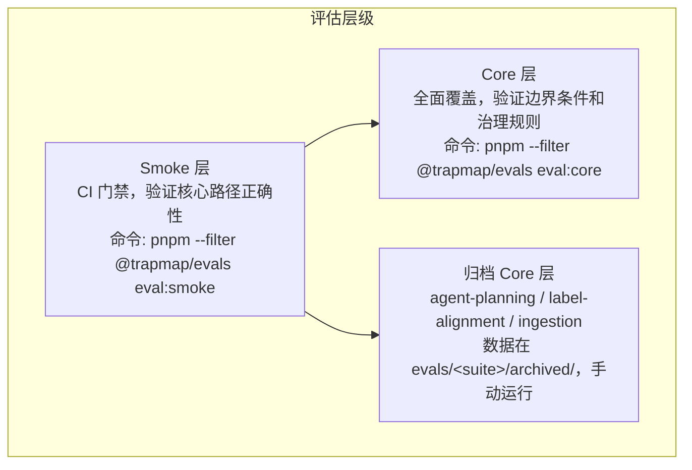

# 测试指南

> 状态：Active。本页讲测试架构、跑法与用例规范，命令全部在仓库根执行。

## 测试架构

TrapMap 用 Smoke 加 Core 两层评估（Wave 8 之后，非核心 suite 的 core tier 归档为手动 tier）：



tier 归属（owner 与变更门禁见各 suite README 与 `evals/README.md` 的 suite 矩阵）：

- **retrieval、summary、graph-extraction**：core tier 保持 active
- **agent-planning、label-alignment、ingestion**：core tier 已归档（`evals/<suite>/archived/`），`--tier core` 仍可手动跑，不进 CI
- **CI 门禁**：`pnpm --filter @trapmap/evals eval:smoke`（aggregate）加 `pnpm --filter @trapmap/evals eval:ci`（baseline-aware runner）加 `pnpm --filter @trapmap/evals eval:snapshots` 生成的六套 parity 快照（`eval-parity` job 逐 case 比对）

### 评估类型

| 类型 | 说明 | 运行器 | Owner |
|------|------|--------|-------|
| 检索评估 (Retrieval) | 召回相关性与治理正确性 | `evals/retrieval/run.ts` | 检索召回与路由 owner |
| 摘要评估 (Summary) | 摘要忠实度与覆盖率 | `evals/summary/run.ts` | 摘要 owner |
| 路径规划评估 (Agent Planning) | 路径规划质量对比 | `evals/agent-planning/run.ts` | agent-planning eval owner |
| 标签对齐评估 (Label Alignment) | 标签召回与对齐决策 | `evals/label-alignment/run.ts` | label-alignment eval owner |
| 图提取评估 (Graph Extraction) | 图提取、去重、冲突评测 | `evals/graph-extraction/run.ts` | 图提取 owner |
| 摄取评估 (Ingestion) | Skill 目录摄取正确性 | `evals/ingestion/run.ts` | ingestion eval owner |
| 治理评估 (Governance) | RBAC 与安全等级过滤 | 内嵌于检索评估 | 检索召回与路由 owner |

## 运行测试

### 单元测试

离线可跑，PG 集成用例在没有数据库时自动跳过。

```bash
# 全量测试
pnpm test

# 按包跑，三个包的 test 脚本都存在，可直接用
pnpm --filter @trapmap/contracts test --run
pnpm --filter @trapmap/backend-core test --run
pnpm --filter @trapmap/host-local test --run

# 覆盖率
pnpm test:coverage

# 类型检查
pnpm typecheck
```

`packages/server/` 兼容壳已于 2026-07-31 删除，旧文档里的 `pnpm --filter @trapmap/server test` 写法一律换成上面三个包级命令。

### 单文件测试

根 `vitest.config.ts` 用多 project 配置。你在仓库根跑单文件时用 `test:file`，它把路径映射到唯一 project，避免跨 project 误命中同名文件：

```bash
pnpm test:file -- packages/contracts/test/domain/task-queue.test.ts
```

`packages/contracts/test/domain/task-queue.test.ts` 是真实存在的文件，拿它当路径格式的参照。包内跑法也行，例如 `pnpm --filter @trapmap/contracts test --run <包内相对路径>`。

### Langfuse Observation 测试

```bash
pnpm test:file -- packages/contracts/test/domain/observability-config.test.ts

pnpm test:file -- packages/host-local/test/nest/observability/langfuse-sink.test.ts

pnpm test:file -- packages/host-local/test/nest/observability/langfuse.service.test.ts

pnpm test:file -- packages/ai-providers/test/observability.test.ts

pnpm test:observability-closeout
```

要点：disabled 与 enabled 切换、凭证缺失、flush 超时边界、隐私模式；wrapper 不泄露 raw prompt、output、向量，correlation ID 正常传播。

### 部署与运行时最小验证矩阵

host-local closeout 主链路固定为 build、start、observability-benchmark。`dev` 只做开发便利，不算 closeout 判据。

```bash
pnpm --filter @trapmap/app-light build
pnpm --filter @trapmap/app-light start

pnpm test:observability-closeout

pnpm test:observability-benchmark -- --base-url http://127.0.0.1:4000

pnpm test:discovery-closeout

pnpm test:distributed-closeout

pnpm test:deployment-smoke

pnpm test:runtime-closeout

pnpm test:runtime-foundations

pnpm test:light-target

pnpm test:heavy-target

pnpm typecheck

pnpm check:docs
```

`test:observability-benchmark` 与 `test:runtime-closeout`（含 `:compose` 变体）需要运行中的网关或 Docker，不要在离线环境跑。改动涉及 `packages/host-distributed` 的权威写路径、网关透传、internal client 语义或 job ownership 时，`pnpm test:distributed-acceptance` 是必跑门，不用 `test:deployment-smoke` 代替。

手动 smoke 判定标准：CLI 只连网关，不直连 worker。`local-agent` 裁掉的治理、团队、运维 API 返回 `501 capability_unsupported`，distributed worker 命中业务 API 同样返回 `501`。

部署级 operator closeout 用 `pnpm test:runtime-closeout`，它要求网关支持 `/v1/auth/login` 与 `/v1/operations/status/async`，验证 `deploymentProfile`、网关唯一入口、`queue.reclaimCount`、`queue.recentDeadLetters`、`outbox.staleProcessing`、`outbox.reclaimCount`、`outbox.recentFailures` 对 operator 可见，retry 与 dead-letter 策略以 `retryResumeContract` 为唯一事实源。

### Phase 4 验证归属矩阵

验证矩阵固定为两类部署形态。默认本地入口是 `packages/host-local/src/nest/**`，distributed 主线由 `host-distributed` 承担。

#### Backend target 命令

| Target | Profile | App 包（宿主库包） | Build | Verification |
|---|---|---|---|---|
| `light` | `local-agent`、`team-monolith` | `@trapmap/app-light`（`@trapmap/host-local`） | `pnpm build:light` | `pnpm test:light-target` |
| `heavy` | `distributed` | `@trapmap/app-distributed`（`@trapmap/host-distributed`） | `pnpm build:heavy` | `pnpm test:heavy-target` |

命令映射的 owner 是 `scripts/backend-target-registry.ts`。`heavy` 只证明过渡中的分布式拓扑，不证明物理库隔离、Kubernetes、mTLS、独立控制面或与 `light` 的能力对等。

#### 单体验证（host-local 默认轻宿主）

| 验证层 | 命令 | 说明 |
|---|---|---|
| 包级最小测试 | `pnpm --filter @trapmap/<pkg> test --run <path>` | 各包独立测试 |
| 类型检查 | `pnpm typecheck` | 全 workspace 类型检查 |
| Observability closeout | `pnpm test:observability-closeout` | 探针加 request、trace、metrics、log 关联链路 |
| Deployment smoke | `pnpm test:deployment-smoke` | profile、preset、runtime、路由暴露、CLI 网关唯一性 |
| Runtime foundations | `pnpm test:runtime-foundations` | runtime 元数据、readiness、ownership、启动地基 |
| 文档守卫 | `pnpm check:docs` 加 `pnpm check:structure` | 叙事与命令一致性、目录规则 |
| 表清单守卫 | `pnpm check:table-schema` | `db` 的 42 张 `pgTable` 对 `DATABASE_SCHEMA.md` 的 diff |
| pgTable 单源守卫 | `pnpm check:pgtable-single-source` | service 包不重定义表 |
| Eval import 边界守卫 | `pnpm check:eval-imports` | evals 不直连 service 内部文件 |
| @eval-only 标记守卫 | `pnpm check:eval-only` | eval-only 模块带标记 |
| Eval smoke | `pnpm --filter @trapmap/evals eval:smoke` | 只在检索、摘要、治理、feedback、eval runner 相关改动时纳入 |

#### 分布式验证（host-distributed 主线）

| 验证层 | 命令 | 说明 |
|---|---|---|
| Discovery closeout | `pnpm test:discovery-closeout` | consul adapter、resolver、TTL 缓存、round-robin fallback |
| Distributed acceptance | `pnpm test:distributed-closeout` | 网关转发、remote write 委托、error、header、auth 语义、job ownership |
| Runtime closeout | `pnpm test:runtime-closeout` | 部署级 operator closeout，async status contract，queue 与 outbox reclaim |
| 全部单体验证层 | 同上 | 分布式验证不替代单体验证，两层独立跑 |

#### Owner Service 验证归属

| Owner Service | 包级测试 | 分布式 acceptance | 说明 |
|---|---|---|---|
| `gateway` | `host-local`、`host-distributed` | 网关转发、auth 传播 | 不拥有业务真相 |
| `identity-access` | `service-identity-access` | auth 与 session 校验 | 基础 owner service |
| `knowledge-read` | `service-knowledge-read` | 检索投影新鲜度 | 只解释读侧 |
| `knowledge-write` | `service-knowledge-write` | knowledge-write 内部命令面 | 写侧真相 owner |
| `governance-review` | `service-governance-review` | 治理向 knowledge-write 的委托 | 治理命令 owner |
| `candidate-ingestion` | `service-candidate-ingestion` | 候选解决向 knowledge-write 的委托 | 候选 owner |
| `job-runtime` | `service-job-runtime` | 调度、状态、队列、reclaim | 只拥有 runtime substrate |
| `cron` | `service-cron` | cron 注册、触发、状态加 scheduler 认领 | 只拥有 `cron_jobs` 注册表 |

根计划收尾审计（只改文档、守卫、计划关闭）不用重跑实现型 smoke，但保留 contracts、badcase export、distributed closeout 的 focused proof，防止旧口径把 `debug` 与 `draft` 边界、传播证据、deferred seam 写回旧描述。root-plan closeout 的最小文档证据回答三件事：operator runbook、dashboard/alert/SLO、active 对 archived 索引状态。

### Phase 2 Store Snapshot / PG-first Freeze Checks

`snapshot-usage-guard.test.ts` 与 `pg-first-compat.test.ts` 随 server 包在 2026-07-31 退役，旧命令里的 `归档旧实现/...` 路径已不存在。本节冻结的是它们的判定口径，不是可执行文件：新的 `store.snapshot()` 与 `store.transact()` 调用不许逃出命名 compatibility buckets，PG-first surface 在 InMemory fallback 下保持相同外部 contract。你用这组命令验证等价结论：

```bash
pnpm check:docs

pnpm check:table-schema

pnpm check:structure
```

### Phase 3 Unified Adapter Freeze Checks

最小验证矩阵：

```bash
pnpm check:docs
pnpm check:structure
```

Phase 3 只冻结边界文案与 authoritative placement，不扩张 runtime behavior。

### Phase 4 Adapter Env / Target Freeze Checks

最小验证矩阵：

```bash
pnpm check:docs
pnpm check:structure
```

验证重点是 selector env、provider 专属 env、推荐 profile 与 target 组合、fail-fast 与 fallback 规则、optional dependency 与 target-pruning 的文档边界。关闭条件是 remediation detail plan、`SYSTEM_TRUTH_SOURCES.md`、`PACKAGES.md`、`ENVIRONMENT.md`、`DEPLOYMENT.md`、`TESTING.md` 已同步，且 focused checks 通过并记入 phase report。

### Phase 5 Distributed Baseline Freeze Checks

最小验证矩阵：

```bash
pnpm check:docs
pnpm check:structure
```

冻结 distributed 成熟度基线、网关唯一外部入口、共享 PostgreSQL 过渡姿态、真实内部 hop 证据、compose 拓扑限制、deferred platform boundary，不引入新 runtime behavior。

### Phase 6 Mature Capability Freeze Checks

最小验证矩阵：

```bash
pnpm check:docs
pnpm check:structure
```

冻结 mature-capability 与 library-replacement 的 truth 边界：internal client 加 resilience、tracing 加 metrics、限流加 bulkhead 与背压、缓存加失效、服务发现、DB budget 与 PgBouncer、health indicator、`light` 与 `heavy` 姿态、graph runtime 配置的 current 对 deferred 边界。

### Phase 7 Maintainability / CI-Testing Truth / Documentation Closeout Checks

最小验证矩阵：

```bash
pnpm check:docs
pnpm check:structure
pnpm check:asserts
pnpm check:deps
pnpm check:complexity
pnpm --filter @trapmap/evals eval:smoke
```

CI 与测试口径冻结如下：`pnpm run ci` 是仓库聚合 CI 本地入口；`pnpm --filter @trapmap/evals eval:smoke` 是 smoke tier 统一聚合器；`pnpm --filter @trapmap/evals eval:ci` 是 baseline-aware CI runner 的默认 smoke 入口；`pnpm --filter @trapmap/evals eval:ci:core` 是同一 runner 的 core 入口，次级文档不改写成别的用户面命令。

## 评测（Eval）

### 本地运行

```bash
# Smoke 层（PG 协调，需要 Docker）
pnpm --filter @trapmap/evals eval:smoke

# Core 层
pnpm --filter @trapmap/evals eval:core

# 仅检索
pnpm --filter @trapmap/evals eval:retrieval:smoke
pnpm --filter @trapmap/evals eval:retrieval:core

# 仅摘要
pnpm --filter @trapmap/evals eval:summary:smoke
pnpm --filter @trapmap/evals eval:summary:core

# Dry-run（验证用例格式，不执行，离线可跑）
pnpm exec tsx evals/scripts/eval-all.ts --tier smoke --dry-run --allow-empty
```

`--runner promptfoo` 是默认执行引擎（传 `native` 也走 promptfoo，保留 flag 只为兼容）。快照 parity 的判定快照在 `evals/promptfoo/snapshots/`，`eval.yml` 的 `eval-parity` job 是 blocking。单 suite 验证命令见各 suite README，统一用 `pnpm --filter @trapmap/evals eval -- <suite> --tier smoke --dry-run` 起手。

### 模拟 CI 运行

```bash
# 模拟 CI smoke（含 baseline 对比）
pnpm --filter @trapmap/evals eval:ci

# 模拟 CI core
pnpm --filter @trapmap/evals eval:ci:core

# 看 JSON 报告
cat reports/eval-report.json
```

### PostgreSQL 全量评测

需要 `.env` 里配好 `TRAPMAP_DATABASE_URL` 或 `DATABASE_URL`，且 `trapmap-postgres` 容器在跑。eval runner 不自动读 `.env`，你先 source 再跑。

```bash
set -a && source .env && set +a

pnpm --filter @trapmap/evals eval:retrieval --tier core --json --json-path reports/eval/retrieval-core-postgres.json

pnpm --filter @trapmap/evals eval:summary --tier core --provider fallback --json --json-path reports/eval/summary-core-postgres.json
```

图提取日志出现 `DEGRADED` 或 `WARNING: Chat provider not configured` 时，那次运行只能记 degraded，不能当 live 证据。摘要 multi-fact 用例需要真实 embedding provider，fallback embedding 可能召回失败。

### Live Retrieval Eval（真实后端）

Live eval 跑在真实 TrapMap 实例上，用命名 snapshot 版本控制数据变量。`frozen` 模式恢复完整派生状态做回归检测，`rebuild` 模式只恢复 source 数据走完整 indexing pipeline。`stable` 断言在任何兼容 snapshot 上必须过，`version-sensitive` 断言只做版本间对比。

```bash
# 最小验证（dry-run，离线可跑）
pnpm test:file -- evals/retrieval-live/lib/live-eval.test.ts

pnpm --filter @trapmap/evals eval:retrieval:live --snapshot-version test-smoke-baseline --base-url http://localhost:3000 --dry-run
```

全量验证需要运行中的服务：

```bash
pnpm dev

TRAPMAP_LIVE_EVAL_TOKEN=<token> pnpm --filter @trapmap/evals eval:retrieval:live:smoke \
  --snapshot-version 2026-07-baseline \
  --base-url http://localhost:3000 \
  --json --json-path ./reports/live-smoke.json

pnpm --filter @trapmap/evals eval:retrieval:live:compare \
  --baseline ./reports/live-baseline.json \
  --current ./reports/live-current.json
```

### 快照导出与回放

```bash
pnpm exec tsx --tsconfig tsconfig.base.json scripts/archived/export-retrieval-db-snapshot.ts --output <path> [--teamId <teamId>]
```

导出的是 retrieval 回放所需的 knowledge、artifact、graph 文档子集，不是全库转储。scenario 用 `snapshot.kind='retrieval-db-snapshot'` 加 `snapshot.path` 声明回放，runner 先恢复快照再执行 case。

## 文档漂移与复杂度守卫

```bash
# 阻断层 doc-drift、mermaid、md-lint 加可见层 doc-truth、doc-references、links
pnpm check:docs

# 热点文件行数预算
pnpm check:complexity

# 表清单、pgTable 单源、eval import 边界、@eval-only
pnpm check:table-schema
pnpm check:pgtable-single-source
pnpm check:eval-imports
pnpm check:eval-only
```

表清单守卫以 `packages/db/src/schema/` 的 42 张 `pgTable` 为权威。push CI 另跑 `pnpm check:fallow`（死代码、重复、循环依赖、复杂度零容忍）与本地 `pnpm duplication`（jscpd，阈值见 `.jscpd.json`）互补，不互相替代。

## Runtime Foundations Verification

改动 request context、health 与 readiness、shared resilience、queue 或 outbox 可靠性时，你至少跑这组矩阵：

```bash
pnpm test:runtime-foundations

pnpm test:deployment-smoke

pnpm check:docs

pnpm check:deps

pnpm check:structure
```

说明：共享 runtime metrics 是内部与 test-visible snapshot，不要求稳定对外 endpoint；`/ready` 在 `readiness === "not-ready"` 时返回 `503`；PostgreSQL 模式下 `queueWorker` 与 `outboxWorker` 都纳入 readiness 解释；改 runtime doc contract 同步更新 `SYSTEM_TRUTH_SOURCES.md` 与 `scripts/complexity-budgets.json` 的 docRules。

## 按变更类型的验证矩阵

| 变更类型 | 必须运行的验证 |
|----------|--------------|
| 文档修改 | `pnpm check:docs` 加 `pnpm check:deps` |
| 命令范围变更 | `pnpm check:docs` 加 smoke 测试 |
| 环境默认值变更 | `pnpm check:docs` 加 smoke 测试 |
| 深层架构文档变更 | `pnpm check:docs` 加 smoke 测试 |
| Schema 变更 | `pnpm test` 加 contracts typecheck 加 `pnpm --filter @trapmap/evals eval:smoke` 加 `pnpm check:docs`，并更新 `DATABASE_SCHEMA.md` 表计数 |
| CI 配置变更 | `pnpm check:docs` 并更新 `CI_CD.md` |
| 架构变更 | `pnpm check:docs` 加 `pnpm check:complexity` 加 `pnpm --filter @trapmap/evals eval:smoke` |
| 脚本或守卫变更 | 单文件测试加 `pnpm check:docs` |
| 评测命令变更 | `pnpm check:docs` 加 smoke 测试 |
| 贡献指南变更 | `pnpm check:docs` 加 smoke 测试 |

## 检索评估指标

| 指标 | 含义 |
|------|------|
| Hit@1 | 首条即相关 |
| Hit@5 | 前 5 条含相关 |
| MRR | 相关排名倒数均值 |
| nDCG | 归一化折损累计增益 |

用例 `passed` 只看 outcome 与 governance 断言，不看排名指标。排名漂移用 `eval:ci` 的基线对比抓，不要只看 pass 与 fail。治理失败类型（`forbidden-hit`、`unexpected-empty`、`unexpected-non-empty`、`shape-mismatch`）与相关性分开追踪，高相关盖不住权限泄漏。

`/v1/retrieval/skills/search-by-content` 纳入 retrieval eval 合同边界：smoke 用正向命中 case，core 用 mixed-visibility 治理 case，断言走 `expected.shape.expectedArtifactIds`。

## 摘要评估指标

| 维度 | 含义 | 检查方法 |
|------|------|----------|
| Groundedness | 基于检索上下文 | 事实提取加交叉验证 |
| Coverage | 覆盖关键信息 | 关键点匹配率 |
| Hallucination | 无源外声明 | 禁止声明检测 |

## 添加测试用例

检索用例在 `evals/retrieval/datasets/` 里用 `@trapmap/contracts` 的 schema 定义，`tier` 取 `smoke` 或 `core`，再进对应层级文件导出。需要 fixture 数据时在 `evals/retrieval/scenarios/` 加场景。摘要用例同理，`requiredFacts`、`forbiddenClaims`、`minGroundedness`、`minCoverage` 四件套写全。Schema 位置：`packages/contracts/src/domain/evals/`。

## Feedback Remediation 最小验证

同一 trap 或 skill 的未解决 feedback 达到 10 条时，条目进 `/v1/operations/feedback/remediation`，检索侧硬过滤，edit 后推进 `in-remediation`，approve 后推进 `ready-to-reindex`，complete 端点先刷新索引再批量 resolve。你用 feedback、retrieval、review、skill-edit、skill-review 五组包级测试覆盖这条链（路径按现包布局，旧 `归档旧实现/...` 引用已失效）。

## 运维验证序列 Phase 5 Operations

前置：PostgreSQL 已起、schema 已应用、至少 1 个 approved artifact、CLI 已登录。

```bash
# 健康检查，确认索引状态
trapmap operations capsule-index health

# 定点重建某 artifact 索引
trapmap operations capsule-index rebuild --mode artifact --artifact-id <artifact-id>

# 全量重建
trapmap operations capsule-index rebuild

# 孤立清理
trapmap operations capsule-index cleanup-orphans
```

`missingKeywords` 高走定点重建，`failedKeywords` 看 `lastError` 修完再重建，`orphanKeywords` 高走清理。

## Badcase Export 与 Decision Metrics

operator 导出走 `GET /v1/operations/badcases/:feedbackId/export`，脚本导出走 `pnpm exec tsx scripts/archived/export-badcase-to-eval.ts <feedbackId> <outputPath>`，两边 draft shape 一致。route 额外携带的 `debug` 仅用于 operator/debug 闭环，不属于 eval draft payload。决策指标看 `GET /v1/operations/stats/summary` 的 `asyncArchitecture`、`cacheHitRateByNamespace`、`badcaseExportCount`、`retrievalFailureDistribution`、`thresholds`。

## Distributed acceptance closeout

`pnpm test:distributed-acceptance` 验证真实 HTTP owner hop、correlation、错误分类、deadline 与 retry、幂等 replay；`pnpm test:distributed-closeout` 验证多进程恢复。该证据只支持过渡微服务成熟度，不做 Level 3 声明。

## 相关文档

- [安全指南](SECURITY.md)：RBAC 与安全等级
- [环境变量真相表](../reference/ENVIRONMENT.md)：测试相关环境变量

## 常见用法

下面命令全部在仓库根执行。前置条件按条标注，无标注即离线可跑。

### 只改了一个包

```bash
pnpm --filter @trapmap/contracts test --run
pnpm typecheck
```

你把包名换成你改的包（三包命令见上文单元测试一节）。PG 集成用例无库时自动跳过，你不用先起库。

### 只改了一个文件

```bash
pnpm test:file -- packages/contracts/test/domain/task-queue.test.ts
```

你把路径换成你改的文件。`test:file` 把路径映射到唯一 project，避免跨 project 误命中同名文件。

### 只改了评测用例

```bash
pnpm exec tsx evals/scripts/eval-all.ts --tier smoke --dry-run --allow-empty
```

这条离线可跑，只验用例格式不执行。通过后再跑 `pnpm --filter @trapmap/evals eval:smoke`（需要 Docker）。

### 只改了文档或守卫

```bash
pnpm check:docs
pnpm check:structure
```

这两条覆盖漂移、mermaid、md-lint 与目录规则。改守卫脚本另加对应单文件测试。
