# 数据库表结构快速参考

> **历史说明**：`packages/server（Wave-10 已删除）` 已于 Wave-10 删除（提交 `a66d94e6`）。本文档中的 `packages/server（Wave-10 已删除）` 路径指向已删除的实现，概念描述仍然适用但路径已不存在。表定义现由 `packages/persistence-schema/src/` 统一持有。详见 `docs/archived/archived-plans/compatibility-shell-retirement-runtime-infra-ownership.md`。

> **源码真实来源**: `packages/persistence-schema/src/`
> **表定义目录**: `packages/persistence-schema/src/`
> **数据模型详情**: `docs/reference/DATA_MODEL.md`
> **迁移基线**: 六个 `packages/service-*/drizzle/` 目录各自拥有一个空库 baseline；distributed host 按 `identity-access → knowledge-write → candidate-ingestion → governance-review → job-runtime → knowledge-read` 协调执行。

## 迁移操作

迁移只支持从空数据库建立当前 schema。已有开发数据库必须重建；不支持旧 `0000–0020` 历史的原地升级。`store_snapshot` 及其 JSONB 兼容层已于 Wave-9 删除；遗留数据的一次性 backfill 已完成并退役（详见 `docs/archived/archived-plans/compatibility-shell-retirement-runtime-infra-ownership.md`）。

## 技术栈

| 组件 | 技术 |
|------|------|
| 数据库 | PostgreSQL 16 + pgvector 扩展 |
| ORM | Drizzle ORM |
| 向量搜索 | pgvector (384 维 HNSW 索引) |
| 全文搜索 | tsvector + GIN 索引 |

## 表总览 (62 张表)

### 知识域 (14 表)

| 表名 | 用途 | 主键 |
|------|------|------|
| `knowledge_entries` | 知识条目主表 | `id` (text) |
| `knowledge_revisions` | 条目修订历史 | `id` (text) |
| `lifecycle_events` | 状态变更审计 | `id` (text) |
| `knowledge_labels` | 结构化标签 | 唯一索引 `(entry_id, label)` |
| `knowledge_boundary_contexts` | 情境上下文 | `id` (identity) |
| `knowledge_boundary_versions` | 版本范围 | `id` (identity) |
| `knowledge_boundary_prerequisites` | 前置条件 | `id` (identity) |
| `knowledge_boundary_signals` | 相关性信号 | `id` (identity) |
| `knowledge_boundary_exclusions` | 排除条件 | `id` (identity) |
| `knowledge_boundary_evidence` | 外部证据 | `id` (identity) |
| `knowledge_maintenance_assignments` | 维护指派 (1:1) | `entry_id` (text) |
| `knowledge_embeddings` | 向量嵌入 (pgvector) | `id` (text) |
| `knowledge_keywords` | 关键词索引 (GIN) | `id` (text) |
| `knowledge_search_documents` | 全文搜索 (tsvector) | `(entry_id, revision_no)` |

### 技能工件域 (22 表，含 2 张派生索引表)

> **Round 4 事实源规则**：结构化子表为事实源，`skill_artifacts` 和 `artifact_revisions` 上的对应 JSONB 列为兼容缓存。
> 读取时结构化优先，写入时两套表示同步维护。详见 [`round4-cross-table-consistency-plan.md`](../plans/round4-cross-table-consistency-plan.md) 阶段 0。

| 表名 | 用途 | 角色 | 主键 |
|------|------|------|------|
| `skill_artifacts` | 技能工件主表 | **JSONB 缓存 + 根级事实源** | `id` (text) |
| `artifact_revisions` | 工件修订历史 | **JSONB 缓存 + 修订级事实源** | `id` (text) |
| `artifact_lifecycle_events` | 工件状态变更审计 | **事实源** | `id` (text) |
| `skill_artifact_files` | 文件记录 | **结构化事实源** (覆盖 `artifact_revisions.files` JSONB) | `id` (identity) |
| `skill_artifact_script_descriptors` | 脚本描述符 | **结构化事实源** (覆盖 `artifact_revisions.script_descriptors` JSONB) | `id` (identity) |
| `skill_artifact_profiles` | 派生配置 (1:1) | **结构化事实源** (覆盖 `artifact_revisions.derived.profile` JSONB) | `artifact_revision_id` (text) |
| `skill_artifact_capsules` | 派生胶囊 | **结构化事实源** (覆盖 `artifact_revisions.derived.capsules` JSONB) | `capsule_id` (text) |
| `skill_artifact_client_manifests` | 客户端清单 (1:1) | **结构化事实源** (覆盖 `artifact_revisions.derived.clientManifest` JSONB) | `artifact_revision_id` (text) |
| `skill_artifact_manifest_references` | 清单-引用文件 | **结构化事实源** (覆盖 `derived.clientManifest.references` JSONB) | `id` (identity) |
| `skill_artifact_manifest_assets` | 清单-资源文件 | **结构化事实源** (覆盖 `derived.clientManifest.assets` JSONB) | `id` (identity) |
| `skill_artifact_manifest_scripts` | 清单-脚本 | **结构化事实源** (覆盖 `derived.clientManifest.scripts` JSONB) | `id` (identity) |
| `skill_artifact_boundary_contexts` | 情境上下文 | **结构化事实源** (覆盖 `skill_artifacts.boundary` JSONB) | `id` (identity) |
| `skill_artifact_boundary_versions` | 版本范围 | **结构化事实源** (覆盖 `skill_artifacts.boundary` JSONB) | `id` (identity) |
| `skill_artifact_boundary_prerequisites` | 前置条件 | **结构化事实源** (覆盖 `skill_artifacts.boundary` JSONB) | `id` (identity) |
| `skill_artifact_boundary_signals` | 相关性信号 | **结构化事实源** (覆盖 `skill_artifacts.boundary` JSONB) | `id` (identity) |
| `skill_artifact_boundary_exclusions` | 排除条件 | **结构化事实源** (覆盖 `skill_artifacts.boundary` JSONB) | `id` (identity) |
| `skill_artifact_boundary_evidence` | 外部证据 | **结构化事实源** (覆盖 `skill_artifacts.boundary` JSONB) | `id` (identity) |
| `skill_artifact_maintenance_assignments` | 维护指派 (1:1) | **结构化事实源** (覆盖 `skill_artifacts.maintenance_meta` JSONB) | `artifact_id` (text) |
| `skill_artifact_agent_reviews` | Agent 审核结果 (1:1) | **结构化事实源** (覆盖 `skill_artifacts.agent_review` JSONB) | `artifact_id` (text) |
| `skill_artifact_metadata` | 工件元数据 (1:1) | **结构化事实源** (覆盖 `skill_artifacts.metadata` JSONB)。⚠️ `revision_count` 为缓存汇总字段，`latestDecision`/`latestReviewedAt` 为缓存投影 | `artifact_id` (text) |
| `skill_artifact_capsule_keywords` | 胶囊关键词索引 | **派生索引表** (非事实源) | `capsule_id` (text) |
| `skill_artifact_capsule_embeddings` | 胶囊向量嵌入 | **派生索引表** (非事实源) | `capsule_id` (text) |

### 候选人域 (7 表)

| 表名 | 用途 | 主键 |
|------|------|------|
| `candidates` | 候选提交主表 | `id` (text) |
| `candidate_analyses` | 分析结果 (1:1) | `candidate_id` (text) |
| `candidate_duplicate_cases` | 去重检测 | `id` (text) |
| `candidate_duplicate_matches` | 去重匹配详情 | `id` (identity) |
| `candidate_manual_results` | 人工审核结果 (1:1) | `candidate_id` (text) |
| `candidate_resolution_outcomes` | 解析结果 (1:1) | `candidate_id` (text) |
| `entity_lineage` | 实体溯源 | `id` (text) |

### 身份与审计域 (6 表) — Round 10 Phase 3

> **事实源规则**：结构化表为事实源，PG 模式下不再通过 `store_snapshot` JSONB 读取。`repos.team/user/membership/session/accessKey/audit` 统一入口。

| 表名 | 用途 | 主键 |
|------|------|------|
| `users` | 用户 | `id` (text) |
| `teams` | 团队 | `id` (text) |
| `memberships` | 团队成员关系 | `id` (text) |
| `sessions` | 会话 | `id` (text) |
| `access_keys` | 访问密钥 | `id` (text) |
| `audit_events` | 审计事件 | `id` (text) |

### 身份与审计域索引
- `users`: `handle` UNIQUE
- `teams`: `slug` UNIQUE
- `memberships`: (`user_id`, `team_id`) UNIQUE; `user_id`, `team_id` 单独索引
- `sessions`: `token_hash` UNIQUE; `token_hash`, `user_id` 索引
- `access_keys`: `token_hash` UNIQUE; `token_hash`, `member_id`, `team_id` 索引
- `audit_events`: `team_id`, `actor_id`, `action`, `entity_id`, `created_at` 索引

### 身份域外键关系
```
users (1) ──────→ (N) memberships                   [CASCADE]
                → (N) sessions                       [SET NULL]
teams (1) ──────→ (N) memberships                   [CASCADE]
                → (N) sessions.active_team_id        [SET NULL]
```

### 反馈与分析域 (4 表)

| 表名 | 用途 | 主键 |
|------|------|------|
| `feedback_records` | 用户反馈 | `id` (text) |
| `feedback_custom_answers` | 反馈自定义问答 | `id` (identity) |
| `conflict_relations` | 治理冲突关系 | `id` (text) |
| `usage_events` | 使用事件 | `id` (text) |
| `usage_events_daily_rollup` | 日聚合分析 | `id` (identity) |

### 标签目录域 (4 表) — 规范标签 catalog

> **事实源规则**：`canonical_labels` 为标签身份权威来源；`label_aliases` 记录原始变体映射；`canonical_label_embeddings` 提供向量召回；`label_alignment_events` 为 LLM 对齐审计轨迹。

| 表名 | 用途 | 主键 |
|------|------|------|
| `canonical_labels` | 规范标签主表（合并状态 + 可逆合并） | `id` (text) |
| `label_aliases` | 原始标签变体 → 规范标签映射 | `normalizedAlias` (unique index) |
| `canonical_label_embeddings` | 规范标签向量嵌入 (pgvector) | `canonical_label_id` (text) |
| `label_alignment_events` | LLM/手动对齐决策审计 | `id` (text) |

### 跨域 (5 表)

| 表名 | 用途 | 主键 |
|------|------|------|
| `task_queue` | 后台任务队列（写路径主入口） | `id` (text) |
| `domain_event_outbox` | 领域事件 outbox（生命周期事件发布） | `id` (text) |
| `graph_index_documents` | GraphRAG-lite 图索引文档 | `id` (text) |
| `workflow_runs` | 工作流运行快照（Phase 3 持久化） | `run_id` (text) |
| `retrieval_badcase_traces` | 检索坏例 trace（Phase 4 可复现性） | `id` (text) |

### task_queue 关键索引

| 索引名 | 类型 | 列 | 条件 | 用途 |
|--------|------|-----|------|------|
| `task_queue_pending_dequeue_idx` | 部分索引 | `(type, process_after, priority DESC, created_at ASC)` | `WHERE status = 'pending'` | 匹配 SKIP LOCKED 出队谓词 |
| `task_queue_dedupe_pending_idx` | 唯一部分索引 | `(type, dedupe_key)` | `WHERE status IN ('pending', 'running')` | 防止同一实体重复排队 |
| `task_queue_running_lease_idx` | 部分索引 | `(type, lease_until, updated_at)` | `WHERE status = 'running'` | 支撑 stuck-task reclaim |

### domain_event_outbox 关键索引

| 索引名 | 类型 | 列 | 条件 | 用途 |
|--------|------|-----|------|------|
| `domain_event_outbox_pending_idx` | 部分索引 | `(event_name, available_at, created_at)` | `WHERE status = 'pending'` | 匹配 claimBatch 谓词 |
| `domain_event_outbox_processing_lease_idx` | 部分索引 | `(event_name, lease_until, created_at)` | `WHERE status = 'processing'` | 支撑 stuck-outbox reclaim |

### Phase 0 Lease 列

- `task_queue`：
  `worker_id`, `started_at`, `heartbeat_at`, `lease_until`
- `domain_event_outbox`：
  `worker_id`, `started_at`, `heartbeat_at`, `lease_until`

### Phase 1 Operator Read Model

- `queue` operator snapshot 来自 `task_queue` 聚合查询，不新增 `async_jobs` 表。
- `outbox` operator snapshot 来自 `domain_event_outbox` 聚合查询，不新增合并视图表。
- 当前 Phase 1 未新增额外 schema index；沿用 Phase 0 的 lease 索引支撑 backlog / stuck-work operator 查询。

### Phase 3 Workflow Run 表

- `workflow_runs`
  - `run_id` PK
  - `workflow_type`
  - `subject_id`
  - `status`
  - `step_name`
  - `attempt`
  - `started_at`
  - `completed_at`
  - `last_error`
  - `stats` JSONB
- 索引：
  - `workflow_runs_type_subject_idx`
  - `workflow_runs_status_updated_idx`

## 核心表关系图

> 为保持可读性，下图只展开主干外键关系与高价值结构化子表。`*_boundary_*`、`*_manifest_*`、`feedback_*`、`usage_*`、`task_queue`、`graph_index_documents` 等重复模式、派生表或非主干队列表未全部展开。

```mermaid
erDiagram
    knowledge_entries ||--o{ knowledge_revisions : has
    knowledge_entries ||--o{ lifecycle_events : records
    knowledge_entries ||--o{ knowledge_labels : tags
    knowledge_entries ||--o{ knowledge_boundary_contexts : scopes
    knowledge_entries ||--o{ knowledge_boundary_versions : constrains
    knowledge_entries ||--o{ knowledge_boundary_prerequisites : requires
    knowledge_entries ||--o{ knowledge_boundary_signals : signals
    knowledge_entries ||--o{ knowledge_boundary_exclusions : excludes
    knowledge_entries ||--o{ knowledge_boundary_evidence : cites
    knowledge_entries ||--o| knowledge_maintenance_assignments : assigns
    knowledge_entries ||--o{ knowledge_embeddings : indexes
    knowledge_entries ||--o{ knowledge_keywords : tokenizes
    knowledge_entries ||--o{ knowledge_search_documents : searches

    skill_artifacts ||--o{ artifact_revisions : has
    skill_artifacts ||--o{ artifact_lifecycle_events : records
    skill_artifacts ||--o| skill_artifact_metadata : describes
    skill_artifacts ||--o| skill_artifact_agent_reviews : reviews
    skill_artifacts ||--o| skill_artifact_maintenance_assignments : assigns
    skill_artifacts ||--o{ skill_artifact_boundary_contexts : scopes
    skill_artifacts ||--o{ skill_artifact_boundary_versions : constrains
    skill_artifacts ||--o{ skill_artifact_boundary_prerequisites : requires
    skill_artifacts ||--o{ skill_artifact_boundary_signals : signals
    skill_artifacts ||--o{ skill_artifact_boundary_exclusions : excludes
    skill_artifacts ||--o{ skill_artifact_boundary_evidence : cites
    artifact_revisions ||--o{ skill_artifact_files : contains
    artifact_revisions ||--o{ skill_artifact_script_descriptors : scripts
    artifact_revisions ||--o| skill_artifact_profiles : derives
    artifact_revisions ||--o{ skill_artifact_capsules : derives
    artifact_revisions ||--o| skill_artifact_client_manifests : packages
    skill_artifact_client_manifests ||--o{ skill_artifact_manifest_references : references
    skill_artifact_client_manifests ||--o{ skill_artifact_manifest_assets : assets
    skill_artifact_client_manifests ||--o{ skill_artifact_manifest_scripts : scripts
    skill_artifact_capsules ||--o| skill_artifact_capsule_keywords : indexes
    skill_artifact_capsules ||--o| skill_artifact_capsule_embeddings : embeds

    candidates ||--o| candidate_analyses : analyzes
    candidates ||--o{ candidate_duplicate_cases : flags
    candidate_duplicate_cases ||--o{ candidate_duplicate_matches : matches
    candidates ||--o| candidate_manual_results : reviews
    candidates ||--o| candidate_resolution_outcomes : resolves
    candidates ||--o{ entity_lineage : traces

    users ||--o{ memberships : joins
    teams ||--o{ memberships : contains
    users ||--o{ sessions : opens
    teams ||--o{ sessions : activates
    memberships ||--o{ access_keys : grants
    users ||--o{ access_keys : issues
    teams ||--o{ access_keys : scopes
```



## 核心表字段速查

### knowledge_entries

```sql
id              text    PK
team_id         text    FK(nullable, null=全局)
scope           text    CHECK('global','project')
labels          jsonb   string[]
shortcut        text    条目摘要
detail          text    详细内容
required_level  int     CHECK(0-10)
lifecycle_state text    CHECK('draft','submitted','agent-pass','agent-rejected','approved','rejected','deactivated')
owner_user_id   text
boundary        jsonb   Boundary 类型
maintenance_meta jsonb  维护元信息
created_at      timestamptz
updated_at      timestamptz
```

**索引**: lifecycle_state, team_id, (scope, required_level), owner_user_id

### skill_artifacts

```sql
id              text    PK
team_id         text    FK(nullable)
scope           text
labels          jsonb   string[]
title           text
slug            text
required_level  int
lifecycle_state text
owner_user_id   text
metadata        jsonb   复杂对象
agent_review    jsonb   复杂对象
maintenance_meta jsonb
boundary        jsonb   Boundary 类型
created_at      timestamptz
updated_at      timestamptz
```

**索引**: lifecycle_state, team_id, slug, (COALESCE(team_id,'__global__'), scope, slug) UNIQUE

### candidates

```sql
id                  text    PK
source_type         text    CHECK('trap','skill')
submitted_by_user_id text
team_id             text    FK(nullable)
status              text    CHECK('received','queued','analyzing','duplicate_detected','ready_for_review','resolved','error')
original_payload    jsonb   CandidatePayload
analysis_snapshot   jsonb   AnalysisSnapshot
duplicate_case      jsonb   DuplicateCase
received_at         timestamptz
queued_at           timestamptz
analyzing_at        timestamptz
completed_at        timestamptz
last_error          text
retry_count         int     default 0
manual_result       jsonb
created_at          timestamptz
updated_at          timestamptz
```

**索引**: status, team_id, source_type

说明：
- `analysis_snapshot.duplicateTrace` / `candidate_analyses.duplicate_trace` 持久化 duplicate lane 来源：`detector` 与 `matchedLane`
- 候选 exact lane 不单独落列；trap exact 依赖运行时重算指纹，skill exact 复用已持久化的 `skill_artifact_profiles.source_hash` / `content_hash`

### knowledge_embeddings

```sql
id              text    PK (pattern: entry_{entryId}_rev{revisionNo})
entry_id        text    FK -> knowledge_entries(id) CASCADE
revision_no     int
content_hash    text    SHA-256
vector          vector(384)  pgvector 嵌入
team_id         text    FK(nullable)
scope           text
required_level  int
labels          text[]  原生数组
status          text    'synced'|'failed'
last_error      text
created_at      timestamptz
updated_at      timestamptz
```

**索引**: (entry_id, revision_no) UNIQUE, status, vector HNSW (m=16, ef_construction=64)

## 枚举值速查

### LifecycleState
```
draft → submitted → agent-pass → approved
                  → agent-rejected → rejected
approved → deactivated
```

### CandidateStatus
```
received → queued → analyzing → duplicate_detected → ready_for_review → resolved
                               → error
```

### FeedbackProblemType
```
incorrect | outdated | context-mismatch | incomplete | other
```

### FeedbackStatus
```
new | triaged | resolved | dismissed
```

## 外键关系摘要

```
knowledge_entries (1) ──→ (N) knowledge_revisions         [RESTRICT]
knowledge_entries (1) ──→ (N) lifecycle_events             [RESTRICT]
knowledge_entries (1) ──→ (N) knowledge_embeddings         [CASCADE]
knowledge_entries (1) ──→ (N) knowledge_keywords           [CASCADE]
knowledge_entries (1) ──→ (N) knowledge_search_documents   [CASCADE]
knowledge_entries (1) ──→ (N) knowledge_labels             [CASCADE]
knowledge_entries (1) ──→ (N) knowledge_boundary_*         [CASCADE]
knowledge_entries (1) ──→ (1) knowledge_maintenance_assignments [CASCADE]

skill_artifacts (1) ──→ (N) artifact_revisions             [RESTRICT]
skill_artifacts (1) ──→ (N) artifact_lifecycle_events      [RESTRICT]
skill_artifacts (1) ──→ (N) skill_artifact_files           [CASCADE]
skill_artifacts (1) ──→ (N) skill_artifact_capsules        [CASCADE]
skill_artifacts (1) ──→ (1) skill_artifact_profiles        [CASCADE]
skill_artifacts (1) ──→ (1) skill_artifact_client_manifests [CASCADE]
skill_artifacts (1) ──→ (N) skill_artifact_boundary_*      [CASCADE]
skill_artifacts (1) ──→ (1) skill_artifact_maintenance_assignments [CASCADE]
skill_artifacts (1) ──→ (1) skill_artifact_agent_reviews   [CASCADE]
skill_artifacts (1) ──→ (1) skill_artifact_metadata        [CASCADE]

candidates (1) ──→ (1) candidate_analyses                  [CASCADE]
candidates (1) ──→ (N) candidate_duplicate_cases           [CASCADE]
candidates (1) ──→ (1) candidate_manual_results            [CASCADE]
candidates (1) ──→ (1) candidate_resolution_outcomes       [CASCADE]

candidate_duplicate_cases (1) ──→ (N) candidate_duplicate_matches [CASCADE]

feedback_records (1) ──→ (N) feedback_custom_answers       [CASCADE]
```

## 特殊索引

| 类型 | 表 | 列 | 说明 |
|------|-----|-----|------|
| HNSW | `knowledge_embeddings` | `vector` | 向量相似度搜索 (cosine, m=16, ef=64) |
| GIN | `knowledge_keywords` | `tokens` | 数组重叠查询 (`&&` 操作符) |
| GIN | `knowledge_search_documents` | `document` | tsvector 全文搜索 |

## 迁移历史

| # | 文件 | 说明 |
|---|------|------|
| 0 | `0000_bent_nightmare.sql` | 初始 schema |
| 1 | `0001_cloudy_magma.sql` | 添加索引 |
| 2 | `0002_round3_knowledge_structural.sql` | 知识域子表 + CHECK 约束 |
| 3 | `0003_round5_candidate_structural.sql` | 候选人子表 + CHECK 约束 |
| 4 | `0004_round6_feedback_usage.sql` | 反馈 + 使用分析 |
| 5 | `0005_round7_retrieval_index_structural.sql` | 检索索引结构化 |
| 6 | `0006_round8_naming_constraints.sql` | 命名规范化 + FK 约束 |
| 7 | `0007_round4_artifact_structural.sql` | 工件子表 (最大迁移) |
| 8 | `0008_round9_cross_table_consistency.sql` | 跨表一致性约束（复合FK + CHECK） |
| 9 | `0009_round10_task_queue_write_path.sql` | 任务队列表（写路径主入口） |
| 10 | `0010_round10_lifecycle_outbox.sql` | 生命周期 outbox 事件表 |
| 11 | `0011_round10_identity_audit_structural.sql` | 身份域和审计域结构化表（Phase 3） |
| 12 | `0012_round10_read_model_cleanup.sql` | 相似度精度修复（integer→real）+ skill_artifacts 唯一索引对齐（Phase 4） |
| 13 | `0013_round10_candidate_analysis_trace.sql` | 候选人 duplicate trace 可观测性（`candidate_analyses.duplicate_trace` JSONB 列） |
| 14 | `0014_round11_dive_log_columns.sql` | knowledge_entries DiveLog 结构化列（dive_log_id, dive_site, raw_content, parsed_blocks 等） |
| 15 | `0015_phase0_atomic_delivery_and_leases.sql` | Phase 0: task_queue/domain_event_outbox lease 列（worker_id, started_at, heartbeat_at, lease_until） |
| 16 | `0016_phase1_async_operator_semantics.sql` | Phase 1: operator read-model 预留槽位（no-op，无额外 schema 对象） |
| 17 | `0017_phase3_workflow_runs.sql` | Phase 3: workflow_runs 持久化表 + 索引 |
| 18 | `0018_phase4_query_traceability_and_badcase_capture.sql` | Phase 4: feedback_records 追溯列 + retrieval_badcase_traces 表 |
| 19 | `0019_phase5_shared_jobs_feedback_remediation.sql` | Phase 5: feedback_records remediation 状态列 + CHECK 约束 |

## 相关文档

- [DATA_MODEL.md](DATA_MODEL.md) - 完整数据模型文档
- [PERSISTENCE.md](../architecture/components/PERSISTENCE.md) - 持久化层架构
- [api-surface.md](api-surface.md) - API 契约
