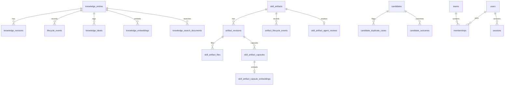

# 数据库表结构

> 状态：Active。核对日期：2026-09-08。真源是 `packages/db/src/schema/`（42 张 `pgTable`）；本页镜像它。表清单漂移时以守卫 `scripts/check-table-schema.ts` 的实测为准，你用 `pnpm check:table-schema` 验证。

## 技术栈

| 组件 | 技术 | 依据 |
|---|---|---|
| 数据库 | PostgreSQL 加 pgvector | `packages/db/src/schema/knowledge.ts:22` 导入 `vector` |
| ORM | Drizzle ORM | `packages/db/src/schema/knowledge.ts:11` 导入 `drizzle-orm/pg-core` |
| 向量索引 | HNSW | `packages/db/src/schema/knowledge.ts:48` 迁移注释 |
| 全文索引 | tsvector 加 GIN，jsonb 加 GIN | `packages/db/src/schema/knowledge.ts:126` 索引定义 |

## 表总览 (42 张表)

9 个域加起来 42 张：7 加 11 加 4 加 3 加 6 加 4 加 2 加 4 加 1。你增删表时同步改本页同节计数，否则守卫变红。

### 知识域 (7 表)

源码：`packages/db/src/schema/knowledge.ts`。

| 表 | 用途 | 主键 |
|---|---|---|
| `knowledge_entries` | 知识主表（含 `boundary` 与 `maintenance_meta` jsonb） | `id` |
| `knowledge_revisions` | 修订历史 | `id` |
| `knowledge_submissions` | 提交加审核快照（含 `reviewerDecision` jsonb） | `id` |
| `lifecycle_events` | 状态审计 | 行内列组合 |
| `knowledge_labels` | 标签（`entry_id` 加 `label` 唯一） | 复合唯一 |
| `knowledge_embeddings` | 向量（HNSW） | `id` |
| `knowledge_search_documents` | 全文加关键词（`tokens` GIN） | `entry_id` 加 `revision_no` |

### 技能工件域 (11 表)

源码：`packages/db/src/schema/artifacts.ts`。结构化子表是事实源，主表与修订表上的 JSONB 做兼容缓存。

| 表 | 用途 | 主键 |
|---|---|---|
| `skill_artifacts` | 工件主表 | `id` |
| `artifact_revisions` | 修订历史 | `id` |
| `artifact_lifecycle_events` | 状态审计 | 行内列组合 |
| `skill_artifact_files` | 文件记录 | `id` |
| `skill_artifact_script_descriptors` | 脚本描述 | `id` |
| `skill_artifact_profiles` | 派生配置（1 对 1） | `artifact_revision_id` |
| `skill_artifact_capsules` | 派生胶囊（含 `keywordTokens` jsonb 加 GIN） | `capsule_id` |
| `skill_artifact_capsule_embeddings` | 胶囊向量（HNSW） | `capsule_id` |
| `skill_artifact_client_manifests` | 客户端清单（1 对 1） | `artifact_revision_id` |
| `skill_artifact_manifest_items` | 清单条目（references、assets、scripts 三合一） | `id` |
| `skill_artifact_agent_reviews` | Agent 审核（1 对 1） | `artifact_id` |

### 候选域 (4 表)

源码：`packages/db/src/schema/candidates.ts`。

| 表 | 用途 | 主键 |
|---|---|---|
| `candidates` | 候选主表（含 `analysis` jsonb 加 GIN） | `id` |
| `candidate_duplicate_cases` | 去重主记录（含 `matches` jsonb 加 GIN） | `id` |
| `candidate_outcomes` | 人工复核加决议（`kind` 为 `manual` 或 `resolution`） | `candidate_id` |
| `entity_lineage` | 实体谱系 | `id` |

### Experience Gene 域 (3 表)

源码：`packages/db/src/schema/experience-genes.ts`。

| 表 | 用途 | 主键 |
|---|---|---|
| `experience_genes` | Gene 当前状态加治理边界加溯源 | `id` |
| `experience_gene_events` | 生命周期审计（只追加） | `id` |
| `experience_gene_embeddings` | 向量加全文投影（含 document 与 labels） | `gene_id` |

### 身份与审计 (6 表)

源码：`packages/db/src/schema/auth.ts`。

| 表 | 用途 | 主键 |
|---|---|---|
| `users` | 用户 | `id` |
| `teams` | 团队 | `id` |
| `memberships` | 成员关系 | `id` |
| `sessions` | 会话 | `id` |
| `access_keys` | 访问密钥 | `id` |
| `audit_events` | 审计事件 | `id` |

### 标签目录 (4 表)

源码：`packages/db/src/schema/labels.ts`。

| 表 | 用途 | 主键 |
|---|---|---|
| `canonical_labels` | 规范标签 | `id` |
| `label_aliases` | 变体到规范映射 | `normalizedAlias` |
| `canonical_label_embeddings` | 标签向量 | `canonical_label_id` |
| `label_alignment_events` | 对齐审计 | `id` |

### 反馈与分析 (2 表)

源码：`packages/db/src/schema/knowledge.ts:383`（`feedback_records`）、`packages/db/src/schema/knowledge.ts:479`（`usage_events`）。

| 表 | 用途 | 主键 |
|---|---|---|
| `feedback_records` | 反馈（含 `custom_answers` jsonb 加 GIN 与 remediation 列） | `id` |
| `usage_events` | 使用事件 | `id` |

### 跨域 (4 表)

| 表 | 用途 | 主键 | 源码 |
|---|---|---|---|
| `task_queue` | 后台队列 | `id` | `packages/db/src/schema/queue.ts:27` |
| `domain_event_outbox` | 领域 outbox | `id` | `packages/db/src/schema/knowledge.ts:522` |
| `graph_index_documents` | 图索引文档 | `id` | `packages/db/src/schema/retrieval.ts:14` |
| `workflow_runs` | 工作流快照 | `run_id` | `packages/db/src/schema/queue.ts:36` |

### 调度 (1 表)

| 表 | 用途 | 主键 | 源码 |
|---|---|---|---|
| `cron_jobs` | 定时任务 | `id` | `packages/db/src/schema/cron.ts:11` |

## 核心关系图



## 字段速查（节选）

`knowledge_entries`：`id`、`team_id`、`scope`（check）、`labels`（jsonb）、`shortcut`、`detail`、`required_level`（0 到 10）、`lifecycle_state`（check）、`boundary`（jsonb）、`maintenance_meta`（jsonb）、`owner_user_id`。完整字段以 `packages/db/src/schema/knowledge.ts:143` 为准。

`skill_artifacts`：`id`、`team_id`、`scope`、`labels`（jsonb）、`title`、`slug`、`required_level`、`lifecycle_state`、`metadata`（jsonb）、`agent_review`（jsonb）。完整字段以 `packages/db/src/schema/artifacts.ts:56` 为准。

`candidates`：`id`、`source_type`（`trap` 或 `skill`）、`status`、`original_payload`（jsonb）、`analysis`（jsonb）。完整字段以 `packages/db/src/schema/candidates.ts:20` 为准。

## 核对命令

```bash
pnpm check:table-schema
pnpm exec tsx scripts/check-doc-drift.ts
```
