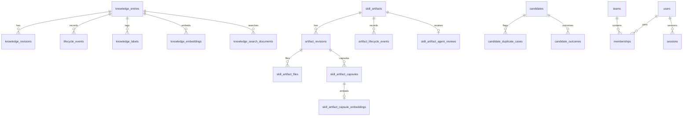

# 数据库表结构

> 真源：`packages/db/src/schema/`（42 张 `pgTable`）；镜像本文档。迁移 baseline 分散在 6 个 `packages/service-*/drizzle/`，distributed 按 `identity-access → knowledge-write → candidate-ingestion → governance-review → job-runtime → knowledge-read` 执行。

## 技术栈

| 组件 | 技术 |
|---|---|
| 数据库 | PostgreSQL 16 + pgvector |
| ORM | Drizzle ORM |
| 向量 | pgvector HNSW (384 维) |
| 全文 | tsvector + GIN, jsonb + GIN |

迁移仅支持空库建库；不支持旧 `0000–0020` 原地升级。

## 表总览 (42 张表)

表清单以 `packages/db/src/schema/` 实测 42 张为准；`DATABASE_SCHEMA.md` 与迁移 SQL 对齐。

### 知识域 (7 表)

| 表 | 用途 | 主键 |
|---|---|---|
| `knowledge_entries` | 知识主表（含 `boundary/maintenance_meta jsonb+GIN`） | `id` |
| `knowledge_revisions` | 修订历史 | `id` |
| `knowledge_submissions` | 提交+审核快照（含 `reviewerDecision jsonb`） | `id` |
| `lifecycle_events` | 状态审计 | `id` |
| `knowledge_labels` | 标签 (`entry_id,label` 唯一) | 复合 |
| `knowledge_embeddings` | 向量 (HNSW) | `id` |
| `knowledge_search_documents` | 全文+关键词 (`tsvector+GIN`, `tokens GIN`) | `(entry_id,revision_no)` |

### 技能工件域 (11 表)

> 结构化子表为事实源，`skill_artifacts` / `artifact_revisions` 的 JSONB 为兼容缓存。

| 表 | 用途 | 主键 |
|---|---|---|
| `skill_artifacts` | 工件主表 | `id` |
| `artifact_revisions` | 修订历史 | `id` |
| `artifact_lifecycle_events` | 状态审计 | `id` |
| `skill_artifact_files` | 文件记录 | `id` |
| `skill_artifact_script_descriptors` | 脚本描述 | `id` |
| `skill_artifact_profiles` | 派生配置 (1:1) | `artifact_revision_id` |
| `skill_artifact_capsules` | 派生胶囊（含 `keywordTokens jsonb+GIN`） | `capsule_id` |
| `skill_artifact_capsule_embeddings` | 胶囊向量 (HNSW) | `capsule_id` |
| `skill_artifact_client_manifests` | 客户端清单 (1:1) | `artifact_revision_id` |
| `skill_artifact_manifest_items` | 清单条目 (references/assets/scripts 三合一) | `id` |
| `skill_artifact_agent_reviews` | Agent 审核 (1:1) | `artifact_id` |

### 候选域 (4 表)

| 表 | 用途 | 主键 |
|---|---|---|
| `candidates` | 候选主表（含 `analysis jsonb+GIN`） | `id` |
| `candidate_duplicate_cases` | 去重主记录（含 `matches jsonb+GIN`） | `id` |
| `candidate_outcomes` | 人工复核+决议 (`kind=manual|resolution`) | `candidate_id` |
| `entity_lineage` | 实体谱系 | `id` |

### Experience Gene 域 (3 表)

| 表 | 用途 | 主键 |
|---|---|---|
| `experience_genes` | Gene 当前状态+治理边界+溯源 | `id` |
| `experience_gene_events` | lifecycle 审计 (append-only) | `id` |
| `experience_gene_embeddings` | 向量+全文投影 (含 document/labels) | `gene_id` |

关键索引：`uq_experience_genes_active_idempotency(partial)` / `status+updated_at` / `scope,team_id,required_level` / `vector HNSW`。

### 身份与审计 (6 表)

| 表 | 用途 | 主键 |
|---|---|---|
| `users` | 用户 | `id` |
| `teams` | 团队 | `id` |
| `memberships` | 成员关系 | `id` |
| `sessions` | 会话 | `id` |
| `access_keys` | 访问密钥 | `id` |
| `audit_events` | 审计事件 | `id` |

索引：`users.handle unique` / `teams.slug unique` / `memberships(user_id,team_id) unique` / `sessions.token_hash unique` / `access_keys.token_hash unique` 等。

### 标签目录 (4 表)

| 表 | 用途 | 主键 |
|---|---|---|
| `canonical_labels` | 规范标签 | `id` |
| `label_aliases` | 变体→规范映射 | `normalizedAlias` |
| `canonical_label_embeddings` | 标签向量 | `canonical_label_id` |
| `label_alignment_events` | 对齐审计 | `id` |

### 反馈与分析 (2 表)

| 表 | 用途 | 主键 |
|---|---|---|
| `feedback_records` | 反馈（含 `custom_answers jsonb+GIN` + remediation 列） | `id` |
| `usage_events` | 使用事件 | `id` |

### 跨域 (4 表)

| 表 | 用途 | 主键 |
|---|---|---|
| `task_queue` | 后台队列 | `id` |
| `domain_event_outbox` | 领域 outbox | `id` |
| `graph_index_documents` | 图索引文档 | `id` |
| `workflow_runs` | 工作流快照 | `run_id` |

### 调度 (1 表)

| 表 | 用途 | 主键 |
|---|---|---|
| `cron_jobs` | 定时任务 | `id` |

> `conflict_relations` 仅在 `service-governance-review/drizzle/` 迁移中存在，未在 `packages/db` 建模（双源例外，现状保留+文档标注）。

## 索引与约束要点

- 向量 HNSW：`knowledge_embeddings`, `skill_artifact_capsule_embeddings`, `experience_gene_embeddings`, `canonical_label_embeddings`。
- 全文 GIN：`knowledge_search_documents.search_vector`；`tokens text[]` GIN。
- jsonb GIN：`candidates.analysis`, `candidate_duplicate_cases.matches`, `skill_artifacts.maintenance_meta` 等。
- 队列：`task_queue_dedupe_pending_idx unique partial (type,dedupe_key) where pending|running` 防重；`task_queue_running_lease_idx` 用于 reclaim；`domain_event_outbox_pending_idx / processing_lease_idx`。

## 核心关系图

## 字段速查（节选）

**knowledge_entries**: `id / team_id / scope(check) / labels(jsonb) / shortcut / detail / required_level(0-10) / lifecycle_state(check) / boundary(jsonb) / maintenance_meta(jsonb) / owner_user_id`

**skill_artifacts**: `id / team_id / scope / labels(jsonb) / title / slug / required_level / lifecycle_state / metadata(jsonb) / agent_review(jsonb) / maintenance_meta(jsonb)`

**candidates**: `id / source_type(trap|skill) / submitted_by / team_id / status / original_payload(jsonb) / analysis(jsonb) / duplicate_case(jsonb)`

> 完整字段以 `packages/db/src/schema/*.ts` 为准。

