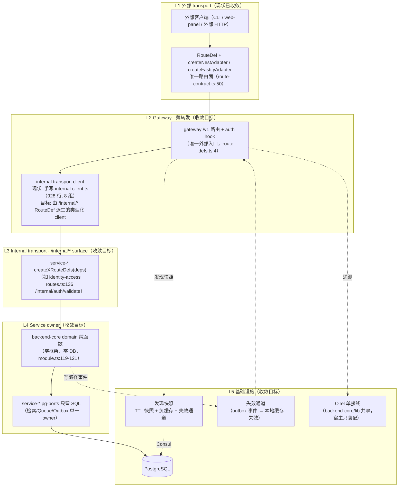

# Distributed Architecture Order And Performance Design

> **状态：** deferred design input（在根 `plan.md` 显式激活前不构成执行授权；对应 debt register 条目的「设计输入」）
> **日期：** 2026-08-15
> **来源：** 分布式架构审查与工程秩序/性能设计（多 subagent 并行产出：现状盘点、目标架构、分项设计 A-F、演进路线；承接用户新增需求：eval workspace 独立化与 app workspace 组装中心）
> **定位：** future-state 蓝图。distributed 形态当前为 `Level 2 / transitional-microservice`；本文全部内容为收敛方向，不代表现状已实现。落地窗口与进入条件以 `docs/todos/open-debt-and-compromises.md` 相应条目为准。


## 问题背景

distributed 形态当前为 `Level 2 / transitional-microservice`（见 [`docs/todos/open-debt-and-compromises.md`](../../docs/todos/open-debt-and-compromises.md:38)）：host-distributed 以"网关 + 独立服务进程"方式部署，服务间经手写 HTTP client 通信。本设计文档承接 10 项已确认的工程问题，均集中在 **distributed 内部 transport 链路** 与 **队列/投影/缓存等基础设施语义** 上；每项均给出工作树内可复核的证据位置、影响范围，以及与既有债务登记的关系。host-local 与 host-distributed 的形态差异是多数问题的根因（见问题 9、10）。

---

### 问题 1：internal transport 双轨制与手写 client 膨胀

**证据（`packages/host-distributed/src/gateway/internal-client.ts`，共 928 行）：**

- `InternalServiceClients` 接口与实现全部手写：`packages/host-distributed/src/gateway/internal-client.ts:179-409`（接口）与 `:432-927`（实现段约 496 行），共 8 组方法（identityAccess / knowledgeRead / knowledgeWrite / candidateIngestion / review / governanceReview / feedbackAdmin / jobRuntime；brief 原记 9 组，复核为 8 组）。
- 每组方法的 URL 模板逐条手写：如 `:436`、`:454`、`:514`、`:684` 等 60+ 处 `${await baseUrl(...)}/internal/...`。
- `baseUrl` 每次调用都异步解析：`:427-430`（`resolver ? resolver.resolveServiceUrl(serviceName) : staticUrl`），即每个内部调用固定多一跳 `DiscoveryResolver.resolveServiceUrl`（`discovery-resolver.ts:53`）。
- **review 与 governanceReview 两组 7 方法逐字重复**：review 组 `:342-376`（接口）与 `:749-794`（实现）、governanceReview 组 `:377-381`（接口）与 `:795-858`（实现）——detectConflicts/approve/reject/applyMaintenance/applyDecay/reviewArtifact/submitFeedback 七个方法体仅 URL key 不同（`urls.review` vs `urls.governanceReview`）；governanceReview 额外含 3 个方法（`:840-857`）。
- 双轨制：host-local 走 Nest DI 装配（`packages/host-local/src/nest/`），host-distributed 独立维护这套手写 client，两个宿主无共享的内部调用契约层。

**影响：** 内部接口新增/变更方法时需在接口、实现、测试多处同步；review/governanceReview 改动必须双处重复编辑，签名或路径漂移风险高；每次调用多一跳无缓存的解析层（与问题 2 叠加）。

**债务登记对应：** 「internal-client review/governanceReview 双组合并」（`docs/todos/open-debt-and-compromises.md:192-200`）。

---

### 问题 2：服务发现解析链路：逐请求解析跳转、负缓存与失败路径缺失

**证据：**

- 每次内部调用都经 `baseUrl` → `DiscoveryResolver.resolveServiceUrl`（`packages/host-distributed/src/gateway/internal-client.ts:427-430`；`packages/host-distributed/src/gateway/discovery-resolver.ts:53-80`）——resolver 层本身无任何缓存字段（`discovery-resolver.ts:37-46` 仅持有 discovery/staticUrls/logger）。
- Consul adapter 每次 `discover` 是一次 HTTP：`packages/host-distributed/src/gateway/consul-discovery-adapter.ts:113-143`（`/v1/health/service/{name}?passing=true`，`:115`）；请求超时默认 3s（`:38` 注释、`:58` 构造默认 `3_000`）。
- **复核修正（相对 brief）：** 链路中确实存在 `DynamicDiscovery` 层，提供 TTL 缓存（默认 30s）与实例级 round-robin：`packages/backend-core/src/runtime/dynamic-discovery.ts:10-11`（缓存与计数器）、`:18`（cacheTTL 默认 30_000）、`:27-38`（缓存命中/未命中分支）、`:40` 与 `:53-58`（round-robin）；装配在 `packages/host-distributed/src/gateway/discovery-factory.ts:44`（`new DynamicDiscovery(adapter, { cacheTTLMs: 30_000 })`）。因此 brief 所述"无 TTL、无实例级 round-robin"不成立。
- **实际缺失的是负缓存与失败路径缓存：** `dynamic-discovery.ts:31-33` 对 `discover` 返回空数组直接 throw 且**不写缓存**；`discovery-resolver.ts:64-77` 捕获异常后走静态 URL 回退。Consul 故障或服务空实例时，**每次内部调用都会重新发起一次 3s 超时的 Consul HTTP**，且没有"静态回退保持一段时间"的缓存，N+1 症状集中在故障窗口。
- 静态 URL 形态（默认配置）下 discovery 整链不启用：`packages/host-distributed/src/gateway/server.ts:274-290`（`config.consulEnabled` 才建 resolver）与 `:290`（无 resolver 时 `createInternalServiceClients(config.internalUrls)` 直连静态 URL）。

**影响：** 正常态下每请求固定多一跳 async 解析（虽被 DynamicDiscovery 缓存兜底）；Consul 故障窗口内每个内部调用都付出一次完整 HTTP 超时代价，叠加问题 3 的 10s 超时，网关雪崩风险被放大；无负缓存使故障恢复后的首个请求仍以"逐请求探活"方式打满 Consul。

**债务登记对应：** 无直接对应条目；与「Consul 双份实现收敛」（`docs/todos/open-debt-and-compromises.md:173-181`）及「平台化与服务自治尚未成熟」的"服务发现默认值是显式 URL + Docker DNS"（`:38-43`）相关，属本设计文档新承接问题。

---

### 问题 3：内部客户端无弹性（单次尝试、无重试/熔断/池化）

**证据（`packages/host-distributed/src/gateway/internal-client.ts`）：**

- 单次尝试：`callInternalService` 内仅一次 `fetch`（`:122`），无任何重试循环、无熔断状态、无并发/连接池控制（裸 `fetch` + 全局并发）。
- 超时 10s 硬编码：`:41`（`DEFAULT_INTERNAL_TIMEOUT_MS = 10_000`），`:85-86` 用 `setTimeout + AbortController` 实现。
- 错误分类已存在但未驱动恢复：`classifyInternalServiceKind`（`:43-52`，按 status 分 validation/unauthorized/forbidden/not-found/conflict/timeout/unavailable/internal）目前只被 `normalizeCanonicalErrorBody`（`:54-67`）用于把非 2xx 响应规范化为错误体，**没有**任何调用点依据分类做重试、退避、熔断或降级决策。
- 超时/网络错误统一映射为 504/503 返回（`:145-169`），上层（路由）直接透传，无重试语义。

**影响：** 任意内部服务瞬时抖动（慢查询、重启、Consul 故障）都会直接转成网关层请求失败；错误分类能力已具备但未形成恢复策略，与问题 2 的故障窗口叠加时网关可用性完全取决于服务自身恢复速度。

**债务登记对应：** 无直接对应条目，属本设计文档新承接问题（可在既有「工程维护信号偏高」下追加，`docs/todos/open-debt-and-compromises.md:27-33`）。

---

### 问题 4：会话校验逐请求 DB hop 无缓存

**证据（全链路，每请求一次）：**

- 网关层：`registerAuthHook` 对每个非 PUBLIC 路径请求调用 `clients.identityAccess.validateSession`——`packages/host-distributed/src/gateway/routes.ts:59-96`（hook 注册 `:60`，调用 `:69-70`）。
- 内部调用：`internal-client.ts:452-457`（`POST /internal/auth/validate`）→ `packages/service-identity-access/src/routes.ts:134-145`（路由 handler 调 `deps.validateSession`）。
- 服务实现：`packages/backend-core/src/identity-access/application/module.ts:119-121`（`validateSession` → `sessionLookup.resolveSession`）→ `packages/service-identity-access/src/pg-ports.ts:398-423`（`:400-403` 直接 SQL `SELECT ... FROM sessions s LEFT JOIN users u ... WHERE s.token_hash = $1`）。
- 全链路无任何 short-TTL 缓存、无失效通道；每次请求 = 网关 HTTP hop + identity-access DB 查询。

**影响：** 网关每请求至少一次内部 hop + 一次 DB 查询，identity-access 成为读写路径的公共瓶颈；高流量下 DB 会话表成为热点，而会话在过期前本可安全短缓存（失效可由 logout/select-team 驱动）。此问题不涉及数据一致性问题，属于性能与放大系数问题。

**债务登记对应：** 无直接对应条目，属本设计文档新承接问题。

---

### 问题 5：检索在 distributed 形态降级为 ILIKE 双实现

**证据：**

- distributed 检索实现为手写 ILIKE：`packages/host-distributed/src/shared/ports.ts:109-146`（`createPgRetrievalQuery`）。`:114` 硬编码 `lifecycle_state = 'approved'`；`:123-126` `(content ILIKE $n OR title ILIKE $n)` + `%${params.query}%`（前导 `%` 无法走 B-tree 索引，属全表扫描）；`:130-134` `SELECT id, content, title ... LIMIT`（brief 原记 `SELECT *`，复核为仅 3 列）；`:140` JS `slice(0, 200)` 截断 snippet；结果 score 恒为 1.0（`:139`），无排序、无相关性打分。
- 接线：`packages/host-distributed/src/knowledge-read/index.ts:22-25` 把 `ports.retrievalQuery` 注入 knowledge-read 服务装配。
- 对照：service-knowledge-read 的完整检索管线具备 semantic/hybrid 通道与 embedding 缓存——`packages/service-knowledge-read/src/server-retrieval-seam.ts:91-117`（semantic/hybrid 策略注册）、`retrieval-recall-coordinator.ts:97`（semanticRecall）/`:189`（hybridRecall）、`retrieval-semantic.ts:16-22`（查询向量缓存）、`retrieval-infra-default.ts:82`（pgvector 相似度 SQL）。
- host-local 形态用的是完整管线：`packages/host-local/src/nest/runtime/host-runtime.ts:42-78`（`createKnowledgeReadRetrievalQuery`，mode `'hybrid'`，`:76`）。

**影响：** 同一对外语义（`/internal/retrieval/search`，`internal-client.ts:512-517`）在两种形态下行为完全不同：distributed 退化为无打分、无 mode 选择的文本包含匹配，检索质量与 host-local 不一致；宿主手写 SQL 与 service 包 pg-ports/domain 规则并存（即债务登记"宿主业务下沉"），后续检索能力增强（向量、rerank）需双处维护。

**债务登记对应：** 「host-distributed shared/ports.ts 业务下沉」（`docs/todos/open-debt-and-compromises.md:202-210`）。

---

### 问题 6：Queue/Outbox 双实现并存

**证据：**

- 实现 A（简化版，宿主手写）：`packages/host-distributed/src/shared/ports.ts:152-209`（`createPgTaskQueue`）、`:211-302`（`createPgOutbox`）。`:238` lease 硬编码 `lease_until = NOW() + INTERVAL '30 seconds'`；`:189-207` 与 `:282-300` 的 `getStatusSnapshot` 把 `staleRunning: 0`/`staleProcessing: 0` 硬编码（`:204`、`:297`），无 reclaim 计数、无过期任务回收逻辑（对比实现 B 的 `reclaimCount`）。
- 实现 B（服务包完整版）：`packages/service-job-runtime/src/async-runtime.ts:115-256`（task queue）、`:258-330`（outbox）。`:197` SKIP LOCKED task claim；`:279-297` outbox `claimBatch` 使用可配置 lease（`:293` `OUTBOX_LEASE_MS`，定义于 `packages/backend-core/src/job-runtime/domain/policy.ts:36`）；`:168` 与 `:317` 用 `COUNT(*) FILTER` 真实计算 stale 计数；`:183-188`/`:283-286` 有 reclaim 逻辑。
- **运行时实际接线（复核补充）：** job-runtime 服务进程消费的是实现 B——`packages/host-distributed/src/job-runtime/server.ts:22-30`（`createJobRuntimeAsyncTransport`，provider `'postgres'`）；`createServicePorts` 中的简化版 `createPgTaskQueue`/`createPgOutbox` 在 `:332-333` 无条件实例化、`:351` 仅当 `serviceName === 'job-runtime'` 时暴露为 `ports.jobRuntime`，但该槽位在运行时无消费者（仅有测试消费：`packages/host-distributed/src/shared/database-ownership.test.ts:83-90`）。
- 两个实现的语义不一致点：lease 硬编码 vs 可配置、stale 硬编码 0 vs 真实计算、有无 reclaim、有无 dedupe/attempts 预算（对比 `async-runtime.ts:127-148` 的 dedupe 与 `:229-231` 的指数退避重排期）。

**影响：** 同一套 QueuePorts/OutboxPort 存在两套 SQL 语义，任何行为修复若只改一处即产生漂移（正对应债务登记的进入条件"任一 SQL 实现出现行为不一致修复"）；诊断快照语义不一致（简化版 stale 恒为 0）会误导排障。

**债务登记对应：** 「host-distributed shared/ports.ts 业务下沉」（`docs/todos/open-debt-and-compromises.md:202-210`）。

---

### 问题 7：Outbox 消费串行、无退避、无并发上限

**证据（`packages/service-job-runtime/src/outbox-worker.ts`）：**

- batch 内串行 `await`：`:52-69`——`claimBatch` 后 `for...of` 顺序 `await handler.handle(event.payload)`（`:60`）+ `outbox.complete`；单个慢 handler（如 LLM 类操作）会阻塞本 batch 内其后所有事件，且下一个 batch 也要等本轮循环结束。
- poll 循环固定间隔、无指数退避：`:32-43`（`pause` 用固定 `pollIntervalMs`，默认 `OUTBOX_POLL_INTERVAL_MS = 2_000`，`packages/backend-core/src/job-runtime/domain/policy.ts:46`）；`:70` 空 batch 后与 `:71-73` 错误后都是同一固定间隔，错误重试无 backoff（对照 task 侧有 `retryBackoffMs`，`policy.ts:54-55`）。
- 无并发上限：单 worker 循环、无并发度配置项，`batchSize` 由 `OUTBOX_CLAIM_BATCH_SIZE = 10`（`policy.ts:45`）固定。

**影响：** 任一事件 handler 慢或 hang（无 handler 级超时）都会拖慢整体 outbox 吞吐；错误风暴时固定 2s 轮询持续打 DB/下游，无退避保护；多实例部署时无并发协同控制。

**债务登记对应：** 无直接对应条目，属本设计文档新承接问题。

---

### 问题 8：跨实例缓存失效缺失（脏投影风险）

**证据：**

- knowledge-read 的两个进程内缓存均为模块级单例：`packages/service-knowledge-read/src/retrieval-read-model-cache.ts:12`（`readModelCache` 模块变量，`:16-20` TTL 60s）与 `packages/service-knowledge-read/src/entry-projection.ts:29-30`（`entryProjectionCache` 模块变量，`:36-41` TTL 60s）。
- 失效机制仅进程内：`packages/service-knowledge-read/src/knowledge-read-support-infra-default.ts:20-24`（`listeners` 为模块内 `Set`）、`:56-61`（`registerInvalidationListener`/`emitInvalidation` 只通知本进程监听者）；无任何跨进程/跨实例通道（Redis pub/sub、DB 通知等均不存在）。
- **复核补充：** 失效入口在生产代码中零调用者——`invalidateRetrievalReadModel`（`retrieval-read-model-cache.ts:51-53`）与 `invalidateKnowledgeEntryProjection`（`entry-projection.ts:138-143`）仅被测试引用；即缓存实际只依赖 60s TTL 过期，连"本地失效"路径在运行时都未触发。
- distributed 形态下 knowledge-read 是独立进程（`packages/host-distributed/src/knowledge-read/index.ts:19-29`），outbox 事件由 job-runtime 进程消费（`packages/host-distributed/src/job-runtime/server.ts:36-60` 的 `knowledge.approved` handler）；写入事件发生在其他实例/服务中时，持有缓存的 knowledge-read 实例在 TTL 过期前读到脏投影。

**影响：** 分布式多实例下投影/检索模型可能跨实例不一致（approved 后最长 60s 脏读，且任何失效事件都不会广播）；若未来放大缓存规模或提高 TTL，脏窗口随之放大。

**债务登记对应：** 无直接对应条目，属本设计文档新承接问题。

---

### 问题 9：OTel / Consul 双份接线

**证据：**

- host-local：Nest observability 模块（`packages/host-local/src/nest/observability/`：`otel.module.ts`、`prometheus.module.ts`、`loki.module.ts`、`sentry.module.ts`、`langfuse.module.ts` 等，Nest `@Global() @Module()` 装配）与 Nest 版 Consul 服务（`packages/host-local/src/nest/service-discovery/consul.module.ts:18-23`、`consul.service.ts`——`@Injectable() class ConsulService implements DiscoveryPort`，依赖 `consul` npm 包）。
- host-distributed：framework-free 一套——`packages/host-distributed/src/shared/telemetry.ts:32-36`（`attachRuntimeTelemetry` 自带 `bootstrapOtel`，`:77`）与 `packages/host-distributed/src/gateway/internal-observability.ts:53-63`（自建 `MeterProvider` + `OnDemandMetricReader`）；Consul 走 `packages/host-distributed/src/gateway/consul-discovery-adapter.ts`（原生 fetch 实现 `DiscoveryPort`）+ `discovery-factory.ts:37-50`（`createGatewayDiscovery` 工厂）。
- 即：OTel 接线两套（Nest 模块 vs 手写 bootstrap）、Consul 实现两套（`consul` npm 依赖 vs 原生 fetch），分别对应两条债务条目。

**影响：** 指标/span 语义、采样策略、健康检查/KV/重试语义需双处同步修改，漂移风险高；两宿主观测口径可能不一致，跨形态排障（本地 vs distributed）结论不可互信。

**债务登记对应：** 「OTel 双份接线收敛」（`docs/todos/open-debt-and-compromises.md:163-171`）、「Consul 双份实现收敛」（`:171-178`）。

---

### 问题 10：工具收敛遗留（AbortController 超时与 capability-model 单文件）

**证据：**

- 手写 AbortController+setTimeout 超时两处：`packages/host-distributed/src/gateway/internal-client.ts:84-86` 与 `packages/host-distributed/src/gateway/consul-discovery-adapter.ts:186-187`；而 `@trapmap/lib` 已有 `timeout` 工具（`packages/lib/src/async.ts:27`），AGENTS.md 通用约束要求统一从 lib 导入。该两处被债务登记明确列为"有意保留的遗留"（`docs/todos/open-debt-and-compromises.md:68`）。
- capability-model 单文件 510 行：`packages/backend-core/src/runtime/capability-model.ts`（类型定义/默认值/校验/推导混合），对应「capability-model 拆分」条目（`docs/todos/open-debt-and-compromises.md:153-161`，注明 510 行主体保留）。

**影响：** 超时实现两处独立演化（如后续加超时元数据/指标需双处同步）；capability-model 新增能力维度时改动集中、审查困难，且宿主 capability 组合职责与 backend-core runtime 混合。

**债务登记对应：** 「capability-model 拆分」（`docs/todos/open-debt-and-compromises.md:153-161`）、「重复工具函数回潮与工厂模式一致性」遗留项（`:64-71`，其中 `:68` 明确列出 `internal-client.ts` AbortController timeout）。

---

## 与既有债务登记的关系

| # | 问题 | 对应 debt 条目（`docs/todos/open-debt-and-compromises.md`） | 备注 |
|---|---|---|---|
| 1 | internal transport 双轨制与手写 client 膨胀 | 「internal-client review/governanceReview 双组合并」（`:189`） | brief 原记"9 组"，复核为 8 组 |
| 2 | 服务发现解析链路问题 | 无直接条目；相关「Consul 双份实现收敛」（`:171`）、「平台化与服务自治尚未成熟」（`:36`） | brief 中"无 TTL/无 round-robin"经复核不成立（`DynamicDiscovery` 已有），实际缺失负缓存与失败路径 |
| 3 | 内部客户端无弹性 | 无直接条目（可挂「工程维护信号偏高」`:27`） | 本设计文档新承接 |
| 4 | 会话校验逐请求 DB hop | 无直接条目 | 本设计文档新承接 |
| 5 | 检索 ILIKE 双实现 | 「host-distributed shared/ports.ts 业务下沉」（`:198`） | brief 中"`SELECT *`"复核为 `SELECT id, content, title` |
| 6 | Queue/Outbox 双实现 | 「host-distributed shared/ports.ts 业务下沉」（`:198`） | 运行时实际消费实现 B，简化版无运行时消费者 |
| 7 | Outbox 消费串行无退避 | 无直接条目 | 本设计文档新承接 |
| 8 | 跨实例缓存失效缺失 | 无直接条目 | 失效入口生产代码零调用者（复核补充） |
| 9 | OTel / Consul 双份接线 | 「OTel 双份接线收敛」（`:162`）、「Consul 双份实现收敛」（`:171`） | 与登记描述一致 |
| 10 | 工具收敛遗留 | 「capability-model 拆分」（`:153`）、「重复工具函数回潮与工厂模式一致性」遗留（`:68`） | 与登记描述一致 |

无直接条目的问题 2/3/4/7/8 为本设计文档承接的新问题域；设计章节将为其给出落点，不回写已归档文档（按 [`docs/todos/README.md`](../../docs/todos/README.md) 规则，新增问题优先进入活跃细则问题池或其显式 deferred 落点）。

---

## 目标与目标架构

> 本设计文档的现状基线：distributed 形态当前为 `Level 2 / transitional-microservice`（见 [`docs/reference/SYSTEM_TRUTH_SOURCES.md`](../../docs/reference/SYSTEM_TRUTH_SOURCES.md:30,112)）：gateway 是唯一外部入口（`packages/host-distributed/src/gateway/route-defs.ts:4`、`server.ts:4`），真实 service process 与真实内部 HTTP hop 已存在，但仍是"共享 PostgreSQL 底座 + 显式 URL 覆盖"的过渡形态。本章描述的目标架构是 **future-state 蓝图**，全部内容均为收敛方向，不代表现状已实现。
>
> 问题编号 Q1-Q10 与「问题背景」章节一致。行内 `file:line` 均为本仓库当前代码证据。

### 2.1 设计目标（G1-G8）

| 编号 | 目标 | 解决的问题 |
|---|---|---|
| **G1** | **内部 transport 与外部 transport 共享同一 RouteDef 真相**：gateway 内部调用不再手写 URL 字符串 client，而是由 service 声明的 `/internal/*` RouteDef（`create<X>RouteDefs`）派生类型化 client；手写 `InternalServiceClients`（internal-client.ts:179-409，8 组）与 review/governanceReview 逐字重复（internal-client.ts:749-858）被单一契约替代 | Q1（双轨制/手写 client 膨胀） |
| **G2** | **服务发现解析从 per-call 变为带失效通道的 TTL 快照**：解析结果作为 gateway 内"发现快照"被复用，快照含负缓存与显式失效通道，不再每次内部调用都进入解析链路（internal-client.ts:427-430 → discovery-resolver.ts:53） | Q2（解析无缓存/负缓存/失效） |
| **G3** | **内部客户端获得弹性并收敛为唯一实现**：统一 internal transport 层内置重试/退避/熔断与并发池化，`classifyInternalServiceKind`（internal-client.ts:43-52）的分类开始驱动恢复策略，替换当前单次尝试 + 固定 10s 超时（internal-client.ts:41,121-173） | Q3（内部客户端无弹性） |
| **G4** | **读路径引入带显式失效通道的缓存**：会话校验（gateway 每请求 `validateSession`，routes.ts:59-71 → identity-access `resolveSession` → sessions 表查询，pg-ports.ts:400-403）与 knowledge-read 读模型（retrieval-read-model-cache.ts、entry-projection.ts）改为 short-TTL 缓存 + 写路径驱动的失效通道，TTL 只作兜底 | Q4（会话逐请求 DB hop）、Q8（跨实例缓存失效缺失） |
| **G5** | **检索唯一 owner**：检索语义收敛到 service-knowledge-read 完整管线（semantic/hybrid 通道、向量检索 retrieval-infra-default.ts:82、embedding 缓存），distributed 形态复用其检索端口实现；宿主不再持有降级 ILIKE 实现（shared/ports.ts:109,124-125） | Q5（检索 ILIKE 双实现） |
| **G6** | **异步 runtime 单一实现**：Queue/Outbox 的 claim、lease、退避、快照语义收敛为 service-job-runtime 的 `JobRuntimeAsyncTransport`（async-runtime.ts，lease 可配置 OUTBOX_LEASE_MS、真实 stale 统计），宿主侧简化实现（shared/ports.ts:152,211）退役；outbox 消费改为并发 + 每事件独立失败 + 指数退避（替换 outbox-worker.ts:52-74 的串行与固定间隔） | Q6（Queue/Outbox 双实现）、Q7（outbox 串行无退避） |
| **G7** | **双宿主观测/发现接线收敛**：OTel 与 Consul 各保留单一接线实现（backend-core 共享支持 + 宿主只装配），消除 host-local（otel.module.ts、consul.service.ts:15,48）与 host-distributed（telemetry.ts:32、consul-discovery-adapter.ts）的两套并行接线 | Q9（OTel/Consul 双份接线） |
| **G8** | **工具与承载结构收敛**：手写超时/收敛遗留统一走 `@trapmap/lib`（如 `timeout`，lib/src/async.ts:27，替代 internal-client.ts:84-86 与 consul-discovery-adapter.ts:185-199 的 AbortController+setTimeout），capability-model 单文件（510 行）按类型/默认值/校验/推导拆分 | Q10（工具收敛遗留） |

G1-G8 与「问题背景」的 Q1-Q10 一一对应；后续分项设计按本编号引用目标。

### 2.2 架构原则（P1-P6）

- **P1 唯一路由面**：外部（`/v1/*`）与内部（`/internal/*`）HTTP 面都是 RouteDef（`packages/backend-core/src/http/route-contract.ts:50`），经 `createNestAdapter`（adapters/nest.ts:90）/ `createFastifyAdapter`（adapters/fastify.ts:33）双 adapter 渲染；禁止在任一宿主手写重复路由实现（service-identity-access/src/server.ts:25 即该模式的现有落点）。G1 的"RouteDef 派生 internal client"是 P1 在内部面的推广。
- **P2 domain 零框架零 DB**：业务规则留在 `packages/backend-core/src/<context>/domain/` 纯函数（如 identity-access `validateSession` 只委托端口，module.ts:119-121），宿主与 adapter 层不新增业务判断。
- **P3 宿主只装配，service-* pg-ports 只留 SQL**：宿主不再持有检索/Queue/Outbox SQL（现状违例即 shared/ports.ts:109-302，对应 debt「host-distributed shared/ports.ts 业务下沉」）；SQL 收归对应 service 包 pg-ports 与 backend-core 端口实现。
- **P4 同一契约单一实现、单一 owner 不重实现**（新增显式原则）：同一能力（检索、Queue、Outbox、发现、可观测）全仓只允许一个 owner 实现，其他形态通过端口复用或装配复用；任何新能力落地前先检查是否已有 owner（对应 Q5/Q6/Q9 的三组双实现）。
- **P5 缓存必须带显式失效通道，TTL 只作兜底**（新增显式原则）：任何新增读路径缓存（会话、读模型、发现快照）必须同时定义失效来源（写路径事件/变更通知）与失效传递通道；不允许只靠 TTL 收敛（对应 Q4/Q8 与 G2）。
- **P6 过渡演进约束**：目标架构按分项逐步落地，落地窗口内保持 `Level 2 / transitional-microservice` 基线与现有形态可运行；行为不变硬约束适用于每一步的现状到目标迁移（复用 debt register 的进入条件，见 2.4）。

### 2.3 分层模型

目标架构分五层；L1 已收敛（现状即目标），L2-L5 是本设计的收敛目标：



- **L1 外部 transport**：现状已收敛——gateway 是唯一外部入口（route-defs.ts:4-5），外部路由全部为 RouteDef 并经双 adapter 渲染（server.ts:293 `registerGatewayRoutes`、host-local gateway.module.ts:34 `createNestAdapter(createGatewayRouteDefs(deps), deps)`）。
- **L2 Gateway**：保持薄转发职责；收敛点是把"手写 URL 字符串 + 每调用解析"（internal-client.ts:427-430）替换为"RouteDef 派生的类型化 client + 发现快照 + 弹性策略"（G1/G2/G3）。
- **L3 Internal transport**：service 侧已是 RouteDef 声明（`createFastifyAdapter(createXRouteDefs(module), module)`，service-identity-access/src/server.ts:25）；目标是把这一契约复用回 client 侧，消除双轨（G1）。
- **L4 Service owner**：domain 契约（backend-core 端口）与 pg-ports SQL 各自唯一 owner（P2/P3/P4）；检索与异步 runtime 收敛到 service 包 owner（G5/G6）。
- **L5 基础设施**：PostgreSQL 继续是持久化底座；新增收敛点——发现快照（G2）、失效通道（G4/G8 跨实例）、OTel/Consul 单接线（G7）。

### 2.4 现状 vs 目标对照表

| 问题（Qn） | 现状（证据） | 目标形态 | 所在层 |
|---|---|---|---|
| Q1 内部 transport 双轨/手写 client | 外部面 RouteDef（route-defs.ts），内部面手写 8 组 `InternalServiceClients`（internal-client.ts:179-409），review/governanceReview 两组 7 方法逐字重复（internal-client.ts:749-858） | 内部 client 由 `/internal/*` RouteDef 派生，单一契约两端共享（G1） | L2/L3 |
| Q2 发现解析无缓存（N+1） | 每次内部调用经 `baseUrl` → `resolveServiceUrl`（internal-client.ts:427-430，discovery-resolver.ts:53）；仅 consulEnabled 路径经 DynamicDiscovery 30s TTL + round-robin（dynamic-discovery.ts:9-58，discovery-factory.ts:44），无负缓存（空结果直接 throw，dynamic-discovery.ts:31-33）、无主动失效；Consul 超时默认 3s（consul-discovery-adapter.ts:38） | 统一"发现快照"层：TTL 快照 + 负缓存 + 显式失效通道，解析不再进入 per-call 链路（G2） | L2/L5 |
| Q3 内部客户端无弹性 | 单次尝试、固定 10s 超时（internal-client.ts:41,121-173）；错误已分类但分类不驱动恢复（internal-client.ts:43-52） | internal transport 层内置重试/退避/熔断/池化，分类驱动恢复策略（G3） | L2 |
| Q4 会话逐请求 DB hop | gateway auth hook 每请求 `validateSession`（routes.ts:59-71）→ `/internal/auth/validate`（service-identity-access routes.ts:136-139）→ `resolveSession`（module.ts:119-121）→ sessions 表 `SELECT`（pg-ports.ts:400-403） | short-TTL 会话缓存 + 登录/登出/切团队等写路径失效通道（G4） | L2/L4 |
| Q5 检索 ILIKE 双实现 | host-distributed 手写 `%term%` ILIKE + 前端切片（shared/ports.ts:109,124-125,140），与 service-knowledge-read 完整管线（向量检索 retrieval-infra-default.ts:82、semantic/keyword 通道、embedding 缓存）语义不一致 | 检索唯一 owner 在 service-knowledge-read，宿主复用其端口实现（G5） | L4 |
| Q6 Queue/Outbox 双实现 | 宿主简化实现（shared/ports.ts:152 `createPgTaskQueue`、:211 `createPgOutbox`，lease 30s 硬编码 :238，stale 统计硬编码 0 :204,:297）与 job-runtime 完整实现（async-runtime.ts:197 task claim、:279-297 outbox claimBatch、可配置 OUTBOX_LEASE_MS :293、真实 stale 统计 :161-179/:310-328）并存 | 异步 runtime 单一实现（service-job-runtime owner），宿主只装配（G6） | L4/L5 |
| Q7 outbox 消费串行无退避 | batch 内事件顺序 `await`（outbox-worker.ts:52-69）；错误/空轮后固定间隔 pause（outbox-worker.ts:32-43,70-74），无指数退避、无并发上限 | 并发消费 + 每事件独立失败 + 指数退避 + 并发上限（G6） | L4 |
| Q8 跨实例缓存失效缺失 | knowledge-read 缓存为进程内模块级单例（retrieval-read-model-cache.ts:11-38、entry-projection.ts:28-59，TTL 60s），失效只走本地 `emitInvalidation`（context.ts:236、knowledge-read-support-infra-default.ts:59）；distributed 下 outbox 事件由其他实例消费，持有缓存的实例收不到失效 | 失效通道：outbox 事件 → 失效消息 → 实例本地缓存清空，TTL 仅兜底（G4） | L5 |
| Q9 OTel/Consul 双份接线 | host-local：Nest otel.module.ts/otel.service.ts:23、consul.module.ts + consul.service.ts（consul npm 包，consul.service.ts:5,48）；host-distributed：telemetry.ts:32、internal-observability.ts、consul-discovery-adapter.ts + discovery-factory.ts | 各单一接线实现（backend-core/lib 共享），宿主只装配（G7） | L5 |
| Q10 工具收敛遗留 | 手写 AbortController+setTimeout（internal-client.ts:84-86、consul-discovery-adapter.ts:185-199），lib 已有 `timeout`（lib/src/async.ts:27、index.ts:10）；capability-model.ts 单文件 510 行 | 统一走 `@trapmap/lib` 工具；capability-model 拆分（G8） | L2/L5/backend-core |

**与既有债务登记的关系**（`docs/todos/open-debt-and-compromises.md`，具体条目见「问题背景」章节）：本目标架构承接的长期 debt 包括「internal-client review/governanceReview 双组合并」（:189）、「OTel 双份接线收敛」（:162）、「Consul 双份实现收敛」（:171）、「host-distributed shared/ports.ts 业务下沉」（:198）、「capability-model 拆分」（:153）；各分项设计的进入条件与迁移窗口以 debt register 为准（P6）。

---

## 分项设计 A：内部传输统一（Internal Transport Unification）

> **状态：** deferred design input（在根 `plan.md` 显式激活前不构成执行授权）
> **日期：** 2026-08-15
> **来源：** 分布式架构审查（问题域见 Task 1 的 Q1/Q3/Q10）
> **定位：** future-state 设计；distributed 保持 `Level 2 / transitional-microservice` 基线。服务端 `/internal/*` 路由已全部收敛为 RouteDef（P1 唯一路由面在服务侧已成立），本分项收敛 gateway 的 **client 面**：消灭手写 URL 拼接、消除双组重复、为内部调用注入弹性策略，并把超时工具收敛到 `@trapmap/lib` 显式原语。所有收敛均不改变既有 `/internal/*` 路径与 canonical error envelope 语义。
>
> **与兄弟分项边界：** 服务发现解析的性能缺口（负缓存/失败路径/TTL 可配置）归 Task 4（分项设计 B）；OTel/Consul 接线收敛归 Task 6；跨实例失效通道归 Task 5。本分项只承接「契约单一来源 + typed client + 弹性 + 超时工具 + RPC 试点定位」。

本分项承接五项设计：

| 设计 | 对应问题 | 对应 G/P | 对应 debt 条目 | 验证命令 |
| --- | --- | --- | --- | --- |
| 1. internal RouteDef 单一契约 + 类型化派生 client | Q1 | G1、P1、P4 | 「internal-client review/governanceReview 双组合并」（`docs/todos/open-debt-and-compromises.md:192`） | `internal-client.test.ts` focused、`pnpm test:distributed-closeout`、`pnpm typecheck`、`pnpm exec fallow audit --base main` |
| 2. typed client 收敛 + review/governanceReview 合并 | Q1 | G1、P1 | 同上（`:189`） | `internal-client.test.ts`、`routes.test.ts` focused、`pnpm test:distributed-closeout`、`pnpm test:deployment-smoke` |
| 3. 内部调用弹性策略（重试/超时分级/可选熔断） | Q3 | G3、P4 | 无独立条目（Q3 由本设计文档承接，可挂「工程维护信号偏高」`:27`） | `internal-client.test.ts`、`distributed-acceptance.test.ts` focused、`pnpm test:distributed-closeout`、`pnpm test:deployment-smoke` |
| 4. 显式超时工具（替代手写 AbortController） | Q10 | G8、P1 | 「重复工具函数回潮与工厂模式一致性」遗留项（`:68` 明列 `internal-client.ts` AbortController timeout） | `packages/lib/src/async.test.ts`、`internal-client.test.ts` focused、`pnpm typecheck` |
| 5. RPC 试点 seam 定位 | Q1 | P4、P6 | 无独立条目；试点继续由 `TRAPMAP_KNOWLEDGE_WRITE_TRANSPORT` 承载 | `internal-knowledge-write-client.test.ts` focused、`pnpm test:distributed-closeout`、`pnpm test:deployment-smoke` |

---

### 一、现状问题

#### 1.1 契约双轨：服务端已 RouteDef，client 面仍手写 URL（Q1）

**服务端已收敛（P1 在服务侧成立）：** 六个 service 包的 `/internal/*` 路由全部以 `create<X>RouteDefs` 工厂声明为 [`RouteDef`](packages/backend-core/src/http/route-contract.ts:50)，并全部经 `createFastifyAdapter` 挂载：

- identity-access：`createIdentityAccessRouteDefs`（`packages/service-identity-access/src/routes.ts:102`，`/internal/auth/login` `:106`、`/internal/auth/validate` `:136`）；`server.ts:25` `createFastifyAdapter(createIdentityAccessRouteDefs(module), module, ...)`。
- knowledge-read：`createKnowledgeReadRouteDefs`（`packages/service-knowledge-read/src/routes.ts:55`，`/internal/knowledge/:entryId` `:61`、`/internal/retrieval/search` `:83`）。
- knowledge-write：`createKnowledgeWriteRouteDefs`（`packages/service-knowledge-write/src/routes.ts:275`）+ `createArtifactRouteDefs`（`packages/service-knowledge-write/src/artifact-routes.ts:107`）；`/internal/rpc/knowledge-write` `routes.ts:463-472`。
- candidate-ingestion：`packages/service-candidate-ingestion/src/routes.ts:91`。
- governance-review：`packages/service-governance-review/src/routes.ts:238`（业务路径全集 `:244-454`）。
- job-runtime：`packages/service-job-runtime/src/routes.ts:44`。

「同一 RouteDef 双 adapter 消费」在 host-local monolith 已是事实：`host-local/src/nest/gateway/gateway.module.ts:34` 用 `createNestAdapter(createGatewayRouteDefs(deps), deps)`；`packages/host-local/src/nest/runtime/monolith-route-defs.test.ts:54-58` 直接 import 六个服务包 RouteDef 经 Nest adapter 装配。host-distributed 对六个 service 包的 `workspace:*` 依赖已声明在 `dependencies`（`packages/host-distributed/package.json:75-80`），依赖方向成立。

**client 面仍是手写（Q1 的实质缺口）：** `InternalServiceClients` 接口（`packages/host-distributed/src/gateway/internal-client.ts:179-409`，**8 组**：identityAccess / knowledgeRead / knowledgeWrite / candidateIngestion / review / governanceReview / feedbackAdmin / jobRuntime）与实现（`:432-927`，该段约 496 行，文件总行数 928）全部手写；`callInternalService`（`:69-173`）内 60+ 处 `${await baseUrl(...)}/internal/...` URL 模板与 service 包 RouteDef 的 path **重复声明**。例：`/internal/auth/login` 同时存在于 identity-access `routes.ts:106` 与 internal-client `:436`；`/internal/auth/validate` 在 `routes.ts:136` 与 internal-client `:454`。每次调用还经 `baseUrl` 异步解析（`:427-430`，`resolver ? resolver.resolveServiceUrl(serviceName) : staticUrl`）。

**review/governanceReview 双组逐字重复（debt 直接对应）：** 接口 `:342-376` 与 `:377-381`（`InternalServiceClients['review'] & {...}`）、实现 `:749-794` 与 `:795-858`——detectConflicts/approve/reject/applyMaintenance/applyDecay/reviewArtifact/submitFeedback 七个方法体仅静态回退 URL key 不同（`urls.review` vs `urls.governanceReview`），governanceReview 额外含 3 方法（`:840-857`）。且两 key 来自**同一 env**（`service-config.ts:321-322` 均读 `TRAPMAP_GOVERNANCE_REVIEW_URL`），服务名同为 `'governance-review'`（`discovery-resolver.ts:19-26` 的 `SERVICE_NAME_TO_URL_KEY` 只映射到 `governanceReview`）。即 review 组的静态回退 key 与 discovery 映射不一致，是合并的潜在正确性收益点。该双组由 debt「internal-client review/governanceReview 双组合并」（`docs/todos/open-debt-and-compromises.md:192-200`）登记，进入条件：「governance-review 内部接口新增/变更方法时，或 `urls.review`/`urls.governanceReview` 任一 URL key 被确认可退役」——本设计的合并方案即确认 `urls.review` 可退役。

#### 1.2 错误反序列化三份同构实现（Q1 伴随）

同一「canonical envelope → InvocationError」映射存在三份手写实现：`normalizeCanonicalErrorBody`（`internal-client.ts:54-67`，按 status fallback kind + 透传 `{kind,error}`）、`mapRemoteError`（`packages/host-distributed/src/shared/internal-knowledge-write-client.ts:8-32`，kind → `InvocationError` 工厂）、`toInvocationError`（`packages/host-distributed/src/shared/invocation-error.ts:3-18`，同上）。后端侧的权威语义在 [`ErrorEnvelope`](packages/backend-core/src/http/route-contract.ts:95-103) 与 `mapErrorToEnvelope`（`:128-157`），错误 taxonomy 在 [`InvocationErrorKind`](packages/backend-core/src/invocation/invocation-model.ts:57-65)。三份 client 侧实现各自演化，新增 kind 或 envelope 字段需三处同步。

#### 1.3 内部客户端无弹性（Q3）

`callInternalService` 单次 `fetch`（`internal-client.ts:122`），无重试循环、无熔断状态、无并发/连接池控制；超时 10s 硬编码（`:41` `DEFAULT_INTERNAL_TIMEOUT_MS = 10_000`，`:84-86` 用 `setTimeout + AbortController` 实现）；错误分类 `classifyInternalServiceKind`（`:43-52`，status → validation/unauthorized/forbidden/not-found/conflict/timeout/unavailable/internal）已存在，但**没有任何调用点依据分类做重试、退避、熔断或降级决策**——只被 `normalizeCanonicalErrorBody`（`:54-67`）用于规范错误体。超时/网络错误统一映射为 504/503 返回（`:145-169`），上层（gateway 路由）直接透传。

#### 1.4 超时工具收敛遗留（Q10）

手写 `AbortController + setTimeout` 超时两处：`internal-client.ts:84-86` 与 `packages/host-distributed/src/gateway/consul-discovery-adapter.ts:186-187`；而 `@trapmap/lib` 已有 [`timeout`](packages/lib/src/async.ts:27)，AGENTS.md 通用约束要求统一从 lib 导入。但该工具**不支持 AbortSignal 语义传递**：`async.ts:27-46` 是 promise-race 实现，超时只 reject、不取消底层 in-flight fetch（`async.ts:17-26` 注释明示 internal-client 的 AbortController 超时是"有意保留"的遗留）。debt「重复工具函数回潮与工厂模式一致性」把 `internal-client.ts` AbortController timeout 列为遗留（`docs/todos/open-debt-and-compromises.md:68`）。因此「替换即可」不成立，必须先给显式超时工具设计（见 2.4）。

#### 1.5 RPC 试点 seam（定位事实，非缺口）

`TRAPMAP_KNOWLEDGE_WRITE_TRANSPORT=rpc` 是 repo-owned envelope 试点：`service-config.ts:25`（env 名）、`:258-260`（解析，默认 `http`）；client seam `createRemoteKnowledgeWriteClient`（`packages/host-distributed/src/shared/internal-knowledge-write-client.ts:59-130`）在 `transport === 'rpc'` 时走 `clients.knowledgeWrite.invoke({ method, input })`（`:82-88`）→ `/internal/rpc/knowledge-write`（`internal-client.ts:682-689`）→ 服务端 RouteDef（`service-knowledge-write/src/routes.ts:463-472`，`KnowledgeWriteRpcMethod` `:62-67`、`invokeKnowledgeWriteRpc` `:69-96`）。消费方：`host-distributed/src/candidate-ingestion/server.ts:35-36`、`host-distributed/src/governance-review/ports.ts:59-60`。试点范围限定 knowledge-write 单服务。注意：**RPC 面本身也是一条 RouteDef**——试点与「RouteDef 单一契约」并不冲突，反而是派生 client 的自然延伸载体。

---

### 二、目标设计

#### 2.1 设计 1：internal RouteDef 单一契约 + 类型化派生 client —— Q1 / G1 / P1

**契约形态（现状已部分成立，本设计将其固定为约束）：** service 包的 RouteDef 数组即 internal 契约的唯一真相：新增/变更内部路由只改对应服务包的 `create<X>RouteDefs`（method/path/Zod/error envelope 齐备），**禁止再写第二份路径**。派生层与路由声明同层同源，不存在第三套路由面。

**新增 client 侧派生层（未来实施点）：** 在 `packages/backend-core/src/http/` 下新增 framework-free 的 typed client binder（与 `route-contract.ts` 同层），例如：

```
createTypedInternalClient(routeDefs, resolveBaseUrl, options)
```

- 输入：服务包 RouteDef 数组（各服务包 index 已导出 `create<X>RouteDefs` 工厂）+ baseUrl 解析函数 + 弹性选项。
- 输出：类型化调用面——`{ method, path, schema }` 派生 `(input, opts) => Promise<{ status, body }>`；URL 拼接、query 序列化、body 序列化、错误反序列化（canonical envelope → `InvocationError`，见 2.3）**只此一处实现**。
- 边界：派生层只读 method/path/schema 元数据，**不触碰 handler/deps**（RouteDef.handler 在服务端才执行）；host-local 进程内直连路径不受影响。
- 装配：`gateway/server.ts:290` 的 `createInternalServiceClients(config.internalUrls, resolver)` 改为「按服务收集 RouteDef + baseUrl 解析器」装配；`InternalServiceClients` 保留为对外形状（`route-defs.ts:462` 的 deps 类型、`routes.ts:22`、`server.ts:200` 消费），由派生器生成。
- baseUrl 解析调用面保留（`internal-client.ts:427-430` 语义），每服务一次解析入口；解析性能缺口（负缓存/失败路径/TTL 可配置）归 Task 4，本分项不重复设计，口径一致：`DynamicDiscovery` 已有 30s TTL + round-robin（`dynamic-discovery.ts:18`、`:53`），缺口仅为 `discover` 空结果直接 throw 不写负缓存（`dynamic-discovery.ts:31-33`）与 `discovery-factory.ts:44` TTL 硬编码。

对应：Q1；G1（内部与外部 transport 共享同一 RouteDef 真相）、P1（唯一路由面）、P4（同一契约单一实现）；debt：`open-debt-and-compromises.md:192`（入口之一）；验证：见 §五 设计 1/2。

#### 2.2 设计 2：typed client 收敛 + review/governanceReview 合并 —— Q1 / G1 / P1 / debt

- `InternalServiceClients` 从手写 8 组收敛为由 RouteDef 派生的类型化调用面；**review 与 governanceReview 合并为单组 `governanceReview`**（原 7 方法 + getRetrievalProjection/reactivateRemediation/exportBadcaseDraft 共 10 方法），`urls.review` 退役，静态回退 key 统一为 `urls.governanceReview`——与 `discovery-resolver.ts:19-26` 的 `SERVICE_NAME_TO_URL_KEY` 对齐（消除 review 组「discovery 解析到 governanceReview、静态回退却走 review」的隐式不一致）。
- 消费方更新：gateway `route-defs.ts:884-885`（approve/reject）、`:936`（submitFeedback）、`:1013`（reviewArtifact）改指 `clients.governanceReview.*`；`job-runtime/handlers.ts:21,45,51` 已使用 governanceReview 组，无需改动；`feedbackAdmin` 组保持独立（对应 `GovernanceReviewAdminPort` 语义，`packages/backend-core/src/ports/internal-ports.ts:228-248`）。
- 服务端零改动：governance-review 全部路径已单源在 `routes.ts:244-454`。
- debt 回写：合并实施后按债务进入条件更新 `open-debt-and-compromises.md:192-200`（关闭「双组重复」，若 `urls.review` 无其他消费则连同 URL key 退役一并记录）。

对应：Q1；G1、P1；debt：`open-debt-and-compromises.md:192`；验证：见 §五 设计 2。

#### 2.3 设计 3：内部调用弹性策略 —— Q3 / G3

以现有错误分类为唯一驱动源（`classifyInternalServiceKind` `internal-client.ts:43-52` 并入派生层，status → `InvocationErrorKind`，`invocation-model.ts:57-65` 为唯一 taxonomy）：

- **重试：仅幂等 GET + 网络类失败**（fetch 抛错 / 503 unavailable / 504 timeout），上限 1 次 + 短 jitter backoff；POST/PUT/PATCH 不自动重试（幂等性由业务语义决定——delegation 重放幂等已有测试基础：`distributed-acceptance.test.ts:626`「idempotent retry of governance delegation replays the same command without duplicate aggregate mutation」）。
- **超时分级：** 默认 10s 保留（`internal-client.ts:41` 语义不变），派生层支持 per-route/per-call `timeoutMs` 覆盖（现有 `InternalRequestOptions.timeoutMs` `internal-client.ts:36-39` 的调用方语义不变；现状 gateway `route-defs.ts:475` 只传 headers（`trustedArtifactImportOptions`），per-route timeoutMs 覆盖属新增能力）。
- **熔断：可选 fallback**，基于连续网络类失败计数 + 半开探测窗口；默认关闭，显式配置才启用，避免误判；失败计数与恢复窗口可配置。
- **池化：** per-origin undici `Agent`（`maxConnections`/`maxKeepAliveTime`）由 Task 4 设计 3 定义，派生层保留 dispatcher 注入面，本分项不重复实现。
- **指标：** internal hop 指标沿用 `recordDistributedInternalHopMetric`（`internal-observability.ts:87-103`，含 `transport: 'http' | 'rpc'` 维度 `:90`）；重试/熔断计数器挂同一 registry（可选，future-state）。

对应：Q3；G3（内部客户端弹性、分类驱动恢复）、P4；debt：无独立条目（Q3 由本设计文档承接）；验证：见 §五 设计 3。

#### 2.4 设计 4：显式超时工具（替代手写 AbortController）—— Q10 / G8

**不简单替换**：现有 lib `timeout`（`async.ts:27-46`）是 promise-race，超时只 reject、不产生/不传递 AbortSignal、无法取消 in-flight fetch（`async.ts:17-26` 明示差异）。直接替换 `internal-client.ts:84-86` 会丢失「超时即释放网络请求」语义，还影响 `consul-discovery-adapter.ts:186-187` 同类结构。

**显式工具设计（future-state）：** `packages/lib/src/async.ts` 新增带 AbortSignal 的原语（例如 `withTimeout(promise, ms, { signal })`），语义三要素：

1. **settle-first + timer 清理**：与现有 `timeout` 一致（promise 先 settle 则清 timer 并传播结果/错误；超时先到则 reject）。
2. **AbortSignal 为唯一取消载体**：接受调用方 `signal` 并转发（外部取消 → reject `AbortError`）；内部超时经同一 signal 通道表达（而非旁路 reject），保证「取消即停、资源即放」。
3. **fetch 层落地**：internal-client 的 fetch 由派生层统一构造 signal（超时 + 调用方取消），替代手写 `AbortController + setTimeout`（`internal-client.ts:84-86`）；`consul-discovery-adapter.ts:186-187` 同类结构同步收敛（Q10 覆盖两处）。

现有 `timeout` 保持不动（其他调用方语义不变）；`async.ts:17-26` 注释与 debt 遗留（`open-debt-and-compromises.md:68`）在实施时同步更新。**与 Task 4 口径一致性**：Task 4 分项的「不强行统一」针对的是"把 fetch 取消替换成 promise-race `timeout`"这一错误替换；本设计给出带 AbortSignal 的显式原语，为替换提供正确语义载体，二者不冲突。

对应：Q10；G8（工具收敛）、P1；debt：`open-debt-and-compromises.md:68`（遗留项随实施关闭）；验证：见 §五 设计 4。

#### 2.5 设计 5：RPC 试点 seam 定位 —— Q1 / P4 / P6

- `TRAPMAP_KNOWLEDGE_WRITE_TRANSPORT=rpc` 保持 repo-owned envelope 试点：它验证「method + input」信封形态（`internal-knowledge-write-client.ts:76-91` 的 invoke 语义）可作为 RouteDef 派生 client 的自然延伸——RPC 面本身是一条 RouteDef（`service-knowledge-write/src/routes.ts:463-472`），试点不构成第二套路由面。
- 试点范围不扩大：仍仅 knowledge-write 单服务（`service-config.ts:258-260` 只解析该服务）。
- **明确不选型**：gRPC/Connect/protobuf 未决，需单独接受才启用（P6 过渡约束下任何协议层决策都不在本设计内）；本分项不声称任何协议层已选型。
- 协议层启用前置条件（future-state）：新协议面仍收敛到 RouteDef 契约（method/path/Zod 单源，不发明第三套路由面）、canonical envelope 错误语义不变（`route-contract.ts:95-103`）、试点指标可评估（hop `transport` 维度 `internal-observability.ts:90` 已具备对比数据面）。

对应：Q1（试点与契约收敛的关系）；P4（单一实现）、P6（过渡演进）；debt：无独立条目；验证：见 §五 设计 5。

---

### 三、影响面

| 层面 | 影响 | 说明 |
| --- | --- | --- |
| 代码 | `internal-client.ts` 重写为派生层（928 行 → 大幅缩减）；`backend-core/src/http/` 新增 typed client binder；`lib/src/async.ts` 新增 `withTimeout` 原语；`route-defs.ts:884-885,936,1013` 改指 `governanceReview` 组；`consul-discovery-adapter.ts:186-187` 改用新超时原语；`invocation-error.ts`/`internal-knowledge-write-client.ts` 内错误反序列化收敛为派生层唯一实现 | 服务端 service 包**零改动**（路径已单源）；`InternalServiceClients` 对外形状保留（`route-defs.ts:462`、`routes.ts:22`、`server.ts:200`） |
| 契约 | 无对外契约变化；`/internal/*` 路径与 canonical envelope 不变；`urls.review` 退役（与 `urls.governanceReview` 同 env 同服务，`service-config.ts:321-322`） | 不新增路由、不新增 env（弹性参数可选新增，future-state）；RPC 试点范围不变 |
| 依赖/边界 | `host-distributed → service-*` 依赖已存在（`package.json:75-80`，dependencies），派生层 import 服务包 RouteDef 元数据不新增包依赖 | 需 `pnpm exec fallow audit --base main` 验证 zone 合规；派生层不得执行 service handler |
| 测试 | `internal-client.test.ts`、`routes.test.ts`、`distributed-acceptance.test.ts`、`distributed-runtime-closeout.test.ts`、`internal-knowledge-write-client.test.ts`、`delegation-acceptance.test.ts` 扩展/回归；`lib async.test.ts` 新增原语用例 | 合并前后逐方法 URL 断言（`internal-client.test.ts` 现有 10+ it 用例为基础） |
| 文档 | `host-distributed/README.md:263`（transport 说明）、debt register `open-debt-and-compromises.md:192`（合并关闭/更新）与 `:68`（遗留关闭）、必要时 `docs/architecture/BOUNDARIES.md` | 本分项写作阶段不改动 tracked 文件 |
| 与其它分项边界 | Task 4（发现解析缓存、连接池化——本分项仅保留其注入面）；Task 5（跨实例失效通道）；Task 6（OTel/Consul 收敛、hop 指标增强） | 不重复定义上述内容；`route-defs.ts` 外部面的 host-local 副本（`host-local/src/nest/gateway/gateway.route-defs.ts:118`）与内部传输无关，不在本分项收敛范围 |

---

### 四、风险与缓解

| 风险 | 缓解 |
| --- | --- |
| 派生层行为漂移：URL/状态/header/错误语义与手写 client 不一致 | 行为不变硬约束（P6）；`internal-client.test.ts` 与 `routes.test.ts` 的逐方法 URL/语义断言为回归门禁；实施时先建「方法 → path/query/status 对应表」测试，与现状 60+ 处手写 URL 逐条核对 |
| review/governanceReview 合并回归：`urls.review` 消费点遗漏 | 合并前后逐方法断言；`routes.test.ts:132`（feedback admin URL 转发）与 `job-runtime/handlers.ts:21,45,51` 为回归锚点；`urls.review` 退役前全仓 grep 零残留 |
| 派生层意外执行 service handler/deps（路由与实现耦合） | 派生层只读 `{method, path, schema}` 元数据，handler 仍只由服务端 adapter 执行（`adapters/fastify.ts:48-82` 语义不变）；fallow audit 校验依赖方向 |
| 重试破坏幂等语义 | 仅 GET + 网络类失败重试、上限 1 次；POST/PUT 不自动重试（幂等由业务语义决定，`distributed-acceptance.test.ts:626` 重放语义已有测试基础） |
| 熔断误判导致可用性下降 | 默认关闭，显式配置启用；连续失败计数 + 半开探测；阈值/恢复窗口可配置 |
| 超时工具语义差异被误读为"直接替换" | 本设计明确现有 `timeout` 不支持 AbortSignal（`async.ts:17-26`），给出显式新原语（2.4）并保留现有 `timeout` 不动；与 Task 4 的"不强行统一"口径兼容 |
| RPC 试点被误读为协议层已选型 | 明示 gRPC/Connect/protobuf 需单独接受才启用；试点范围锁定 knowledge-write 单服务（`service-config.ts:258-260`） |
| 发现解析负缓存缺口（Task 4 生效前）在本分项落地窗口放大故障影响 | 本分项保留 `baseUrl → resolver` 调用面与 fail-open 兜底（`discovery-resolver.ts:64-77` 语义不变）；负缓存/失败路径补缺归 Task 4，不提前扩大本分项范围 |

---

### 五、验证方式

| 验证项 | 命令 |
| --- | --- |
| 设计 1/2：派生 client 方法/URL/错误语义、双组合并 | `pnpm test:file -- packages/host-distributed/src/gateway/internal-client.test.ts`；`pnpm test:file -- packages/host-distributed/src/gateway/routes.test.ts`；`pnpm test:distributed-closeout`（含 internal-client/routes/acceptance，根 `package.json:53`）；`pnpm test:deployment-smoke` |
| 设计 3：重试（仅 GET+网络类）、超时分级、可选熔断 | `pnpm test:file -- packages/host-distributed/src/gateway/internal-client.test.ts`（新增重试/熔断用例）；`pnpm test:file -- packages/host-distributed/src/gateway/distributed-acceptance.test.ts`（真实 hop 回归，含 `:626` 幂等重放）；`pnpm test:deployment-smoke` |
| 设计 4：lib 显式超时原语 | `pnpm test:file -- packages/lib/src/async.test.ts`（新原语 + 现有 `timeout` 不回归）；`pnpm test:file -- packages/host-distributed/src/gateway/internal-client.test.ts`（超时/取消语义用例，现有 `:359`「maps aborted internal calls to timeout responses」为基线）；`pnpm typecheck` |
| 设计 5：RPC 试点 seam 不回归 | `pnpm test:file -- packages/host-distributed/src/shared/internal-knowledge-write-client.test.ts`；`pnpm test:distributed-closeout`（含 `internal-knowledge-write-client.test.ts`，根 `package.json:53`）；`pnpm test:deployment-smoke` |
| 架构边界（跨包导入变化） | `pnpm exec fallow audit --base main` |
| 类型 | `pnpm typecheck` |

> **实施前前置项（集成者必读）：** 本分项为 deferred design input，在根 `plan.md` 显式激活前不构成执行授权；实施时的 debt 回写与文档更新按 `docs/todos/open-debt-and-compromises.md:200`（「要求的文档与测试」）执行，并同步核对 `docs/operations/REGRESSION-COMMANDS.md` 中 distributed 相关命令是否需随 internal-client 重写更新。

---

## 分项设计 B：服务发现解析缓存与读路径缓存

> **状态：** deferred design input（在根 `plan.md` 显式激活前不构成执行授权）
> **日期：** 2026-08-15
> **来源：** 分布式架构审查（问题域见 Task 1 的 Q2/Q3/Q4/Q8/Q9）
> **定位：** future-state 设计；distributed 保持 Level 2 / transitional-microservice，本分项所有缓存均为 gateway 进程内实现，不引入注册中心 watch、不引入 Redis，不新增消息队列产品。

本分项承接四项设计：

| 设计 | 对应问题 | 对应 G/P | 对应 debt 条目 | 验证命令 |
| --- | --- | --- | --- | --- |
| 1. 发现解析 TTL 快照缓存（含负缓存） | Q2 | G2、P5 | 无独立条目（Q2 由本设计文档承接） | `pnpm test:discovery-closeout`、`pnpm test:distributed-closeout`、`pnpm typecheck` |
| 2. 会话校验缓存 + 失效通道 | Q4、Q8 | G4、P4 | 无独立条目；失效通道设计与 Task 5（Q8 分项）共用 | gateway focused tests、`pnpm test:distributed-closeout`、`pnpm test:deployment-smoke` |
| 3. 内部 HTTP 连接池化 | Q3 | G3、P4 | 无独立条目（Q3 由本设计文档承接） | `internal-client.test.ts` focused、`pnpm test:distributed-closeout`、`pnpm typecheck` |
| 4. Consul 双份收敛定位 | Q9 | G7、P4 | 「Consul 双份实现收敛」（`docs/todos/open-debt-and-compromises.md:173`） | `pnpm test:discovery-closeout`、`pnpm test:deployment-smoke` |

---

### 一、现状问题

#### 1.1 发现解析逐调用解析、负缓存缺失（Q2）

gateway 每次内部请求都走一次解析链：`createInternalServiceClients` 的 `baseUrl()` 逐调用 `await resolver.resolveServiceUrl(serviceName)`（`packages/host-distributed/src/gateway/internal-client.ts:427`），内部客户端全部方法（如 `validateSession` `internal-client.ts:452`）每次都 await 该解析；`DiscoveryResolver.resolveServiceUrl`（`packages/host-distributed/src/gateway/discovery-resolver.ts:53`）在 discovery 可用时逐调用 `discovery.getServiceAddress(serviceName)`（`discovery-resolver.ts:66`），Consul 侧每次 `discover` 一次 HTTP 调用（`packages/host-distributed/src/gateway/consul-discovery-adapter.ts:113`，默认超时 3s，`consul-discovery-adapter.ts:38`，AbortController 实现见 `:186`）。

需要如实修正 Task 1 的表述：**基础正缓存与 round-robin 现状已存在**。backend-core 的 `DynamicDiscovery` 已提供 30s TTL 缓存（默认 `cacheTTLMs = 30_000`，`packages/backend-core/src/runtime/dynamic-discovery.ts:18`）、命中路径（`:27`）、round-robin（`:53`），并由 `discovery-factory.ts:44` 以 `new DynamicDiscovery(adapter, { cacheTTLMs: 30_000 })` 接线到 gateway。真正的缺口有三：

1. **负缓存缺失（核心缺口）**：`discover` 返回空列表时 `getServiceAddress` 直接 throw（`dynamic-discovery.ts:31`），缓存写入发生在 throw 之后、永不执行；`DiscoveryResolver` 捕获后回落静态 URL（`discovery-resolver.ts:72`）。Consul 故障窗口内**每次**内部调用都会重打一次 Consul HTTP（3s 超时），负缓存不存在 → 慢路径与超时叠加，fail-open 只掩盖错误、不遏制网络风暴。
2. **TTL 不可配置**：`cacheTTLMs` 硬编码在 gateway 装配处（`discovery-factory.ts:44`），无环境变量表面。
3. **缓存语义双层分散**：TTL 快照在 backend-core `DynamicDiscovery`，fail-open 兜底在 host 侧 `DiscoveryResolver`，两者之间无统一失效/指标接口。

#### 1.2 会话校验逐请求无缓存（Q4）

gateway `identityAccess.validateSession` 每请求内部调用 `POST /internal/auth/validate`（`internal-client.ts:452`）；identity-access 路由 `deps.validateSession(ctx.body.sessionToken)`（`packages/service-identity-access/src/routes.ts:139`）落到应用层 `sessionLookup.resolveSession(sessionToken)`（`packages/backend-core/src/identity-access/application/module.ts:119`）——repository-backed 会话解析（会话变更点包括 create `module.ts:85/:105`、logout `module.ts:116`、select-team `:128`，后两者是失效通道应覆盖的写路径）。即每个外部请求 = 1 次 internal hop + 1 次会话解析，无任何缓存与失效通道。

#### 1.3 内部客户端无显式连接池、无弹性策略（Q3）

`callInternalService`（`internal-client.ts:69`）使用全局 `fetch`（`internal-client.ts:122`），无 per-origin dispatcher/Agent 配置；`host-distributed/package.json:64` 未声明 `undici` 依赖，意味着无法显式构造 per-origin `Agent`。undici 全局 dispatcher 虽默认开启 keep-alive 连接复用，但连接数上限与 keep-alive 时长不可按服务治理；单次尝试（无重试）、10s 固定超时（`internal-client.ts:41`）已把错误分类（`classifyInternalServiceKind` `internal-client.ts:43`）但分类未驱动任何恢复策略。注：`@trapmap/lib` 的 `timeout`（`packages/lib/src/async.ts:27`）其文档明确记录 internal-client 的 AbortController 超时是**有意不统一**（promise-race 无法取消 in-flight fetch，`async.ts:17`），故本设计不将超时工具替换列为目标。

#### 1.4 Consul 双份实现并行（Q9）

host-local 维护 NestJS 实现（`consul.service.ts:15` implements `DiscoveryPort`，依赖 `consul` npm 包 `consul.service.ts:5`，装配于 `consul.module.ts:18`）；host-distributed 维护 framework-free 实现（`consul-discovery-adapter.ts:51` implements `DiscoveryPort`，native fetch `:185`）。两份实现行为（健康检查、KV、重试、degraded 语义）并行漂移（debt「Consul 双份实现收敛」`docs/todos/open-debt-and-compromises.md:173`）。

---

### 二、目标设计

#### 2.1 设计 1：发现解析 TTL 快照缓存（含负缓存）—— Q2

**目标形态：** `DiscoveryResolver` 持有 gateway 进程内快照缓存 `serviceName → instance list`：

- **正缓存**：TTL 30-60s（默认 30s，与现状 `DynamicDiscovery` 默认一致，可通过环境变量配置；建议 `TRAPMAP_DISCOVERY_CACHE_TTL_MS`）；命中缓存零网络往返。
- **负缓存**：解析失败或返回空列表时写入 short-TTL 负缓存（建议 5-10s），负缓存窗口内不再打 Consul；窗口过后恢复探测。
- **实例级 round-robin**：复用 backend-core `DynamicDiscovery` 既有实现（`dynamic-discovery.ts:53`）或内聚到 resolver 快照层——**二选一收敛，避免双层缓存语义**。倾向：将快照与负缓存下沉到 `DynamicDiscovery`（backend-core，framework-free，可单测），`DiscoveryResolver` 只保留 fail-open 兜底（行为不变硬约束）。
- **失效通道**：保留 `invalidateCache`（`dynamic-discovery.ts:43`）供配置热更/手动运维；服务滚动注册变化由 TTL 自然收敛。
- **边界**：缓存只放 gateway 进程内。Level 2 不引入注册中心 watch（Consul watch/blocking query）、不引入 Redis 分布式缓存。

对应：Q2；G2、P5；debt：无独立条目（本设计文档承接）；验证：backend-core `dynamic-discovery.test.ts` 新增负缓存/TTL 配置用例 + gateway `discovery-resolver.test.ts`、`pnpm test:discovery-closeout`、`pnpm test:distributed-closeout`、`pnpm typecheck`。

#### 2.2 设计 2：会话校验缓存 + 失效通道 —— Q4、Q8

**目标形态：** gateway 侧 `validateSession` short-TTL 缓存：

- 键 `sessionToken`，值 = identity-access 校验结果（会话主体/team 信息）；TTL 30-60s。命中即免 internal hop + 免会话解析。
- 401 失败结果按 short-TTL 负缓存（防无效 token 反复打穿）。
- **失效通道选型（优先级从高到低）**：
  1. **outbox 事件失效（首选）**：identity-access 写路径（`logout` `module.ts:116`、权限变更）发布失效事件 → gateway 订阅后删除对应缓存键。事件载体复用 job-runtime outbox 机制（`service-job-runtime` 的 `OutboxPort`，见 Task 5 分项），**不在本分项新增消息设施**。
  2. **复用 knowledge-read 失效通道**：`service-knowledge-read` 已具备进程内失效通道实现模式——`cache.registerInvalidationListener`/`emitInvalidation`（`packages/service-knowledge-read/src/knowledge-read-support-infra-default.ts:56`，listener 为进程内 `Set` `:20`），网关会话缓存可复用同一接口形态；其**跨实例投递**（Q8 的 LISTEN/NOTIFY 或 outbox 通道）由 Task 5 分项定义，本设计只声明依赖该通道的接口语义。
  3. **TTL 兜底**：以上通道未覆盖时，TTL 过期即恢复一致性（失效延迟有界）。

对应：Q4、Q8；G4、P5；debt：无独立条目；失效通道细节归 Task 5 分项；验证：gateway focused tests（缓存命中/负缓存/失效后强制回源）、`pnpm test:distributed-closeout`、`pnpm test:deployment-smoke`。

#### 2.3 设计 3：内部 HTTP 连接池化 —— Q3

**目标形态：** internal client 按服务维护 per-origin keep-alive 连接池：以 undici `Agent` 显式构造（`maxConnections`、`maxKeepAliveTime`），替代全局默认 dispatcher；`callInternalService` 的 `fetch` 显式携带 dispatcher。

- **依赖前置**：`undici` 未在 `host-distributed/package.json:64` 声明，需在实施时声明依赖（按仓库通用第三方依赖规则，经 `@trapmap/lib` 声明后由宿主消费，落点待实施细则定）。
- **参数建议**：`maxConnections` 有界（如 10/服务），`maxKeepAliveTime` 建议 30s（与内部 10s 超时 `internal-client.ts:41` 不冲突）；保留每请求 AbortController 超时语义不变。
- **定位**：明确为**性能优化点**（减少高并发下的连接建立/拆除与 FD 峰值），不改变正确性语义；现状 undici 默认 keep-alive 已有基础复用，收益主要体现为连接数治理与参数可观测。
- **弹性边界**：重试/熔断等恢复策略属于 Task 3 分项（internal transport 统一），本设计不重复定义，仅保证连接池为其提供落点（错误分类 `internal-client.ts:43` 的调用方语义不变）。

对应：Q3；G3；debt：无独立条目；验证：`internal-client.test.ts` 新增 per-origin agent 用例、`pnpm test:distributed-closeout`、`pnpm typecheck`。

#### 2.4 设计 4：Consul 双份收敛定位 —— Q9

**定位（本分项只写定位，不实施）：** 以 backend-core `DiscoveryPort`（`packages/backend-core/src/ports/discovery-ports.ts:31`）为**唯一契约**；以 host-distributed 现有 framework-free adapter（`consul-discovery-adapter.ts`，native fetch、无第三方依赖）为**唯一实现**；host-local 的 `consul.module.ts:18` 装配层改为注入同一实现，`consul.service.ts` 退役。行为约束：注册/注销/健康检查/KV/ degraded 语义以 adapter 为准单一化。

- 承接 debt「Consul 双份实现收敛」（`docs/todos/open-debt-and-compromises.md:173`）；进入条件见该条目（Consul 行为需双宿主一致修改或故障归因不一致）。
- 本分项与 Task 6（可观测性与通用收敛）的接线侧细节共用同一口径；本分项只固定契约与实现落点。
- **明确不实施**：在根 `plan.md` 显式激活前，此为 deferred 设计输入，不构成执行授权；实施时需同步更新 `docs/architecture/SERVICE-DISCOVERY.md`（debt 条目「要求的文档与测试」）。

对应：Q9；G7、P4；debt：「Consul 双份实现收敛」（`docs/todos/open-debt-and-compromises.md:173`）；验证：`pnpm test:discovery-closeout`、`pnpm test:deployment-smoke`。

---

### 三、影响面

| 层面 | 影响 | 说明 |
| --- | --- | --- |
| 代码 | `discovery-resolver.ts`、`discovery-factory.ts`（TTL 配置化）、backend-core `dynamic-discovery.ts`（负缓存下沉）、`internal-client.ts`（per-origin Agent）、gateway 会话缓存模块（新） | 全部为 gateway/backend-core 进程内改造；`DiscoveryPort` 契约不变（`discovery-ports.ts:31`） |
| 契约 | 无对外契约变化 | 缓存为 gateway 内部实现细节；不新增路由、不新增第三方设施 |
| 测试 | `dynamic-discovery.test.ts`、`discovery-resolver.test.ts`、`consul-discovery-adapter.test.ts`、`internal-client.test.ts` 扩展；新增会话缓存单测 | focused tests + closeout 命令见各设计标注 |
| 文档 | `docs/architecture/SERVICE-DISCOVERY.md`（设计 4 实施时，debt 条目要求） | 本分项写作阶段不改动 tracked 文件 |
| 与其它分项边界 | Task 3（internal transport：解析链上游、重试/熔断落点）、Task 5（跨实例失效通道定义、outbox 载体）、Task 6（Consul 收敛接线侧、指标增强：发现缓存命中/未命中 counter） | 本分项不重复定义上述内容 |

---

### 四、风险与缓解

| 风险 | 缓解 |
| --- | --- |
| 负缓存误伤：实例滚动发布/注销后 5-10s 内请求仍指向旧实例 | 负缓存 short-TTL（5-10s）+ 正缓存 TTL 有界（≤60s）+ 保留静态 URL fail-open 兜底（`discovery-resolver.ts:72` 语义不变）；round-robin 天然分摊到存活实例 |
| 会话缓存安全窗口：登出/权限变更后 TTL 内仍放行 | 失效通道优先级明确（outbox 事件 → 复用 knowledge-read 失效通道 → TTL 兜底）；TTL 上限 60s 作为失效延迟上界；高敏校验（如 system-admin、权限变更后的敏感写路径）可配置旁路缓存，需要时逐调用回源 |
| 跨实例一致性：多 gateway/多 knowledge-read 实例缓存各自为政 | Level 2 阶段进程内缓存即可接受；跨实例失效（Q8）由 Task 5 分项的失效通道统一承载，本分项只声明依赖其接口语义，不自行发明通道 |
| 连接池参数不当导致连接耗尽/FD 峰值 | `maxConnections` 有界（默认 10/服务）、`maxKeepAliveTime` 30s、与 10s 内部超时（`internal-client.ts:41`）配合；配合 Task 6 内部 hop 指标（低基数 counter）观察连接池与超时分布 |
| Consul 双份收敛属大重构，仓促实施可能破坏两宿主行为 | 按 debt 进入条件（`open-debt-and-compromises.md:178`）执行；行为不变硬约束；本主线不实施，仅输出设计定位 |
| Q10 表面建议（手写 AbortController 统一替换为 lib `timeout`）与 fetch 取消语义冲突 | 保留 AbortController 超时（`internal-client.ts:84`、`consul-discovery-adapter.ts:186`）；`async.ts:17` 文档已记录该分歧，本设计不强行统一 |

---

### 五、验证方式

| 验证项 | 命令 |
| --- | --- |
| 发现缓存（正/负/round-robin） | `pnpm test:file -- packages/backend-core/src/runtime/dynamic-discovery.test.ts`；`pnpm test:file -- packages/host-distributed/src/gateway/discovery-resolver.test.ts`；`pnpm test:file -- packages/host-distributed/src/gateway/consul-discovery-adapter.test.ts` |
| 会话缓存（命中/负缓存/失效回源） | 新增 gateway focused test（future-state，实施时补齐） |
| 连接池化 | `pnpm test:file -- packages/host-distributed/src/gateway/internal-client.test.ts` |
| Discovery closeout | `pnpm test:discovery-closeout`（⚠️ 见下注） |
| Distributed closeout | `pnpm test:distributed-closeout` |
| Deployment smoke | `pnpm test:deployment-smoke` |
| 类型 | `pnpm typecheck` |

> **注（集成者必读）：** 根 `package.json:52` 的 `test:discovery-closeout` 目前引用已删除的文件 `packages/backend-core/src/discovery/cached-discovery.test.ts` 与 `round-robin-selector.test.ts`（该目录已不存在，相关实现于 2026-08-09 清理时删除，见 debt「重复工具函数回潮与工厂模式一致性」`docs/todos/open-debt-and-compromises.md:67`）。实施本设计前需先修复该脚本指向 `runtime/dynamic-discovery.test.ts`，否则 closeout 命令无法作为有效门禁。

---

## 分项设计 C：检索单一 Owner 与异步 Runtime 收敛

> **状态：** deferred design input（在根 `plan.md` 显式激活前不构成执行授权）
> **日期：** 2026-08-15
> **来源：** 分布式架构审查（问题域见 Task 1 的 Q5/Q6/Q7/Q8；目标与架构原则见 Task 2 的 G4/G5/G6 与 P3/P4/P5/P6）
> **定位：** future-state 设计；distributed 保持 `Level 2 / transitional-microservice` 基线（见 [`docs/reference/SYSTEM_TRUTH_SOURCES.md`](../../docs/reference/SYSTEM_TRUTH_SOURCES.md:30,112)）。本分项全部内容为收敛方向，不代表现状已实现；落地窗口与进入条件以 debt register 为准（P6 过渡演进约束）。

本分项承接四项设计：

| 设计 | 对应问题 | 对应 G/P（编号以 Task 2 定稿为准） | 对应 debt 条目 | 验证命令 |
| --- | --- | --- | --- | --- |
| 1. 检索唯一 Owner | Q5 | **G5**（检索唯一 owner）；**P3**（宿主只装配）、**P4**（同一契约单一实现） | 「host-distributed shared/ports.ts 业务下沉」（[`docs/todos/open-debt-and-compromises.md`](../../docs/todos/open-debt-and-compromises.md:202-210)） | service-knowledge-read focused tests、`pnpm eval:smoke`、`pnpm test:distributed-closeout`、`pnpm test:deployment-smoke`、`pnpm typecheck` |
| 2. Queue/Outbox 单一实现收敛 | Q6 | **G6**（异步 runtime 单一实现）；**P3**、**P4** | 「host-distributed shared/ports.ts 业务下沉」（同上条目） | service-job-runtime focused tests、`pnpm test:distributed-closeout`、`pnpm test:deployment-smoke`、`pnpm typecheck` |
| 3. Outbox 并发与退避 | Q7 | **G6**（outbox 消费改为并发 + 每事件独立失败 + 指数退避） | 无独立条目（Q7 由本设计文档承接） | service-job-runtime focused tests（`outbox-worker.test.ts`、`async-runtime.test.ts`）、`pnpm test:deployment-smoke` |
| 4. 跨实例失效通道 | Q8 | **G4**（读路径缓存带显式失效通道）；**P5**（缓存必须带显式失效通道而非信任 TTL） | 无独立条目（Q8 由本设计文档承接；与 Task 4 分项的失效通道共用同一选型） | service-knowledge-read focused tests、`pnpm eval:smoke`、`pnpm test:distributed-closeout`、`pnpm test:deployment-smoke` |

---

### 一、现状问题

#### 1.1 检索双实现：distributed 降级 ILIKE 与 service 完整管线并存（Q5）

`RetrievalQueryPort`（`packages/backend-core/src/ports/retrieval-ports.ts:75`）存在两套实现：

- **实现 A（distributed 宿主手写，当前被接线）：** `createPgRetrievalQuery`（`packages/host-distributed/src/shared/ports.ts:109-146`）：`:114` 硬编码 `lifecycle_state = 'approved'`；`:123-126` `(content ILIKE $n OR title ILIKE $n)` + `%${params.query}%`（前导 `%` 无法走 B-tree 索引）；`:130-134` **`SELECT id, content, title ... LIMIT`（仅 3 列，LIMIT 已下推）**；`:140` JS `slice(0, 200)` 截断 snippet；结果 score 恒为 1.0（`:139`），无相关性排序。接线于 `packages/host-distributed/src/knowledge-read/index.ts:22-25`（`ports.retrievalQuery` 注入 knowledge-read 装配），对外经 `/internal/retrieval/search` 路由（`packages/service-knowledge-read/src/routes.ts:81-92` → `deps.search` → `packages/backend-core/src/knowledge-read/application/module.ts:52-58`）被 gateway 消费（`packages/host-distributed/src/gateway/internal-client.ts:512-517`）。
- **实现 B（service 完整管线，仅 host-local 使用）：** `createKnowledgeReadRetrievalQuery`（`packages/service-knowledge-read/src/server-retrieval-seam.ts:122-152`）基于 `searchKnowledge` 完整管线（`search-knowledge.ts:66`）：semantic/keyword 双通道（`server-retrieval-seam.ts:89-94` 注册 `semanticChannel`/`keywordChannel`）、semantic/hybrid/graph-assisted 三策略（`:96-120`）、pgvector 向量检索 SQL（`packages/service-knowledge-read/src/retrieval-infra-default.ts:82`）、查询向量缓存（`retrieval-semantic.ts:16-22`）、routing trace 与 rag 日志。host-local 经 `createKnowledgeReadOwnerRetrievalServices` 装配（`packages/host-local/src/nest/runtime/host-runtime.ts:42-78`，mode `'hybrid'`，`:76`）。

同一对外语义（`/internal/retrieval/search`）在两种形态下行为完全不同：distributed 退化为无打分、无 mode 选择的文本包含匹配。宿主手写 SQL 与 service 包 pg-ports/domain 规则并存，即债务「host-distributed shared/ports.ts 业务下沉」（`open-debt-and-compromises.md:202-210`）。

#### 1.2 Queue/Outbox 双实现并存，简化版无运行时消费者（Q6）

同一 `QueuePorts` 契约（`packages/backend-core/src/ports/queue-ports.ts:45-54` TaskQueuePort、`:84-91` OutboxPort）存在两套 SQL 实现：

- **实现 A（简化版，宿主手写）：** `createPgTaskQueue`（`packages/host-distributed/src/shared/ports.ts:152-209`）与 `createPgOutbox`（`:211-302`）。`:238` lease 硬编码 `lease_until = NOW() + INTERVAL '30 seconds'`；`:204`/`:297` 的 `getStatusSnapshot` 把 `staleRunning: 0`/`staleProcessing: 0` **硬编码**，无 reclaim 计数、无过期回收逻辑；`enqueue` 无 dedupe、无 attempts 预算语义。
- **实现 B（service 完整版，运行时唯一被消费的实现）：** `packages/service-job-runtime/src/async-runtime.ts` 的 `createPostgresTaskQueue`（`:115-256`，SKIP LOCKED claim `:197`、dedupe `:127-148`、重试指数退避 `:229-231`、真实 stale 统计 `:168`）与 `createPostgresOutbox`（`:258-330`，claimBatch `:279-297` 使用可配置 `OUTBOX_LEASE_MS` `:293`、reclaim `:283-286`、fail 退避 `:306`、真实 stale 统计 `:317`），lease 常量定义于 `packages/backend-core/src/job-runtime/domain/policy.ts:35-36`。
- **运行时接线（复核修正）：** job-runtime 服务进程实际消费的是实现 B——`packages/host-distributed/src/job-runtime/server.ts:22-30`（`createJobRuntimeAsyncTransport`，provider `'postgres'`）；`createServicePorts` 中的简化版在 `shared/ports.ts:332-333` 无条件实例化、`:351` 仅当 `serviceName === 'job-runtime'` 时暴露为 `ports.jobRuntime`，**该槽位运行时无消费者**（仅测试消费：`packages/host-distributed/src/shared/database-ownership.test.ts:83-90`）。同文件 `asyncDiagnostics` 槽位（`:316-319`、`:341-349`）同样仅有测试引用，网关对 job-runtime 的状态查询走 HTTP 转发（`internal-client.ts:909-923` → `/internal/jobs/queue`，`packages/service-job-runtime/src/routes.ts:73-80`）。

即两套实现并存，语义不一致点（lease 硬编码 vs 可配置、stale 硬编码 vs 真实计算、有无 reclaim/dedupe），但运行时消费的是 service 版本；简化版属"宿主业务下沉"债务的残留死面。

#### 1.3 Outbox 消费串行、固定间隔无退避（Q7）

`createJobRuntimeOutboxConsumer`（`packages/service-job-runtime/src/outbox-worker.ts`）：

- **batch 内串行 `await`：** `:52-69`——`claimBatch` 后 `for...of` 顺序 `await handler.handle(event.payload)`（`:60`）+ `outbox.complete`；单个慢 handler 阻塞本 batch 内其后所有事件。
- **固定轮询间隔、无指数退避：** `:32-43`（`pause` 用固定 `pollIntervalMs`，默认 `OUTBOX_POLL_INTERVAL_MS = 2_000`，`policy.ts:46`）；`:70` 空 batch 与 `:71-73` 错误后都是同一固定间隔，错误风暴下持续 2s 轮询打 DB/下游（对照 task 侧已有 `retryBackoffMs`，`policy.ts:54-55`，`async-runtime.ts:229-231`）。
- **无并发上限：** 单 worker 循环、无并发度配置；batch size 由 `OUTBOX_CLAIM_BATCH_SIZE = 10`（`policy.ts:45`）固定。

**lease 语义现状：** claim 时设置 `lease_until = NOW() + INTERVAL '30 seconds'` 与 `heartbeat_at`（`async-runtime.ts:293`，lease 常量 `policy.ts:36`），但消费循环内**无 heartbeat 续期**——长 handler 超 30s 后事件可被其他 worker reclaim（`OUTBOX_RECLAIM_SQL_CONDITION`，`async-runtime.ts:51`）而原 handler 仍在处理，存在重复处理窗口；且 handler 无超时护栏。

#### 1.4 跨实例失效缺失：纯 TTL 驱动的进程内缓存（Q8）

knowledge-read 的两个读缓存均为**进程内模块级单例、纯 TTL 驱动**：

- `retrieval-read-model-cache.ts:12`（模块变量）、`:16-20`（TTL 60s，单键 read model 缓存）；`entry-projection.ts:29-30`（模块变量）、`:36-41`（TTL 60s 快照缓存）。
- 失效机制仅进程内：`packages/service-knowledge-read/src/knowledge-read-support-infra-default.ts:20-24`（`listeners` 为模块内 `Set`）、`:56-61`（`registerInvalidationListener`/`emitInvalidation` 只通知本进程监听者）；失效原因为 `'approved' | 'deactivated' | 'remediation-suppressed' | 'remediation-reactivated'`（`context.ts:206-210`）。
- **复核修正：** 失效入口在生产代码中**零调用者**——`invalidateRetrievalReadModel`（`retrieval-read-model-cache.ts:51-53`）与 `invalidateKnowledgeEntryProjection`（`entry-projection.ts:138-143`）仅被测试引用（`retrieval-read-model-cache.test.ts:75`、`entry-projection.test.ts:62`、`deps.test.ts:177`）。即**现状为纯 TTL 驱动的进程内缓存**，连"本地失效"路径在运行时都未触发。
- distributed 形态下 knowledge-read 是独立进程（`packages/host-distributed/src/knowledge-read/index.ts:18-31`，compose 单实例 `docker-compose.yml:193`），写路径发生在其他服务/实例中（knowledge-write 事务内写 outbox：`packages/service-knowledge-write/src/knowledge-entry-tx.ts:80-99`；job-runtime 进程消费：`packages/host-distributed/src/job-runtime/server.ts:36-60`）——未来多实例扩缩容时，持有缓存的实例在 TTL 过期前读到脏投影。

---

### 二、目标设计

#### 2.1 设计 1：检索唯一 Owner —— Q5 / G5 / P3、P4

**目标形态：** `RetrievalQueryPort` 全仓只有一个 owner 实现——`service-knowledge-read` 的检索 seam（`createKnowledgeReadOwnerRetrievalServices` + `createKnowledgeReadRetrievalQuery`，`server-retrieval-seam.ts:57-83`、`:122-152`）。`packages/host-distributed/src/shared/ports.ts` 的 `createPgRetrievalQuery`（`:109-146`）**删除**；distributed knowledge-read 装配（`knowledge-read/index.ts:22-25`）改为消费 service 包的检索 seam（host-local 已有同款装配参考：`host-runtime.ts:42-78`），宿主只负责提供 seam 所需的依赖（config、AI services、graphQuery、store、strategy/channel registry，`server-retrieval-seam.ts:43-55`）并转发 `retrievalQuery` 端口。检索语义（eligibility、semantic/keyword/vector、routing、score）全部收敛在 service 包与 backend-core domain（P3 宿主只装配、P4 同一契约单一实现）。

**过渡选项（若暂不迁移，短期缓解）：** 保持现有 ILIKE 路径（`ports.ts:123-134`）短期可运行，但补两个缓解：

1. **pg_trgm GIN 索引**：对 `knowledge_entries(content)` 与 `knowledge_entries(title)` 建 `gin_trgm_ops` 索引，使 `%term%` 前后通配 ILIKE 走 trigram 索引而非全表扫描（当前 `:123-126` 的写法 B-tree 完全无法命中）。
2. **LIMIT 下推已存在**：`:130-134` 已带 `LIMIT`，无需改动；缓解阶段可复核 `score = 1.0` 恒值（`:139`）是否保留按 `created_at` 排序的确定性。

过渡缓解只改变索引与执行计划，不改变 SQL 语义；**最终形态是删除该实现**（与 Q6 的简化版删除同批执行，一并关闭 debt 条目）。

对应：Q5；G5；P3/P4；debt：「host-distributed shared/ports.ts 业务下沉」（`open-debt-and-compromises.md:202-210`，进入条件：`shared/ports.ts` 任一 SQL 实现出现行为不一致修复，或 service 包 pg-ports 签名变化使宿主实现可自然替换）；验证：service-knowledge-read focused tests、`pnpm eval:smoke`（检索改动必跑）、`pnpm test:distributed-closeout`、`pnpm test:deployment-smoke`、`pnpm typecheck`、跨包导入变化时 `pnpm exec fallow audit --base main`。

#### 2.2 设计 2：Queue/Outbox 单一实现收敛 —— Q6 / G6 / P3、P4

**目标形态：** `QueuePorts`（`queue-ports.ts:45-54`、`:84-91`）全仓只有一个权威实现——`service-job-runtime` 的 `createJobRuntimeAsyncTransport`（`async-runtime.ts:90-113`）。具体动作：

1. **删除** `shared/ports.ts` 的 `createPgTaskQueue`（`:152-209`）与 `createPgOutbox`（`:211-302`）；`createServicePorts` 移除 `jobRuntime` 槽位（`:320`、`:351`）与 `asyncDiagnostics` 槽位（`:316-319`、`:341-349`）。job-runtime 服务装配已经只消费 `createJobRuntimeAsyncTransport`（`packages/host-distributed/src/job-runtime/server.ts:22-30`），删除后宿主保持"只装配"（P3）。
2. **替代方案（若删除受测试/兼容面牵制）**：`createPgTaskQueue`/`createPgOutbox` 改为对 `createJobRuntimeAsyncTransport` 实现的薄委托（同一 SQL 单一来源），但首选删除——`ports.jobRuntime`/`asyncDiagnostics` 运行时无消费者（见 1.2），不存在生产依赖。
3. **`getStatusSnapshot` 不再硬编码 stale 计数**：收敛后唯一快照实现是 `async-runtime.ts:161-179`（task `COUNT(*) FILTER` 真实 stale_running）与 `:310-328`（outbox `COUNT(*) FILTER` 真实 stale_processing + `reclaimCount`）；`shared/ports.ts:204`/`:297` 的 `staleRunning: 0`/`staleProcessing: 0` 硬编码随实现删除而消失。网关侧 `GET /v1/jobs/queue` 语义不变（`internal-client.ts:909-923` → `/internal/jobs/queue`，`routes.ts:73-80`）。
4. **owner 边界不变**：job-runtime 仍唯一拥有 queue/outbox runtime（claim/lease/reclaim/消费）；knowledge-write 的 outbox 写入仍是其写路径事务内 SQL（`knowledge-entry-tx.ts:80-99`，属 service pg-ports 既有落点，本设计不动）。

对应：Q6；G6；P3/P4；debt：同上条目（与设计 1 同批关闭）；验证：service-job-runtime focused tests（`async-runtime.test.ts`）、`pnpm test:distributed-closeout`（含 `distributed-runtime-closeout.test.ts:347-355` 的快照/reclaim 断言）、`pnpm test:deployment-smoke`、`pnpm typecheck`、`pnpm exec fallow audit --base main`（跨包导入变化时）。

#### 2.3 设计 3：Outbox 并发与退避 —— Q7 / G6

**目标形态：** `createJobRuntimeOutboxConsumer`（`outbox-worker.ts`）由"batch 内串行 + 固定间隔"改为"bounded concurrency + 指数退避 + 成功恢复默认间隔"：

1. **bounded concurrency**：claim 后的 batch 内，按小并发度（如默认 2-4，建议新增常量 `OUTBOX_CONCURRENCY`，与 `OUTBOX_CLAIM_BATCH_SIZE` 并列于 `policy.ts:44-46`）并行派发 `handler.handle`，每个事件独立 `complete`/`fail`（现状 `:56-68` 已是每事件独立 complete/fail，只需去串行化）；batch 内并发受 `OUTBOX_CLAIM_BATCH_SIZE` 与并发度双上限约束。事件间无强顺序依赖（claim 仅 `ORDER BY event_name, created_at`，`async-runtime.ts:293`），并行安全。
2. **指数退避**：空 batch（`:70`）与错误路径（`:71-73`）的 `pause` 间隔不再固定，改为错误后 poll interval 递增（复用 `retryBackoffMs` 语义，`policy.ts:54-55`，与任务侧 `async-runtime.ts:229-231` 一致），成功消费后恢复默认 `OUTBOX_POLL_INTERVAL_MS`（`policy.ts:46`）。每事件级退避已由 outbox `fail` SQL 承载（`async-runtime.ts:306` 的 `available_at` 指数重排期），本设计补齐的是**轮询侧**退避。
3. **lease 语义**：claim 后 heartbeat/reclaim 继续由 `async-runtime.ts` 的 lease 字段承载（`heartbeat_at`/`lease_until`，claim `:293`、reclaim `:283-286`，条件 `:51`）；并发化后需为长 handler 补**处理中 heartbeat 续期**（周期刷新 `heartbeat_at`，避免 30s lease 在慢处理期间过期被 reclaim 造成重复处理）与 **handler 级超时护栏**（超时按失败处理并 `fail`）。

对应：Q7；G6；debt：无独立条目（Q7 由本设计文档承接）；验证：service-job-runtime focused tests（`outbox-worker.test.ts` 新增并发/退避/超时用例、`async-runtime.test.ts` lease/reclaim 回归）、`pnpm test:deployment-smoke`、`pnpm typecheck`。

#### 2.4 设计 4：跨实例失效通道 —— Q8 / G4 / P5

**目标形态：** knowledge-read 缓存（read-model、entry-projection）的失效从"纯 TTL 驱动"（1.4）升级为"写路径变更 → 失效消息 → 所有 knowledge-read 实例本地清缓存"，TTL 只作兜底（P5）。失效消息携带 `entryId` + `reason`（reason 复用 `KnowledgeReadCacheInvalidationReason` 词表，`context.ts:206-210`）；消息到达后调用既有失效入口（`invalidateRetrievalReadModel`/`invalidateKnowledgeEntryProjection`，恢复其运行时使用），实例内清缓存逻辑维持现状（listener 全量 clear，`retrieval-read-model-cache.ts:31-38`、`entry-projection.ts:47-59`；按 entryId 增量清除列为可选增强）。

**选型对比（LISTEN/NOTIFY vs outbox 事件）：**

| 维度 | PG `LISTEN/NOTIFY` | outbox 事件驱动 |
| --- | --- | --- |
| 时效 | 即时推送，无轮询延迟 | 依赖 outbox 消费循环（当前 2s 轮询 + 批量），延迟 ≥ 轮询间隔 |
| 持久性 | **非持久**：实例重启/断连期间通知丢失，需 TTL 兜底 + 启动/重连时全量重建 | **持久可重放**：outbox 行已由写路径事务写入（`knowledge-entry-tx.ts:80-99`），崩溃后仍可消费 |
| 基础设施增量 | 零新增表；需要一个专用 PG 连接 `LISTEN`（pg 客户端 `'notification'` 事件）；与 PgBouncer transaction pooling 不兼容（注意 debt「物理数据隔离与 PgBouncer 采用条件」`open-debt-and-compromises.md:46-53`） | 复用现有 outbox 表与 job-runtime 消费者，无新连接语义 |
| 投递范围 | 原生广播到所有 LISTEN 实例 | 需 fan-out：当前 outbox 由 job-runtime **单消费者** claim（claimBatch 不按 event_name 过滤，`async-runtime.ts:293`），knowledge-read 若自起消费者会与 job-runtime 抢单 |
| 写入侧改动 | 写路径事务内 `SELECT pg_notify(...)`（knowledge-write pg-ports SQL 落点），或 outbox 表 INSERT 触发器发 NOTIFY（零代码改动） | 无需新改动：`knowledge.approved`/`knowledge.lifecycle-updated`/`knowledge.deactivated` 事件已存在（`lifecycle.ts:35-36`，payload 已含 entryId/previousState/nextState，`knowledge-entry-tx.ts:89-98`） |
| 消息体限制 | payload ≤ 8KB、可合并丢失中间值 | 无大小限制，事件即记录 |
| 扩展性 | 消息风暴（高频写）下每条变更都推送；无消费确认 | 天然批量与重试语义（attempts/lease/backoff 已具备） |

**推荐：Level 2 阶段采用 `LISTEN/NOTIFY` 为主通道**，理由：

1. **不破坏 job-runtime 单消费者边界**——knowledge-read 消费 NOTIFY 不触及 outbox claim，job-runtime 仍唯一拥有 queue/outbox runtime（六服务 owner 边界约束）。
2. **时效与实现量最优**：即时失效、无轮询放大、零新增表；只新增一个"失效通道模块"（knowledge-read 侧 dedicated LISTEN 连接 + 事件分发，宿主装配；写入侧 `SELECT pg_notify('trapmap_knowledge_read_invalidation', json)` 放在 knowledge-write 写路径事务 SQL 内，属 service pg-ports 落点）。
3. **持久性缺口由三层兜底闭合**：TTL 兜底（60s，现状语义不变）→ 实例启动/断连重连时全量重建投影（`entry-projection.ts` 的 `rebuild`/缓存 `clear` 路径已存在）→ 失效消息丢失只把一致性窗口退回现状上界（60s），不劣于现状。
4. **演进路径**：若未来引入 PgBouncer（transaction pooling 下 LISTEN 不可用）或需要重放/审计，再迁移到 outbox 事件通道——届时需要 `claimBatch` 支持 event-scoped 过滤（`async-runtime.ts:293` 增加 `event_name` 白名单条件）与 knowledge-read 独立消费者，属该阶段单独设计。

NOTIFY 投递天然广播到所有 knowledge-read 实例，满足"失效消息投递到所有实例"的要求；多实例扩缩容（当前 compose 单实例 `docker-compose.yml:193`）时无需额外 fan-out 机制。

对应：Q8；G4；P5；debt：无独立条目（本设计文档承接；与 Task 4 分项「会话校验缓存 + 失效通道」共用同一选型，Task 4 只声明依赖本分项定义的通道接口语义）；验证：service-knowledge-read focused tests（新增失效通道单测：NOTIFY 到达 → 缓存清空/重建）、`pnpm eval:smoke`、`pnpm test:distributed-closeout`、`pnpm test:deployment-smoke`、`pnpm typecheck`。

---

### 三、影响面

| 层面 | 影响 | 说明 |
| --- | --- | --- |
| 代码 | `shared/ports.ts`（删除 `createPgRetrievalQuery`/`createPgTaskQueue`/`createPgOutbox` 与 `jobRuntime`/`asyncDiagnostics` 槽位，只留装配）、`knowledge-read/index.ts`（检索 seam 装配改造 + 失效通道 LISTEN 连接）、`outbox-worker.ts`（并发/退避/heartbeat/超时）、`policy.ts`（新增 `OUTBOX_CONCURRENCY` 等常量）、knowledge-write 写路径 SQL（可选 `pg_notify`） | 宿主业务 SQL 收归 service 包；`RetrievalQueryPort`/`QueuePorts` 契约本身不变（`retrieval-ports.ts:75`、`queue-ports.ts`） |
| 契约 | 无对外契约变化 | `/internal/retrieval/search`（`routes.ts:81-92`）、`/internal/jobs/queue`（`routes.ts:73-80`）语义不变；失效通道为服务间基础设施，不新增路由 |
| 测试 | `database-ownership.test.ts`（删除 `jobRuntime`/`asyncDiagnostics` 断言）、`outbox-worker.test.ts`/`async-runtime.test.ts`（并发/退避/lease）、knowledge-read focused tests（失效通道）、`distributed-runtime-closeout.test.ts`（快照断言随实现收敛回归） | focused tests + closeout 命令见各设计标注 |
| 文档 | `docs/architecture/BOUNDARIES.md`（宿主 SQL 收归后的边界说明，debt 条目「要求的文档与测试」） | 本分项写作阶段不改动 tracked 文件 |
| 与其它分项边界 | Task 4（会话缓存失效通道共用本分项选型）、Task 6（可观测性：outbox 并发/退避与失效通道的指标落点）、债务「task_queue_type_dedupe_idx 冗余索引」「store_snapshot 幽灵表」等迁移窗口（`open-debt-and-compromises.md:221-238`） | 本分项不重复定义上述内容；落地时避免与迁移窗口同批冲突 |

---

### 四、风险与缓解

| 风险 | 缓解 |
| --- | --- |
| 检索迁移后 distributed 形态依赖 AI/embedding 外部能力（seam 需要 ai/graphQuery/store 等依赖，`server-retrieval-seam.ts:43-55`），服务不可用时检索不可用 | 保留过渡选项：短期维持 ILIKE 路径 + pg_trgm GIN 索引缓解（仅补索引与执行计划，不改变 SQL 语义）；迁移与删除分两步走（先装配新 seam 做对读验证，再删旧实现），删除动作与 Q6 同批（P6 过渡演进约束）；`docker-compose.yml` 已注入 AI/embedding 环境变量 |
| LISTEN/NOTIFY 非持久：实例重启/网络断连期间通知丢失，脏窗口被拉回 60s TTL 上界 | 三层兜底（TTL → 启动/重连全量重建 → 丢失不劣于现状）；NOTIFY 失败（连接断）记录告警并触发重建 |
| NOTIFY 与未来 PgBouncer（transaction pooling）不兼容 | debt 登记明确 PgBouncer 采用需先具备独立扩展证据（`open-debt-and-compromises.md:46-53`）；选型已给出演进路径：届时迁移到 outbox 事件通道（需 `claimBatch` event-scoped 支持） |
| outbox 并发化引入重复处理窗口：30s lease 内长 handler 未完成即被 reclaim | 处理中 heartbeat 续期（刷新 `heartbeat_at`）+ handler 级超时护栏 + 事件幂等（handler 以 `event.id` 去重）；lease/reclaim 语义仍由 `async-runtime.ts` 承载（`:51`、`:283-286`） |
| 轮询退避参数不当：空队列时恢复慢或错误风暴退避过长 | 退避复用 `retryBackoffMs`（`policy.ts:54-55`）既有语义并设上限（如不超过 60s）；成功消费即恢复默认间隔；配合 Task 6 指标观察空轮/错误分布 |
| 简化版删除被既有测试/装配隐性依赖 | 已核实 `ports.jobRuntime`/`asyncDiagnostics` 运行时零消费者（1.2），仅 `database-ownership.test.ts` 断言；删除时同步更新该测试并跑 `pnpm test:distributed-closeout` |
| 失效通道消息风暴（高频写场景每条变更都推送） | NOTIFY 广播只触发进程内缓存 clear（无 DB 往返）；高频场景下批量变更合并为一次重建；必要时降级为"仅通知有变更"语义（channel 空 payload） |

---

### 五、验证方式

| 验证项 | 命令 |
| --- | --- |
| 检索唯一 owner（seam 装配、ILIKE 删除后 `/internal/retrieval/search` 回归） | service-knowledge-read focused tests（`server-retrieval-seam.test.ts`、`search-knowledge.test.ts`、`routes.test.ts`）；`pnpm eval:smoke`（检索改动必跑） |
| pg_trgm 索引缓解（如采用过渡选项） | 迁移/索引 focused tests + `pnpm eval:smoke` |
| Queue/Outbox 单一实现（简化版删除、快照语义） | `pnpm test:file -- packages/host-distributed/src/shared/database-ownership.test.ts`（更新断言）；`pnpm test:distributed-closeout`（含 `distributed-runtime-closeout.test.ts:347-355` 快照/reclaim 断言）；`pnpm test:deployment-smoke` |
| Outbox 并发/退避/heartbeat/超时 | `pnpm test:file -- packages/service-job-runtime/src/outbox-worker.test.ts`；`pnpm test:file -- packages/service-job-runtime/src/async-runtime.test.ts`；`pnpm test:deployment-smoke` |
| 跨实例失效通道（NOTIFY 到达 → 缓存清空/重建、TTL 兜底、重连重建） | service-knowledge-read focused tests（失效通道单测，future-state 实施时补齐）；`pnpm eval:smoke`；`pnpm test:distributed-closeout` |
| 类型 / 架构边界 | 裸 `pnpm typecheck`；跨包导入路径变更时 `pnpm exec fallow audit --base main`（zone 规则见 [`docs/architecture/BOUNDARIES.md`](../../docs/architecture/BOUNDARIES.md)） |
| 文档守卫（实施时同步 debt 条目「要求的文档与测试」） | `pnpm check:docs`、`pnpm check:structure` |

---

## 分项设计 D：可观测性与通用收敛

> **状态：** deferred design input（在根 `plan.md` 显式激活前不构成执行授权）
> **日期：** 2026-08-15
> **来源：** 分布式架构审查（问题域见 Task 1 的 Q9/Q10；承接 Task 2 的 G7/G8 与 P1/P4/P6；与 Task 4 分项设计 4 同一口径）
> **定位：** future-state 设计，全部为收敛方向，不代表现状已实现；distributed 保持 Level 2 / transitional-microservice，本分项不引入 gRPC/Connect/protobuf、不引入 K8s/注册中心 watch/Redis/消息队列产品化。

本分项承接四项设计：

| 设计 | 对应问题 | 对应 G/P | 对应 debt 条目 | 验证命令 |
| --- | --- | --- | --- | --- |
| 1. OTel 单接线 | Q9 | G7（双宿主观测/发现接线收敛）、P1/P4 | 「OTel 双份接线收敛」（`docs/todos/open-debt-and-compromises.md:163`） | `pnpm test:observability-closeout`、`pnpm test:deployment-smoke`、`pnpm typecheck`、`pnpm check:docs` |
| 2. Consul 接线侧收敛 | Q9 | G7、P4 | 「Consul 双份实现收敛」（`docs/todos/open-debt-and-compromises.md:173`） | `pnpm test:discovery-closeout`（⚠️ 脚本先修复，见五）、`pnpm test:deployment-smoke`、`pnpm typecheck` |
| 3. 工具收敛（timeout 语义边界 + capability-model 拆分原则） | Q10 | G8、P4 | 「capability-model 拆分」（`docs/todos/open-debt-and-compromises.md:153`） | backend-core focused tests、`pnpm typecheck`、`pnpm exec fallow audit --base main` |
| 4. 内部 hop 指标增强 | Q2/Q3/Q6 的观测支撑 | G2/G3/G6 支撑 | 无独立条目（本设计文档承接） | `pnpm test:observability-closeout`、`pnpm test:distributed-closeout`、`pnpm test:deployment-smoke` |

---

### 一、现状问题

#### 1.1 OTel / metrics 接线双份，且 gateway 存在第三套（Q9）

两宿主各维护一套 OTel/metrics 接线，依赖声明也双份相同：

- **host-local**（Nest）：`packages/host-local/src/nest/observability/otel.service.ts:30-100` 完成 NodeSDK bootstrap（`validateOtelPolicy` 校验 `:31`，`TraceIdRatioBasedSampler` `:68`，profile 分支 `:71-88`，bounded shutdown `:102-120`）；`prometheus.service.ts:26-27` 以 `TRAPMAP_METRICS_ENABLED` 控制 `prom-client` 注册，`collectDefaultMetrics` 前缀 `trapmap_`（`:37`），三个业务指标 `trapmap_http_requests_total`/`trapmap_http_request_duration_seconds`/`trapmap_active_connections`（`:40/:46/:53`）；`http-metrics.middleware.ts:49-61` 创建 server span 并记录指标（`:82-84`）；模块装配见 `otel.module.ts:4-8`、`prometheus.module.ts`、`index.ts:1-6`。
- **host-distributed**（Fastify）：`packages/host-distributed/src/shared/telemetry.ts:32-75` Fastify hook 创建 span（属性集 `:44-49`，状态码 `:62-66`），`bootstrapOtel` `:77-134` 是**另一份** NodeSDK 装配（`NodeSDK` 配置 `:107-124`）；`gateway/internal-observability.ts:60-79` 以 OTel MeterProvider + InMemoryMetricExporter 建 registry，hop 指标 `trapmap_runtime_internal_hops_total`/`trapmap_runtime_internal_hop_duration_ms`（`:69/:72`）、async 生命周期 `trapmap_async_lifecycle_events_total`（`:75`），快照与 Prometheus 文本渲染 `:145-163`/`:200-216`；`shared/observability.ts:18-25` 提供 `/metrics` 路由。
- **gateway 还有第三套**：`gateway/server.ts:40-41` 模块级 `Map` 计数，`recordHttpRequestMetric` `:134-153` 手写 counter/histogram 语义，`renderPrometheusMetrics` `:155` 手写文本渲染，`/metrics` 路由 `:294-298`。同一请求计数在 gateway 侧叫 `trapmap_runtime_http_requests_total`（`server.ts:149`，单位 ms 的 `trapmap_runtime_request_duration_ms` `:150`），在 host-local 侧叫 `trapmap_http_requests_total`（`prometheus.service.ts:40`，单位秒的 `trapmap_http_request_duration_seconds` `:46`）——同一语义两套名字、两套单位。
- **依赖双份**：`packages/host-local/package.json:27-34` 与 `packages/host-distributed/package.json:65-72` 声明完全相同的 8 个 `@opentelemetry/*` 依赖。

已共享的部分只有 policy 校验：两宿主都调用 contracts 的 `validateOtelPolicy`（`packages/contracts/src/domain/observability-config.ts:499`；消费点 `otel.service.ts:31`、`telemetry.ts:78`），span 属性集、采样策略应用、指标口径均无单一来源。

**文档与代码已漂移（现状问题的一部分）：** `docs/architecture/OBSERVABILITY.md:94/:180/:200-202` 声称 backend-core 经 `MetricsPort`/`TracingPort`/`LoggingPort` 暴露遥测、host-local observability 目录含 `metrics-port.adapter.ts`/`tracing-port.adapter.ts`/`logging-port.adapter.ts`——但实际目录清单（glob 核实，20 个条目）无这三个 adapter，backend-core `ports/index.ts:1-12` 亦无对应 port（仅有 `AuditMetricsPort`，`ports/audit-ports.ts:63`）；`OBSERVABILITY.md:225` 声称 host-local 不读 `OTEL_SAMPLE_RATE`、用 AlwaysOn sampler——实际 `otel.service.ts:35` 读取且 `:68` 应用 `TraceIdRatioBasedSampler`。规则的"双处同步 + 文档漂移"正是 debt「OTel 双份接线收敛」（`docs/todos/open-debt-and-compromises.md:163-171`）的影响面，也意味着该 debt 的进入条件（指标口径在两侧被证实不一致，`:168`）**已经实质满足**，实施窗口可提前。

#### 1.2 Consul 双份实现的接线侧（Q9）

host-local 与 host-distributed 各有一份 Consul 接线，注册/注销/健康检查语义重复：

- host-local：`consul.service.ts:15` implements `DiscoveryPort`，依赖 `consul` npm 包（`packages/host-local/package.json:45`），装配于 `consul.module.ts:18-22`；`onModuleInit` degraded 分支 `:36-73`，`registerDefault` `:193-218`（健康检查 `/health` 10s/5s `:208-212`），`onModuleDestroy` 注销 `:75-79`，`registerHealthCheck` 挂到 LifecycleManager `:220-256`。
- host-distributed：`consul-discovery-adapter.ts:51` implements `DiscoveryPort`，native fetch（`:185-199`，AbortController+setTimeout 超时 `:186-187`，默认 3s `:38`）；`discovery-factory.ts:37-50` 组合 adapter + `DynamicDiscovery` + `DiscoveryResolver`，gateway 注册参数与 host-local 相同（`/health` 10s/5s，`discovery-factory.ts:63-67`）。

即"注册字段、健康检查探测语义、degraded fail-open、注销时机"存在两份实现（debt「Consul 双份实现收敛」`docs/todos/open-debt-and-compromises.md:173-181`）。Task 4 分项设计 4 已固定契约与实现落点（`DiscoveryPort` 唯一契约 `packages/backend-core/src/ports/discovery-ports.ts:31`、framework-free adapter 唯一实现），本分项承接其接线侧细节。

#### 1.3 工具收敛遗留（Q10）

- **手写 AbortController 超时**：`internal-client.ts:84-86` 与 `consul-discovery-adapter.ts:185-199` 各一份 `AbortController + setTimeout` 样板；`@trapmap/lib` 已有 `timeout`（`packages/lib/src/async.ts:27-46`），但其文档（`async.ts:17-22`）显式记录 internal-client 的 AbortController 超时是**有意不统一**——promise-race 超时无法取消 in-flight fetch。语义差异必须显式化（见设计 3），不得简单声称"替换即可"。
- **非取消 bounded-wait 双份**：`otel.service.ts:108-113` 与 `telemetry.ts:139-150` 是两份几乎相同的 OTel shutdown `Promise.race` 超时（各自定义 `SHUTDOWN_TIMEOUT_MS = 5_000`，`otel.service.ts:10`、`telemetry.ts:21`），另有 `langfuse.service.ts:99-104` 的 flush 超时。
- **capability-model 单文件**：`packages/backend-core/src/runtime/capability-model.ts` 共 510 行，类型定义（`:20-106`）、异步 worker 推导（`:112-140`）、boot 逻辑（`:146-169`）、service unit（`:175-217`）、preset（`:228-245`）、capability 推导（`:251-437`）、入口（`:443-510`）混装一文件（debt「capability-model 拆分」`docs/todos/open-debt-and-compromises.md:153-161`）。

#### 1.4 内部 hop 指标缺口

现状指标只有：hop counter/duration（`internal-observability.ts:69/:72`）、async 生命周期（`:75`）、gateway HTTP（`server.ts:149-150`）、进程（`shared/observability.ts:8-13`）、host-local RED（`prometheus.service.ts:40/:46/:53`）。**发现缓存命中/未命中、熔断状态、outbox 退避状态没有任何指标**——G2/G3/G6 落地后这些状态只能靠日志观察，无法进 dashboard/告警。

---

### 二、目标设计

#### 2.1 设计 1：OTel 单接线 —— Q9

**目标形态：** 提取共享 OTel 接线支持（落点：backend-core 观测支持模块，host-agnostic、framework-free，只依赖 contracts policy 与 `@opentelemetry/*`），两宿主只保留组合：

1. **SDK bootstrap 单一实现**：NodeSDK 生命周期（动态导入、`local-agent` profile 分支、bounded shutdown）收敛为一个 `bootstrapOtel(policy)` 工厂，消除 `otel.service.ts:30-100` 与 `telemetry.ts:77-134` 两份装配；shutdown bounded-wait 统一走 lib `timeout`（见设计 3）。
2. **span 属性 / 采样策略 / 脱敏规则单一来源**：span 属性集（method、url.path、`trapmap.route_family`、`trapmap.service_name`、`trapmap.request_id`、状态码）收敛为共享工厂输出，单一来源引用 contracts 的 `observability.ts`（route family 归一 `:70-86`、correlation keys `:5-19`、metric namespace 枚举 `:54-62`）；采样策略统一为 `validateOtelPolicy` 输出的 `sampleRate` 应用 `TraceIdRatioBasedSampler`（消除 `OBSERVABILITY.md:225` 的漂移口径，以 `otel.service.ts:68` 为语义基准）。
3. **指标注册/导出 API 单一，宿主后端差异保留**：共享 API 提供 `createMetricsRegistry` / `renderPrometheusText` / `snapshot` 三件套——host-local 以 `prom-client` 为导出后端（保留 `prometheus.service.ts` 语义），distributed 以 OTel MeterProvider + InMemoryMetricExporter 为后端（保留 `internal-observability.ts:60-79/:200-216` 语义），两宿主经同一 API 注册与导出；`/metrics` 的 Prometheus 文本格式与 internal-hop 指标口径保留宿主差异，但注册/导出路径唯一。
4. **gateway 第三套 Map 管线退役**：`server.ts:40-41/:134-153/:155` 的模块级 Map 计数与手写渲染删除，改为 internal-observability 的注册/导出 API；`/metrics` 输出契约（`text/plain; version=0.0.4`，`server.ts:294-298`、`shared/observability.ts:24`）保持不变。
5. **依赖单源化**：8 个 `@opentelemetry/*` 依赖移入 backend-core，`host-local/package.json:27-34` 与 `host-distributed/package.json:65-72` 的双份声明移除（仓库通用依赖规则：经共享包声明、各包消费）。
6. **宿主只保留组合**：host-local 的 `OtelModule`/`PrometheusModule` 只做 Nest 装配，distributed 的 `attachRuntimeTelemetry`/`attachRuntimeMetricsRoute` 只做 Fastify hook 组合。

收敛边界（明确不做）：不合并 Sentry/Loki/Langfuse 适配器（各自按现有边界留在 host-local，`index.ts:1-6`）；不改变 `OTEL_DISABLED`/`OTEL_EXPORTER_OTLP_ENDPOINT`/`OTEL_SAMPLE_RATE`/`TRAPMAP_METRICS_ENABLED` 环境变量语义（`OBSERVABILITY.md:221-229`）；不引入 Collector/Grafana 等部署资产。

对应：Q9；G7；P1/P4；debt：「OTel 双份接线收敛」（`docs/todos/open-debt-and-compromises.md:163`，进入条件 `:168` 已实质满足）；验证：`pnpm test:observability-closeout`、`pnpm test:deployment-smoke`、`pnpm typecheck`、`pnpm check:docs`（同步更新 `OBSERVABILITY.md`，debt 条目「要求的文档与测试」）。

#### 2.2 设计 2：Consul 接线侧收敛 —— Q9

**定位（与 Task 4 分项设计 4 同一口径，本分项写接线侧细节）：** 以 `DiscoveryPort`（`discovery-ports.ts:31`）为唯一契约、framework-free adapter（`consul-discovery-adapter.ts:51`）为唯一实现；host-local 的 Nest 装配层改为注入同一实现，`consul.service.ts` 退役（`consul` npm 依赖 `host-local/package.json:45` 移除）。

接线侧细节：

- **注册/注销单一实现**：以 adapter 的 `register`/`deregister`（`consul-discovery-adapter.ts:64-111`）为唯一实现；host-local `registerDefault` 的注册参数（`consul.service.ts:193-218`）与 gateway 注册参数（`discovery-factory.ts:56-76`）在收敛后同源同一默认（`SERVICE_NAME`/`SERVICE_HOST`/`PORT`/`INSTANCE_ID` 等环境变量语义不变，`SERVICE-DISCOVERY.md:178-190`）。
- **健康检查语义单一**：Consul 侧探测统一为 adapter 的 `/v1/health/service/{name}?passing=true`（`consul-discovery-adapter.ts:113-143`）语义；host-local 的 LifecycleManager 健康检查注册（`consul.service.ts:220-256`）作为**宿主生命周期面**保留在 host-local，但其判定口径（passing 探测、degraded 时 unhealthy 但应用继续服务）与 adapter 对齐，不持有第二套探测实现。
- **KV/超时语义单一**：KV 读写以 adapter 实现（`:145-181`）为准；超时统一为 AbortController 语义（见设计 3 收敛 B），host-local 不再有第二份。
- **fail-open 语义不变**：Consul 不可用时两宿主都返回安全默认、应用继续服务（`consul.service.ts:56-61`、adapter 注释 `:7-9`）——这是行为不变硬约束，收敛后以 adapter 为唯一实现点。

对应：Q9；G7；P4；debt：「Consul 双份实现收敛」（`docs/todos/open-debt-and-compromises.md:173`，进入条件 `:178`：Consul 行为需双宿主一致修改，或真实 Consul 故障归因不一致）；验证：`pnpm test:discovery-closeout`（⚠️ 脚本需先修复，见五）、`pnpm test:deployment-smoke`、`pnpm typecheck`。

#### 2.3 设计 3：工具收敛 —— Q10

**语义差异（本设计的核心约束，必须显式化）：** `timeout`（`async.ts:27-46`）只做"超时即拒绝"，**不能取消底层 promise 占用的资源**（`async.ts:17-22` 文档已明确）；对 fetch 系调用，仅替换为 `timeout` 会让请求继续在飞行中、超时后无信号可传。因此收敛分两轨：

- **收敛 A（非取消场景，可直接统一）**：promise-race bounded-wait 的手写实现统一替换为 lib `timeout`——`otel.service.ts:108-113`、`telemetry.ts:139-150`（OTel shutdown，消息可自定义）、`langfuse.service.ts:99-104`（flush 超时）。这是纯重构、行为不变。
- **收敛 B（取消语义场景，保留 AbortController 语义）**：`internal-client.ts:84-86` 与 `consul-discovery-adapter.ts:186-187` 的 `AbortController + setTimeout` 样板收敛为**单一 helper**（建议 `@trapmap/lib` 新增如 `timeoutWithSignal`/`withAbortTimeout`：返回 controller 并在到期时 abort，同时 reject 调用方；属新增通用函数，须补单元测试，走 `@trapmap/lib` 单源规则）。**不等于"替换为 timeout"**；若暂不新增 helper，维持现状并在 `async.ts` 文档中持续记录该分歧（Task 4 报告已确认此口径）。

**capability-model 拆分（本设计只给原则与验收，不实施）：**

- **拆分原则**：在 backend-core runtime 内拆为 `types`（`:20-106` 类型与接口）/ `defaults`（preset 表与默认值，`:228-245` 的映射表、`:310` 默认 profile）/ `validation`（推导校验，`:112-140` `resolveAsyncWorkerState`、`:158-160` `shouldOwnAsyncWork` 等）/ `resolution`（`:443-510` 公共入口）四模块 + `index.ts` 聚合导出；**行为不变硬约束**，`resolveRuntimeDeployment`/`resolveDeploymentProfileCompatibility` 对外签名与输出逐字段不变。
- **验收标准**：每个模块可独立单测（现有 capability-model 测试分散到对应模块，不依赖宿主装配）；行数预算（每模块 ≤ 200 行，拆后无单文件超预算）；入口函数输出与拆分前逐字段一致（表驱动/快照对照测试）。
- **进入条件**（debt `docs/todos/open-debt-and-compromises.md:158`）：capability-model.ts 行数超出复杂度预算、新增维度需要独立校验/推导单元，或出现第三个宿主消费方。

对应：Q10；G8；P4；debt：「capability-model 拆分」（`docs/todos/open-debt-and-compromises.md:153`）；验证：backend-core focused tests（capability-model 拆后各模块单测）、`pnpm typecheck`、`pnpm exec fallow audit --base main`。

#### 2.4 设计 4：内部 hop 指标增强 —— Q2/Q3/Q6 观测支撑

**目标：** 为 G2 发现缓存、G3 熔断、G6 outbox 退避补低基数指标，全部经设计 1 的注册/导出 API 落地（不新增第二套管线）：

| 指标 | 类型 | 标签（低基数枚举） | 记录点 |
| --- | --- | --- | --- |
| `trapmap_runtime_discovery_cache_hits_total` / `trapmap_runtime_discovery_cache_misses_total` | counter | `service_name`、`result_type`（`hit`/`miss`/`negative-hit`） | `DynamicDiscovery.getServiceAddress` 命中/未命中分支（`dynamic-discovery.ts:21-41`）；G2 负缓存落地后记录 `negative-hit` |
| `trapmap_runtime_circuit_state` | gauge（closed=0 / half-open=1 / open=2） | `target_service` | Task 3 internal transport 熔断状态机（本分项只定义记录面，状态机归属 Task 3） |
| `trapmap_runtime_circuit_transitions_total` | counter | `target_service`、`from_state`、`to_state` | 同上，状态迁移点 |
| `trapmap_async_outbox_poll_backoff_ms` | gauge（当前 poll 间隔，ms） | `worker_kind`（`outbox`） | `createJobRuntimeOutboxConsumer`（`outbox-worker.ts:19-43`），退避/恢复时更新 |
| `trapmap_async_outbox_poll_cycles_total` | counter | `worker_kind`、`result`（`empty`/`batch`/`error`） | poll 循环结束点（`outbox-worker.ts:52-74` 的 `events.length === 0` 与 `:71-74` 错误路径） |

**命名与基数约束：** 指标名前缀对齐 contracts `observabilityMetricNamespaceSchema`（`trapmap.runtime`/`trapmap.async`，`observability.ts:54-62`）；标签只允许有限枚举（service_name、target_service、result_type、state 类），**禁止**用户 ID、请求 ID、trace ID、session token 等动态值（低基数约束 `OBSERVABILITY.md:266-274`）；与现有 `trapmap_runtime_internal_hops_total`（`internal-observability.ts:69`）等命名风格一致。所有指标只增不改（不重命名现有指标，避免破坏既有 scraper）。

对应：Q2/Q3/Q6 的观测支撑（G2/G3/G6）；debt：无独立条目（本设计文档承接）；验证：`pnpm test:observability-closeout`、`pnpm test:distributed-closeout`、`pnpm test:deployment-smoke`、`pnpm typecheck`。

---

### 三、影响面

| 层面 | 影响 | 说明 |
| --- | --- | --- |
| 代码 | backend-core 新增观测支持模块（bootstrap/span 属性工厂/指标注册导出 API）；`host-local/src/nest/observability/*` 收敛为装配；`host-distributed/src/shared/telemetry.ts`、`internal-observability.ts`、`shared/observability.ts` 消费共享 API；`gateway/server.ts:40-41/:134-153/:155` Map 管线删除；`consul.service.ts` 退役、host-local 装配注入共享 adapter；`@trapmap/lib` 新增取消语义超时 helper（如实施） | 全部为收敛重构，`DiscoveryPort`（`discovery-ports.ts:31`）与 HTTP/路由契约不变 |
| 契约 | 无对外契约变化 | 环境变量语义不变（`OBSERVABILITY.md:221-229`）；`/metrics` 输出格式与 content-type 不变（`shared/observability.ts:24`、`server.ts:294-298`） |
| 依赖 | 8 个 `@opentelemetry/*` 移入 backend-core；`consul`、`prom-client` 归属按共享依赖规则调整 | `host-local/package.json:27-34`、`host-distributed/package.json:65-72`、`host-local/package.json:45` |
| 测试 | `observability-chain.test.ts`、`prometheus.service.test.ts`、`otel.service.test.ts`、`telemetry.test.ts`、`internal-observability` 相关测试、`consul-discovery-adapter.test.ts` 扩展/迁移；capability-model 测试拆分 | focused tests + closeout 命令见各设计标注 |
| 文档 | `docs/architecture/OBSERVABILITY.md`（修正 `:94/:180/:200-202/:225` 漂移，改为共享支持口径）、`docs/architecture/SERVICE-DISCOVERY.md`、`docs/operations/REGRESSION-COMMANDS.md` 与 `TESTING.md` 中 `test:discovery-closeout` 引用 | 本分项写作阶段不改动 tracked 文件 |
| 与其它分项边界 | Task 4（Consul 收敛契约与实现落点、发现缓存指标记录点）、Task 3（internal transport：熔断状态机、内部 hop 指标记录面）、Task 5（outbox 退避语义与记录点） | 本分项只定义观测面，不重实现状态机与退避逻辑 |

---

### 四、风险与缓解

| 风险 | 缓解 |
| --- | --- |
| 双份接线收敛属大重构，仓促实施破坏两宿主 runtime 行为 | 按 debt 进入条件执行（`open-debt-and-compromises.md:168/:178`）；行为不变硬约束（fail-open、环境变量、`/metrics` 输出）；本主线不实施，仅输出设计 |
| `timeout` 语义被误读为可无条件替换 AbortController 超时 | 语义差异显式化（设计 3 收敛 A/B 分轨）；`async.ts:17-22` 文档持续记录；禁止声称"替换即可" |
| gateway Map 管线删除后指标口径变化 | 新增指标只增不改；gateway 侧 `trapmap_runtime_http_requests_total` 等现有名字在迁移中保持，合并命名口径需先确认 scraper 消费方 |
| `OBSERVABILITY.md` 已漂移（port/adapter 名单、sampler 口径）导致实现时按文档做错 | 实施前以源码为基准修正文档（本设计 1.1 已列三处漂移证据）；`pnpm check:docs` 把关 |
| `test:discovery-closeout` 脚本损坏（引用已删除文件）导致门禁不可信 | 实施前置修复（见五注），否则 closeout 不作为有效门禁；演进路线中相关阶段引用该命令时同步加注 |
| 指标标签基数失控（熔断 target_service 等维度过多） | 标签限枚举；`target_service` 有限集合（`discovery-resolver.ts:19-26` 的 6 个逻辑服务名）；dashboard 按低基数约束审查 |
| capability-model 拆分引入行为差异 | 行为不变硬约束 + 表驱动对照测试（拆前/拆后 `resolveRuntimeDeployment` 输出逐字段一致）作为放行条件 |

---

### 五、验证方式

| 验证项 | 命令 |
| --- | --- |
| OTel 单接线（bootstrap/span 属性/导出 API） | `pnpm test:file -- packages/host-local/src/nest/observability/observability-chain.test.ts`；`pnpm test:file -- packages/host-local/src/nest/observability/otel.service.test.ts`；`pnpm test:file -- packages/host-distributed/src/shared/telemetry.test.ts` |
| Prometheus 导出与标签规则 | `pnpm test:file -- packages/host-local/src/nest/observability/prometheus.service.test.ts`；`pnpm test:file -- packages/host-distributed/src/shared/observability.test.ts` |
| Consul 收敛（adapter 唯一实现） | `pnpm test:file -- packages/host-distributed/src/gateway/consul-discovery-adapter.test.ts`；`pnpm test:file -- packages/host-distributed/src/gateway/discovery-resolver.test.ts` |
| 超时工具收敛 | `pnpm test:file -- packages/lib/src/async.test.ts`（新增用例时）；backend-core/host 相关 focused tests |
| capability-model 拆分（原则验收，实施时） | `pnpm test:file -- packages/backend-core/src/runtime/capability-model.test.ts`（拆后各模块单测） |
| Observability closeout | `pnpm test:observability-closeout` |
| Distributed closeout | `pnpm test:distributed-closeout` |
| Discovery closeout | `pnpm test:discovery-closeout`（⚠️ 见下注） |
| Deployment smoke | `pnpm test:deployment-smoke` |
| 类型 / 边界 / 文档 | `pnpm typecheck`；`pnpm exec fallow audit --base main`；`pnpm check:docs`；`pnpm check:structure` |

> **注（集成者必读）：** 根 `package.json:52` 的 `test:discovery-closeout` 目前引用已删除的文件 `packages/backend-core/src/discovery/cached-discovery.test.ts` 与 `round-robin-selector.test.ts`（`packages/backend-core/src/discovery/` 目录已不存在）。实施前需先修复该脚本指向 `packages/backend-core/src/runtime/dynamic-discovery.test.ts`（该测试真实存在），否则 closeout 命令无法作为有效门禁；`docs/operations/REGRESSION-COMMANDS.md:18/:38`、`docs/operations/TESTING.md:347/:482`、`docs/README.md:218` 同步引用该脚本。

---


---

## 分项设计 E：Eval Workspace 独立化

> 本分项为 future-state 设计：把 `evals/` 提升为独立 pnpm workspace 成员，将 eval-only 类型从 `packages/contracts/src/domain/evals/` 迁出到 eval workspace 内自治维护，并以既有 `check:eval-imports` / `check:eval-only` 守卫作为边界守门延续约束。涉及 debt 条目：`@eval-only` 标记守卫（延续）、EvalSeedPort 收窄（独立，不替代）。

### E.1 现状问题

**E1 — evals 不是 workspace 成员，无 package.json，依赖边界无法用依赖图表达。**
`pnpm-workspace.yaml:1-2` 只声明 `packages/*`，`evals/` 顶层目录（agent-planning/fixtures/graph-extraction/ingestion/label-alignment/lib/promptfoo/retrieval/retrieval-live/scripts/summary）不属于任何 workspace 包，目录内不存在 package.json（已核实）。eval 专用第三方依赖（`promptfoo`、`langfuse` 等）因此散落在根 `package.json:114-131` 的 devDependencies 中。结果：evals 对 packages 的依赖关系只能靠脚本守卫（`check:eval-imports`）事后校验，无法在安装/依赖解析层表达；反过来，packages 反向依赖 evals 也完全没有工具化拦截（当前仅有 `depcruise` 对 `packages/*/src` 的检查，`package.json:103`）。

**E2 — eval-only 类型与产品契约混居在 contracts，别名与深导入并存。**
`packages/contracts/src/domain/evals/` 承载 7 个 eval-only 类型模块（agent-planning/label-alignment/platform/retrieval/retrieval-live/report/summary）由 `index.ts:1-7` 聚合导出，并混居 4 个测试文件（agent-planning.test.ts/evals.test.ts/label-alignment.test.ts/platform.test.ts）。消费面同时存在四种指向：
- tsconfig path 别名 `@trapmap/contracts/evals` → `./packages/contracts/src/domain/evals/index.ts`（`tsconfig.base.json:30`）；
- vitest 别名同指向（`vitest.config.ts:9-11`）；
- contracts 包 `exports` 的 `./evals` 子路径（`packages/contracts/package.json:13-15`）；
- 深相对导入直接穿透别名：`evals/scripts/eval-all.ts:25-31`、`evals/scripts/eval-ci.ts:31-36` 直接 `../../packages/contracts/src/domain/evals/...`。

别名体系既冗余又未被遵守，契约的"独立子路径导出"（见 `docs/archived/PACKAGE_STACK_RATIONALE.md:28` 的原始动机）实际退化为四处同步维护的手工指针。

**E3 — 守卫语义依赖「eval domain 住在 contracts」这一前提。**
`scripts/check-eval-imports.ts:87` 对 `packages/contracts/**` 的深相对导入无条件放行，文件头注释（`scripts/check-eval-imports.ts:9-10`）明言前提是 "shared contracts live in the eval domain and are deliberately open to evals"。也就是说：**eval 类型留在 contracts 是当前守卫规则成立的基础**；类型归属不独立于契约包，就无法单独演进 eval 边界。

**E4 — eval 类型与产品 schema 存在单源耦合，迁移必须保持方向合法。**
eval 类型并非自包含：`packages/contracts/src/domain/evals/report.ts:11` 从 `../retrieval.js` 导入 `retrievalStrategySchema/routeFamilySchema/routingReasonSchema`；`packages/contracts/src/domain/evals/retrieval.ts:16` 从 `../common.js` 导入 `entityIdSchema/labelSchema/scopeSchema/securityLevelSchema`。迁出时必须保留从 `@trapmap/contracts` 主入口导入（合法方向），不得复制定义造成双源。

**E5 — evals 未纳入 `tsc -b`，当前零静态类型门禁。**
根 `tsconfig.json:3-20` 的 references 只覆盖 `packages/*`，不包含 `evals`（也不含 `scripts`）；`pnpm typecheck`（`package.json:61`）与 CI typecheck job（`.github/workflows/ci.yml:31-43`）均不检查 evals 代码。`evals/tsconfig.json` 虽然存在且 references 了 contracts/backend-core/service-knowledge-write，但 `rootDir: ".."`（`evals/tsconfig.json:4`）把编译根越界到仓库根，且该项目从未被任何上层项目引用，实际只服务于编辑器。CI test job（`ci.yml:64-84`）虽跑 `pnpm test`（含 evals 测试项目，`vitest.config.ts:166`），但 vitest 不做类型检查。

**E6 — 反向依赖无强制拦截。**
`scripts/check-eval-imports.ts:105` 只扫描 `evals/` 一个方向（`collectImportRefs(resolve(root, 'evals'), root)`，`scripts/lib/eval-import-lib.ts:121`），packages 反向 import evals 没有任何守卫或路径约束。当前仅靠"未添加 `@trapmap/evals` 别名"这一事实性约定。

### E.2 目标设计

**D1 — eval workspace 化（evals → 独立 workspace 成员）。**
`pnpm-workspace.yaml` 在 `packages/*` 之外增加 `evals`（作为单包 workspace，或预留 `evals/*` 支持未来 suite 级分包），`evals/` 新增 `package.json`（name 如 `@trapmap/evals`，private）。依赖声明：
- evals → `@trapmap/contracts`、`@trapmap/lib` 以 `workspace:*` 声明（无条件开放面）；
- eval 专用第三方依赖（`promptfoo`、`langfuse` 等）从根 `package.json:114-131` devDependencies 迁入 evals 包；
- 方向约束：**evals → packages 单向，反向禁止**——packages 的 package.json 不声明 `@trapmap/evals`，`tsconfig.base.json` 不添加 `@trapmap/evals` path 别名（无别名则 TS 层无解析通道），依赖解析层与守卫层双保险。

**D2 — 独立类型单独维护，明确迁移边界（哪些随迁、哪些留守）。**
`packages/contracts/src/domain/evals/` 整体迁往 eval workspace 内独立目录（如 `evals/types/`，保留 `index.ts` 聚合导出结构，最大程度减少消费方改写）。迁移判定标准与证据：
- **随迁（eval-only，零产品消费者）**：agent-planning/label-alignment/platform/retrieval/retrieval-live/report/summary 全部 7 模块。证据：全仓 grep，`@trapmap/contracts/evals` 的消费方集中在 `evals/` 内（约 82 处命中，绝大多数为 evals 代码），`packages/*/src` 中无任何产品路径消费该子路径；`packages/` 内 `domain/evals` 相对引用仅 `packages/contracts/src/index.test.ts:3401`（contracts 包自身测试，随迁改写）与 `packages/web-panel/vite.config.ts:85-87`（vite 配置残留，已核实 `packages/web-panel/src` 无 eval 引用，直接退役）。
- **留守（有产品消费者）**：本轮为零。规则显式写明：凡被 `packages/*/src` 产品路径引用的类型必须留在 contracts 并由主入口或显式子路径导出，不得以 `@eval-only` 标记（`scripts/check-eval-only.ts:40-45` 作用域仅 service-*/backend-core/host-*）或白名单绕过——这与 `check:eval-only` 的判定逻辑（`scripts/check-eval-only.ts:118-136`：有产品引用或 index re-export 可达者不算 eval-only）保持一致。
- 迁移完成后：**contracts 不保留任何被产品路径引用的 eval 类型**（现状为零，目标保持为零）；`packages/contracts/src/domain/evals/` 目录整体删除。

**D3 — 别名与子路径导出全面退役。**
随 D2 一并删除四处手工指针：contracts `exports` 的 `./evals` 子路径（`packages/contracts/package.json:13-15`）、`tsconfig.base.json:30` 的 path 别名、`vitest.config.ts:9-11` 的 vitest 别名、`packages/web-panel/vite.config.ts:85-87` 的 vite 残留别名。evals 内部消费统一改为包内相对导入（或经 `@trapmap/evals` 自引用），`@trapmap/contracts/evals` 这一命名空间彻底消失。

**D4 — 依赖改写保持单源。**
随迁后的 eval 类型对产品 schema 的依赖（原 `report.ts:11` 的 `../retrieval.js`、`retrieval.ts:16` 的 `../common.js`）改写为从 `@trapmap/contracts` 主入口导入，不复制定义；`evals/scripts/eval-all.ts:25-31`、`eval-ci.ts:31-36` 的深相对导入改写为 evals 包内相对导入。迁移 diff 必须为「纯搬移 + import 改写」，无任何逻辑变更（迁移后以 diff 核验）。

**D5 — vitest / tsconfig 配套。**
- vitest：`project('evals', './evals', ['**/*.test.ts'])`（`vitest.config.ts:166`）保留，`types/` 迁入后仍在 `evals/` 下被 `**/*.test.ts` 覆盖；`@trapmap/contracts/evals` 别名从 `vitest.config.ts:9-11` 移除。
- evals/tsconfig.json：`rootDir` 从 `".."`（`evals/tsconfig.json:4`）收到 evals 包内；references 按真实导入面调整——contracts/backend-core/service-knowledge-write 均有真实消费（如 `evals/graph-extraction/lib/classification.ts` → backend-core；`evals/label-alignment/lib/catalog-seed.ts`、`evals/promptfoo/parity-retrieval.test.ts` → service-knowledge-write），并补 `@trapmap/lib`（`evals/retrieval/lib/adapters.ts`、`evals/fixtures/traps/index.ts` 有真实导入，现行 references 缺 lib 属潜在缺口）。
- **建议把 evals 纳入根 `tsconfig.json` references**，使 `pnpm typecheck` 首次覆盖 evals（消除 E5 零类型门禁）；若存量类型错误过大，退而求其次在 debt register 登记，并先用 `pnpm exec tsc -b evals` 人工验证（见 R5）。

**D6 — 脚本入口对齐。**
根 `package.json:62-98` 的 `pnpm eval:*` 系列（含 `eval:smoke`、`eval:ci`、`eval:snapshots`）与 `scripts/run-eval.ts:60-68` 的 `SUITE_SCRIPTS` 保持 suite 路径不变（`evals/retrieval/run.ts` 等原地不动），因此本分项不改入口路径；D2 迁入的 `types/` 位于 evals 包内，tsx 直跑（`--tsconfig tsconfig.base.json`）与新 workspace 身份均可用。若后续引入 suite 级分包（`evals/*` 多包），再按新布局同步入口。

**D7 — 守卫延续而非绕过（`@eval-only` 标记 + `check:eval-imports`）。**
- 扫描根不变：`check:eval-imports` 以 `evals/` 为根收集（`scripts/check-eval-imports.ts:105`、`eval-import-lib.ts:121`），`types/` 迁入后仍在扫描范围内，守卫继续生效。
- 守卫语义演进：D2 完成后 `check-eval-imports.ts:87` 的 `packages/contracts/**` 无条件放行失去前提（eval domain 不再住在 contracts），收窄为「仅 `@trapmap/contracts` 包名导入 + 显式白名单」（`HOST_LOCAL_EVAL_ALLOWLIST` `check-eval-imports.ts:38-42`、`EVAL_TEST_FACADE_ALLOWLIST` `:49-54` 保留），evals 深钻 contracts 产品文件（如 `src/common.js`）变为违规。
- `check:eval-only` 作用域（`check-eval-only.ts:40-45`：service-*/backend-core/host-*）与现有 5 个 `@eval-only` 模块（service-candidate-ingestion/llm-dedup.ts、service-governance-review/llm-conflict.ts、service-knowledge-read/graph-llm-extract.ts、service-knowledge-write/artifact-derive-from-payloads.ts、service-knowledge-write/knowledge-record-mutations.ts）语义不变：它们是 packages 内被 evals 单独消费的模块，迁移后规则同前。
- 反向拦截：在 `check:eval-imports` 增加 packages → evals 反向扫描（或依赖 depcruise 扩展），packages 出现 `evals/**` 相对导入或 `@trapmap/evals` 引用即失败，落实 D1 的反向禁令。
- 两个守卫继续在 CI doc-guardrails job 运行（`.github/workflows/ci.yml:168-169`），禁止绕过；守卫单测（`scripts/__tests__/check-eval-imports.test.ts`、`check-eval-only.test.ts`）同步更新用例（现有用例含 "allows packages/contracts imports"，`check-eval-imports.test.ts:29-31`，需按 D7 新语义改写）。

**D8 — 与 EvalSeedPort 收窄的关系（独立 debt，不互相替代）。**
EvalSeedPort 收窄（`docs/todos/open-debt-and-compromises.md:183-190`）是独立 debt 条目：它收敛「seed 端口最小契约」，本分项收敛「eval 类型归属 + workspace 边界 + 守卫」。二者正交——即使类型迁出 contracts，seed 端口仍驻留在共享端口面，其签名收窄仍需独立评估与进入条件。本分项不实施 EvalSeedPort 收窄，不修改端口签名；完成本分项后 evals 依赖面更清晰，可作为该 debt 的前置地基，但两者互不替代。

### E.3 影响面

- **packages/contracts**：`src/domain/evals/`（7 模块 + index + 4 测试）整体迁出删除；`package.json:13-15` 的 `./evals` exports 删除；`packages/contracts/src/index.test.ts:3390-3401` 的 eval 契约用例（Phase 25）随迁改写或删除（与 evals 侧测试去重）；`README.md:248-259` 的 Evals Sub-Entry 章节删除；主入口 `src/index.ts` 无变化（本就不导出 eval 类型）。
- **evals/**：新增 `package.json` 与 `types/` 目录；约 82 处 `@trapmap/contracts/evals` 引用改写为包内相对导入；`evals/tsconfig.json` references 更新（补 `@trapmap/lib`）、rootDir 收紧；`evals/README.md` 更新。
- **根**：`pnpm-workspace.yaml`、`package.json` devDependencies（promptfoo/langfuse 等迁出）、`tsconfig.base.json:30` 别名删除、`vitest.config.ts:9-11` 别名删除、`pnpm-lock.yaml` 重新生成；可选：`tsconfig.json:3-20` references 增加 evals。
- **scripts**：`check-eval-imports.ts:87` 判定子句收窄（D7）；`scripts/archived/export-retrieval-db-snapshot.ts:14` 消费 `@trapmap/contracts/evals`，需改写或随 archived 目录处理；`scripts/__tests__/check-eval-imports.test.ts` 用例同步。
- **web-panel**：`vite.config.ts:85-87` 残留别名删除（`packages/web-panel/src` 无 eval 引用，已核实）。
- **CI**：doc-guardrails（`ci.yml:148`）与两个守卫步骤（`ci.yml:168-169`）继续运行；typecheck job（`ci.yml:31`）若纳入 evals references 将首次覆盖 evals（E5 缺口修复）；test job（`ci.yml:64`）vitest 覆盖面不变。
- **文档**：`packages/contracts/README.md`、`docs/reference/REPO_STRUCTURE.md:70-76`（evals suite 目录条目）、`docs/operations/TESTING.md`（eval 章节，含 :29 的 CI 门禁描述）、`docs/reference/SYSTEM_TRUTH_SOURCES.md:38`（评估快照 parity 事实行）、`docs/architecture/BOUNDARIES.md`（依赖方向声明）按 DOCUMENTATION_GOVERNANCE 同步。

### E.4 风险与缓解

- **R1 — 迁移引发大面导入改写（~87 处）**：缓解——分两步走：第一步纯搬移 + 现有别名改指新位置（零语义变化，import 行不变）；第二步删除 contracts exports/别名并统一改写。每步都跑 `pnpm check:eval-imports` + `pnpm typecheck`。
- **R2 — 守卫收窄误伤既有合法导入**：`packages/contracts/**` 放行（`check-eval-imports.ts:87`）删除后，若 evals 仍深钻 contracts 产品文件会失败：缓解——收窄前先跑 `pnpm check:eval-imports` 建全量基线，逐项确认或改写；白名单（`check-eval-imports.ts:38-54`）作为显式例外通道保留。
- **R3 — contracts 不再提供 eval 运行时 schema**：缓解——类型迁到 `evals/types/` 后仍随 evals 包源码参与 tsx 直跑与 vitest 转译，schema 校验能力不变；`scripts/run-eval.ts:60-68` 入口路径不变，无运行时断链。
- **R4 — eval 类型与产品 schema 双源漂移**：缓解——单源原则（D4）：随迁类型只经 `@trapmap/contracts` 主入口导入 product schema，禁止复制；迁移 diff 必须为纯搬移 + import 改写，人工核验零逻辑变更。
- **R5 — evals 首次进入 typecheck 暴露存量类型错误**（E5 现状缺口）：缓解——迁移 PR 内先修或分步解；若工作量过大，先不纳入根 `tsconfig.json` references，debt register 登记，并以 `pnpm exec tsc -b evals` 人工验证。
- **R6 — workspace 化改变安装图/锁文件/hoisting**：缓解——迁移后重新生成 `pnpm-lock.yaml`，CI `pnpm install --frozen-lockfile` 一致性由 CI 自身验证。
- **R7 — 守卫单测语义回归**（`scripts/__tests__/check-eval-imports.test.ts:29-31` 现有 "allows packages/contracts imports" 用例）：缓解——与 D7 同 PR 更新守卫单测，确保 classifyImport 新语义（仅包名导入合法）被测试锁定。
- **R8 — EvalSeedPort 收窄被误并**：缓解——本分项明确不做端口签名变更（D8），debt 条目（`open-debt-and-compromises.md:183-190`）维持独立，进入条件不变。

### E.5 验证方式

- **守卫**：`pnpm check:eval-imports`、`pnpm check:eval-only`（对应 CI doc-guardrails，`ci.yml:168-169`）——迁移后必须全绿，且新增「packages 反向引用 evals」用例（D7 反向扫描）。
- **类型**：`pnpm typecheck`（`package.json:61`）——纳入根 references 后覆盖 evals；未纳入时额外跑 `pnpm exec tsc -b evals`。
- **eval 行为面**：`pnpm eval:smoke`（`package.json:79`）、`pnpm eval:ci`（`package.json:93`）、`pnpm eval:snapshots`（`package.json:94`，parity 快照）——CI 门禁要求（`docs/operations/TESTING.md:29`）。
- **测试**：`pnpm test` 的 evals project（`vitest.config.ts:166`）+ contracts project（domain/evals 测试迁出后覆盖范围变化）；守卫单测 `pnpm test:file -- scripts/__tests__/check-eval-imports.test.ts`、`scripts/__tests__/check-eval-only.test.ts`。
- **结构性断言（迁移后 grep 校验）**：`packages/*/src` 无 `@trapmap/contracts/evals` 引用、无 `domain/evals` 相对引用；contracts `package.json` 无 `./evals` exports；`tsconfig.base.json`/`vitest.config.ts` 无该别名；`packages/*` 的 package.json 无 `@trapmap/evals` 依赖。
- **文档守卫**：`pnpm check:docs`（markdownlint/链接检查覆盖 `evals/**`，`scripts/check-docs.ts:94,110`）。

**debt 关联标注**：D2/D3/D7 对应 `@eval-only` 标记守卫与 `check:eval-imports` 守卫条目（延续并演进，不绕过）；D8 对应 EvalSeedPort 收窄（独立条目，不实施、不替代）。验证命令集中于 `pnpm check:eval-imports`、`pnpm check:eval-only`、`pnpm eval:smoke`、`pnpm typecheck`。

---

## 分项设计 F：App Workspace 组装中心

> **状态：** deferred design input（在根 `plan.md` 显式激活前不构成执行授权）
> **日期：** 2026-08-15
> **来源：** 分布式架构审查（构建/部署/组装面，Task 9）
> **定位：** future-state 设计；本分项只重构构建产物与组装入口的归属，不改变任何 runtime 行为、RouteDef 面或 profile 语义。迁移窗口内 `packages/host-local` / `packages/host-distributed` 保留为库包与兼容入口，`test:light-target` / `test:heavy-target` / `test:deployment-smoke` 的验证语义保持不变。

本分项承接的设计与问题、debt 条目、验证命令对照：

| 设计 | 问题编号 | 对应 debt 条目 | 验证命令 |
| --- | --- | --- | --- |
| 1. `apps/` workspace 与组装中心划分表 | F1 | 无独立条目（六路审查 hosts 车道相关条目 `docs/todos/open-debt-and-compromises.md:163-200` 由本设计承接落点） | `pnpm build:light`、`pnpm build:heavy`、`pnpm typecheck` |
| 2. 组装中心职责边界（thin assembly） | F2 | 同上；「host-distributed shared/ports.ts 业务下沉」`docs/todos/open-debt-and-compromises.md:202` 的宿主内 SQL 是反向教训 | `pnpm check:structure`、`pnpm check:imports` |
| 3. `BACKEND_TARGET_REGISTRY` 迁移到 apps 注册表 | F3 | 无独立条目（registry 测试 `scripts/__tests__/backend-target-build.test.ts:29-58` 需同步） | `pnpm test:light-target`、`pnpm test:heavy-target` |
| 4. Dockerfile / compose 映射迁移 | F4 | 「host-distributed Dockerfile 冗余 COPY client-core」`docs/todos/open-debt-and-compromises.md:239-247` | `pnpm build:light`、`pnpm build:heavy`、`docker compose --profile distributed config` |
| 5. cli / web-panel 落点建议 | F5 | 无独立条目 | `pnpm typecheck`、`pnpm --filter @trapmap/cli test`、`pnpm --filter @trapmap/web-panel test` |

---

### 一、现状问题

#### 1.1 宿主包同时是库包与可执行入口，组装职责没有独立落点（F1）

`packages/host-local` 的 `package.json` 同时声明库导出面（`main`/`types`/`exports` → `dist/index.js`，`packages/host-local/package.json:6-13`）与可执行脚本（`build`/`dev`/`start`，`packages/host-local/package.json:14-20`）。库入口与进程入口共用同一文件：`start()` 作为公开 API 导出（`packages/host-local/src/index.ts:31`），同文件尾部又按 `process.argv[1]` 判断直接执行并挂 SIGINT/SIGTERM（`packages/host-local/src/index.ts:43-66`）；`packages/host-local/src/nest/main.ts` 还保留第二处 direct-run 判定（`packages/host-local/src/nest/main.ts:49-52`）。`packages/host-distributed` 同样双面：`exports` 暴露 `./config/*`、`./gateway/*`、`./shared/*` 子路径（`packages/host-distributed/package.json:13-40`），`src/index.ts` 既是 `--service` 分发入口（`packages/host-distributed/src/index.ts:20-55`、`:61-79`）又带 direct-run 判定（`:154-166`）。

问题：宿主包的"可复用组合逻辑"与"进程入口"（env 绑定、profile 选择、信号处理、启动顺序）混在同一包、同一文件内，新增一种部署形态（新 worker、新 profile、嵌入场景）没有独立的"组装中心"可以落，只能继续膨胀宿主包或另开宿主包。

#### 1.2 入口面分散且存在死脚本（F1）

根 `package.json` 维护 20+ 个 `dev:*` 别名（`dev:local-agent`/`dev:team-monolith`/`dev:distributed:*` 与 `dev:host-*` 两套并行，`package.json:15-30`）；`packages/host-distributed` 自身维护 7 个 `dev:*` 与 7 个 `start:*` 脚本（`packages/host-distributed/package.json:44-59`）。其中 `dev:host-local:nest` 指向 `@trapmap/host-local` 的 `dev:nest` 脚本（`package.json:22`），但该脚本在 `packages/host-local/package.json:14-20` 中不存在——死脚本，说明入口面已出现漂移无人值守。权威分发面 `scripts/run-dev.ts` 只维护 `run-backend-target` 派生的 devTargets 映射（`scripts/run-dev.ts:41-43`），与包内脚本、根别名三层并行，命名语义各自为政。

#### 1.3 构建目标注册表把 target 硬绑到包名（F3）

`BACKEND_TARGET_REGISTRY` 的 `BackendTargetDefinition` 含 `hostPackage`/`devTargets`/`buildCommand`/`verificationCommands`/`profiles`/`clientDefault`（`scripts/backend-target-registry.ts:15-22`）；`light` 绑定 `@trapmap/host-local`（`:55`）、`heavy` 绑定 `@trapmap/host-distributed`（`:74`），buildCommand 是 `pnpm --filter <hostPackage> build`（`:68`、`:82`），devTargets 的 `packageName` 全部指向宿主包（`:26-40`、`:57-66`）。执行器 `run-backend-target.ts` 按注册表字符串执行命令（`scripts/run-backend-target.ts:17-22`）。测试把这一绑定钉死：`backend-target-build.test.ts:29-58` 断言 `light`→`@trapmap/host-local`、`heavy`→`@trapmap/host-distributed`，`backend-target-registry.test.ts:9-20` 断言 `hostPackage` 字段值。

问题：注册表字段表达的是"target → 包名"而非"target → 组装中心（entry module + 构建/部署面）"。一旦组装入口与库逻辑解耦（本分项目标），注册表需要表达新的落点维度；同时该注册表是 `SYSTEM_TRUTH_SOURCES.md:31` 与 `docs/operations/TESTING.md:446-458` 矩阵的权威，变更必须回写这两处。

#### 1.4 构建/部署面与包结构强耦合（F4）

- Dockerfile 存放在 `packages/` 内：`packages/host-local/Dockerfile:130-132`（`WORKDIR /app/packages/host-local` + `CMD node dist/index.js`）、`packages/host-distributed/Dockerfile:154-156`（`WORKDIR /app/packages/host-distributed` + `CMD node dist/index.js --service gateway`）。
- `docker-compose.yml` 共 9 处直接引用这两个 Dockerfile（`docker-compose.yml:7`、`:73`、`:153`、`:198`、`:242`、`:286`、`:346`、`:406`、`:489`）；distributed 各服务通过 `working_dir: /app/packages/host-distributed`（如 `:155`、`:200`、`:244`、`:288`、`:348`、`:408`、`:491`）＋ `command: node dist/index.js --service <name>`（如 `:154`、`:199`、`:243`、`:287`、`:347`、`:407`、`:490`）复用同一镜像展开。migration 服务固定执行 `node dist/migrate.js`（`:490`）。
- 镜像构建面与依赖面已出现不一致：`packages/host-distributed/Dockerfile:26-28` 冗余 COPY `client-core`（debt「host-distributed Dockerfile 冗余 COPY client-core」`docs/todos/open-debt-and-compromises.md:239-247`）——Dockerfile 作为"组装"的物理载体，但其内容不随依赖面守卫自动对齐。

问题：组装（镜像内容、入口选择、working_dir）分散在 Dockerfile、compose 服务定义与包脚本三处，且都以"包目录路径"为坐标；任何组装结构调整都会连带改动 compose 的 9 处路径与 working_dir。

#### 1.5 无 apps 概念，工作区只有 `packages/*`（F1）

`pnpm-workspace.yaml:1-2` 只声明 `packages/*`。`check:structure` 的目录守卫只对 `packages/*` 强制 README（`scripts/check-structure.mjs:73-86`），对根目录只做 markdown allowlist / docs 子目录白名单 / 禁 `archived/`（`scripts/check-structure.mjs:8-28`、`:38-71`）——`apps/` 这类新顶层目录既不在守卫面内、也不被禁止，目录规则处于"未定义"状态。`REPO_STRUCTURE.md` 是包结构权威页（`docs/reference/REPO_STRUCTURE.md:5`），其中 host 包职责描述（`:38-44`）与 `docs/architecture/BOUNDARIES.md:24-25` 的 zone 路径都以 `packages/host-*` 为坐标，本设计的落点需要与这两处兼容。

---

### 二、目标设计

#### 2.1 设计 1：新增 `apps/` workspace，建立组装中心划分表（F1、F5）

**目标形态：** `pnpm-workspace.yaml` 增加 `apps/*`（现有 `packages/*` 行保留，`pnpm-workspace.yaml:1-2`）。`packages/` 保持库包（contracts / backend-core / lib / service-* / persistence-schema / ai-providers / client-core / **host-local** / **host-distributed** 均不动）；`apps/` 只放"构建产物"级的组装中心，消费库包，不承载业务逻辑。

划分表（按现有构建产物类型）：

| 构建产物 | 现状落点 | 目标落点 | 划分理由 |
| --- | --- | --- | --- |
| light 宿主（local-agent / team-monolith 两个 profile） | `packages/host-local`（scripts `dev`/`start`，`packages/host-local/package.json:16-17`；profile 由 `TRAPMAP_DEPLOYMENT_PROFILE` 选择，`packages/host-local/src/nest/config/config.ts:159-172`） | `apps/light` | registry `light` target 的组装中心；职责 = 入口 + env 绑定 + profile 选择，直接消费 `@trapmap/host-local` 的 `start()` API（`packages/host-local/src/index.ts:31`） |
| distributed 宿主（gateway + candidate/governance/outbox 三个 worker 及五个内部服务形态） | `packages/host-distributed`（单入口 `--service` 分发，`packages/host-distributed/src/index.ts:20-55`；7 个 `start:*` 脚本 `packages/host-distributed/package.json:53-59`） | `apps/distributed` | registry `heavy` target 的组装中心；保持"单入口 + `--service` 分发"形态，与 compose 复用同一镜像展开 7 个服务的命令覆盖（`docker-compose.yml:154` 等）对齐 |
| migration 作业 | `packages/host-distributed/src/migrate.ts`（compose `node dist/migrate.js`，`docker-compose.yml:490`） | `apps/distributed` 内迁移入口 | 随 distributed 组装中心走同一镜像，compose migration 服务只改 dockerfile/working_dir 引用 |
| CLI（bin `trapmap`） | `packages/cli`（`bin` 字段 `packages/cli/package.json:8-10`） | **本轮不迁移**，`apps/cli` 预留 | CLI 不参与 backend-target 注册表（注册表只覆盖 light/heavy，`scripts/backend-target-registry.ts:52-92`），无 profile/env 绑定与依赖装配面，bin 入口面已定型；迁移是纯 churn。未来若 CLI 需要多形态入口（如 daemon 模式）再落 `apps/cli` |
| Web 面板（vite） | `packages/web-panel`（`dev`/`build`/`preview` 脚本 `packages/web-panel/package.json:7-11`） | **本轮不迁移**，`apps/web-panel` 预留 | 同样不参与 backend-target 注册表；vite 构建面独立，且已挂 vitest jsdom project（`vitest.config.ts:143-164`）与 tsconfig reference（`tsconfig.json:16`），迁移收益低、触碰面大 |

**子包命名建议：** `@trapmap/app-light`、`@trapmap/app-distributed`（预留 `@trapmap/app-cli`、`@trapmap/app-web-panel`）。`apps/light` 与 `apps/distributed` 各自声明 `dependencies: { "@trapmap/host-local": "workspace:*" }` / `{ "@trapmap/host-distributed": "workspace:*" }`。

**目录兼容性：** 新增 `apps/` 顶层目录不触发既有 structure-guard 失败（守卫只检查根 markdown allowlist、`docs/` 子目录白名单、禁 `archived/` 根目录与 `packages/*` README，`scripts/check-structure.mjs:38-94`）；建议同期把 `checkPackageReadmes`（`scripts/check-structure.mjs:73-86`）泛化为同时校验 `apps/*/README.md`，并在 `REPO_STRUCTURE.md`（权威页）新增 `apps/` 小节，使守卫面与文档面一致。

#### 2.2 设计 2：组装中心职责边界（thin assembly）（F2）

**组装中心允许做的（只此五类）：**

1. 进程入口与启动顺序编排（bootstrap / listen / graceful shutdown）；
2. 环境变量读取与绑定（如 `TRAPMAP_DEPLOYMENT_PROFILE` 读取与校验，语义对齐 `packages/host-local/src/nest/config/config.ts:159-172` 的解析规则，不重复实现）；
3. profile 选择与路由表面 gating 的**调用**（profile 选择语义本身仍是 host/config 契约，组装中心只负责把 env 交给库并拿到结果）；
4. 依赖装配（把库包暴露的 `start()` / `start<X>Service()` 组合起来）；
5. Dockerfile 与启动命令（`CMD`）。

**组装中心禁止做的：** 领域规则、port 接口实现、SQL/pg-ports、RouteDef 声明、适配器实现、可复用组合逻辑。全部必须留在 host / service / backend-core 库包。设计红线：`docs/todos/open-debt-and-compromises.md:202-210` 登记的反向教训（host-distributed `shared/ports.ts` 宿主内手写 SQL）与本设计 F2 互斥——组装中心比宿主包更薄，任何"顺手在 app 里放逻辑"的行为视为回归。落地时建议复用 `scripts/check-relative-imports.mjs`（`check:imports` 入口，`package.json:102`）的跨目录检查思路：`apps/*/src` 只允许导入 `@trapmap/*` 库包包名入口，禁止相对路径深导 host/service 内部文件；若需更强约束，可在 `check-structure` 家族新增 `apps` 目录规则。

**双入口迁移窗口策略（关键约束）：** 迁移窗口内 `packages/host-local/src/index.ts:43-66` 与 `packages/host-distributed/src/index.ts:154-166` 的 direct-run 判定**保留**，使 `pnpm --filter @trapmap/host-local start`、`pnpm --filter @trapmap/host-distributed start:*`（`TESTING.md:336-338` 的 closeout 主链路 `build -> start` 依赖它们）继续可用；窗口关闭后以 debt 形式退役这两个 seam 与 `packages/host-local/package.json:16-17` 的可执行脚本，`start` 库 API 保留。窗口内双入口以"app 入口 import 库 API、零逻辑复制"为防漂移手段。

#### 2.3 设计 3：`BACKEND_TARGET_REGISTRY` 迁移到 apps 注册表（F3）

**目标形态：** 注册表仍以 `light` / `heavy` 两个 target 为键（`profiles`/`verificationCommands`/`clientDefault` 字段与取值全部不变），把"组装落点"从 `hostPackage` 包名升级为 app 组装中心：

| 字段 | 现状（`scripts/backend-target-registry.ts:15-22`） | 目标 |
| --- | --- | --- |
| `hostPackage` | `'@trapmap/host-local'`（`:55`）/ `'@trapmap/host-distributed'`（`:74`） | 改名为 `appPackage`：`'@trapmap/app-light'` / `'@trapmap/app-distributed'`；新增 `libraryPackage` 字段保留宿主库包名（迁移窗口内测试与文档引用） |
| `devTargets.*.packageName` | 全部指向宿主包（`:26-40`、`:57-66`） | 指向 app 包（`local-agent`→`@trapmap/app-light`、`gateway`/`candidate-worker`/`governance-worker`/`outbox-worker`→`@trapmap/app-distributed`）；`scriptName` 语义不变，由 `run-dev.ts:41-43` 原样分发 |
| `buildCommand` | `['pnpm', '--filter', '@trapmap/host-local', 'build']`（`:68`）/ host-distributed（`:82`） | `['pnpm', '--filter', '@trapmap/app-light', 'build']` / `['pnpm', '--filter', '@trapmap/app-distributed', 'build']` |
| `verificationCommands` | `test:deployment-smoke` + `test:runtime-foundations`（light，`:69`）；heavy 加 discovery/distributed/runtime-closeout（`:83-89`） | **逐字不变** |

**语义保持的关键论证：** `test:deployment-smoke`（`package.json:57`）与 `test:runtime-foundations`（`package.json:56`）是**基于库包源码路径**的 vitest 命令（`packages/host-local/src/nest/**`、`packages/host-distributed/src/gateway/**`），不经过组装入口。宿主库留在 `packages/` 内（2.1），验证面天然不受组装中心位置影响；`test:light-target` / `test:heavy-target` 只是注册表派生命令（`package.json:48-49`、`run-backend-target.ts:17-22`），改注册表字段即改目标，验证语义不变。同步修改钉死旧绑定的测试：`backend-target-build.test.ts:29-58`、`backend-target-registry.test.ts:9-20`。

**根脚本面：** `build:light`/`build:heavy`/`test:light-target`/`test:heavy-target` 的 CLI 形态（`package.json:9-10`、`:48-49`）与 `run-backend-target.ts:60-78` 的参数解析不变；`pnpm dev -- <target>` 的分发（`run-dev.ts:25-43`）不变。死脚本 `dev:host-local:nest`（`package.json:22`，目标 `dev:nest` 不存在于 `packages/host-local/package.json:14-20`）随本设计一并从根脚本清单移除。

#### 2.4 设计 4：Dockerfile 与 compose 映射迁移（F4）

**目标形态：**

- Dockerfile 归属迁移到组装中心：`apps/light/Dockerfile`、`apps/distributed/Dockerfile`（原 `packages/host-local/Dockerfile`、`packages/host-distributed/Dockerfile` 内容迁入；生产阶段 `WORKDIR`/`CMD` 从 `/app/packages/host-*`（`packages/host-local/Dockerfile:130-132`、`packages/host-distributed/Dockerfile:154-156`）改为 `/app/apps/light` / `/app/apps/distributed`）。
- `docker-compose.yml` 的 9 处 `dockerfile:` 引用（`:7`、`:73`、`:153`、`:198`、`:242`、`:286`、`:346`、`:406`、`:489`）与 distributed 服务的 `working_dir: /app/packages/host-distributed`（`:155` 等 7 处）同步改为 app 路径；`command` 覆盖（`:154`、`:199`、`:243`、`:287`、`:347`、`:407`、`:490`）保持 `--service` 分发与 `node dist/migrate.js` 语义不变。
- **镜像名不变**（`trap-map-host-local:latest`、`trap-map-server:latest`、`trap-map-host-distributed:latest`，`docker-compose.yml:4`、`:69`、`:149` 等），迁移窗口内不引入镜像名变更，避免部署漂移。
- Dockerfile 重写时顺带消债：移除 `packages/host-distributed/Dockerfile:26-28` 冗余 `client-core` COPY（debt `docs/todos/open-debt-and-compromises.md:239-247`），并同步 `packages/host-distributed/src/dockerfile.test.ts`（该文件是 Dockerfile 内容断言面，`packages/host-distributed/src/dockerfile.test.ts`）。
- Docker 构建上下文仍是仓库根（`docker-compose.yml:6`、`:72` 的 `context: .` 不变），app Dockerfile 需要 COPY 的库包清单比现 host Dockerfile 多一层（`apps/*` 自身），沿用现有逐包 COPY 模式（`packages/host-local/Dockerfile:10-52`）。
- `docker-compose.observability.yml` 只含 consul/tempo/prometheus/loki/promtail/grafana 基础设施（`docker-compose.observability.yml:20-144`），不引用 TrapMap 镜像，不在本设计变更面内。

#### 2.5 设计 5：CLI / web-panel 落点建议（F5）

按 2.1 划分表：CLI 与 web-panel 本轮**留在 `packages/`**，`apps/cli` 与 `apps/web-panel` 仅预留目录约定。理由汇总：

1. 两者都不是 backend-target 注册表对象（`scripts/backend-target-registry.ts:52-92` 只覆盖 light/heavy），本分项的核心收益（注册表与组装解耦）对它们不适用；
2. CLI 的 bin 面（`packages/cli/package.json:8-10`）与 web-panel 的 vite 构建面（`packages/web-panel/package.json:7-11`）已是稳定产物形态，无 profile 选择/env 绑定等组装职责需要抽取；
3. 迁移会触碰 vitest project 定义（`vitest.config.ts:165`、`:143-164`）、tsconfig references（`tsconfig.json:16`、`:19`）、knip entry（`knip.json:4`）与 README 守卫，churn 大于收益。

**否决项：** 不采用"把 `packages/host-local` / `packages/host-distributed` 整体 git mv 进 `apps/`"的激进形态——那会破坏库导出面（`packages/host-local/package.json:6-13`、`packages/host-distributed/package.json:13-40` 的子路径 exports）、vitest 别名与 project（`vitest.config.ts:17-23`、`:141-142`）、`test:deployment-smoke`/`test:runtime-foundations` 的路径面（`package.json:56-57`）与 BOUNDARIES zone（`docs/architecture/BOUNDARIES.md:24-25`），违反"迁移窗口内不破坏验证语义"硬约束。`apps/` 只做增量组装层。

---

### 三、影响面

| 影响面 | 具体落点 | 说明 |
| --- | --- | --- |
| 注册表与脚本测试 | `scripts/backend-target-registry.ts:52-92`、`scripts/__tests__/backend-target-build.test.ts:29-58`、`scripts/__tests__/backend-target-registry.test.ts:9-20` | 字段改名（`hostPackage`→`appPackage`+`libraryPackage`）与命令串变更必须与实现同 commit |
| 根脚本 | `package.json:9-10`（build:light/heavy）、`:48-49`（test:*-target）、`:15-30`（dev 别名） | CLI 形态不变；`dev:host-local:nest`（`:22`）删除；`dev:host-*` 别名在窗口内保留 |
| pnpm workspace | `pnpm-workspace.yaml:1-2` | 增加 `apps/*`；锁文件变更 |
| TypeScript 引用面 | `tsconfig.json:3-20` | 新增 `./apps/light`、`./apps/distributed` reference（host 条目 `:17`、`:18` 保留） |
| vitest 面 | `vitest.config.ts:17-23`、`:141-142` | 新增 app 包别名与 project；host 现有条目保留 |
| Docker / compose | `packages/host-local/Dockerfile`、`packages/host-distributed/Dockerfile`（迁移为 `apps/*/Dockerfile`）；`docker-compose.yml:7`、`:73`、`:153`、`:198`、`:242`、`:286`、`:346`、`:406`、`:489` 与各 working_dir | 镜像名不变；`docker-compose.observability.yml` 不受影响 |
| 文档权威页 | `docs/reference/REPO_STRUCTURE.md:38-44`（host 职责）、`:54`（scripts 列表）、`docs/operations/TESTING.md:446-458`（target 矩阵）、`:85`（run-dev 分发说明）、`docs/reference/SYSTEM_TRUTH_SOURCES.md:31`（registry 权威）、`docs/architecture/DEPLOYMENT.md:614`（Dockerfile 归属） | 全部回写 app 落点；`docs/architecture/BOUNDARIES.md:24-25` 的 zone 路径**不变**（host 库仍在 packages/） |
| 守卫 | `scripts/check-structure.mjs:73-86`（泛化为 `packages/*`+`apps/*` README）、`scripts/check-stale-package-refs.ts` | structure-guard 是唯一需要代码级扩展的守卫；stale-package-refs 只盯已删除包（`packages/server`/`runtime-infra`），不受影响 |
| 依赖面检查 | `.fallowrc`/fallow zone、`docs/architecture/BOUNDARIES.md:245` | apps 包若被纳入 zone 治理需同步 allow 数组；host/service 包间依赖不变 |
| knip | `knip.json:3-18` | 新增 app 入口 entry，避免 knip 将组装中心报为未使用 |
| CI | `.github/workflows/ci.yml` | CI 未直接引用 light/heavy target（`rg` 无命中），随 registry/测试/守卫变化间接通过 |

---

### 四、风险与缓解

| 编号 | 风险 | 缓解 |
| --- | --- | --- |
| R1 | **验证语义回归**：迁移中破坏 `test:light-target`/`test:heavy-target`/`test:deployment-smoke`（硬约束） | 验证命令保持"库包路径"面（`package.json:56-57`），宿主库不动；注册表 `verificationCommands` 逐字不变；`backend-target-build.test.ts:29-58` 断言同 commit 更新为 app 命令并新增"验证命令集合不变"断言 |
| R2 | **双入口漂移**：窗口内 `packages/host-*/src/index.ts` direct-run 与 `apps/*` 入口行为分叉 | app 入口只 import 库 API（`host-local/src/index.ts:31` 的 `start()`、host-distributed 子路径 exports `packages/host-distributed/package.json:13-40`），零逻辑复制；窗口关闭后以 debt 退役旧 seam（`host-local/src/index.ts:43-66`、`host-distributed/src/index.ts:154-166`） |
| R3 | **组装中心偷偷变厚**：app 包夹带业务逻辑（反向教训 `docs/todos/open-debt-and-compromises.md:202-210`） | 2.2 红线 + `check:imports` 类守卫（app 只允许 `@trapmap/*` 包名导入）；新增 app 代码走 Code Review 时的 fallow audit 通道 |
| R4 | **文档/守卫不同步**：`REPO_STRUCTURE.md`/`TESTING.md`/`SYSTEM_TRUTH_SOURCES.md`/`DEPLOYMENT.md` 仍写旧路径，`check:docs` 与 doc-drift 失败 | 文档回写与实现同 PR；`check:docs`（`package.json:39`）+ `check:structure`（`package.json:40`）纳入本分项必跑门 |
| R5 | **compose 路径遗漏**：9 处 dockerfile 引用 + 7 处 working_dir 漏改一处导致 distributed profile 起不来 | `docker compose --profile distributed config` 静态校验 + `test:runtime-closeout:compose`（`package.json:55`，真实拉起验证）列入验证 |
| R6 | **Docker 构建面回归**：app Dockerfile 的 COPY 清单少包或多包（现状已有一处冗余，debt `docs/todos/open-debt-and-compromises.md:239-247`） | Dockerfile 重写时消债并同步 `packages/host-distributed/src/dockerfile.test.ts`；`pnpm build:light`/`pnpm build:heavy` 无法覆盖镜像构建，镜像构建验证挂在 compose 静态校验 + 手动 `docker build` 冒烟 |
| R7 | **包名/导出面兼容**：`appPackage` 字段改名触发 registry 消费者（run-dev/run-backend-target）漏改 | 两个执行器只读字段语义（`run-dev.ts:41-43`、`run-backend-target.ts:17-22`），不消费字段名本身；改名与新增字段在 registry 测试中显式断言 |
| R8 | **tsc -b / vitest 引用面遗漏**：apps 未进 `tsconfig.json` references 或 vitest projects，typecheck 覆盖不到 | 2.1 明确新增引用；`pnpm typecheck`（`package.json:61`）与本分项验收绑定 |

---

### 五、验证方式

| 验证项 | 命令 | 覆盖设计 |
| --- | --- | --- |
| light/heavy 构建产物 | `pnpm build:light`、`pnpm build:heavy` | F3、F4（app 包构建 + 注册表 buildCommand） |
| target 验证语义不变 | `pnpm test:light-target`、`pnpm test:heavy-target` | F3、R1（注册表 verificationCommands 未变，命令面路径未变） |
| 部署关键切片 | `pnpm test:deployment-smoke` | F2、R1（profile/preset/runtime/route 面不受组装中心影响） |
| 运行基础面 | `pnpm test:runtime-foundations` | F2、R1 |
| 全仓类型检查 | `pnpm typecheck` | F1、R8（apps references 纳入 `tsc -b`） |
| 目录守卫 | `pnpm check:structure` | F1、R4（`apps/*` README 校验 + 现有 packages 面不回退） |
| 文档一致性 | `pnpm check:docs` | R4（REPO_STRUCTURE/TESTING/SYSTEM_TRUTH_SOURCES/DEPLOYMENT 回写） |
| 注册表/执行器单测 | `pnpm test:file -- scripts/__tests__/backend-target-build.test.ts`、`pnpm test:file -- scripts/__tests__/backend-target-registry.test.ts`、`pnpm test:file -- scripts/__tests__/run-dev.test.ts` | F3（命令串与字段断言） |
| compose 静态与真实校验 | `docker compose --profile distributed config`、`pnpm test:runtime-closeout:compose` | F4、R5（9 处 dockerfile + working_dir 映射） |
| 组装中心薄度守卫 | `pnpm check:imports`（+ 可选新增 apps 目录规则） | F2、R3 |
| 依赖面 | `pnpm exec fallow audit --base main` | F1（apps 包入 zone 时同步 `BOUNDARIES.md:245` allow 数组） |
| 前端/CLI 包不回退 | `pnpm --filter @trapmap/cli test --run`、`pnpm --filter @trapmap/web-panel test --run` | F5（留在 packages/ 的包测试保持绿色） |

---

## 演进路线与验证门禁

> 本路线按"低风险高收益在前、大重构在后"排序；每阶段满足其 debt 进入条件即该阶段可启动（进入条件 = 该阶段可启动的判据，见各 debt 条目与下方放行条件）。所有阶段完成后仍保持 Level 2 / transitional-microservice 成熟度声明（`docs/reference/SYSTEM_TRUTH_SOURCES.md:30,112`）。

### 非目标（全路线适用）

- **不引入 gRPC/Connect/protobuf**：内部传输保持 HTTP + RouteDef 契约（除非单独接受新的协议选型）。
- **不引入 K8s、注册中心 watch（Consul blocking query）、Redis、消息队列产品化**：缓存均为 gateway/service 进程内实现，失效通道在 PostgreSQL 底座上实现（LISTEN/NOTIFY 或 outbox 事件）。
- **不改变 Level 2 成熟度声明**：不把分布式形态升级为 Level 3 作为本路线目标。
- **不做无范围重构**：只承接 Q1-Q10 确认问题与对应 debt；不合并 Sentry/Loki/Langfuse 适配器、不重写 metrics 管线为第三方产品。

### Phase 1：缓存与弹性（低风险高收益）

| 项 | 内容 |
| --- | --- |
| 内容 | ① 发现解析 TTL 快照缓存（含负缓存）下沉 `DynamicDiscovery`（Q2，Task 4 分项设计 1）；② 会话校验 short-TTL 缓存 + 失效通道接口（Q4，Task 4 分项设计 2）；③ 超时工具收敛 A：非取消场景统一 `@trapmap/lib` `timeout`（Q10，本分项设计 3） |
| 放行条件（与 debt 进入条件关系） | Q2/Q4 无独立 debt 条目（由本设计文档承接），**放行条件 = 本阶段可启动判据**：`dynamic-discovery.test.ts` 补负缓存/TTL 配置用例通过；会话缓存失效通道接口（进程内）先行落地；Q10 收敛 A 为纯重构，无额外前置 |
| 验证命令 | `pnpm test:file -- packages/backend-core/src/runtime/dynamic-discovery.test.ts`、gateway focused tests、`pnpm test:discovery-closeout`（先修复脚本）、`pnpm test:distributed-closeout`、`pnpm test:deployment-smoke`、`pnpm typecheck` |

### Phase 2：transport 收敛

| 项 | 内容 |
| --- | --- |
| 内容 | ① internal RouteDef 派生类型化 client，`InternalServiceClients` 退役（Q1，G1/P1）；② `review`/`governanceReview` 双组合并（debt「internal-client review/governanceReview 双组合并」）；③ `shared/ports.ts` 检索/Queue/Outbox SQL 业务下沉到 service 包 pg-ports（Q5/Q6，debt「host-distributed shared/ports.ts 业务下沉」）；④ Queue/Outbox 单实现（复用 `service-job-runtime` `async-runtime.ts`，Q6） |
| 放行条件（与 debt 进入条件关系） | 满足「internal-client review/governanceReview 双组合并」进入条件（`open-debt-and-compromises.md:197`：governance-review 内部接口新增/变更，或 URL key 可退役）或「shared/ports.ts 业务下沉」进入条件（`:207`：任一 SQL 实现出现行为不一致修复，或 service pg-ports 签名变化可自然替换）；行为不变硬约束 |
| 验证命令 | `pnpm test:file -- packages/host-distributed/src/gateway/internal-client.test.ts`、`pnpm test:distributed-closeout`、`pnpm test:deployment-smoke`、`pnpm typecheck`、`pnpm exec fallow audit --base main` |

### Phase 3：失效通道与检索 owner

| 项 | 内容 |
| --- | --- |
| 内容 | ① 跨实例失效通道落地：PG `LISTEN/NOTIFY` 或 outbox 事件驱动（选型对比见 Task 5 分项），失效消息投递所有 knowledge-read 实例（Q8）；② 检索唯一 owner：`service-knowledge-read` 完整管线（semantic/hybrid）为唯一实现，宿主 ILIKE 实现（`shared/ports.ts:109`）退役（Q5） |
| 放行条件（与 debt 进入条件关系） | 「shared/ports.ts 业务下沉」进入条件满足（Phase 2 若未触发，本阶段为最晚触发点）；失效通道选型经 Task 5 分项定稿；ILIKE 退役前短期缓解（pg_trgm GIN 索引 + LIMIT 下推）可选但最终形态是删除 |
| 验证命令 | `pnpm test:distributed-closeout`、`pnpm test:deployment-smoke`、`pnpm eval:smoke`（检索改动）、`pnpm typecheck` |

### Phase 4：观测接线收敛与能力模型拆分

| 项 | 内容 |
| --- | --- |
| 内容 | ① OTel 单接线（本分项设计 1，Q9）；② Consul 接线侧收敛（本分项设计 2，Q9）；③ 内部 hop 指标增强（本分项设计 4）；④ capability-model 拆分（本分项设计 3 原则与验收，Q10） |
| 放行条件（与 debt 进入条件关系） | 「OTel 双份接线收敛」进入条件（`open-debt-and-compromises.md:168`：需双宿主同步修改的 OTel 语义变更，或指标口径不一致——本文 1.1 已证实口径不一致与文档漂移，条件实质满足）；「Consul 双份实现收敛」进入条件（`:178`：Consul 行为需双宿主一致修改，或真实故障归因不一致）；「capability-model 拆分」进入条件（`:158`：行数超预算/新维度需独立单测/第三宿主） |
| 验证命令 | `pnpm test:observability-closeout`、`pnpm test:discovery-closeout`、`pnpm test:deployment-smoke`、`pnpm typecheck`、`pnpm check:docs`、`pnpm check:structure`、`pnpm exec fallow audit --base main` |

### 验证门禁

每个阶段合入前必须通过的门禁集合（按改动范围选取，不强制全量）：

- `pnpm typecheck`（必选）
- 与改动直接相关的 focused tests（`pnpm test:file -- <path>`，必选）
- `pnpm test:distributed-closeout`（涉及 host-distributed hop 链路）
- `pnpm test:deployment-smoke`（涉及 runtime/profile/route surface）
- `pnpm test:discovery-closeout`（涉及发现/Consul 收敛；**先修复根 `package.json:52` 脚本指向 `runtime/dynamic-discovery.test.ts`**）
- `pnpm test:observability-closeout`（涉及观测接线）
- `pnpm eval:smoke`（涉及检索/摘要/治理/eval runner）
- `pnpm exec fallow audit --base main`（跨包导入路径或边界变更）
- `pnpm check:docs`、`pnpm check:structure`（涉及文档/目录规则变更）

所有阶段完成后回写 `docs/todos/open-debt-and-compromises.md` 对应 debt 条目（closeout 登记），并同步更新 `docs/architecture/OBSERVABILITY.md` 与 `docs/architecture/SERVICE-DISCOVERY.md` 的现状口径。

---

## 执行组织

> 本文档由并行分节写作后集成，文中「Task N」指写作任务编号，映射：Task 1=问题背景、Task 2=目标与目标架构、Task 3=分项 A、Task 4=分项 B、Task 5=分项 C、Task 6=分项 D 与演进路线、Task 8=分项 E、Task 9=分项 F；实际章节以标题为准。

本文档按「现状盘点 → 目标架构 → 分项设计 A-F → 演进路线」组织：A/B/C/D 承接 Q1-Q10（分布式 transport/缓存/异步 runtime 秩序与性能），E 承接 eval workspace 独立化，F 承接 app workspace 组装中心。各分项标注对应问题编号、G/P 目标原则、debt 条目与验证命令；在根 `plan.md` 显式激活前均为 deferred 设计输入。
