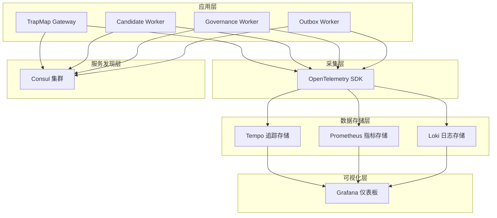

# 服务发现和可观测性升级 - 任务细则

**状态：** 进行中
**目标：** 为 TrapMap 引入完整的服务发现机制和可观测性三大支柱（追踪、指标、日志）
**选型：** Consul + Tempo + Prometheus + Loki + Grafana + OpenTelemetry

---

## 目录

1. [技术选型详细对比](#1-技术选型详细对比)
2. [阶段 0：基础架构设计](#2-阶段-0基础架构设计)
3. [阶段 1：服务发现集成](#3-阶段-1服务发现集成consul)
4. [阶段 2：可观测性三大支柱](#4-阶段-2可观测性三大支柱)
5. [阶段 3：Nest.js 深度集成](#5-阶段-3nestjs-深度集成)
6. [阶段 4：测试和验证](#6-阶段-4测试和验证)
7. [阶段 5：文档和交付](#7-阶段-5文档和交付)
8. [风险和注意事项](#8-风险和注意事项)
9. [依赖关系图](#9-依赖关系图)
10. [验收标准](#10-验收标准)

---

## 1. 技术选型详细对比

### 1.1 服务发现：Consul vs etcd vs Docker DNS

| 维度 | Consul | etcd | Docker DNS |
|------|--------|------|-----------|
| **核心定位** | 专业服务发现 + KV存储 | 通用KV存储 | 简单的容器发现 |
| **健康检查** | ✅ 内置HTTP/TCP/Script | ❌ 需自己实现 | ⚠️ 仅容器存活检查 |
| **服务注册** | ✅ 原生支持，开箱即用 | ❌ 需要封装 | ⚠️ 自动但有限 |
| **DNS接口** | ✅ 内置DNS服务器 | ❌ 无 | ✅ Docker内置 |
| **KV存储** | ✅ 强大的配置管理 | ✅ 强大的KV存储 | ❌ 无 |
| **多数据中心** | ✅ 原生支持 | ⚠️ 需要额外配置 | ❌ 不支持 |
| **社区成熟度** | ⭐⭐⭐⭐⭐ (10年历史) | ⭐⭐⭐⭐ (K8s存储层) | ⭐⭐⭐ (Docker内置) |
| **Nest.js集成** | ⭐⭐⭐⭐ (consul包) | ⭐⭐⭐ (etcd3包) | ⭐⭐ (需自己实现) |

**选择 Consul 的理由：**
- 专门为服务发现设计（vs etcd 是通用KV存储）
- 内置健康检查、DNS接口、KV存储
- 社区最大，文档最完善
- 与 Nest.js 生态有成熟的集成方案

**适用场景：**
- 需要动态服务注册和发现
- 需要内置的健康检查机制
- 需要配置管理和 DNS 接口
- 团队规模中等，需要稳定的服务发现基础设施

---

### 1.2 分布式追踪：Tempo vs Jaeger vs Zipkin

| 维度 | Tempo | Jaeger | Zipkin |
|------|-------|--------|--------|
| **开发者** | Grafana Labs | Uber → CNCF | Twitter |
| **CNCF状态** | ❌ 非CNCF | ✅ 毕业项目 | ❌ 非CNCF |
| **OpenTelemetry支持** | ✅ 原生支持 | ✅ 原生支持 | ⚠️ 支持但不原生 |
| **存储后端** | 只支持对象存储 | Cassandra/Elasticsearch/内存 | Cassandra/Elasticsearch |
| **与Grafana集成** | ⭐⭐⭐⭐⭐ 完美 | ⭐⭐⭐⭐ 好 | ⭐⭐⭐ 一般 |
| **部署复杂度** | ⭐⭐⭐⭐ 简单 | ⭐⭐⭐ 中等 | ⭐⭐⭐ 中等 |
| **UI功能** | ⭐⭐⭐⭐ 好 | ⭐⭐⭐⭐⭐ 更丰富 | ⭐⭐⭐ 基础 |
| **运维成本** | 低 | 中等 | 中等 |

**选择 Tempo 的理由：**
- 与 Grafana 完美集成（同一公司维护）
- 部署更简单（只需对象存储，不需要Cassandra/Elasticsearch）
- 配置最少，开箱即用
- 对于中等规模部署更实际

**适用场景：**
- 已经使用 Grafana 作为可视化层
- 需要简单的部署和运维
- 不需要复杂的追踪 UI 功能
- 存储成本敏感（对象存储比 Cassandra 便宜）

---

### 1.3 指标监控：Prometheus vs DataDog vs InfluxDB

| 维度 | Prometheus | DataDog | InfluxDB |
|------|-----------|---------|----------|
| **类型** | 开源监控系统 | 商业SaaS | 时序数据库 |
| **成本** | ⭐⭐⭐⭐⭐ 免费 | ⭐⭐ 按量付费 | ⭐⭐⭐⭐ 开源免费 |
| **云厂商锁定** | ❌ 无 | ✅ 强 | ❌ 无 |
| **数据主权** | ⭐⭐⭐⭐⭐ 完全控制 | ⭐⭐ 数据在云端 | ⭐⭐⭐⭐⭐ 完全控制 |
| **查询语言** | PromQL (强大) | 自有查询语言 | Flux/InfluxQL |
| **社区标准** | ⭐⭐⭐⭐⭐ 云原生事实标准 | ⭐⭐⭐ 商业产品 | ⭐⭐⭐⭐ 时序数据库标准 |
| **与Grafana集成** | ⭐⭐⭐⭐⭐ 完美 | ⭐⭐⭐⭐ 好 | ⭐⭐⭐⭐ 好 |
| **生态系统** | ⭐⭐⭐⭐⭐ 最广泛 | ⭐⭐⭐ 独立平台 | ⭐⭐⭐⭐ 时序数据生态 |

**选择 Prometheus 的理由：**
- 开源免费（vs DataDog 按量付费，成本高）
- 无厂商锁定（数据完全在自己控制下）
- 云原生事实标准（CNCF背书）
- 与 Grafana 完美集成

**适用场景：**
- 成本敏感，需要免费开源方案
- 需要数据主权，不希望数据存放在第三方
- 需要与云原生生态集成
- 需要强大的查询语言（PromQL）

---

### 1.4 日志聚合：Loki vs ELK vs Fluentd

| 维度 | Loki | ELK (Elasticsearch + Logstash + Kibana) | Fluentd |
|------|------|----------------------------------------|---------|
| **类型** | 轻量级日志聚合 | 完整的日志分析平台 | 日志收集器 |
| **部署复杂度** | ⭐⭐⭐⭐ 简单 | ⭐⭐ 复杂（需要ES集群） | ⭐⭐⭐ 中等 |
| **存储成本** | ⭐⭐⭐⭐⭐ 低（标签索引） | ⭐⭐ 高（全文索引） | ⭐⭐⭐ 取决于后端 |
| **查询能力** | ⭐⭐⭐ 够用 | ⭐⭐⭐⭐⭐ 强大（全文搜索） | ⭐⭐ 取决于后端 |
| **与Grafana集成** | ⭐⭐⭐⭐⭐ 完美 | ⭐⭐⭐ Kibana专用 | ⭐⭐⭐ 一般 |
| **资源消耗** | ⭐⭐⭐⭐⭐ 低 | ⭐⭐ 高（ES集群） | ⭐⭐⭐⭐ 中等 |
| **适用场景** | 中小规模日志 | 大规模日志分析 | 日志收集和转发 |

**选择 Loki 的理由：**
- 部署更简单（不需要 Elasticsearch 集群）
- 存储成本更低（标签索引，不全文索引）
- 与 Grafana 完美集成
- 对于中小规模日志场景足够用

**适用场景：**
- 中小规模日志聚合（GB/TB 级别）
- 已经使用 Grafana 作为可视化层
- 成本敏感，需要低存储成本
- 不需要复杂的全文搜索功能

---

### 1.5 可视化：Grafana vs Kibana vs Datadog

| 维度 | Grafana | Kibana | Datadog |
|------|---------|--------|---------|
| **类型** | 开源可视化平台 | ELK栈的可视化组件 | 商业SaaS |
| **数据源支持** | ⭐⭐⭐⭐⭐ 最广泛 | ⭐⭐ 只支持Elasticsearch | ⭐⭐⭐⭐ 多种 |
| **指标可视化** | ⭐⭐⭐⭐⭐ 强大 | ⭐⭐ 有限 | ⭐⭐⭐⭐⭐ 强大 |
| **日志可视化** | ⭐⭐⭐⭐ 好 | ⭐⭐⭐⭐⭐ 强大 | ⭐⭐⭐⭐⭐ 强大 |
| **追踪可视化** | ⭐⭐⭐⭐⭐ 完美（Tempo） | ❌ 不支持 | ⭐⭐⭐⭐⭐ 强大 |
| **告警** | ⭐⭐⭐⭐⭐ 强大 | ⭐⭐⭐ 基础 | ⭐⭐⭐⭐⭐ 强大 |
| **成本** | ⭐⭐⭐⭐⭐ 免费 | ⭐⭐⭐⭐ 免费 | ⭐⭐ 按量付费 |
| **社区模板** | ⭐⭐⭐⭐⭐ 最丰富 | ⭐⭐⭐⭐ 好 | ⭐⭐⭐ 有限 |

**选择 Grafana 的理由：**
- 与 Prometheus、Loki、Tempo 完美集成
- 一个仪表板展示所有可观测性数据
- 社区最大，仪表板模板丰富
- 开源版足够用

**适用场景：**
- 需要统一的可视化平台
- 已经使用 Prometheus、Loki、Tempo
- 需要丰富的仪表板模板
- 需要强大的告警功能

---

### 1.6 采集标准：OpenTelemetry

| 维度 | OpenTelemetry | 无标准（各工具自定义） |
|------|--------------|---------------------|
| **CNCF状态** | ✅ 孵化项目 | ❌ 无标准 |
| **语言支持** | ⭐⭐⭐⭐⭐ 官方支持TS/Node.js | ⭐⭐ 各工具各自实现 |
| **生态集成** | ⭐⭐⭐⭐⭐ 支持所有主流后端 | ⭐⭐ 需要为每个后端单独适配 |
| **未来演进** | ⭐⭐⭐⭐⭐ 可观测性的未来标准 | ⭐⭐ 可能过时 |
| **学习成本** | ⭐⭐⭐ 需要学习 | ⭐⭐⭐⭐⭐ 无额外学习 |

**选择 OpenTelemetry 的理由：**
- CNCF的可观测性标准（事实标准）
- 原生支持Nest.js（@opentelemetry/sdk-node）
- 只写一次代码，可发送到多种后端
- 面向未来的技术选型

**适用场景：**
- 需要标准化的可观测性采集
- 需要支持多种后端（Jaeger/Tempo/Datadog等）
- 需要与云原生生态集成
- 需要长期技术演进支持

---

## 2. 阶段 0：基础架构设计

### 2.1 目标

明确架构边界、技术选型理由、Docker Compose 配置方案

### 2.2 任务

#### 2.2.1 架构设计文档

**文件路径：**
- `docs/architecture/OBSERVABILITY.md`（可观测性架构说明）
- `docs/architecture/SERVICE-DISCOVERY.md`（服务发现架构说明）
- 更新 `architecture.md`（添加概览）

**内容要求：**
- 架构图（Mermaid格式）
- 技术选型对比表
- 优缺点分析
- 数据流图

**示例 Mermaid 架构图：**



**验收标准：**
- [ ] 架构图清晰展示各组件关系
- [ ] 技术选型对比表完整
- [ ] 优缺点分析深入

---

#### 2.2.2 技术选型对比文档

**文件路径：**
- `docs/architecture/TECH-SELECTION.md`（技术选型详细对比）

**内容要求：**
- 每个选型的详细对比表
- 选择理由
- 与替代品的对比
- 适用场景分析

**验收标准：**
- [ ] 每个选型都有对比表
- [ ] 选择理由清晰
- [ ] 包含适用场景分析

---

#### 2.2.3 Docker Compose 方案设计

**文件路径：**
- `docker-compose.observability.yml`（可观测性服务配置）

**设计要求：**
- 多环境配置（dev/staging/prod）
- 网络拓扑和服务依赖关系
- 健康检查策略
- 资源限制

**示例配置：**

```yaml
# docker-compose.observability.yml
version: '3.8'

services:
  # 服务发现
  consul:
    image: hashicorp/consul:1.17
    container_name: trapmap-consul
    ports:
      - "8500:8500"   # HTTP API
      - "8600:8600/udp" # DNS
    volumes:
      - consul_data:/consul/data
    command: agent -server -bootstrap-expect=1 -ui -client=0.0.0.0
    healthcheck:
      test: ["CMD", "consul", "members"]
      interval: 10s
      timeout: 5s
      retries: 3
    networks:
      - trapmap-observability

  # 追踪
  tempo:
    image: grafana/tempo:2.3.0
    container_name: trapmap-tempo
    ports:
      - "3200:3200"   # Tempo HTTP
      - "4317:4317"   # OTLP gRPC
      - "4318:4318"   # OTLP HTTP
    volumes:
      - tempo_data:/var/tempo
    command: -config.file=/etc/tempo/tempo.yaml
    healthcheck:
      test: ["CMD", "wget", "--no-verbose", "--tries=1", "--spider", "http://localhost:3200/ready"]
      interval: 10s
      timeout: 5s
      retries: 3
    networks:
      - trapmap-observability

  # 指标
  prometheus:
    image: prom/prometheus:v2.48.0
    container_name: trapmap-prometheus
    ports:
      - "9090:9090"
    volumes:
      - ./config/prometheus.yml:/etc/prometheus/prometheus.yml
      - prometheus_data:/prometheus
    command:
      - '--config.file=/etc/prometheus/prometheus.yml'
      - '--storage.tsdb.path=/prometheus'
      - '--web.console.libraries=/etc/prometheus/console_libraries'
      - '--web.console.templates=/etc/prometheus/consoles'
      - '--storage.tsdb.retention.time=200h'
      - '--web.enable-lifecycle'
    healthcheck:
      test: ["CMD", "wget", "--no-verbose", "--tries=1", "--spider", "http://localhost:9090/-/healthy"]
      interval: 10s
      timeout: 5s
      retries: 3
    networks:
      - trapmap-observability

  # 日志
  loki:
    image: grafana/loki:2.9.3
    container_name: trapmap-loki
    ports:
      - "3100:3100"
    volumes:
      - ./config/loki.yml:/etc/loki/local-config.yaml
      - loki_data:/loki
    command: -config.file=/etc/loki/local-config.yaml
    healthcheck:
      test: ["CMD", "wget", "--no-verbose", "--tries=1", "--spider", "http://localhost:3100/ready"]
      interval: 10s
      timeout: 5s
      retries: 3
    networks:
      - trapmap-observability

  # 可视化
  grafana:
    image: grafana/grafana:10.2.2
    container_name: trapmap-grafana
    ports:
      - "3000:3000"
    volumes:
      - grafana_data:/var/lib/grafana
      - ./config/grafana/provisioning:/etc/grafana/provisioning
    environment:
      - GF_SECURITY_ADMIN_USER=admin
      - GF_SECURITY_ADMIN_PASSWORD=${GRAFANA_PASSWORD:-admin}
    healthcheck:
      test: ["CMD", "wget", "--no-verbose", "--tries=1", "--spider", "http://localhost:3000/api/health"]
      interval: 10s
      timeout: 5s
      retries: 3
    networks:
      - trapmap-observability

volumes:
  consul_data:
  tempo_data:
  prometheus_data:
  loki_data:
  grafana_data:

networks:
  trapmap-observability:
    name: trapmap-observability
```

**验收标准：**
- [ ] 配置文件语法正确
- [ ] 服务依赖关系正确
- [ ] 健康检查配置完整
- [ ] 多环境配置支持

---

## 3. 阶段 1：服务发现集成（Consul）

### 3.1 目标

引入 Consul 实现服务注册、健康检查和动态发现

### 3.2 任务

#### 3.2.1 Consul 客户端模块

**文件路径：**
- `packages/backend-core/src/lib/discovery/consul.module.ts`
- `packages/backend-core/src/lib/discovery/consul.service.ts`
- `packages/backend-core/src/lib/discovery/consul.interface.ts`

**实现要求：**

```typescript
// consul.module.ts
import { Module } from '@nestjs/common';
import { ConsulService } from './consul.service';

@Module({
  providers: [ConsulService],
  exports: [ConsulService],
})
export class ConsulModule {}

// consul.service.ts
import { Injectable, OnModuleInit, OnModuleDestroy } from '@nestjs/common';
import Consul from 'consul';

@Injectable()
export class ConsulService implements OnModuleInit, OnModuleDestroy {
  private consul: Consul;
  private serviceId: string;

  constructor() {
    this.consul = new Consul({
      host: process.env.CONSUL_HOST || 'localhost',
      port: parseInt(process.env.CONSUL_PORT || '8500'),
    });
  }

  async onModuleInit() {
    await this.registerService();
  }

  async onModuleDestroy() {
    await this.deregisterService();
  }

  private async registerService() {
    this.serviceId = `trapmap-${process.env.SERVICE_NAME}-${process.env.INSTANCE_ID}`;
    
    await this.consul.agent.service.register({
      id: this.serviceId,
      name: process.env.SERVICE_NAME || 'trapmap',
      address: process.env.SERVICE_HOST || 'localhost',
      port: parseInt(process.env.PORT || '4000'),
      check: {
        http: `http://${process.env.SERVICE_HOST || 'localhost'}:${process.env.PORT || '4000'}/health`,
        interval: '10s',
        timeout: '5s',
      },
      meta: {
        version: process.env.npm_package_version || '0.1.0',
        environment: process.env.NODE_ENV || 'development',
      },
    });
  }

  private async deregisterService() {
    await this.consul.agent.service.deregister(this.serviceId);
  }

  async getService(serviceName: string) {
    const services = await this.consul.health.service(serviceName, { passing: true });
    return services.map(s => ({
      id: s.Service.ID,
      address: s.Service.Address,
      port: s.Service.Port,
      meta: s.Service.Meta,
    }));
  }

  async getKV(key: string) {
    const result = await this.consul.kv.get(key);
    return result?.Value;
  }

  async setKV(key: string, value: string) {
    await this.consul.kv.set(key, value);
  }
}
```

**测试要求：**
- `packages/server/src/lib/discovery/consul.test.ts`
- 单元测试：服务注册、健康检查、KV存储
- 集成测试：与真实Consul交互

**验收标准：**
- [ ] Consul 客户端模块功能完整
- [ ] 服务注册和注销逻辑正确
- [ ] 健康检查端点可用
- [ ] 单元测试覆盖率 > 80%

---

#### 3.2.2 动态服务发现

**文件路径：**
- `packages/client-core/src/lib/discovery/dynamic-discovery.ts`

**实现要求：**

```typescript
// dynamic-discovery.ts
import { ConsulService } from '@trapmap/backend-core';

export class DynamicDiscovery {
  private cache: Map<string, { address: string; port: number }[]> = new Map();
  private cacheTTL = 30000; // 30秒缓存

  constructor(private consulService: ConsulService) {}

  async getServiceAddress(serviceName: string): Promise<{ address: string; port: number }> {
    // 检查缓存
    const cached = this.cache.get(serviceName);
    if (cached && cached.length > 0) {
      return this.randomSelect(cached);
    }

    // 从Consul获取
    const services = await this.consulService.getService(serviceName);
    if (services.length === 0) {
      throw new Error(`No healthy instances of ${serviceName} found`);
    }

    // 更新缓存
    this.cache.set(serviceName, services);
    setTimeout(() => this.cache.delete(serviceName), this.cacheTTL);

    return this.randomSelect(services);
  }

  private randomSelect(services: { address: string; port: number }[]) {
    const index = Math.floor(Math.random() * services.length);
    return services[index];
  }
}
```

**测试要求：**
- 端到端测试验证服务发现
- 测试缓存逻辑
- 测试故障转移

**验收标准：**
- [ ] 动态服务发现功能正常
- [ ] 缓存机制工作
- [ ] 负载均衡策略正确
- [ ] 故障转移机制工作

---

## 4. 阶段 2：可观测性三大支柱

### 4.1 目标

集成 LGTM stack（Loki + Grafana + Tempo + Prometheus）

### 4.2 任务

#### 4.2.1 OpenTelemetry 集成

**文件路径：**
- `packages/backend-core/src/lib/tracing/otel.module.ts`
- `packages/backend-core/src/lib/tracing/otel.service.ts`

**实现要求：**

```typescript
// otel.module.ts
import { Module, Global } from '@nestjs/common';
import { OtelService } from './otel.service';

@Global()
@Module({
  providers: [OtelService],
  exports: [OtelService],
})
export class OtelModule {}

// otel.service.ts
import { Injectable, OnModuleInit } from '@nestjs/common';
import { NodeSDK } from '@opentelemetry/sdk-node';
import { OTLPTraceExporter } from '@opentelemetry/exporter-trace-otlp-http';
import { OTLPMetricExporter } from '@opentelemetry/exporter-metrics-otlp-http';
import { PeriodicExportingMetricReader } from '@opentelemetry/sdk-metrics';
import { Resource } from '@opentelemetry/resources';
import { ATTR_SERVICE_NAME, ATTR_SERVICE_VERSION } from '@opentelemetry/semantic-conventions';

@Injectable()
export class OtelService implements OnModuleInit {
  private sdk: NodeSDK;

  async onModuleInit() {
    const resource = new Resource({
      [ATTR_SERVICE_NAME]: process.env.SERVICE_NAME || 'trapmap',
      [ATTR_SERVICE_VERSION]: process.env.npm_package_version || '0.1.0',
    });

    const traceExporter = new OTLPTraceExporter({
      url: process.env.OTEL_EXPORTER_OTLP_ENDPOINT || 'http://localhost:4318/v1/traces',
    });

    const metricExporter = new OTLPMetricExporter({
      url: process.env.OTEL_EXPORTER_OTLP_ENDPOINT || 'http://localhost:4318/v1/metrics',
    });

    const metricReader = new PeriodicExportingMetricReader({
      exporter: metricExporter,
      exportIntervalMillis: 15000,
    });

    this.sdk = new NodeSDK({
      resource,
      traceExporter,
      metricReader,
    });

    this.sdk.start();
  }

  async onApplicationShutdown() {
    await this.sdk.shutdown();
  }
}
```

**测试要求：**
- OpenTelemetry 初始化测试
- 追踪导出测试
- 指标导出测试

**验收标准：**
- [ ] OpenTelemetry SDK 正确初始化
- [ ] 追踪数据成功导出到 Tempo
- [ ] 指标数据成功导出到 Prometheus
- [ ] 日志数据成功导出到 Loki

---

#### 4.2.2 Prometheus 指标集成

**文件路径：**
- `packages/backend-core/src/lib/metrics/prometheus.module.ts`
- `packages/backend-core/src/lib/metrics/prometheus.service.ts`

**实现要求：**

```typescript
// prometheus.module.ts
import { Module, Global } from '@nestjs/common';
import { PrometheusService } from './prometheus.service';

@Global()
@Module({
  providers: [PrometheusService],
  exports: [PrometheusService],
})
export class PrometheusModule {}

// prometheus.service.ts
import { Injectable } from '@nestjs/common';
import { Counter, Gauge, Histogram, register } from 'prom-client';

@Injectable()
export class PrometheusService {
  private httpRequestsTotal: Counter;
  private httpRequestDuration: Histogram;
  private activeConnections: Gauge;

  constructor() {
    // 请求计数器
    this.httpRequestsTotal = new Counter({
      name: 'http_requests_total',
      help: 'Total number of HTTP requests',
      labelNames: ['method', 'route', 'status_code'],
    });

    // 请求延迟直方图
    this.httpRequestDuration = new Histogram({
      name: 'http_request_duration_seconds',
      help: 'Duration of HTTP requests in seconds',
      labelNames: ['method', 'route'],
      buckets: [0.01, 0.05, 0.1, 0.5, 1, 5],
    });

    // 活跃连接数
    this.activeConnections = new Gauge({
      name: 'active_connections',
      help: 'Number of active connections',
    });
  }

  incrementRequests(method: string, route: string, statusCode: string) {
    this.httpRequestsTotal.inc({ method, route, status_code: statusCode });
  }

  observeDuration(method: string, route: string, duration: number) {
    this.httpRequestDuration.observe({ method, route }, duration);
  }

  incrementConnections() {
    this.activeConnections.inc();
  }

  decrementConnections() {
    this.activeConnections.dec();
  }

  async getMetrics() {
    return register.metrics();
  }
}
```

**测试要求：**
- 指标采集测试
- 指标暴露测试
- 性能开销测试

**验收标准：**
- [ ] 指标正确采集
- [ ] `/metrics` 端点可用
- [ ] 指标数据与 Prometheus 集成
- [ ] 性能开销 < 5%

---

#### 4.2.3 Loki 日志集成

**文件路径：**
- `packages/backend-core/src/lib/logging/loki.module.ts`
- `packages/backend-core/src/lib/logging/loki.service.ts`

**实现要求：**

```typescript
// loki.module.ts
import { Module, Global } from '@nestjs/common';
import { LokiService } from './loki.service';

@Global()
@Module({
  providers: [LokiService],
  exports: [LokiService],
})
export class LokiModule {}

// loki.service.ts
import { Injectable, LoggerService } from '@nestjs/common';
import { LokiTransport } from 'winston-loki';

@Injectable()
export class LokiService implements LoggerService {
  private logger: any;

  constructor() {
    this.logger = new (require('winston').createLogger)({
      transports: [
        new LokiTransport({
          host: process.env.LOKI_HOST || 'http://localhost:3100',
          labels: {
            job: process.env.SERVICE_NAME || 'trapmap',
            environment: process.env.NODE_ENV || 'development',
          },
          json: true,
          replaceTimestamp: true,
        }),
      ],
    });
  }

  log(message: string, context?: string) {
    this.logger.info(message, { context });
  }

  error(message: string, trace?: string, context?: string) {
    this.logger.error(message, { trace, context });
  }

  warn(message: string, context?: string) {
    this.logger.warn(message, { context });
  }

  debug(message: string, context?: string) {
    this.logger.debug(message, { context });
  }

  verbose(message: string, context?: string) {
    this.logger.verbose(message, { context });
  }
}
```

**测试要求：**
- 日志格式测试
- 日志传输测试
- 性能开销测试

**验收标准：**
- [ ] 日志正确格式化为 JSON
- [ ] 日志成功传输到 Loki
- [ ] 日志查询功能正常
- [ ] 性能开销 < 3%

---

## 5. 阶段 3：Nest.js 深度集成

### 5.1 目标

将可观测性无缝集成到 TrapMap 的 Nest.js 架构中

### 5.2 任务

#### 5.2.1 健康检查升级

**文件路径：**
- `packages/backend-core/src/lib/health/health.module.ts`
- `packages/backend-core/src/lib/health/health.controller.ts`

**实现要求：**

```typescript
// health.controller.ts
import { Controller, Get } from '@nestjs/common';
import { ConsulService } from '../discovery/consul.service';
import { PrometheusService } from '../metrics/prometheus.service';

@Controller()
export class HealthController {
  constructor(
    private consulService: ConsulService,
    private prometheusService: PrometheusService,
  ) {}

  @Get('health')
  async health() {
    return {
      status: 'ok',
      timestamp: new Date().toISOString(),
      services: {
        consul: await this.checkConsul(),
        prometheus: await this.checkPrometheus(),
        tempo: await this.checkTempo(),
        loki: await this.checkLoki(),
      },
    };
  }

  @Get('ready')
  async ready() {
    // 检查所有依赖服务是否就绪
    const consulReady = await this.checkConsul();
    const prometheusReady = await this.checkPrometheus();
    
    return {
      status: consulReady && prometheusReady ? 'ready' : 'not_ready',
      timestamp: new Date().toISOString(),
    };
  }

  @Get('live')
  async live() {
    return {
      status: 'alive',
      timestamp: new Date().toISOString(),
    };
  }

  private async checkConsul(): Promise<boolean> {
    try {
      await this.consulService.getService('consul');
      return true;
    } catch {
      return false;
    }
  }

  private async checkPrometheus(): Promise<boolean> {
    try {
      await fetch('http://localhost:9090/-/healthy');
      return true;
    } catch {
      return false;
    }
  }

  private async checkTempo(): Promise<boolean> {
    try {
      await fetch('http://localhost:3200/ready');
      return true;
    } catch {
      return false;
    }
  }

  private async checkLoki(): Promise<boolean> {
    try {
      await fetch('http://localhost:3100/ready');
      return true;
    } catch {
      return false;
    }
  }
}
```

**测试要求：**
- 健康检查端点测试
- 就绪探针测试
- 存活探针测试

**验收标准：**
- [ ] `/health` 端点返回所有服务状态
- [ ] `/ready` 端点正确判断就绪状态
- [ ] `/live` 端点正常工作
- [ ] 健康检查逻辑正确

---

## 6. 阶段 4：测试和验证

### 6.1 目标

确保系统的可靠性、性能和正确性

### 6.2 任务

#### 6.2.1 单元测试

**测试文件路径：**
- `packages/server/src/lib/discovery/consul.test.ts`
- `packages/server/src/lib/metrics/prometheus.test.ts`
- `packages/server/src/lib/tracing/otel.test.ts`
- `packages/server/src/lib/logging/loki.test.ts`

**测试要求：**
- 每个模块的单元测试
- Mock 外部依赖
- 覆盖率 > 80%

**示例测试：**

```typescript
// consul.test.ts
import { Test, TestingModule } from '@nestjs/testing';
import { ConsulService } from './consul.service';

describe('ConsulService', () => {
  let service: ConsulService;

  beforeEach(async () => {
    const module: TestingModule = await Test.createTestingModule({
      providers: [ConsulService],
    }).compile();

    service = module.get<ConsulService>(ConsulService);
  });

  it('should register service', async () => {
    await service.onModuleInit();
    // 验证服务注册逻辑
  });

  it('should deregister service', async () => {
    await service.onModuleDestroy();
    // 验证服务注销逻辑
  });

  it('should get service by name', async () => {
    const services = await service.getService('trapmap');
    expect(services).toBeDefined();
  });
});
```

**验收标准：**
- [ ] 单元测试覆盖率 > 80%
- [ ] 所有测试通过
- [ ] Mock 逻辑正确

---

#### 6.2.2 集成测试

**测试文件路径：**
- `packages/server/src/lib/discovery/consul.integration.test.ts`
- `packages/server/src/lib/metrics/prometheus.integration.test.ts`
- `packages/server/src/lib/tracing/tempo.integration.test.ts`
- `packages/server/src/lib/logging/loki.integration.test.ts`

**测试要求：**
- 使用 Testcontainers 进行真实环境测试
- 测试与真实 Consul/Prometheus/Tempo/Loki 的交互
- 测试数据正确性

**示例测试：**

```typescript
// consul.integration.test.ts
import { Test, TestingModule } from '@nestjs/testing';
import { ConsulService } from './consul.service';
import { GenericContainer, StartedTestContainer } from 'testcontainers';

describe('ConsulService Integration', () => {
  let consulContainer: StartedTestContainer;
  let service: ConsulService;

  beforeAll(async () => {
    consulContainer = await new GenericContainer('hashicorp/consul:1.17')
      .withExposedPorts(8500)
      .start();

    process.env.CONSUL_HOST = consulContainer.getHost();
    process.env.CONSUL_PORT = consulContainer.getMappedPort(8500).toString();
  });

  afterAll(async () => {
    await consulContainer.stop();
  });

  beforeEach(async () => {
    const module: TestingModule = await Test.createTestingModule({
      providers: [ConsulService],
    }).compile();

    service = module.get<ConsulService>(ConsulService);
  });

  it('should register and deregister service', async () => {
    await service.onModuleInit();
    const services = await service.getService('trapmap');
    expect(services.length).toBeGreaterThan(0);

    await service.onModuleDestroy();
    const servicesAfterDeregister = await service.getService('trapmap');
    expect(servicesAfterDeregister.length).toBe(0);
  });
});
```

**验收标准：**
- [ ] 集成测试通过
- [ ] Testcontainers 正确启动和停止
- [ ] 数据正确存储和检索

---

#### 6.2.3 端到端测试

**测试文件路径：**
- `packages/server/src/e2e/observability.e2e.test.ts`

**测试要求：**
- 完整请求流程追踪测试
- 服务发现和负载均衡测试
- 故障转移和恢复测试
- 性能基准测试

**示例测试：**

```typescript
// observability.e2e.test.ts
import { Test, TestingModule } from '@nestjs/testing';
import { INestApplication } from '@nestjs/common';
import * as request from 'supertest';
import { AppModule } from '../app.module';

describe('Observability E2E', () => {
  let app: INestApplication;

  beforeAll(async () => {
    const moduleFixture: TestingModule = await Test.createTestingModule({
      imports: [AppModule],
    }).compile();

    app = moduleFixture.createNestApplication();
    await app.init();
  });

  afterAll(async () => {
    await app.close();
  });

  it('should track request in Tempo', async () => {
    const response = await request(app.getHttpServer())
      .get('/health')
      .expect(200);

    // 验证追踪数据已发送到 Tempo
    const traceId = response.headers['x-trace-id'];
    expect(traceId).toBeDefined();
  });

  it('should record metrics in Prometheus', async () => {
    await request(app.getHttpServer())
      .get('/health')
      .expect(200);

    const metricsResponse = await request(app.getHttpServer())
      .get('/metrics')
      .expect(200);

    expect(metricsResponse.text).toContain('http_requests_total');
  });

  it('should log to Loki', async () => {
    await request(app.getHttpServer())
      .get('/health')
      .expect(200);

    // 验证日志已发送到 Loki（需要等待异步传输）
    await new Promise(resolve => setTimeout(resolve, 1000));
  });
});
```

**验收标准：**
- [ ] 端到端测试通过
- [ ] 追踪数据正确采集
- [ ] 指标数据正确记录
- [ ] 日志数据正确传输

---

## 7. 阶段 5：文档和交付

### 7.1 目标

完善文档，确保项目可交付

### 7.2 任务

#### 7.2.1 架构文档

**文件路径：**
- `docs/architecture/OBSERVABILITY.md`（可观测性架构说明）
- `docs/architecture/SERVICE-DISCOVERY.md`（服务发现架构说明）
- 更新 `architecture.md`（添加概览）

**内容要求：**
- 架构图（Mermaid格式）
- 技术选型对比表
- 优缺点分析
- 数据流图
- 配置说明

**验收标准：**
- [ ] 架构图清晰
- [ ] 技术选型理由完整
- [ ] 配置说明详细

---

#### 7.2.2 使用指南

**文件路径：**
- `docs/guides/OBSERVABILITY-GUIDE.md`（可观测性使用指南）
- `docs/guides/SERVICE-DISCOVERY-GUIDE.md`（服务发现使用指南）
- `docs/guides/GRAFANA-DASHBOARDS.md`（仪表板使用指南）

**内容要求：**
- 快速开始
- 配置说明
- 故障排查
- 最佳实践
- 示例代码

**验收标准：**
- [ ] 快速开始简单易懂
- [ ] 配置说明详细
- [ ] 故障排查实用

---

#### 7.2.3 部署文档

**文件路径：**
- 更新 `docs/architecture/DEPLOYMENT.md`
- 编写 `docs/operations/OBSERVABILITY-OPERATIONS.md`

**内容要求：**
- 部署步骤
- 配置说明
- 运维手册
- 监控和告警配置

**验收标准：**
- [ ] 部署步骤清晰
- [ ] 配置说明详细
- [ ] 运维手册实用

---

## 8. 风险和注意事项

### 8.1 技术风险

| 风险 | 影响 | 缓解措施 |
|------|------|---------|
| **Consul 集群故障** | 服务发现不可用 | 实现本地缓存和 fallback 机制 |
| **OpenTelemetry 性能开销** | 延迟增加 | 采样策略优化，生产环境使用 head-based sampling |
| **Prometheus 存储空间** | 磁盘占满 | 配置 retention policy，监控存储使用 |
| **Loki 查询性能** | 日志查询慢 | 优化标签设计，避免高基数标签 |
| **Tempo 存储成本** | 对象存储费用 | 配置采样率，调整保留策略 |

### 8.2 运营风险

| 风险 | 影响 | 缓解措施 |
|------|------|---------|
| **配置错误** | 服务无法启动 | 使用 Testcontainers 进行集成测试 |
| **网络问题** | 服务间通信失败 | 实现重试和超时机制 |
| **版本兼容性** | 组件不兼容 | 使用稳定版本，定期更新 |
| **监控盲区** | 问题无法及时发现 | 完善健康检查和告警规则 |

---

## 9. 依赖关系图

```
阶段 0（基础架构设计）
    ↓
阶段 1（Consul 集成）
    ↓
阶段 2（可观测性三大支柱）
    ├── 2A（Prometheus + Grafana）
    ├── 2B（Tempo + OpenTelemetry）
    └── 2C（Loki）
    ↓
阶段 3（Nest.js 深度集成）
    ↓
阶段 4（测试和验证）
    ↓
阶段 5（文档和交付）
```

**关键依赖：**
- 阶段 1 依赖阶段 0（架构设计完成）
- 阶段 2 依赖阶段 1（Consul 集成完成）
- 阶段 3 依赖阶段 2（可观测性三大支柱集成完成）
- 阶段 4 依赖阶段 3（Nest.js 集成完成）
- 阶段 5 可以与阶段 4 并行进行

---

## 10. 验收标准

### 10.1 功能验收

- [ ] Consul 服务注册和发现正常工作
- [ ] OpenTelemetry 追踪数据正确采集
- [ ] Prometheus 指标数据正确记录
- [ ] Loki 日志数据正确传输
- [ ] Grafana 仪表板正常显示
- [ ] 健康检查端点正常工作

### 10.2 性能验收

- [ ] 可观测性开销 < 10%
- [ ] 延迟增加 < 5ms
- [ ] CPU 使用增加 < 5%
- [ ] 内存使用增加 < 50MB

### 10.3 测试验收

- [ ] 单元测试覆盖率 > 80%
- [ ] 集成测试全部通过
- [ ] 端到端测试全部通过
- [ ] 性能测试达标

### 10.4 文档验收

- [ ] 架构文档完整
- [ ] 使用指南详细
- [ ] 部署文档清晰
- [ ] 示例代码可运行

---

## 附录：配置文件示例

### A.1 Prometheus 配置

```yaml
# config/prometheus.yml
global:
  scrape_interval: 15s
  evaluation_interval: 15s

scrape_configs:
  - job_name: 'trapmap'
    static_configs:
      - targets: ['gateway:4000', 'candidate-worker:4000', 'governance-worker:4000', 'outbox-worker:4000']
  
  - job_name: 'consul'
    static_configs:
      - targets: ['consul:8500']
  
  - job_name: 'tempo'
    static_configs:
      - targets: ['tempo:3200']
  
  - job_name: 'loki'
    static_configs:
      - targets: ['loki:3100']
```

### A.2 Tempo 配置

```yaml
# config/tempo.yml
server:
  http_listen_port: 3200

distributor:
  receivers:
    otlp:
      protocols:
        grpc:
          endpoint: 0.0.0.0:4317
        http:
          endpoint: 0.0.0.0:4318

storage:
  trace:
    backend: local
    local:
      path: /var/tempo/traces
    wal:
      path: /var/tempo/wal
```

### A.3 Loki 配置

```yaml
# config/loki.yml
auth_enabled: false

server:
  http_listen_port: 3100

common:
  path_prefix: /loki
  storage:
    filesystem:
      chunks_directory: /loki/chunks
      rules_directory: /loki/rules
  replication_factor: 1
  ring:
    kvstore:
      store: inmemory

schema_config:
  configs:
    - from: 2020-10-24
      store: boltdb-shipper
      object_store: filesystem
      schema: v11
      index:
        prefix: index_
        period: 24h
```

---

**文档版本：** v1.0
**最后更新：** 2026-06-30
**作者：** TrapMap Team
